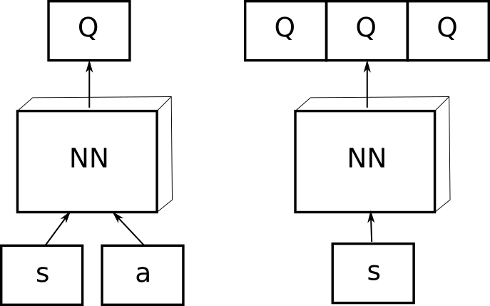
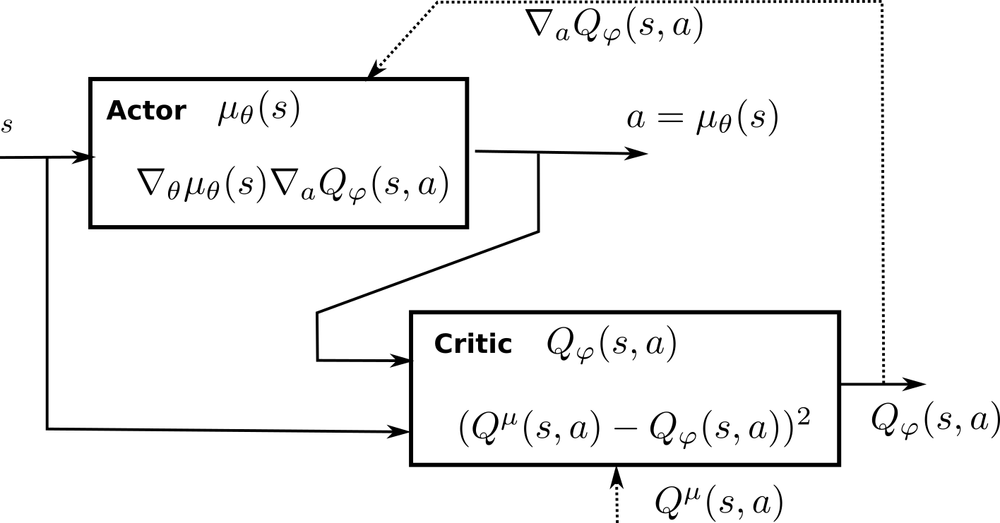

---
# Metadata
title: Deep Reinforcement Learning
author: Julien Vitay
email: julien.vitay@informatik.tu-chemnitz.de

# List of files to include
files:
    - 0-Introduction.md
    - 1.1-BasicRL.md
    - 1.2-DeepLearning.md
    - 2-Valuebased.md
    - 3.1-PolicyGradient.md
    - 3.2-ActorCritic.md
    - 3.3-ImportanceSampling.md
    - 3.4-DPG.md
    - 3.5-NaturalGradient.md
    - 3.6-EntropyRL.md
    - 3.7-DistributionalRL.md
    - 3.8-OtherPolicyGradient.md
    # - 4-RAM.md
    - 5-ModelBased.md
    # - 6-Hierarchical.md
    # - 7-Inverse.md
    # - 8-Robotics.md
    - 9-Practice.md
    - 10-References.md

# Bibliography
bibliography:
    - /home/vitay/Biblio/bibtex/ReinforcementLearning.bib
    - /home/vitay/Biblio/bibtex/DeepLearning.bib
csl: assets/frontiers.csl


# CSS
css: assets/github.css
#mathjax: /usr/share/mathjax/MathJax.js?config=TeX-AMS-MML_HTMLorMML
mathjax: https://cdnjs.cloudflare.com/ajax/libs/mathjax/2.7.1/MathJax.js?config=TeX-AMS-MML_HTMLorMML


# Latex
geometry: "margin=1in"
fontfamily: "times"
fontsize: "11pt"
header-includes:
    - \usepackage{setspace}
    - \onehalfspacing
    - \usepackage{titling}
    - \pretitle{\begin{center}\begin{bfseries}\begin{huge}}
    - \posttitle{\end{huge}\end{bfseries}\end{center}\vspace{2cm}}
    - \renewcommand{\linethickness}{0.4pt}
---

# Introduction

The goal of this document is to keep track the state-of-the-art in deep reinforcement learning. It starts with basics in reinforcement learning and deep learning to introduce the notations and covers different classes of deep RL methods, value-based or policy-based, model-free or model-based, etc.

Different classes of deep RL methods can be identified. This document will focus on the following ones:   

1. Value-based algorithms (DQN...) used mostly for discrete problems like video games.
2. Policy-gradient algorithms (A3C, DDPG...) used for continuous control problems such as robotics.
3. Recurrent attention models (RAM...) for partially observable problems.
4. Model-based RL to reduce the sample complexity by incorporating a model of the environment.
5. Application of deep RL to robotics

One could extend the list and talk about hierarchical RL, inverse RL, imitation-based RL, etc...

**Additional resources**
    
See @Li2017, @Arulkumaran2017 and @Mousavi2018 for recent overviews of deep RL. 

The CS294 course of Sergey Levine at Berkeley is incredibly complete: <http://rll.berkeley.edu/deeprlcourse/>. The Reinforcement Learning course by David Silver at UCL covers also the whole field: <http://www0.cs.ucl.ac.uk/staff/d.silver/web/Teaching.html>.

This series of posts from Arthur Juliani <https://medium.com/emergent-future/simple-reinforcement-learning-with-tensorflow-part-0-q-learning-with-tables-and-neural-networks-d195264329d0> also provide a very good introduction to deep RL, associated to code samples using tensorflow.


**Notes**

This document is meant to stay *work in progress* forever, as new algorithms will be added as they are published. Feel free to comment, correct, suggest, pull request by writing to <julien.vitay@informatik.tu-chemnitz.de>.

For some reason, this document is better printed using chrome. Use the single file version [here](./DeepRL.html) and print it to pdf. Alternatively, a pdf version generated using LaTeX is available [here](./DeepRL.pdf) (some images may disappear, as LaTeX does not support .gif or .svg images).

The style is adapted from the Github-Markdown CSS template <https://www.npmjs.com/package/github-markdown-css>. The document is written in Pandoc's Markdown and converted to html and pdf using pandoc-citeproc and pandoc-crossref.

Some figures are taken from the original publication ("Taken from" or "Source" in the caption). Their copyright stays to the respective authors, naturally. The rest is my own work and can be distributed, reproduced and modified under CC-BY-SA-NC 4.0. 


**Thanks**

Thanks to all the students who helped me dive into that exciting research field, in particular: Winfried Lötzsch, Johannes Jung, Frank Witscher, Danny Hofmann, Oliver Lange, Vinayakumar Murganoor.

**Copyright**

Except where otherwise noted, this work is licensed under a [Creative Commons Attribution-NonCommercial-ShareAlike 4.0 International License](http://creativecommons.org/licenses/by-nc-sa/4.0).


<!--PAGEBREAK-->


# Basics

Deep reinforcement learning (deep RL) is the integration of deep learning methods, classically used in supervised or unsupervised learning contexts, with reinforcement learning (RL), a well-studied adaptive control method used in problems with delayed and partial feedback [@Sutton1998]. This section starts with the basics of RL, mostly to set the notations, and provides a quick overview of deep neural networks.

## Reinforcement learning and Markov Decision Process

RL methods apply to problems where an agent interacts with an environment in discrete time steps (@fig:agentenv). At time $t$, the agent is in state $s_t$ and decides to perform an action $a_t$. At the next time step, it arrives in the state $s_{t+1}$ and obtains the reward $r_{t+1}$. The goal of the agent is to maximize the reward obtained on the long term. The textbook by @Sutton1998 (updated in @Sutton2017) defines the field extensively.

{#fig:agentenv width=50%}

Reinforcement learning problems are described as **Markov Decision Processes** (MDP) defined by five quantities:

* a state space $\mathcal{S}$ where each state $s$ respects the Markov property. It can be finite or infinite.
* an action space $\mathcal{A}$ of actions $a$, which can be finite or infinite, discrete or continuous.
* an initial state distribution $p_0(s_0)$ (from which states is the agent likely to start).
* a transition dynamics model with density $p(s'|s, a)$, sometimes noted $\mathcal{P}_{ss'}^a$. It defines the probability of arriving in the state $s'$ at time $t+1$ when being in the state $s$ and performing the action $a$.
* a reward function $r(s, a, s') : \mathcal{S}\times\mathcal{A}\times\mathcal{S} \rightarrow \Re$ defining the (stochastic) reward obtained after performing $a$ in state $s$ and arriving in $s'$.

The behavior of the agent over time is a **trajectory** (also called episode, history or roll-out) $\tau = (s_0, a_0, s_1, a_, \ldots, s_T, a_T)$ defined by the dynamics of the MDP. Each transition occurs with a probability $p(s'|s, a)$ and provides a certain amount of reward defined by $r(s, a, s')$. In episodic tasks, the horizon $T$ is finite, while in continuing tasks $T$ is infinite.


Importantly, the **Markov property** states that:

$$
    p(s_{t+1}|s_t, a_t) = p(s_{t+1}|s_t, a_t, s_{t-1}, a_{t-1}, \dots s_0, a_0)
$$

i.e. you do not need the full history of the agent to predict where it will arrive after an action. In simple problems, this is just a question of providing enough information to the description of a state: if a transition depends on what happened in the past, just put that information in the state description.

If the Markov property is not met, RL methods may not converge (or poorly). In many problems, one does not have access to the true states of the agent, but one can only indirectly observe them. For example, in a video game, the true state is defined by a couple of variables: coordinates $(x, y)$ of the two players, position of the ball, speed, etc. However, all you have access to are the raw pixels: sometimes the ball may be hidden behind a wall or a tree, but it still exists in the state space. Speed information is also not observable in a single frame.

In a **Partially Observable Markov Decision Process** (POMDP), observations $o_t$ come from a space $\mathcal{O}$ and are linked to underlying states using the density function $p(o_t| s_t)$. Observations are usually not Markov, so the full history of observations $h_t = (o_0, a_0, \dots o_t, a_t)$ is needed to solve the problem.

### Policy and value functions

The policy defines the behavior of the agent: which action should be taken in each state. One distinguishes two kinds of policies:

* a stochastic policy $\pi : \mathcal{S} \rightarrow P(\mathcal{A})$ defines the probability distribution $P(\mathcal{A})$ of performing an action.
* a deterministic policy $\mu(s_t)$ is a discrete mapping of $\mathcal{S} \rightarrow \mathcal{A}$.

The policy can be used to explore the environment and generate trajectories of states, rewards and actions. The performance of a policy is determined by estimating the **discounted return**, i.e. the sum of all rewards received from time step $t$ onwards:

$$
    R_t = \sum_{k=0}^{T} \gamma^k \, r_{t+k+1}
$$

where $0 < \gamma \leq 1$ is the discount rate and $r_{t+1}$ represents the reward obtained during the transition from $s_t$ to $s_{t+1}$.

The **discount rate** $\gamma$ is a critical hyperparameter of RL: chosen too small, only immediate rewards will matter (i.e. participate to $R_t$) and the agent will be greedy. Chosen too close from 1, hypothetical rewards delivered in one year from now will count as much as slightly smaller rewards delivered for certain now.

If the task is episodic ($T$ is finite, the trajectories ends after a finite number of transitions), $\gamma$ can be set to 1, but if the task is continuing ($T=\infty$, trajectories have no end), $\gamma$ must be chosen smaller than 1.

The Q-value of a state-action pair $(s, a)$ is defined as the expected discounted return received if the agent takes $a$ from a state $s$ and follows the policy distribution $\pi$ thereafter:

$$
    Q^{\pi}(s, a) = \mathbb{E}_{\pi}[R_t | s_t = s, a_t=a]
$$

More precisely, the Q-value of a state-action pair is the mathematical expectation of the return over all trajectories starting in $(s, a)$ defined by the policy $\pi$.

Similarly, the value of a state $s$ is the expected discounted return received if the agent starts in $s$ and thereafter follows its policy $\pi$.

$$
    V^{\pi}(s) = \mathbb{E}_{\pi}[R_t | s_t = s]
$$

Obviously, these quantities depend on the states/actions themselves (some chessboard configurations are intrinsically better than others, i.e. you are more likely to win from that state), but also on the policy (if you can kill your opponent in one move - meaning you are in an intrinsically good state - but systematically take the wrong decision and lose, this is actually a bad state).

### Bellman equations

The V- and Q-values are obviously linked with each other. The value of state depend on the value of the actions possible in that state, modulated by the probability that an action will be taken (i.e. the policy):

$$
    V^{\pi}(s) = \sum_{a \in \mathcal{A}} \pi(s, a) \, Q^\pi(s,a)
$$ {#eq:v-value}

For a deterministic policy ($\pi(s, a) = 1$ if $a=a^*$ and $0$ otherwise), the value of a state is the same as the value of the action that will be systematically taken.

Noting that:

$$
    R_t = r_{t+1} + \gamma R_{t+1}
$$ {#eq:return}

i.e. that the return at time $t$ is the sum of the immediate reward received during the next transition $r_{t+1}$ and of the return at the next state ($R_{t+1}$, discounted by $\gamma$), we can also write:

$$
    Q^{\pi}(s, a) = \sum_{s' \in \mathcal{S}} p(s'|s, a) [r(s, a, s') + \gamma \, V^\pi(s')]
$$ {#eq:q-value}

The value of an action depends on which state you arrive in ($s'$), with which probability ($p(s'|s, a)$) this transition occurs, how much reward you receive immediately ($r(s, a, s')$) and how much you will receive later (summarized by $V^\pi(s')$).

Putting together @eq:v-value and @eq:q-value, we obtain the **Bellman equations**:

$$
    V^{\pi}(s) = \sum_{a \in \mathcal{A}} \pi(s, a) \, \sum_{s' \in \mathcal{S}} p(s'|s, a) [r(s, a, s') + \gamma \, V^\pi(s')]
$$

$$
    Q^{\pi}(s, a) = \sum_{s' \in \mathcal{S}} p(s'|s, a) [r(s, a, s') + \gamma \, \sum_{a' \in \mathcal{A}} \pi(s', a') \, Q^\pi(s',a')]
$$

The Bellman equations mean that the value of a state (resp. state-action pair) depends on the value of all other states (resp. state-action pairs), the current policy $\pi$ and the dynamics of the MDP ($p(s'|s, a)$ and $r(s, a, s')$).

{#fig:backup width=50%}

### Dynamic programming

The interesting property of the Bellman equations is that, if the states have the Markov property, they admit *one and only one* solution. This means that for a given policy, if the dynamics of the MDP are known, it is possible to compute the value of all states or state-action pairs by solving the Bellman equations for all states or state-action pairs (*policy evaluation*).

Once the values are known for a given policy, it is possible to improve the policy by selecting with the highest probability the action with the highest Q-value. For example, if the current policy chooses the action $a_1$ over $a_2$ in $s$ ($\pi(s, a_1) > \pi(s, a_2)$), but after evaluating the policy it turns out that $Q^\pi(s, a_2) > Q^\pi(s, a_1)$ (the expected return after $a_2$ is higher than after $a_1$), it makes more sense to preferentially select $a_2$, as there is more reward afterwards. We can then create a new policy $\pi'$ where $\pi'(s, a_2) > \pi'(s, a_1)$, which is is *better* policy than $\pi$ as more reward can be gathered after $s$.

{#fig:dynamicprogramming width=20%}

**Dynamic programming** (DP) alternates between policy evaluation and policy improvement. If the problem is Markov, it can be shown that DP converges to the *optimal policy* $\pi^*$, i.e. the policy where the expected return is maximal in all states.

Note that by definition the optimal policy is *deterministic* and *greedy*: if there is an action with a maximal Q-value for the optimal policy, it should be systematically taken. For the optimal policy $\pi^*$, the Bellman equations become:

$$
    V^{*}(s) = \max_{a \in \mathcal{A}} \sum_{s \in \mathcal{S}} p(s' | s, a) \cdot [ r(s, a, s') + \gamma \cdot V^{*} (s') ]
$$

$$
    Q^{*}(s, a) = \sum_{s' \in \mathcal{S}} p(s' | s, a) \cdot [r(s, a, s') + \gamma \max_{a' \in \mathcal{A}} Q^* (s', a') ]
$$

Dynamic programming can only be used when:

* the dynamics of the MDP ($p(s'|s, a)$ and $r(s, a, s')$) are fully known.
* the number of states and state-action pairs is small (one Bellman equation per state or state/action to solve).

In practice, sample-based methods such as Monte-Carlo or temporal difference are used.

### Monte-Carlo sampling

{#fig:mc width=50%}

When the environment is *a priori* unknown, it has to be explored in order to build estimates of the V or Q value functions. The key idea of **Monte-Carlo** sampling (MC) is rather simple:

1. Start from a state $s_0$.
2. Perform an episode (sequence of state-action transitions) until a terminal state $s_T$ is reached using your current policy $\pi$.
3. Accumulate the rewards into the actual return for that episode $R_t^{(e)} = \sum_{k=0}^T r_{t+k+1}$ for each time step.
4. Repeat often enough so that the value of a state $s$ can be approximated by the average of many actual returns:

$$V^\pi(s) = \mathbb{E}_\pi[R_t | s_t = s] \approx \frac{1}{M} \sum_{e=1}^M R_t^{(e)}$$

Monte-carlo sampling is a classical method to estimate quantities defined by a mathematical expectation: the *true* value of $V^\pi(s)$ is defined over **all** trajectories starting in $s$, what is impossible to compute in most problems. In MC methods, the true value is approximated by the average of a sufficient number of sampled trajectories, the million dollar question being: what means *sufficient*?

In practice, the estimated values are updated using continuous updates:

$$
    V^\pi(s) \leftarrow V^\pi(s) + \alpha (R_t - V^\pi(s))
$$

Q-values can also be approximated using the same procedure:

$$
    Q^\pi(s, a) \leftarrow Q^\pi(s, a) + \alpha (R_t - Q^\pi(s, a))
$$

The two main drawbacks of MC methods are:

1. The task must be episodic, i.e. stop after a finite amount of transitions. Updates are only applied at the end of an episode.
2. A sufficient level of exploration has to be ensured to make sure the estimates converge to the optimal values.

The second issue is linked to the **exploration-exploitation** dilemma: the episode is generated using the current policy (or a policy derived from it, see later). If the policy always select the same actions from the beginning (exploitation), the agent will never discover better alternatives: the values will converge to a local minimum. If the policy always pick randomly actions (exploration), the policy which is evaluated is not the current policy $\pi$, but the random policy. A trade-off between the two therefore has to be maintained: usually a lot of exploration at the beginning of learning to accumulate knowledge about the environment, less towards the end to actually use the knowledge and perform optimally.

There are two types of methods trying to cope with exploration:

* **On-policy** methods generate the episodes using the learned policy $\pi$, but it has to be *$\epsilon$-soft*, i.e. stochastic: it has to let a probability of at least $\epsilon$ of selecting another action than the greedy action (the one with the highest estimated Q-value).
* **Off-policy** methods use a second policy called the *behavior policy* to generate the episodes, but learn a different policy for exploitation, which can even be deterministic.

$\epsilon$-soft policies are easy to create. The simplest one is the **$\epsilon$-greedy** action selection method, which assigns a probability $(1-\epsilon)$ of selecting the greedy action (the one with the highest Q-value), and a probability $\epsilon$ of selecting any of the other available actions:

$$
    a_t = \begin{cases} a_t^* \quad \text{with probability} \quad (1 - \epsilon) \\
                       \text{any other action with probability } \epsilon \end{cases}
$$

Another solution is the **Softmax** (or Gibbs distribution) action selection method, which assigns to each action a probability of being selected depending on their relative Q-values:

$$
    P(s, a) = \frac{\exp Q^\pi(s, a) / \tau}{ \sum_b \exp Q^\pi(s, b) / \tau}
$$

$\tau$ is a positive parameter called the temperature: high temperatures cause the actions to be nearly equiprobable, while low temperatures cause $\tau$ is a positive parameter called the temperature.

The advantage of off-policy methods is that domain knowledge can be used to restrict the search in the state-action space. For example, only moves actually played by chess experts in a given state will be actually explored, not random stupid moves. The obvious drawback being that if the optimal solution is not explored by the behavior policy, the agent has no way to discover it by itself.

### Temporal Difference

The main drawback of Monte-Carlo methods is that the task must be composed of finite episodes. Not only is it not always possible, but value updates have to wait for the end of the episode, what slows learning down. **Temporal difference** methods simply replace the actual return obtained after a state or an action, by an estimation composed of the reward immediately received plus the value of the next state or action, as in @eq:return:

$$
    R_t \approx r(s, a, s') + \gamma \, V^\pi(s') \approx r + \gamma \, Q^\pi(s', a')
$$

This gives us the following learning rules:

$$
    V^\pi(s) \leftarrow V^\pi(s) + \alpha (r(s, a, s') + \gamma \, V^\pi(s') - V^\pi(s))
$$

$$
    Q^\pi(s, a) \leftarrow Q^\pi(s, a) + \alpha (r(s, a, s') + \gamma \, Q^\pi(s', a') - Q^\pi(s, a))
$$

The quantity:

$$
 \delta = r(s, a, s') + \gamma \, V^\pi(s') - V^\pi(s)
$$

or:

$$
    \delta = r(s, a, s') + \gamma \, Q^\pi(s', a') - Q^\pi(s, a)
$$

is called the **reward-prediction error** (RPE) or **TD error**: it defines the surprise between the current reward prediction ($V^\pi(s)$ or $Q^\pi(s, a)$) and the sum of the immediate reward plus the reward prediction in the next state / after the next action.

* If $\delta > 0$, the transition was positively surprising: one obtains more reward or lands in a better state than expected. The initial state or action was actually underrated, so its estimated value must be increased.
* If $\delta < 0$, the transition was negatively surprising. The initial state or action was overrated, its value must be decreased.
* If $\delta = 0$, the transition was fully predicted: one obtains as much reward as expected, so the values should stay as they are.

The main advantage of this learning method is that the update of the V- or Q-value can be applied immediately after a transition: no need to wait until the end of an episode, or even to have episodes at all: this is called **online learning** and allows very fast learning from single transitions. The main drawback is that the updates depend on other estimates, which are initially wrong: it will take a while before all estimates are correct.

{#fig:td width=3%}

When learning Q-values directly, the question is which next action $a'$ should be used in the update rule: the action that will actually be taken for the next transition (defined by $\pi(s', a')$), or the greedy action ($a^* = \text{argmax}_a Q^\pi(s', a)$). This relates to the *on-policy / off-policy* distinction already seen for MC methods:

* **On-policy** TD learning is called **SARSA** (state-action-reward-state-action). It uses the next action sampled from the policy $\pi(s', a')$ to update the current transition. This selected action could be noted $\pi(s')$ for simplicity. It is required that this next action will actually be performed for the next transition. The policy must be $\epsilon$-soft, for example $\epsilon$-greedy or softmax:

$$
    \delta = r(s, a, s') + \gamma \, Q^\pi(s', \pi(s')) - Q^\pi(s, a)
$$

* **Off-policy** TD learning is called **Q-learning** [@Watkins1989]. The greedy action in the next state (the one with the highest Q-value) is used to update the current transition. It does not mean that the greedy action will actually have to be selected for the next transition. The learned policy can therefore also be deterministic:

$$
    \delta = r(s, a, s') + \gamma \, \max_{a'} Q^\pi(s', a') - Q^\pi(s, a)
$$

In Q-learning, the behavior policy has to ensure exploration, while this is achieved implicitly by the learned policy in SARSA, as it must be $\epsilon$-soft. An easy way of building a behavior policy based on a deterministic learned policy is $\epsilon$-greedy: the deterministic action $\mu(s_t)$ is chosen with probability 1 - $\epsilon$, the other actions with probability $\epsilon$. In continuous action spaces, additive noise (e.g. Ohrstein-Uhlenbeck, see @sec:deep-deterministic-policy-gradient-ddpg) can be added to the action.

Alternatively, domain knowledge can be used to create the behavior policy and restrict the search to meaningful actions: compilation of expert moves in games, approximate solutions, etc. Again, the risk is that the behavior policy never explores the actually optimal actions. See @sec:off-policy-actor-critic for more details on the difference between on-policy and off-policy methods.

### Eligibility traces

The main drawback of TD learning is that learning can be slow and necessitate many transitions to converge (sample complexity). This is particularly true when the problem provides **sparse rewards** (as opposed to dense rewards). For example in a game like chess, a reward is given only at the end of a game (+1 for winning, -1 for losing). All other actions receive a reward of 0, although they are as important as the last one in order to win.

Imagine you initialize all Q-values to 0 and apply Q-learning. During the first episode, all actions but the last one will receive a reward $r(s, a, s')$ of 0 and arrive in a state where the greedy action has a value $Q^\pi(s', a')$ of 0, so the TD error $\delta$ is 0 and their Q-value will not change. Only the very last action will receive a non-zero reward and update its value slightly (because of the learning rate $\alpha$). When this episode is performed again, the last action will again be updated, but also the one just before: $Q^\pi(s', a')$ is now different from 0 for this action, so the TD error is now different from 0. It is straightforward to see that if the episode has a length of 100 moves, the agent will need at least 100 episodes to "backpropagate" the final sparse reward to the first action of the episode. In practice, this is even worse: the learning rate $\alpha$ and the discount rate $\gamma$ will slow learning down even more. MC methods suffer less from this problem, as the first action of the episode would be updated using the actual return, which contains the final reward (although it is discounted by $\gamma$).

**Eligibility traces** can be seen a trick to mix the advantages of MC (faster updates) with the ones of TD (online learning, smaller variance). The idea is that the TD error at time $t$ ($\delta_t$) will be used not only to update the action taken at time $t$ ($\Delta Q(s_t, a_t) = \alpha \, \delta_t$), but also all the preceding actions, which are also responsible for the success or failure of the action taken at time $t$. A parameter $\lambda$ between 0 and 1 (decaying factor) controls how far back in time a single TD error influences past actions. This is important when the policy is mostly exploratory: initial actions may be mostly random and finally find the the reward by chance. They should learn less from the reward than the last one, otherwise they would be systematically reproduced. @fig:eligibilitytraces shows the principle of eligibility traces in a simple Gridworld environment.

{#fig:eligibilitytraces width=80%}

There are many possible implementations of eligibility traces (Watkin's, Peng, Tree Backup, etc. See the Chapter 12 of @Sutton2017). Generally, one distinguished a forward and a backward view of eligibility traces.

* The *forward view* considers that one transition $(s_t, a_t)$ gathers the TD errors made at future time steps $t'$ and discounts them with the parameter $\lambda$:

$$
    Q^\pi(s_t, a_t) \leftarrow  Q^\pi(s_t, a_t) + \alpha \, \sum_{t'=t}^T (\gamma \lambda)^{t'-t} \delta_{t'}
$$

From this equation, $\gamma$ and $\lambda$ seem to play a relatively similar role, but remember that $\gamma$ is also used in the TD error, so they control different aspects of learning. The drawback of this approach is that the future transitions at $t'>t$ and their respective TD errors must be known when updating the transition, so this prevents online learning (the episode must be terminated to apply the updates).

* The *backward view* considers that the TD error made at time $t$ is sent backwards in time to all transitions previously executed. The easiest way to implement this is to update an eligibility trace $e(s,a)$ for each possible transition, which is incremented every time a transition is visited and otherwise decays exponentially with a speed controlled by $\lambda$:

$$
    e(s, a) = \begin{cases} e(s, a) + 1 \quad \text{if} \quad s=s_t \quad \text{and} \quad a=a_t \\
                            \lambda \, e(s, a) \quad \text{otherwise.}
              \end{cases}
$$

The Q-value of **all** transitions $(s, a)$ (not only the one just executed) is then updated proportionally to the corresponding trace and the current TD error:

$$
    Q^\pi(s, a) \leftarrow  Q^\pi(s, a) + \alpha \, e(s, a) \, \delta_{t} \quad \forall s, a
$$

The forward and backward implementations are equivalent: the first requires to know the future, the second requires to update many transitions at each time step. The best solution will depend on the complexity of the problem.

TD learning, SARSA and Q-learning can all be efficiently extended using eligibility traces. This gives the algorithms TD($\lambda$), SARSA($\lambda$) and Q($\lambda$), which can learn much faster than their 1-step equivalent, at the cost of more computations.

### Actor-critic architectures

Let's consider the TD error based on state values:

$$
 \delta = r(s, a, s') + \gamma \, V^\pi(s') - V^\pi(s)
$$

As noted in the previous sections, the TD error represents how surprisingly good (or bad) a transition between two states has been (ergo the corresponding action). It can be used to update the value of the state $s_t$:

$$
    V^\pi(s) \leftarrow V^\pi(s) + \alpha \, \delta
$$

This allows to estimate the values of all states for the current policy. However, this does not help to 1) directy select the best action or 2) improve the policy. When only the V-values are given, one can only want to reach the next state $V^\pi(s')$ with the highest value: one needs to know which action leads to this better state, i.e. have a model of the environment. Actually, one selects the action with the highest Q-value:

$$
    Q^{\pi}(s, a) = \sum_{s' \in \mathcal{S}} p(s'|s, a) [r(s, a, s') + \gamma \, V^\pi(s')]
$$

An action may lead to a high-valued state, but with such a small probability that it is actually not worth it. $p(s'|s, a)$ and $r(s, a, s')$ therefore have to be known (or at least approximated), what defeats the purpose of sample-based methods.

![Actor-critic architecture [@Sutton1998].](img/actorcritic.png){#fig:actorcritic width=30%}

**Actor-critic** architectures have been proposed to solve this problem:

1. The **critic** learns to estimate the value of a state $V^\pi(s)$ and compute the RPE $\delta = r(s, a, s') + \gamma \, V^\pi(s') - V^\pi(s)$.
2. The **actor** uses the RPE to update a *preference* for the executed action: action with positive RPEs (positively surprising) should be reinforced (i.e. taken again in the future), while actions with negative RPEs should be avoided in the future.

The main interest of this architecture is that the actor can take any form (neural network, decision tree), as long as it able to use the RPE for learning. The simplest actor would be a softmax action selection mechanism, which maintains a *preference* $p(s, a)$ for each action and updates it using the TD error:

$$
    p(s, a) \leftarrow p(s, a) + \alpha \, \delta_t
$$

The policy uses the softmax rule on these preferences:

$$
    \pi(s, a) = \frac{p(s, a)}{\sum_a p(s, a)}
$$

Actor-critic algorithms learn at the same time two aspects of the problem:

* A value function (e.g. $V^\pi(s)$) to compute the TD error in the critic,
* A policy $\pi$ in the actor.

Classical TD learning only learn a value function ($V^\pi(s)$ or $Q^\pi(s, a)$): these methods are called **value-based** methods. Actor-critic architectures are particularly important in **policy search** methods (see @sec:policy-gradient-methods).

### Function approximation

All the methods presented before are *tabular methods*, as one needs to store one value per state-action pair: either the Q-value of the action or a preference for that action. In most useful applications, the number of values to store would quickly become prohibitive: when working on raw images, the number of possible states alone is untractable. Moreover, these algorithms require that each state-action pair is visited a sufficient number of times to converge towards the optimal policy: if a single state-action pair is never visited, there is no guarantee that the optimal policy will be found. The problem becomes even more obvious when considering *continuous* state or action spaces.

However, in a lot of applications, the optimal action to perform in two very close states is likely to be the same: changing one pixel in a video game does not change which action should be applied. It would therefore be very useful to be able to *interpolate* Q-values between different states: only a subset of all state-action pairs has to explored; the others will be "guessed" depending on the proximity between the states and/or the actions. The problem is now **generalization**, i.e. transferring acquired knowledge to unseen but similar situations.

This is where **function approximation** becomes useful: the Q-values or the policy are not stored in a table, but rather learned by a function approximator. The type of function approximator does not really matter here: in deep RL we are of course interested in deep neural networks (@sec:deep-learning), but any kind of regressor theoretically works (linear algorithms, radial-basis function network, SVR...).

#### Value-based function approximation {-}

In **value-based** methods, we want to approximate the Q-values $Q^\pi(s,a)$ of all possible state-action pairs for a given policy. The function approximator depends on a set of parameters $\theta$. $\theta$ can for example represent all the weights and biases of a neural network. The approximated Q-value can now be noted $Q(s, a ;\theta)$ or $Q_\theta(s, a)$. As the parameters will change over time during learning, we can omit the time $t$ from the notation. Similarly, action selection is usually $\epsilon$-greedy or softmax, so the policy $\pi$ depends directly on the estimated Q-values and can therefore on the parameters: it is noted $\pi_\theta$.

{#fig:functionapprox width=50%}

There are basically two options regarding the structure of the function approximator (@fig:functionapprox):

1. The approximator takes a state-action pair $(s, a)$ as input and returns a single Q-value $Q(s, a)$.
2. It takes a state $s$ as input and returns the Q-value of all possible actions in that state.

The second option is of course only possible when the action space is discrete, but has the advantage to generalize better over similar states.

The goal of a function approximator is to minimize a *loss function* (or cost function) $\mathcal{L}(\theta)$, so that the estimated Q-values converge for all state-pairs towards their target value, depending on the chosen algorithm:

* Monte-Carlo methods: the Q-value of each $(s, a)$ pair should converge towards the expected return:

$$
    \mathcal{L}(\theta) = \mathbb{E}_\pi[(R_t - Q_\theta(s, a))^2]
$$

If we learn over $N$ episodes of length $T$, the loss function can be approximated as:

$$
    \mathcal{L}(\theta) \approx \frac{1}{N} \sum_{e=1}^N \sum_{t = 1}^T [R^e_t - Q_\theta(s_t, a_t)]^2
$$

* Temporal difference methods: the Q-values should converge towards an estimation of the expected return.

    * For SARSA:

    $$
    \mathcal{L}(\theta) = \mathbb{E}_\pi[(r(s, a, s') + \gamma \, Q_\theta(s', \pi(s')) - Q_\theta(s, a))^2]
    $$

    * For Q-learning:

    $$
    \mathcal{L}(\theta) = \mathbb{E}_\pi[(r(s, a, s') + \gamma \, \max_{a'} Q_\theta(s', a') - Q_\theta(s, a))^2]
    $$

Any function approximator able to minimize these loss functions can be used.

#### Policy-based function approximation {-}

In policy-based function approximation, we want to directly learn a policy $\pi_\theta(s, a)$ that maximizes the expected return of each possible transition, i.e. the ones which are selected by the policy. The **objective function** to be maximized is defined over all trajectories $\tau = (s_0, a_0, s_1, a_1, \ldots, s_T, a_T)$ conditioned by the policy:

$$
    J(\theta) = \mathbb{E}_{\tau \sim \rho_\theta} [R_t]
$$

In short, the learned policy $\pi_\theta$ should only produce trajectories $\tau$ where each state is associated to a high return $R_t$ and avoid trajectories with low returns. Although this objective function leads to the desired behavior, it is not computationally tractable as we would need to integrate over all possible trajectories. The methods presented in @sec:policy-gradient-methods will provide estimates of the gradient of this objective function.


<!--PAGEBREAK-->


## Deep learning

Deep RL uses deep neural networks as function approximators, allowing complex representations of the value of state-action pairs to be learned. This section provides a very quick overview of deep learning. For additional details, refer to the excellent book of @Goodfellow2016.

### Deep neural networks

A deep neural network (DNN) consists of one input layer $\mathbf{x}$, one or several hidden layers $\mathbf{h_1}, \mathbf{h_2}, \ldots, \mathbf{h_n}$ and one output layer $\mathbf{y}$ (@fig:dnn).

{#fig:dnn width=60%}

Each layer $k$ (called *fully-connected*) transforms the activity of the previous layer (the vector $\mathbf{h_{k-1}}$) into another vector $\mathbf{h_{k}}$ by multiplying it with a **weight matrix** $W_k$, adding a **bias** vector $\mathbf{b_k}$ and applying a non-linear **activation function** $f$.

$$
    \mathbf{h_{k}} = f(W_k \times \mathbf{h_{k-1}} + \mathbf{b_k})
$${#eq:fullyconnected}

The activation function can theoretically be of any type as long as it is non-linear (sigmoid, tanh...), but modern neural networks use preferentially the **Rectified Linear Unit** (ReLU) function $f(x) = \max(0, x)$ or its parameterized variants.

The goal of learning is to find the weights and biases $\theta$ minimizing a given **loss function** on a training set $\mathcal{D}$.

* In *regression* problems, the **mean square error** (mse) is minimized:

$$
    \mathcal{L}(\theta) = \mathbb{E}_{\mathbf{x}, \mathbf{t} \in \mathcal{D}} [||\mathbf{t} - \mathbf{y}||^2]
$$

where $\mathbf{x}$ is the input, $\mathbf{t}$ the true output (defined in the training set) and $\mathbf{y}$ the prediction of the NN for the input $\mathbf{x}$. The closer the prediction from the true value, the smaller the mse.

* In *classification* problems, the **cross entropy** (or negative log-likelihood) is minimized:

$$
    \mathcal{L}(\theta) = - \mathbb{E}_{\mathbf{x}, \mathbf{t} \in \mathcal{D}} [\sum_i t_i \log y_i]
$$

where the log-likelihood of the prediction $\mathbf{y}$ to match the data $\mathbf{t}$ is maximized over the training set. The mse could be used for classification problems too, but the output layer usually has a softmax activation function for classification problems, which works nicely with the cross entropy loss function. See <https://rdipietro.github.io/friendly-intro-to-cross-entropy-loss> for the link between cross entropy and log-likelihood and <https://deepnotes.io/softmax-crossentropy> for the interplay between softmax and cross entropy.

Once the loss function is defined, it has to be minimized by searching optimal values for the free parameters $\theta$. This optimization procedure is based on **gradient descent**, which is an iterative procedure modifying estimates of the free parameters in the opposite direction of the gradient of the loss function:

$$
\Delta \theta = -\eta \, \nabla_\theta \mathcal{L}(\theta) = -\eta \, \frac{\partial \mathcal{L}(\theta)}{\partial \theta}
$$

The learning rate $\eta$ is chosen very small to ensure a smooth convergence. Intuitively, the gradient (or partial derivative) represents how the loss function changes when each parameter is slightly increased. If the gradient w.r.t a single parameter (e.g. a weight $w$) is positive, increasing the weight increases the loss function (i.e. the error), so the weight should be slightly decreased instead. If the gradient is negative, one should increase the weight.

The question is now to compute the gradient of the loss function w.r.t all the parameters of the DNN, i.e. each single weight and bias. The solution is given by the **backpropagation** algorithm, which is simply an application of the **chain rule** to feedforward neural networks:

$$
    \frac{\partial \mathcal{L}(\theta)}{\partial W_k} = \frac{\partial \mathcal{L}(\theta)}{\partial \mathbf{y}} \times \frac{\partial \mathbf{y}}{\partial \mathbf{h_n}} \times \frac{\partial \mathbf{h_n}}{\partial \mathbf{h_{n-1}}} \times \ldots \times \frac{\partial \mathbf{h_k}}{\partial W_k}
$$

Each layer of the network adds a contribution to the gradient when going **backwards** from the loss function to the parameters. Importantly, all functions used in a NN are differentiable, i.e. those partial derivatives exist (and are easy to compute). For the fully connected layer represented by @eq:fullyconnected, the partial derivative is given by:

$$
    \frac{\partial \mathbf{h_{k}}}{\partial \mathbf{h_{k-1}}} = f'(W_k \times \mathbf{h_{k-1}} + \mathbf{b_k}) \, W_k
$$

and its dependency on the parameters is:

$$
    \frac{\partial \mathbf{h_{k}}}{\partial W_k} = f'(W_k \times \mathbf{h_{k-1}} + \mathbf{b_k}) \, \mathbf{h_{k-1}}
$$
$$
    \frac{\partial \mathbf{h_{k}}}{\partial \mathbf{b_k}} = f'(W_k \times \mathbf{h_{k-1}} + \mathbf{b_k})
$$

Activation functions are chosen to have an easy-to-compute derivative, such as the ReLU function:

$$
    f'(x) = \begin{cases} 1 \quad \text{if} \quad x > 0 \\ 0 \quad \text{otherwise.} \end{cases}
$$

Partial derivatives are automatically computed by the underlying libraries, such as tensorflow, theano, pytorch, etc. The next step is choose an **optimizer**, i.e. a gradient-based optimization method allow to modify the free parameters using the gradients. Optimizers do not work on the whole training set, but use **minibatches** (a random sample of training examples: their number is called the *batch size*) to compute iteratively the loss function. The most popular optimizers are:

* SGD (stochastic gradient descent): vanilla gradient descent on random minibatches.
* SGD with momentum (Nesterov or not): additional momentum to avoid local minima of the loss function.
* Adagrad
* Adadelta
* RMSprop
* Adam
* Many others. Check the doc of keras to see what is available: <https://keras.io/optimizers>

See this useful post for a comparison of the different optimizers: <http://ruder.io/optimizing-gradient-descent> [@Ruder2016]. The common wisdom is that SGD with Nesterov momentum works best (i.e. it finds a better minimum) but its meta-parameters (learning rate, momentum) are hard to find, while Adam works out-of-the-box, at the cost of a slightly worse minimum. For deep RL, Adam is usually preferred, as the goal is to quickly find a working solution, not to optimize it to the last decimal.

<!-- {#fig:optimizers width=50%} -->

Additional regularization mechanisms are now typically part of DNNs in order to avoid overfitting (learning by heart the training set but failing to generalize): L1/L2 regularization, dropout, batch normalization, etc. Refer to @Goodfellow2016 for further details.

### Convolutional networks

Convolutional Neural Networks (CNN) are an adaptation of DNNs to deal with highly dimensional input spaces such as images. The idea is that neurons in the hidden layer reuse ("share") weights over the input image, as the features learned by early layers are probably local in visual classification tasks: in computer vision, an edge can be detected by the same filter all over the input image.

A **convolutional layer** learns to extract a given number of features (typically 16, 32, 64, etc) represented by 3x3 or 5x5 matrices. These matrices are then convoluted over the whole input image (or the previous convolutional layer) to produce **feature maps**. If the input image has a size NxMx1 (grayscale) or NxMx3 (colored), the convolutional layer will be a tensor of size NxMxF, where F is the number of extracted features. Padding issues may reduce marginally the spatial dimensions. One important aspect is that the convolutional layer is fully differentiable, so backpropagation and the usual optimizers can be used to learn the filters.

{#fig:convlayer width=50%}

After a convolutional layer, the spatial dimensions are preserved. In classification tasks, it does not matter where the object is in the image, the only thing that matters is what it is: classification requires **spatial invariance** in the learned representations. The **max-pooling layer** was introduced to downsample each feature map individually and increase their spatial invariance. Each feature map is divided into 2x2 blocks (generally): only the maximal feature activation in that block is preserved in the max-pooling layer. This reduces the spatial dimensions by a factor two in each direction, but keeps the number of features equal.

{#fig:maxpooling}

A convolutional neural network is simply a sequence of convolutional layers and max-pooling layers (sometime two convolutional layers are applied in a row before max-pooling, as in VGG [@Simonyan2015]), followed by a couple of fully-connected layers and a softmax output layer. @fig:alexnet shows the architecture of AlexNet, the winning architecture of the ImageNet challenge in 2012 [@Krizhevsky2012].

{#fig:alexnet}

Many improvements have been proposed since 2012 (e.g. ResNets [@He2015]) but the idea stays similar. Generally, convolutional and max-pooling layers are alternated until the spatial dimensions are so reduced (around 10x10) that they can be put into a single vector and fed into a fully-connected layer. This is **NOT** the case in deep RL! Contrary to object classification, spatial information is crucial in deep RL: position of the ball, position of the body, etc. It matters whether the ball is to the right or to the left of your paddle when you decide how to move it. Max-pooling layers are therefore omitted and the CNNs only consist of convolutional and fully-connected layers. This greatly increases the number of weights in the networks, hence the number of training examples needed to train the network. This is still the main limitation of using CNNs in deep RL.

### Recurrent neural networks

Feedforward neural networks learn to efficiently map static inputs $\mathbf{x}$ to outputs $\mathbf{y}$ but have no memory or context: the output at time $t$ does not depend on the inputs at time $t-1$ or $t-2$, only the one at time $t$. This is problematic when dealing with video sequences for example: if the task is to classify videos into happy/sad, a frame by frame analysis is going to be inefficient (most frames a neutral). Concatenating all frames in a giant input vector would increase dramatically the complexity of the classifier and no generalization can be expected.

Recurrent Neural Networks (RNN) are designed to deal with time-varying inputs, where the relevant information to take a decision at time $t$ may have happened at different times in the past. The general structure of a RNN is depicted on @fig:rnn:

{#fig:rnn width=90%}

The output $\mathbf{h}_t$ of the RNN at time $t$ depends on its current input $\mathbf{x}_t$, but also on its previous output $\mathbf{h}_{t-1}$, which, by recursion, depends on the whole history of inputs $(x_0, x_1, \ldots, x_t)$.

$$
    \mathbf{h}_t = f(W_x \, \mathbf{x}_{t} + W_h \, \mathbf{h}_{t-1} + \mathbf{b})
$$

Once unrolled, a RNN is equivalent to a deep network, with $t$ layers of weights between the first input $\mathbf{x}_0$ and the current output $\mathbf{h}_t$. The only difference with a feedforward network is that weights are reused between two time steps / layers. **Backpropagation though time** (BPTT) can be used to propagate the gradient of the loss function backwards in time and learn the weights $W_x$ and $W_h$ using the usual optimizer (SGD, Adam...).

However, this kind of RNN can only learn short-term dependencies because of the **vanishing gradient problem** [@Hochreiter1991]. When the gradient of the loss function travels backwards from  $\mathbf{h}_t$ to $\mathbf{x}_0$, it will be multiplied $t$ times by the recurrent weights $W_h$. If $|W_h| > 1$, the gradient will explode with increasing $t$, while if $|W_h| < 1$, the gradient will vanish to 0.

The solution to this problem is provided by **long short-term memory networks** [LSTM;@Hochreiter1997]. LSTM layers maintain additionally a state $\mathbf{C}_t$ (also called context or memory) which is manipulated by three learnable gates (input, forget and output gates). As in regular RNNs, a *candidate state* $\tilde{\mathbf{C}_t}$ is computed based on the current input and the previous output:

$$
    \tilde{\mathbf{C}_t} = f(W_x \, \mathbf{x}_{t} + W_h \, \mathbf{h}_{t-1} + \mathbf{b})
$$

{#fig:lstm width=40%}

The activation function $f$ is usually a tanh function. The input and forget learn to decide how the candidate state should be used to update the current state:

* The input gate decides which part of the candidate state $\tilde{\mathbf{C}_t}$ will be used to update the current state $\mathbf{C}_t$:

$$
    \mathbf{i}_t = \sigma(W^i_x \, \mathbf{x}_{t} + W^i_h \, \mathbf{h}_{t-1} + \mathbf{b}^i)
$$

The sigmoid activation function $\sigma$ is used to output a number between 0 and 1 for each neuron: 0 means the candidate state will not be used at all, 1 means completely.

* The forget gate decides which part of the current state should be kept or forgotten:

$$
    \mathbf{f}_t = \sigma(W^f_x \, \mathbf{x}_{t} + W^f_h \, \mathbf{h}_{t-1} + \mathbf{b}^f)
$$

Similarly, 0 means that the corresponding element of the current state will be erased, 1 that it will be kept.

Once the input and forget gates are computed, the current state can be updated based on its previous value and the candidate state:

$$
   \mathbf{C}_t =  \mathbf{i}_t \odot \tilde{\mathbf{C}_t} + \mathbf{f}_t \odot \mathbf{C}_{t-1}
$$

where $\odot$ is the element-wise multiplication.

* The output gate finally learns to select which part of the current state $\mathbf{C}_t$ should be used to produce the current output $\mathbf{h}_t$:

$$
    \mathbf{o}_t = \sigma(W^o_x \, \mathbf{x}_{t} + W^o_h \, \mathbf{h}_{t-1} + \mathbf{b}^o)
$$

$$
    \mathbf{h}_t = \mathbf{o}_t \odot \tanh \mathbf{C}_t
$$

The architecture may seem complex, but everything is differentiable: backpropagation though time can be used to learn not only the input and recurrent weights for the candidate state, but also the weights and and biases of the gates. The main advantage of LSTMs is that they solve the vanishing gradient problem: if the input at time $t=0$ is important to produce a response at time $t$, the input gate will learn to put it into the memory and the forget gate will learn to maintain in the current state until it is not needed anymore. During this "working memory" phase, the gradient is multiplied by exactly one as nothing changes: the dependency can be learned with arbitrary time delays!

There are alternatives to the classical LSTM layer such as the gated recurrent unit [GRU; @Cho2014] or peephole connections [@Gers2001]. See <http://colah.github.io/posts/2015-08-Understanding-LSTMs>, <https://medium.com/mlreview/understanding-lstm-and-its-diagrams-37e2f46f1714> or <http://blog.echen.me/2017/05/30/exploring-lstms/> for more visual explanations of LSTMs and their variants.

RNNs are particularly useful for deep RL when considering POMDPs, i.e. partially observable problems. If an observation does not contain enough information about the underlying state (e.g. a single image does not contain speed information), LSTM can integrate these observations over time and learn to implicitly represent speed in its context vector, allowing efficient policies to be learned.


<!--PAGEBREAK-->


# Value-based methods

## Limitations of deep neural networks for function approximation

The goal of value-based deep RL is to approximate the Q-value of each possible state-action pair using a deep (convolutional) neural network. As shown on @fig:functionapprox2, the network can either take a state-action pair as input and return a single output value, or take only the state as input and return the Q-value of all possible actions (only possible if the action space is discrete), In both cases, the goal is to learn estimates $Q_\theta(s, a)$ with a NN with parameters $\theta$.

{#fig:functionapprox2 width=60%}

When using Q-learning, we have already seen in @sec:function-approximation that the problem is a regression problem, where the following mse loss function has to be minimized:

$$
    \mathcal{L}(\theta) = \mathbb{E}_\pi[(r_t + \gamma \, \max_{a'} Q_\theta(s', a') - Q_\theta(s, a))^2]
$$

In short, we want to reduce the prediction error, i.e. the mismatch between the estimate of the value of an action $Q_\theta(s, a)$ and the real return, here approximated with $r(s, a, s') + \gamma \, \text{max}_{a'} Q_\theta(s', a')$.

We can compute this loss by gathering enough samples $(s, a, r, s')$ (i.e. single transitions), concatenating them randomly in minibatches, and let the DNN learn to minimize the prediction error using backpropagation and SGD, indirectly improving the policy. The following pseudocode would describe the training procedure when gathering transitions **online**, i.e. when directly interacting with the environment:

---

* Initialize value network $Q_{\theta}$ with random weights.
* Initialize empty minibatch $\mathcal{D}$ of maximal size $n$.
* Observe the initial state $s_0$.
* for $t \in [0, T_\text{total}]$:
    * Select the action $a_t$ based on the behavior policy derived from $Q_\theta(s_t, a)$ (e.g. softmax).
    * Perform the action $a_t$ and observe the next state $s_{t+1}$ and the reward $r_{t+1}$.
    * Predict the Q-value of the greedy action in the next state $\max_{a'} Q_\theta(s_{t+1}, a')$
    * Store $(s_t, a_t, r_{t+1} + \gamma \, \max_{a'} Q_\theta(s_{t+1}, a'))$ in the minibatch.
    * If minibatch $\mathcal{D}$ is full:
        * Train the value network $Q_{\theta}$ on $\mathcal{D}$ to minimize $\mathcal{L}(\theta) = \mathbb{E}_\mathcal{D}[(r(s, a, s') + \gamma \, \text{max}_{a'} Q_\theta(s', a') - Q_\theta(s, a))^2]$
        * Empty the minibatch $\mathcal{D}$.

---

However, the definition of the loss function uses the mathematical expectation operator $E$ over all transitions, which can only be approximated by **randomly** sampling the distribution (the MDP). This implies that the samples concatenated in a minibatch should be independent from each other (i.i.d). When gathering transitions online, the samples are correlated: $(s_t, a_t, r_{t+1}, s_{t+1})$ will be followed by $(s_{t+1}, a_{t+1}, r_{t+2}, s_{t+2})$, etc. When playing video games, two successive frames will be very similar (a few pixels will change, or even none if the sampling rate is too high) and the optimal action will likely not change either (to catch the ball in pong, you will need to perform the same action - going left - many times in a row).

**Correlated inputs/outputs** are very bad for deep neural networks: the DNN will overfit and fall into a very bad local minimum. That is why stochastic gradient descent works so well: it randomly samples values from the training set to form minibatches and minimize the loss function on these uncorrelated samples (hopefully). If all samples of a minibatch were of the same class (e.g. zeros in MNIST), the network would converge poorly. This is the first problem preventing an easy use of deep neural networks as function approximators in RL.

The second major problem is the **non-stationarity** of the targets in the loss function. In classification or regression, the desired values $\mathbf{t}$ are fixed throughout learning: the class of an object does not change in the middle of the training phase.

$$
    \mathcal{L}(\theta) = - \mathbb{E}_{\mathbf{x}, \mathbf{t} \in \mathcal{D}}[ ||\mathbf{t} - \mathbf{y}||^2]
$$

In Q-learning, the target $r(s, a, s') + \gamma \, \max_{a'} Q_\theta(s', a')$ will change during learning, as $Q_\theta(s', a')$ depends on the weights $\theta$ and will hopefully increase as the performance improves. This is the second problem of deep RL: deep NN are particularly bad on non-stationary problems, especially feedforward networks. They iteratively converge towards the desired value, but have troubles when the target also moves (like a dog chasing its tail).

## Deep Q-Network (DQN)

@Mnih2015 (originally arXived in @Mnih2013) proposed an elegant solution to the problems of correlated inputs/outputs and non-stationarity inherent to RL. This article is a milestone of deep RL and it is fair to say that it started or at least strongly renewed the interest for deep RL.

The first idea proposed by @Mnih2015 solves the problem of correlated input/outputs and is actually quite simple: instead of feeding successive transitions into a minibatch and immediately training the NN on it, transitions are stored in a huge buffer called **experience replay memory** (ERM) or **replay buffer** able to store 100000 transitions. When the buffer is full, new transitions replace the old ones. SGD can now randomly sample the ERM to form minibatches and train the NN.

{#fig:erm width=40%}

The second idea solves the non-stationarity of the targets $r(s, a, s') + \gamma \, \max_{a'} Q_\theta(s', a')$. Instead of computing it with the current parameters $\theta$ of the NN, they are computed with an old version of the NN called the **target network** with parameters $\theta'$. The target network is updated only infrequently (every thousands of iterations or so) with the learned weights $\theta$. As this target network does not change very often, the targets stay constant for a long period of time, and the problem becomes more stationary.

The resulting algorithm is called **Deep Q-Network (DQN)**. It is summarized by the following pseudocode:

---

* Initialize value network $Q_{\theta}$ with random weights.
* Copy $Q_{\theta}$ to create the target network $Q_{\theta'}$.
* Initialize experience replay memory $\mathcal{D}$ of maximal size $N$.
* Observe the initial state $s_0$.
* for $t \in [0, T_\text{total}]$:
    * Select the action $a_t$ based on the behavior policy derived from $Q_\theta(s_t, a)$ (e.g. softmax).
    * Perform the action $a_t$ and observe the next state $s_{t+1}$ and the reward $r_{t+1}$.
    * Store $(s_t, a_t, r_{t+1}, s_{t+1})$ in the experience replay memory.
    * Every $T_\text{train}$ steps:
        * Sample a minibatch $\mathcal{D}_s$ randomly from $\mathcal{D}$.
        * For each transition $(s, a, r, s')$ in the minibatch:
            * Predict the Q-value of the greedy action in the next state $\max_{a'} Q_{\theta'}(s', a')$ using the target network.
            * Compute the target value $y = r + \gamma \, \max_{a'} Q_{\theta'}(s', a')$.
        * Train the value network $Q_{\theta}$ on $\mathcal{D}_s$ to minimize $\mathcal{L}(\theta) = \mathbb{E}_{\mathcal{D}_s}[(y - Q_\theta(s, a))^2]$
    * Every $T_\text{target}$ steps:
        * Update the target network with the trained value network:  $\theta' \leftarrow \theta$

---

In this document, pseudocode will omit many details to simplify the explanations (for example here, the case where a state is terminal - the game ends - and the next state has to be chosen from the distribution of possible starting states). Refer to the original publication for more exact algorithms.

The first thing to notice is that experienced transitions are not immediately used for learning, but simply stored in the ERM to be sampled later. Due to the huge size of the ERM, it is even likely that the recently experienced transition will only be used for learning hundreds or thousands of steps later. Meanwhile, very old transitions, generated using an initially bad policy, can be used to train the network for a very long time.

The second thing is that the target network is not updated very often ($T_\text{target}=10000$), so the target values are going to be wrong a long time. More recent algorithms such as DDPG (@sec:deep-deterministic-policy-gradient-ddpg) use a a smoothed version of the current weights, as proposed in @Lillicrap2015:

$$
    \theta' = \tau \, \theta + (1-\tau) \, \theta'
$$

If this rule is applied after each step with a very small rate $\tau$, the target network will slowly track the learned network, but never be the same.

These two facts make DQN extremely slow to learn: millions of transitions are needed to obtain a satisfying policy. This is called the **sample complexity**, i.e. the number of transitions needed to obtain a satisfying performance. DQN finds very good policies, but at the cost of a very long training time.

DQN was initially applied to solve various Atari 2600 games. Video frames were used as observations and the set of possible discrete actions was limited (left/right/up/down, shoot, etc). The CNN used is depicted on @fig:dqn. It has two convolutional layers, no max-pooling, 2 fully-connected layer and one output layer representing the Q-value of all possible actions in the games.

{#fig:dqn}

The problem of partial observability is solved by concatenating the four last video frames into a single tensor used as input to the CNN. The convolutional layers become able through learning to extract the speed information from it. Some of the Atari games (Pinball, Breakout) were solved with a performance well above human level, especially when they are mostly reactive. Games necessitating more long-term planning (Montezuma' Revenge) were still poorly learned, though.

Beside being able to learn using delayed and sparse rewards in highly dimensional input spaces, the true *tour de force* of DQN is that it was able to learn the 49 Atari games using the same architecture and hyperparameters, showing the generality of the approach. 

## Double DQN

In DQN, the experience replay memory and the target network were decisive in allowing the CNN to learn the tasks through RL. Their drawback is that they drastically slow down learning and increase the sample complexity. Additionally, DQN has stability issues: the same network may not converge the same way in different runs. One first improvement on DQN was proposed by @vanHasselt2015 and called **double DQN**.

The idea is that the target value $y = r(s, a, s') + \gamma \, \max_{a'} Q_{\theta'}(s', a')$ is frequently over-estimating the true return because of the max operator. Especially at the beginning of learning when Q-values are far from being correct, if an action is over-estimated ($Q_{\theta'}(s', a)$ is higher that its true value) and selected by the target network as the next greedy action, the learned Q-value $Q_{\theta}(s, a)$ will also become over-estimated, what will propagate to all previous actions on the long-term. @vanHasselt2010 showed that this over-estimation is inevitable in regular Q-learning and proposed **double learning**.

The idea is to train independently two value networks: one will be used to find the greedy action (the action with the maximal Q-value), the other to estimate the Q-value itself. Even if the first network choose an over-estimated action as the greedy action, the other might provide a less over-estimated value for it, solving the problem.

Applying double learning to DQN is particularly straightforward: there are already two value networks, the trained network and the target network. Instead of using the target network to both select the greedy action in the next state and estimate its Q-value, here the trained network $\theta$ is used to select the greedy action $a^* = \text{argmax}_{a'} Q_\theta (s', a')$ while the target network only estimates its Q-value. The target value becomes:

$$
    y = r(s, a, s') + \gamma \, Q_{\theta'}(s', \text{argmax}_{a'} Q_\theta (s', a'))
$$

This induces only a small modification of the DQN algorithm and significantly improves its performance and stability:

---

* Every $T_\text{train}$ steps:
    * Sample a minibatch $\mathcal{D}_s$ randomly from $\mathcal{D}$.
    * For each transition $(s, a, r, s')$ in the minibatch:
        * Select the greedy action in the next state $a^* = \text{argmax}_{a'} Q_\theta (s', a')$ using the trained network.
        * Predict its Q-value $Q_{\theta'}(s', a^*)$ using the target network.
        * Compute the target value $y = r + \gamma \, Q_{\theta'}(s', a*)$.

---


## Prioritized experience replay

Another drawback of the original DQN is that the experience replay memory is sampled uniformly. Novel and interesting transitions are selected with the same probability as old well-predicted transitions, what slows down learning. The main idea of **prioritized experience replay** [@Schaul2015] is to order the transitions in the experience replay memory in decreasing order of their TD error:

$$
    \delta = r(s, a, s') + \gamma \, Q_{\theta'}(s', \text{argmax}_{a'} Q_\theta (s', a')) - Q_\theta(s, a)
$$

and sample with a higher probability those surprising transitions to form a minibatch. However, non-surprising transitions might become relevant again after enough training, as the $Q_\theta(s, a)$ change, so prioritized replay has a softmax function over the TD error to ensure "exploration" of memorized transitions. This data structure has of course a non-negligible computational cost, but accelerates learning so much that it is worth it. See <https://jaromiru.com/2016/11/07/lets-make-a-dqn-double-learning-and-prioritized-experience-replay/> for a presentation of double DQN with prioritized replay.

## Duelling network

The classical DQN architecture uses a single NN to predict directly the value of all possible actions $Q_\theta(s, a)$. The value of an action depends on two factors:

* the value of the underlying state $s$: in some states, all actions are bad, you lose whatever you do.
* the interest of that action: some actions are better than others for a given state.

This leads to the definition of the **advantage** $A^\pi(s,a)$ of an action:

$$
    A^\pi(s, a) = Q^\pi(s, a) - V^\pi(s)
$${#eq:advantagefunction}

The advantage of the optimal action in $s$ is equal to zero: the expected return in $s$ is the same as the expected return when being in $s$ and taking $a$, as the optimal policy will choose $a$ in $s$ anyway. The advantage of all other actions is negative: they bring less reward than the optimal action (by definition), so they are less advantageous. Note that this is only true if your estimate of $V^\pi(s)$ is correct.

@Baird1993 has shown that it is advantageous to decompose the Q-value of an action into the value of the state and the advantage of the action (*advantage updating*):


$$
    Q^\pi(s, a) = V^\pi(s) + A^\pi(s, a)
$$

If you already know that the value of a state is very low, you do not need to bother exploring and learning the value of all actions in that state, they will not bring much. Moreover, the advantage function has **less variance** than the Q-values, which is a very good property when using neural networks for function approximation. The variance of the Q-values comes from the fact that they are estimated based on other estimates, which themselves evolve during learning (non-stationarity of the targets) and can drastically change during exploration (stochastic policies). The advantages only track the *relative* change of the value of an action compared to its state, what is going to be much more stable over time.


The range of values taken by the advantages is also much smaller than the Q-values. Let's suppose we have two states with values -10 and 10, and two actions with advantages 0 and -1 (it does not matter which one). The Q-values will vary between -11 (the worst action in the worst state) and 10 (the best action in the best state), while the advantage only varies between -1 and 0. It is therefore going to be much easier for a neural network to learn the advantages than the Q-values, as they are theoretically not bounded.


{#fig:duelling width=60%}

@Wang2016 incorporated the idea of *advantage updating* in a double DQN architecture with prioritized replay (@fig:duelling). As in DQN, the last layer represents the Q-values of the possible actions and has to minimize the mse loss:

$$
    \mathcal{L}(\theta) = \mathbb{E}_\pi([r(s, a, s') + \gamma \, Q_{\theta', \alpha', \beta'}(s', \text{argmax}_{a'} Q_{\theta, \alpha, \beta} (s', a')) - Q_{\theta, \alpha, \beta}(s, a)]^2)
$$

The difference is that the previous fully-connected layer is forced to represent the value of the input state $V_{\theta, \beta}(s)$ and the advantage of each action $A_{\theta, \alpha}(s, a)$ separately. There are two separate sets of weights in the network, $\alpha$ and $\beta$, to predict these two values, sharing  representations from the early convolutional layers through weights $\theta$. The output layer performs simply a parameter-less summation of both sub-networks:

$$
    Q_{\theta, \alpha, \beta}(s, a) = V_{\theta, \beta}(s) + A_{\theta, \alpha}(s, a)
$$

The issue with this formulation is that one could add a constant to $V_{\theta, \beta}(s)$ and substract it from $A_{\theta, \alpha}(s, a)$ while obtaining the same result. An easy way to constrain the summation is to normalize the advantages, so that the greedy action has an advantage of zero as expected:

$$
    Q_{\theta, \alpha, \beta}(s, a) = V_{\theta, \beta}(s) + (A_{\theta, \alpha}(s, a) - \max_a A_{\theta, \alpha}(s, a))
$$

By doing this, the advantages are still free, but the state value will have to take the correct value. @Wang2016 found that it is actually better to replace the $\max$ operator by the mean of the advantages. In this case, the advantages only need to change as fast as their mean, instead of having to compensate quickly for any change in the greedy action as the policy improves:

$$
    Q_{\theta, \alpha, \beta}(s, a) = V_{\theta, \beta}(s) + (A_{\theta, \alpha}(s, a) - \frac{1}{|\mathcal{A}|} \sum_a A_{\theta, \alpha}(s, a))
$$

Apart from this specific output layer, everything works as usual, especially the gradient of the mse loss function can travel backwards using backpropagation to update the weights $\theta$, $\alpha$ and $\beta$. The resulting architecture outperforms double DQN with prioritized replay on most Atari games, particularly games with repetitive actions.


## Distributed DQN (GORILA)

The main limitation of deep RL is the slowness of learning, which is mainly influenced by two factors:

* the *sample complexity*, i.e. the number of transitions needed to learn a satisfying policy.
* the online interaction with the environment.

The second factor is particularly critical in real-world applications like robotics: physical robots evolve in real time, so the acquisition speed of transitions will be limited. Even in simulation (video games, robot emulators), the simulator might turn out to be much slower than training the underlying neural network. Google Deepmind proposed the GORILA (General Reinforcement Learning Architecture) framework to speed up the training of DQN networks using distributed actors and learners [@Nair2015]. The framework is quite general and the distribution granularity can change depending on the task.

{#fig:gorila width=90%}

In GORILA, multiple actors interact with the environment to gather transitions. Each actor has an independent copy of the environment, so they can gather $N$ times more samples per second if there are $N$ actors. This is possible in simulation (starting $N$ instances of the same game in parallel) but much more complicated for real-world systems (but see @Gu2017 for an example where multiple identical robots are used to gather experiences in parallel).

The experienced transitions are sent as in DQN to an experience replay memory, which may be distributed or centralized. Multiple DQN learners will then sample a minibatch from the ERM and compute the DQN loss on this minibatch (also using a target network). All learners start with the same parameters $\theta$ and simply compute the gradient of the loss function $\frac{\partial \mathcal{L}(\theta)}{\partial \theta}$ on the minibatch. The gradients are sent to a parameter server (a master network) which uses the gradients to apply the optimizer (e.g. SGD) and find new values for the parameters $\theta$. Weight updates can also be applied in a distributed manner. This distributed method to train a network using multiple learners is now quite standard in deep learning: on multiple GPU systems, each GPU has a copy of the network and computes gradients on a different minibatch, while a master network integrates these gradients and updates the slaves.

The parameter server regularly updates the actors (to gather samples with the new policy) and the learners (to compute gradients w.r.t the new parameter values). Such a distributed system can greatly accelerate learning, but it can be quite tricky to find the optimum number of actors and learners (too many learners might degrade the stability) or their update rate (if the learners are not updated frequently enough, the gradients might not be correct). A similar idea is at the core of the A3C algorithm (@sec:asynchronous-advantage-actor-critic-a3c).

## Deep Recurrent Q-learning (DRQN)

The Atari games used as a benchmark for value-based methods are **partially observable MDPs** (POMDP), i.e. a single frame does not contain enough information to predict what is going to happen next (e.g. the speed and direction of the ball on the screen is not known). In DQN, partial observability is solved by stacking four consecutive frames and using the resulting tensor as an input to the CNN. if this approach worked well for most Atari games, it has several limitations (as explained in <https://medium.com/emergent-future/simple-reinforcement-learning-with-tensorflow-part-6-partial-observability-and-deep-recurrent-q-68463e9aeefc>):

1. It increases the size of the experience replay memory, as four video frames have to be stored for each transition.
2. It solves only short-term dependencies (instantaneous speeds). If the partial observability has long-term dependencies (an object has been hidden a long time ago but now becomes useful), the input to the neural network will not have that information. This is the main explanation why the original DQN performed so poorly on games necessitating long-term planning like Montezuma's revenge.

Building on previous ideas from the Schmidhuber's group [@Bakker2001;@Wierstra2007], @Hausknecht2015 replaced one of the fully-connected layers of the DQN network by a LSTM layer (see @sec:recurrent-neural-networks) while using single frames as inputs. The resulting **deep recurrent q-learning** (DRQN) network became able to solve POMDPs thanks to the astonishing learning abilities of LSTMs: the LSTM layer learn to remember which part of the sensory information will be useful to take decisions later.

However, LSTMs are not a magical solution either. They are trained using *truncated BPTT*, i.e. on a limited history of states. Long-term dependencies exceeding the truncation horizon cannot be learned. Additionally, all states in that horizon (i.e. all frames) have to be stored in the ERM to train the network, increasing drastically its size. Despite these limitations, DRQN is a much more elegant solution to the partial observability problem, letting the network decide which horizon it needs to solve long-term dependencies.

## Other variants of DQN

Double duelling DQN with prioritized replay is currently the state-of-the-art method for value-based deep RL (see @Hessel2017 for an experimental study of the contribution of each mechanism and the corresponding **Rainbow** DQN network). Several improvements have been proposed since the corresponding milestone papers. This section provides some short explanations and links to the original papers (to be organized and extended).

**Average-DQN** proposes to increase the stability and performance of DQN by replacing the single target network (a copy of the trained network) by an average of the last parameter values, in other words an average of many past target networks [@Anschel2016].

@He2016 proposed **fast reward propagation** through optimality tightening to speedup learning: when rewards are sparse, they require a lot of episodes to propagate these rare rewards to all actions leading to it. Their method combines immediate rewards (single steps) with actual returns (as in Monte-Carlo) via a constrained optimization approach.


<!--PAGEBREAK-->

# Policy Gradient methods

**Policy search** methods directly learn to estimate the policy $\pi_\theta$ with a parameterized function estimator. The goal of the neural network is to maximize an objective function representing the *return* (sum of rewards, noted $R(\tau)$ for simplicity) of the trajectories $\tau = (s_0, a_0, s_1, a_1, \ldots, s_T, a_T)$ selected by the policy $\pi_\theta$:

$$
    J(\theta) = \mathbb{E}_{\tau \sim \rho_\theta}[R(\tau)] = \mathbb{E}_{\tau \sim \rho_\theta}[\sum_{t=0}^T \gamma^t \, r(s_t, a_t, s_{t+1}) ]
$$

To maximize this objective function, the policy $\pi_\theta$ should only generate trajectories $\tau$ associated with high returns $R(\tau)$ and avoid those with low return, which is exactly what we want.

The objective function uses the mathematical expectation of the return over all possible trajectories. The likelihood that a trajectory is generated by the policy $\pi_\theta$ is noted $\rho_\theta(\tau)$ and given by:

$$
    \rho_\theta(\tau) = p_\theta(s_0, a_0, \ldots, s_T, a_T) = p_0 (s_0) \, \prod_{t=0}^T \pi_\theta(s_t, a_t) p(s_{t+1} | s_t, a_t)
$${#eq:likelihood_trajectory}

$p_0 (s_0)$ is the initial probability of starting in $s_0$ (independent from the policy) and $p(s_{t+1} | s_t, a_t)$ is the transition probability defining the MDP. Having the probability distribution of the trajectories, we can expand the mathematical expectation in the objective function:

$$
    J(\theta) = \int_\tau \rho_\theta (\tau) \, R(\tau) \, d\tau
$$

Monte-Carlo sampling could be used to estimate the objective function. One basically would have to sample multiple trajectories $\{\tau_i\}$ and average the obtained returns:

$$
    J(\theta) \approx \frac{1}{N} \, \sum_i \rho_\theta(\tau_i) \, R(\tau_i)
$$

However, this approach would suffer from several problems:

1. The trajectory space is extremely huge, so one would need a lot of sampled trajectories to have a correct estimate of the objective function (**high variance**).
2. For stability reasons, only small changes can be made to the policy at each iteration, so it would necessitate a lot of episodes (**sample complexity**).
3. The probability of a trajectory is difficult to estimate: the initial probability distribution $p_0$ has to be known, as well as the dynamics of the MDP ($p(s_{t+1} | s_t, a_t)$). Those could be approximated or learned (*model-based RL*), but it would limit the applicability of the method and approximation errors would accumulate quickly over a trajectory.
4. For continuing tasks ($T = \infty$), the return can not be estimated.

The policy search methods presented in this section are called **policy gradient methods**. As we are going to apply gradient ascent on the weights $\theta$ in order to maximize $J(\theta)$, all we actually need is the gradient $\nabla_\theta J(\theta)$ of the objective function w.r.t the weights:

$$
    \nabla_\theta J(\theta) = \frac{\partial J(\theta)}{\partial \theta}
$$

Once a suitable estimation of this **policy gradient** is obtained, gradient ascent is straightforward:

$$
    \theta \leftarrow \theta + \eta \, \nabla_\theta J(\theta)
$$

The rest of this section basically presents methods allowing to estimate the policy gradient (REINFORCE, DPG) and to improve the sample complexity. See
<http://www.scholarpedia.org/article/Policy_gradient_methods> for an more detailed overview of policy gradient methods, <https://lilianweng.github.io/lil-log/2018/04/08/policy-gradient-algorithms.html> and <http://karpathy.github.io/2016/05/31/rl/> for excellent tutorials from Lilian Weng and Andrej Karpathy. The article by @Peters2008 is also a good overview of policy gradient methods.

## REINFORCE

### Estimating the policy gradient

@Williams1992 proposed a useful estimate of the policy gradient. Considering that the return $R(\tau)$ of a trajectory does not depend on the parameters $\theta$, one can simplify the policy gradient in the following way:

$$
    \nabla_\theta J(\theta) = \nabla_\theta \int_\tau \rho_\theta (\tau) \, R(\tau) \, d\tau =  \int_\tau (\nabla_\theta \rho_\theta (\tau)) \, R(\tau) \, d\tau
$$

We now use the **log-trick**, a simple identity based on the fact that:

$$
    \frac{d \log f(x)}{dx} = \frac{f'(x)}{f(x)}
$$

to rewrite the policy gradient of a single trajectory:

$$
    \nabla_\theta \rho_\theta (\tau) = \rho_\theta (\tau) \, \nabla_\theta \log \rho_\theta (\tau)
$$

The policy gradient becomes:

$$
    \nabla_\theta J(\theta) =  \int_\tau \rho_\theta (\tau) \, \nabla_\theta \log \rho_\theta (\tau) \, R(\tau) \, d\tau
$$

which now has the form of a mathematical expectation:

$$
    \nabla_\theta J(\theta) =  \mathbb{E}_{\tau \sim \rho_\theta}[ \nabla_\theta \log \rho_\theta (\tau) \, R(\tau) ]
$$

This means that we can obtain an estimate of the policy gradient by simply sampling different trajectories $\{\tau_i\}$ and averaging $\nabla_\theta \log \rho_\theta (\tau_i) \, R(\tau_i)$ (Monte-Carlo sampling).

Let's now look further at how the gradient of the log-likelihood of a trajectory $\log \pi_\theta (\tau)$ look like. Through its definition (@eq:likelihood_trajectory), the log-likelihood of a trajectory is:

$$
    \log \rho_\theta(\tau) = \log p_0 (s_0) + \sum_{t=0}^T \log \pi_\theta(s_t, a_t) + \sum_{t=0}^T \log p(s_{t+1} | s_t, a_t)
$${#eq:loglikelihood_trajectory}

$\log p_0 (s_0)$ and $\log p(s_{t+1} | s_t, a_t)$ do not depend on the parameters $\theta$ (they are defined by the MDP), so the gradient of the log-likelihood is simply:

$$
    \nabla_\theta \log \rho_\theta(\tau) = \sum_{t=0}^T \nabla_\theta \log \pi_\theta(s_t, a_t)
$${#eq:gradloglikelihood_trajectory}

$\nabla_\theta \log \pi_\theta(s_t, a_t)$ is called the **score function**.

This is the main reason why policy gradient algorithms are used: the gradient is independent from the MDP dynamics, allowing **model-free** learning. The policy gradient is then given by:

$$
    \nabla_\theta J(\theta) =  \mathbb{E}_{\tau \sim \rho_\theta}[\sum_{t=0}^T \nabla_\theta \log \pi_\theta(s_t, a_t) \, R(\tau) ] =  \mathbb{E}_{\tau \sim \rho_\theta}[ \sum_{t=0}^T \nabla_\theta \log \pi_\theta(s_t, a_t) \, (\sum_{t=0}^T \gamma^t r_{t+1})]
$$

Estimating the policy gradient now becomes straightforward using Monte-Carlo sampling. The resulting algorithm is called the **REINFORCE** algorithm [@Williams1992]:

---

* while not converged:

    * Sample $N$ trajectories $\{\tau_i\}$ using the current policy $\pi_\theta$ and observe the returns $\{R(\tau_i)\}$.

    * Estimate the policy gradient as an average over the trajectories:

    $$
       \nabla_\theta J(\theta) \approx \frac{1}{N} \sum_{i=1}^N \sum_{t=0}^T \nabla_\theta \log \pi_\theta(s_t, a_t) \, R(\tau_i)
    $$

    * Update the policy using gradient ascent:

    $$
        \theta \leftarrow \theta + \eta \, \nabla_\theta J(\theta)
    $$

---

While very simple, the REINFORCE algorithm does not work very well in practice:

1. The returns $\{R(\tau_i)\}$ have a very high variance (as the Q-values in value-based methods), which is problematic for NNs (see @sec:reducing-the-variance).
2. It requires a lot of episodes to converge (sample inefficient).
3. It only works with **online** learning: trajectories must be frequently sampled and immediately used to update the policy.
4. The problem must be episodic ($T$ finite).

However, it has two main advantages:

1. It is a **model-free** method, i.e. one does not need to know anything about the MDP.
2. It also works on **partially observable** problems (POMDP): as the return is computed over complete trajectories, it does not matter if the states are not Markovian.

The methods presented in this section basically try to solve the limitations of REINFORCE (high variance, sample efficiency, online learning) to produce efficient policy gradient algorithms.

### Reducing the variance

The main problem with the REINFORCE algorithm is the **high variance** of the policy gradient. This variance comes from the fact that we learn stochastic policies (it is often unlikely to generate twice the exact same trajectory) in stochastic environments (rewards are stochastic, the same action in the same state may receive). Two trajectories which are identical at the beginning will be associated with different returns depending on the stochasticity of the policy, the transition probabilities and the probabilistic rewards.

Consider playing a game like chess with always the same opening, and then following a random policy. You may end up winning ($R=1$) or losing ($R=-1$) with some probability. The initial actions of the opening will receive a policy gradient which is sometimes positive, sometimes negative: were these actions good or bad? Should they be reinforced? In supervised learning, this would mean that the same image of a cat will be randomly associated to the labels "cat" or "dog" during training: the NN will not like it.

In supervised learning, there is no problem of variance in the outputs, as training sets are fixed. This is in contrary very hard to ensure in deep RL and constitutes one of its main limitations. The only direct solution is to sample enough trajectories and hope that the average will be able to smooth the variance. The problem is even worse in the following conditions:

* High-dimensional action spaces: it becomes difficult to sample the environment densely enough if many actions are possible.
* Long horizons: the longer the trajectory, the more likely it will be unique.
* Finite samples: if we cannot sample enough trajectories, the high variance can introduce a bias in the gradient, leading to poor convergence.

See <https://medium.com/mlreview/making-sense-of-the-bias-variance-trade-off-in-deep-reinforcement-learning-79cf1e83d565> for a nice explanation of the bias/variance trade-off in deep RL.

Another related problem is that the REINFORCE gradient is sensitive to **reward scaling**. Let's consider a simple MDP where only two trajectories $\tau_1$ and $\tau_2$ are possible. Depending on the choice of the reward function, the returns may be different:

1. $R(\tau_1) = 1$ and $R(\tau_2) = -1$
2. $R(\tau_1) = 3$ and $R(\tau_2) = 1$

In both cases, the policy should select the trajectory $\tau_1$. However, the policy gradient for $\tau_2$ will change its sign between the two cases, although the problem is the same! What we want to do is to maximize the returns, regardless the absolute value of the rewards, but the returns are unbounded. Because of the non-stationarity of the problem (the agent becomes better with training, so the returns of the sampled trajectories will increase), the policy gradients will increase over time, what is linked to the variance problem. Value-based methods addressed this problem by using **target networks**, but it is not a perfect solution (the gradients become biased).


A first simple but effective idea to solve both problems would be to subtract the mean of the sampled returns from the returns:

---

* while not converged:

    * Sample $N$ trajectories $\{\tau_i\}$ using the current policy $\pi_\theta$ and observe the returns $\{R(\tau_i)\}$.
    * Compute the mean return:
    $$
        \hat{R} = \frac{1}{N} \sum_{i=1}^N R(\tau_i)
    $$
    * Estimate the policy gradient as an average over the trajectories:
    $$
       \nabla_\theta J(\theta) \approx \frac{1}{N} \sum_{i=1}^N \sum_{t=0}^T \nabla_\theta \log \pi_\theta(s_t, a_t) \, ( R(\tau_i) - \hat{R})
    $$
    * Update the policy using gradient ascent:
    $$
        \theta \leftarrow \theta + \eta \, \nabla_\theta J(\theta)
    $$

---

This obviously solves the reward scaling problem, and reduces the variance of the gradients. But are we allowed to do this (i.e. does it introduce a bias to the gradient)? @Williams1992 showed that subtracting a constant $b$ from the returns still leads to an unbiased estimate of the gradient:


$$
    \nabla_\theta J(\theta) =  \mathbb{E}_{\tau \sim \rho_\theta}[\nabla_\theta \log \rho_\theta (\tau) \, (R(\tau) -b) ]
$$

The proof is actually quite simple:

$$
    \mathbb{E}_{\tau \sim \rho_\theta}[\nabla_\theta \log \rho_\theta (\tau) \, b ] = \int_\tau \rho_\theta (\tau) \nabla_\theta \log \rho_\theta (\tau) \, b \, d\tau = \int_\tau \nabla_\theta  \rho_\theta (\tau) \, b \, d\tau = b \, \nabla_\theta \int_\tau \rho_\theta (\tau) \, d\tau =  b \, \nabla_\theta 1 = 0
$$

As long as the constant $b$ does not depend on $\theta$, the estimator is unbiased. The resulting algorithm is called **REINFORCE with baseline**. @Williams1992 has actually showed that the best baseline (the one which also reduces the variance) is the mean return weighted by the square of the gradient of the log-likelihood:

$$
    b = \frac{\mathbb{E}_{\tau \sim \rho_\theta}[(\nabla_\theta \log \rho_\theta (\tau))^2 \, R(\tau)]}{\mathbb{E}_{\tau \sim \rho_\theta}[(\nabla_\theta \log \rho_\theta (\tau))^2]}
$$

but the mean reward actually work quite well. Advantage actor-critic methods (@sec:advantage-actor-critic-methods) replace the constant $b$ with an estimate of the value of each state $\hat{V}(s_t)$.

### Policy Gradient theorem

Let's have another look at the REINFORCE estimate of the policy gradient after sampling:

$$
   \nabla_\theta J(\theta) \approx \frac{1}{N} \sum_{i=1}^N \sum_{t=0}^T \nabla_\theta \log \pi_\theta(s_t, a_t) \, R(\tau_i) = \frac{1}{N} \sum_{i=1}^N (\sum_{t=0}^T \nabla_\theta \log \pi_\theta(s_t, a_t) ) \, (\sum_{t'=0}^T \gamma^{t'} \, r(s_{t'}, a_{t'}, s_{t'+1}) )
$$

For each transition $(s_t, a_t)$, the  gradient of its log-likelihood (*score function*) $\nabla_\theta \log \pi_\theta(s_t, a_t) )$ is multiplied by the return of the whole episode $R(\tau) = \sum_{t'=0}^T \gamma^{t'} \, r(s_{t'}, a_{t'}, s_{t'+1})$. However, the **causality principle** dictates that the reward received at $t=0$ does not depend on actions taken in the future, so we can simplify the return for each transition:

$$
 \nabla_\theta J(\theta) \approx \frac{1}{N} \sum_{i=1}^N (\sum_{t=0}^T \nabla_\theta \log \pi_\theta(s_t, a_t)  \, \sum_{t'=t}^T \gamma^{t'-t} \, r(s_{t'}, a_{t'}, s_{t'+1}) )
$$

The quantity $\hat{Q}(s_t, a_t) = \sum_{t'=t}^T \gamma^{t'-t} \, r(s_{t'}, a_{t'}, s_{t'+1})$ is called the **reward to-go** from the transition $(s_t, a_t)$, i.e. the discounted sum of future rewards after that transition. Quite obviously, the Q-value of that action is the mathematical expectation of this reward to-go.

{#fig:rewardtogo width=30%}

$$
 \nabla_\theta J(\theta) \approx \frac{1}{N} \sum_{i=1}^N \sum_{t=0}^T \nabla_\theta \log \pi_\theta(s_t, a_t) \, \hat{Q}(s_t, a_t)
$$

@Sutton1999 showed that the policy gradient can be estimated by replacing the return of the sampled trajectory with the Q-value of each action, what leads to the **policy gradient theorem** (@eq:policygradienttheorem):

$$
    \nabla_\theta J(\theta) =  \mathbb{E}_{s \sim \rho_\theta, a \sim \pi_\theta}[\nabla_\theta \log \pi_\theta(s, a) \, Q^{\pi_\theta}(s, a)]
$${#eq:policygradienttheorem}

where $\rho_\theta$ is the distribution of states reachable under the policy $\pi_\theta$. Because the actual return $R(\tau)$ is replaced by its expectation $Q^{\pi_\theta}(s, a)$, the policy gradient is now a mathematical expectation over **single transitions** instead of complete trajectories, allowing **bootstrapping** as in temporal difference methods (@sec:temporal-difference).

One clearly sees that REINFORCE is actually a special case of the policy gradient theorem, where the Q-value of an action replaces the return obtained during the corresponding trajectory.

The problem is of course that the true Q-value of the actions is as unknown as the policy. However, @Sutton1999 showed that it is possible to estimate the Q-values with a function approximator $Q_\varphi(s, a)$ with parameters $\varphi$ and obtain an unbiased estimation:

$$
    \nabla_\theta J(\theta) =  \mathbb{E}_{s \sim \rho_\theta, a \sim \pi_\theta}[\nabla_\theta \log \pi_\theta(s, a) \, Q_\varphi(s, a))]
$${#eq:policygradienttheoremapprox}

Formally, the Q-value approximator must respect the Compatible Function Approximation Theorem, which states that the value approximator must be compatible with the policy ($\nabla_\varphi Q_\varphi(s, a) = \nabla_\theta \log \pi_\theta(s, a)$) and minimize the mean-square error with the true Q-values $\mathbb{E}_{s \sim \rho^\pi, a \sim \pi_\theta} [(Q^{\pi_\theta}(s, a) - Q_\varphi(s, a))^2]$. In the algorithms presented in this section, these conditions are either met or neglected.

The resulting algorithm belongs to the **actor-critic** class, in the sense that:

* The **actor** $\pi_\theta(s, a)$ learns to approximate the policy by maximizing @eq:policygradienttheoremapprox.
* The **critic** $Q_\varphi(s, a)$ learns to estimate the policy by minimizing the mse with the true Q-values.

@fig:actorcriticpolicy shows the architecture of the algorithm. The only problem left is to provide the critic with the true Q-values.

{#fig:actorcriticpolicy width=80%}

Most policy-gradient algorithms (A3C, DPPG, TRPO) are actor-critic architectures. Some remarks already:

* Trajectories now appear only implicitly in the policy gradient, one can even sample single transitions. It should therefore be possible (with modifications) to do **off-policy learning**, for example with using importance sampling (@sec:importance-sampling) or a replay buffer of stored transitions as in DQN (see ACER @sec:actor-critic-with-experience-replay-acer). REINFORCE works strictly on-policy.
* The policy gradient theorem suffers from the same **high variance** problem as REINFORCE. The different algorithms presented later are principally attempts to solve this problem and reduce the sample complexity: advantages, deterministic policies, natural gradients...
* The actor and the critic can be completely separated, or share some parameters.


<!--PAGEBREAK-->

## Advantage Actor-Critic methods

The *policy gradient theorem* provides an actor-critic architecture able to learn parameterized policies. In comparison to REINFORCE, the policy gradient depends on the Q-values of the actions taken during the trajectory rather than on the obtained returns $R(\tau)$. Quite obviously, it will also suffer from the high variance of the gradient (@sec:reducing-the-variance), requiring the use of baselines. In this section, the baseline is state-dependent and chosen equal to the value of the state $V^\pi(s)$, so the factor multiplying the log-likelihood of the policy is:

$$
    A^{\pi}(s, a) = Q^{\pi}(s, a) - V^\pi(s)
$$

which is the **advantage** of the action $a$ in $s$, as already seen in *duelling networks* (@sec:duelling-network).

Now the problem is that the critic would have to approximate two functions: $Q^{\pi}(s, a)$ and $V^{\pi}(s)$. **Advantage actor-critic** methods presented in this section (A2C, A3C, GAE) approximate the advantage of an action:

$$
    \nabla_\theta J(\theta) =  \mathbb{E}_{s \sim \rho^\pi, a \sim \pi_\theta}[\nabla_\theta \log \pi_\theta(s, a) \, A_\varphi(s, a)]
$$


$A_\varphi(s, a)$ is called the **advantage estimate** and should be equal to the real advantage *in expectation*.

Different methods could be used to compute the advantage estimate:

* $A_\varphi(s, a) =  R(s, a) - V_\varphi(s)$ is the **MC advantage estimate**, the Q-value of the action being replaced by the actual return.

* $A_\varphi(s, a) =   r(s, a, s') + \gamma \, V_\varphi(s') - V_\varphi(s)$ is the **TD advantage estimate** or TD error.

* $A_\varphi(s, a) =   \sum_{k=0}^{n-1} \gamma^{k} \, r_{t+k+1} + \gamma^n \, V_\varphi(s_{t+n+1}) - V_\varphi(s_t)$ is the **n-step advantage estimate**.


The most popular approach is the n-step advantage, which is at the core of the methods A2C and A3C, and can be understood as a trade-off between MC and TD. MC and TD advantages could be used as well, but come with the respective disadvantages of MC (need for finite episodes, slow updates) and TD (unstable). Generalized Advantage Estimation (GAE, @sec:generalized-advantage-estimation-gae) takes another interesting approach to estimate the advantage.

*Note:* A2C is actually derived from the A3C algorithm presented later, but it is simpler to explain it first. See <https://blog.openai.com/baselines-acktr-a2c/> for an explanation of the reasons. A good explanation of A2C and A3C with Python code is available at <https://cgnicholls.github.io/reinforcement-learning/2017/03/27/a3c.html>.

### Advantage Actor-Critic (A2C)

The first aspect of A2C is that it relies on n-step updating, which is a trade-off between MC and TD:

* MC waits until the end of an episode to update the value of an action using the reward to-go (sum of obtained rewards) $R(s, a)$.
* TD updates immediately the action using the immediate reward $r(s, a, s')$ and approximates the rest with the value of the next state $V^\pi(s)$.
* n-step uses the $n$ next immediate rewards and approximates the rest with the value of the state visited $n$ steps later.


$$
    \nabla_\theta J(\theta) =  \mathbb{E}_{s_t \sim \rho^\pi, a_t \sim \pi_\theta}[\nabla_\theta \log \pi_\theta(s_t, a_t) \, ( \sum_{k=0}^{n-1} \gamma^{k} \, r_{t+k+1} + \gamma^n \, V_\varphi(s_{t+n+1}) - V_\varphi(s_t))]
$${#eq:a2c}

TD can be therefore be seen as a 1-step algorithm. For sparse rewards (mostly zero, +1 or -1 at the end of a game for example), this allows to update the $n$ last actions which lead to a win/loss, instead of only the last one in TD, speeding up learning. However, there is no need for finite episodes as in MC. In other words, n-step estimation ensures a trade-off between bias (wrong updates based on estimated values as in TD) and variance (variability of the obtained returns as in MC). An alternative to n-step updating is the use of *eligibility traces* (see @sec:eligibility-traces, @Sutton1998).

A2C has an actor-critic architecture (@fig:a3c):

* The actor outputs the policy $\pi_\theta$ for a state $s$, i.e. a vector of probabilities for each action.
* The critic outputs the value $V_\varphi(s)$ of a state $s$.

{#fig:a3c width=70%}

Having a computable formula for the policy gradient, the algorithm is rather simple:

1. Acquire a batch of transitions $(s, a, r, s')$ using the current policy $\pi_\theta$ (either a finite episode or a truncated one).

2. For each state encountered, compute the discounted sum of the next $n$ rewards $\sum_{k=0}^{n} \gamma^{k} \, r_{t+k+1}$ and use the critic to estimate the value of the state encountered $n$ steps later $V_\varphi(s_{t+n+1})$.

$$
    R_t = \sum_{k=0}^{n-1} \gamma^{k} \, r_{t+k+1} + \gamma^n \, V_\varphi(s_{t+n+1})
$$

3. Update the actor using @eq:a2c.

$$
    \nabla_\theta J(\theta) =  \sum_t \nabla_\theta \log \pi_\theta(s_t, a_t) \, (R_t - V_\varphi(s_t))
$$

4. Update the critic to minimize the TD error between the estimated value of a state and its true value.

$$
    \mathcal{L}(\varphi) = \sum_t (R_t - V_\varphi(s_t))^2
$$

5. Repeat.

This is not very different in essence from REINFORCE (sample transitions, compute the return, update the policy), apart from the facts that episodes do not need to be finite and that a critic has to be learned in parallel. A more detailed pseudo-algorithm for a single A2C learner is the following:

---

* Initialize the actor $\pi_\theta$ and the critic $V_\varphi$ with random weights.
* Observe the initial state $s_0$.
* for $t \in [0, T_\text{total}]$:
    * Initialize empty episode minibatch.
    * for $k \in [0, n]$: # Sample episode
        * Select a action $a_k$ using the actor $\pi_\theta$.
        * Perform the action $a_k$ and observe the next state $s_{k+1}$ and the reward $r_{k+1}$.
        * Store $(s_k, a_k, r_{k+1})$ in the episode minibatch.
    * if $s_n$ is not terminal: set $R = V_\varphi(s_n)$ with the critic, else $R=0$.

    * Reset gradient $d\theta$ and $d\varphi$ to 0.
    * for $k \in [n-1, 0]$: # Backwards iteration over the episode
        * Update the discounted sum of rewards $R = r_k + \gamma \, R$
        * Accumulate the policy gradient using the critic:
        $$
            d\theta \leftarrow d\theta + \nabla_\theta \log \pi_\theta(s_k, a_k) \, (R - V_\varphi(s_k))
        $$
        * Accumulate the critic gradient:
        $$
            d\varphi \leftarrow d\varphi + \nabla_\varphi (R - V_\varphi(s_k))^2
        $$

    * Update the actor and the critic with the accumulated gradients using gradient descent or similar:
    $$
        \theta \leftarrow \theta + \eta \, d\theta \qquad \varphi \leftarrow \varphi + \eta \, d\varphi
    $$

---

Note that not all states are updated with the same horizon $n$: the last action encountered in the sampled episode will only use the last reward and the value of the final state (TD learning), while the very first action will use the $n$ accumulated rewards. In practice it does not really matter, but the choice of the discount rate $\gamma$ will have a significant influence on the results.

As many actor-critic methods, A2C performs online learning: a couple of transitions are explored using the current policy, which is immediately updated. As for value-based networks (e.g. DQN, @sec:deep-q-network-dqn), the underlying NN will be affected by the correlated inputs and outputs: a single batch contains similar states and action (e.g. consecutive frames of a video game). The solution retained in A2C and A3C does not depend on an *experience replay memory* as DQN, but rather on the use of **multiple parallel actors and learners**.

The idea is depicted on @fig:a3carchi (actually for A3C, but works with A2C). The actor and critic are stored in a global network. Multiple instances of the environment are created in different parallel threads (the **workers** or **actor-learners**). At the beginning of an episode, each worker receives a copy of the actor and critic weights from the global network. Each worker samples an episode (starting from different initial states, so the episodes are uncorrelated), computes the accumulated gradients and sends them back to the global network. The global networks merges the gradients and uses them to update the parameters of the policy and critic networks. The new parameters are send to each worker again, until it converges.

---

* Initialize the actor $\pi_\theta$ and the critic $V_\varphi$ in the global network.
* repeat:
    * for each worker $i$ in **parallel**:
        * Get a copy of the global actor $\pi_\theta$ and critic $V_\varphi$.
        * Sample an episode of $n$ steps.
        * Return the accumulated gradients $d\theta_i$ and $d\varphi_i$.
    * Wait for all workers to terminate.
    * Merge all accumulated gradients into $d\theta$ and $d\varphi$.
    * Update the global actor and critic networks.

---

This solves the problem of correlated inputs and outputs, as each worker explores different regions of the environment (one can set different initial states in each worker, vary the exploration rate, etc), so the final batch of transitions used for training the global networks is much less correlated. The only drawback of this approach is that it has to be possible to explore multiple environments in parallel. This is easy to achieve in simulated environments (e.g. video games) but much harder in real-world systems like robots. A brute-force solution for robotics is simply to buy enough robots and let them learn in parallel [@Gu2017].


### Asynchronous Advantage Actor-Critic (A3C)

{#fig:a3carchi width=70%}

Asynchronous Advantage Actor-Critic [A3C,@Mnih2016] extends the approach of A2C by removing the need of synchronization between the workers at the end of each episode before applying the gradients. The rationale behind this is that each worker may need different times to complete its task, so they need to be synchronized. Some workers might then be idle most of the time, what is a waste of resources. Gradient merging and parameter updates are sequential operations, so no significant speedup is to be expected even if one increases the number of workers.

The solution retained in A3C is to simply skip the synchronization step: each worker reads and writes the network parameters whenever it wants. Without synchronization barriers, there is of course a risk that one worker tries to read the network parameters while another writes them: the obtained parameters would be a mix of two different networks. Surprisingly, it does not matter: if the learning rate is small enough, there is anyway not a big difference between two successive versions of the network parameters. This kind of "dirty" parameter sharing is called *HogWild!* updating [@Niu2011] and has been proven to work under certain conditions which are met here.

The resulting A3C pseudocode is summarized here:

---

* Initialize the actor $\pi_\theta$ and the critic $V_\varphi$ in the global network.

* for each worker $i$ in **parallel**:
    * repeat:
        * Get a copy of the global actor $\pi_\theta$ and critic $V_\varphi$.
        * Sample an episode of $n$ steps.
        * Compute the accumulated gradients $d\theta_i$ and $d\varphi_i$.
        * Update the global actor and critic networks asynchronously (HogWild!).

---

The workers are fully independent: their only communication is through the **asynchronous** updating of the global networks. This can lead to very efficient parallel implementations: in the original A3C paper [@Mnih2016], they solved the same Atari games than DQN using 16 CPU cores instead of a powerful GPU, while achieving a better performance in less training time (1 day instead of 8). The speedup is almost linear: the more workers, the faster the computations, the better the performance (as the policy updates are less correlated).

#### Entropy regularization {-}

An interesting addition in A3C is the way they enforce exploration during learning. In actor-critic methods, exploration classically relies on the fact that the learned policies are stochastic (**on-policy**): $\pi(s, a)$ describes the probability of taking the action $a$ in the state $s$. In discrete action spaces, the output of the actor is usually a softmax layer, ensuring that all actions get a non-zero probability of being selected during training. In continuous action spaces, the executed action is sampled from the output probability distribution. However, this is often not sufficient and hard to control.

In A3C, the authors added an **entropy regularization** term [@Williams1991,@sec:maximum-entropy-rl] to the policy gradient update:

$$
    \nabla_\theta J(\theta) =  \mathbb{E}_{s_t \sim \rho^\pi, a_t \sim \pi_\theta}[\nabla_\theta \log \pi_\theta(s_t, a_t) \, ( R_t - V_\varphi(s_t)) + \beta \, \nabla_\theta H(\pi_\theta(s_t))]
$${#eq:a3c_entropy}

For discrete actions, the entropy of the policy for a state $s_t$ is simple to compute: $H(\pi_\theta(s_t)) = - \sum_a \pi_\theta(s_t, a) \, \log \pi_\theta(s_t, a)$. For continuous actions, replace the sum with an integral. It measures the "randomness" of the policy: if the policy is fully deterministic (the same action is systematically selected), the entropy is zero as it carries no information. If the policy is completely random, the entropy is maximal. Maximizing the entropy at the same time as the returns improves exploration by forcing the policy to be as non-deterministic as possible.

The parameter $\beta$ controls the level of regularization: we do not want the entropy to dominate either, as a purely random policy does not bring much reward. If $\beta$ is chosen too low, the entropy won't play a significant role in the optimization and we may obtain a suboptimal deterministic policy early during training as there was not enough exploration. If $\beta$ is too high, the policy will be random. Entropy regularization adds yet another hyperparameter to the problem, but can be really useful for convergence when adequately chosen.


#### Comparison between A3C and DQN {-}

1. DQN uses an experience replay memory to solve the correlation of inputs/outputs problem, while A3C uses parallel actor-learners. If multiple copies of the environment are available, A3C should be preferred because the ERM slows down learning (very old transitions are still used for learning) and requires a lot of memory.
2. A3C is on-policy: the learned policy must be used to explore the environment. DQN is off-policy: a behavior policy can be used for exploration, allowing to guide externally which regions of the state-action space should be explored. Off-policy are often preferred when expert knowledge is available.
3. DQN has to use target networks to fight the non-stationarity of the Q-values. A3C uses state-values and advantages, which are much more stable over time than Q-values, so there is no need for target networks.
4. A3C can deal with continuous action spaces easily, as it uses a parameterized policy. DQN has to be strongly modified to deal with this problem.
5. Both can deal with POMDP by using LSTMs in the actor network: A3C [@Mnih2016;@Mirowski2016], DQN [@Hausknecht2015, see @sec:deep-recurrent-q-learning-drqn].


### Generalized Advantage Estimation (GAE)

The different versions of the policy gradient seen so far take the form:

$$
    \nabla_\theta J(\theta) =  \mathbb{E}_{s_t \sim \rho^\pi, a_t \sim \pi_\theta}[\nabla_\theta \log \pi_\theta (s_t, a_t) \, \psi_t ]
$$

where:

* $\psi_t = R_t$ is the *REINFORCE* algorithm (MC sampling).

* $\psi_t = R_t - b$ is the *REINFORCE with baseline* algorithm.

* $\psi_t = Q^\pi(s_t, a_t)$ is the *policy gradient theorem*.

* $\psi_t = A^\pi(s_t, a_t)$ is the *advantage actor critic*.

* $\psi_t = r_{t+1} + \gamma \, V^\pi(s_{t+1}) - V^\pi(s_t)$ is the *TD actor critic*.

* $\psi_t = \sum_{k=0}^{n-1} \gamma^{k} \, r_{t+k+1} + \gamma^n \, V^\pi(s_{t+n+1}) - V^\pi(s_t)$ is the *n-step algorithm* (A2C).


Generally speaking:

* the more $\psi_t$ relies on real rewards (e.g. $R_t$), the more the gradient will be correct on average (small bias), but the more it will vary (high variance). This increases the sample complexity: we need to average more samples to correctly estimate the gradient.
* the more $\psi_t$ relies on estimations (e.g. the TD error), the more stable the gradient (small variance), but the more incorrect it is (high bias). This can lead to suboptimal policies, i.e. local optima of the objective function.

This is the classical bias/variance trade-off in machine learning (see @sec:reducing-the-variance). The n-step algorithm used in A2C is an attempt to mitigate between these extrema. @Schulman2015a proposed the **Generalized Advantage Estimate** (GAE) to further control the bias/variance trade-off.

Let's define the n-step advantage:

$$
    A^{n}_t = \sum_{k=0}^{n-1} \gamma^{k} \, r_{t+k+1} + \gamma^n \, V^\pi(s_{t+n+1}) - V^\pi(s_t)
$$

It is easy to show recursively that it depends on the TD error $\delta_t = r_{t+1} + \gamma \, V^\pi(s_{t+1}) - V^\pi(s_t)$ of the $n$ next steps:

$$
    A^{n}_t = \sum_{l=0}^{n-1} \gamma^l \, \delta_{t+l}
$$

In other words, the prediction error over $n$ steps is the (discounted) sum of the prediction errors between two successive steps. Now, what is the optimal value of $n$? GAE decides not to choose and to simply average all n-step advantages and to weight them with a discount parameter $\lambda$. This defines the **Generalized Advantage Estimator** $A^{\text{GAE}(\gamma, \lambda)}_t$:

$$
    A^{\text{GAE}(\gamma, \lambda)}_t = (1-\lambda) \, \sum_{l=0}^\infty \lambda^l A^l_t = \sum_{l=0}^\infty (\gamma \lambda)^l \delta_{t+l}
$$

The GAE is the discounted sum of all n-step advantages. When $\lambda=0$, we have $A^{\text{GAE}(\gamma, 0)}_t = A^{0}_t = \delta_t$, i.e. the TD advantage (high bias, low variance). When $\lambda=1$, we have (at the limit) $A^{\text{GAE}(\gamma, 1)}_t = R_t$, i.e. the MC advantage (low bias, high variance). Choosing the right value of $\lambda$ between 0 and 1 allows to control the bias/variance trade-off.

$\gamma$ and $\lambda$ play different roles in GAE: $\gamma$ determines the scale or horizon of the value functions: how much future rewards rewards are to be taken into account. The higher $\gamma <1$, the smaller the bias, but the higher the variance. Empirically, @Schulman2015a found that small $\lambda$ values introduce less bias than $\gamma$, so $\lambda$ can be chosen smaller than $\gamma$ (which is typically 0.99).

The policy gradient for Generalized Advantage Estimation is therefore:

$$
    \nabla_\theta J(\theta) =  \mathbb{E}_{s_t \sim \rho^\pi, a_t \sim \pi_\theta}[\nabla_\theta \log \pi_\theta (s_t, a_t) \, \sum_{l=0}^\infty (\gamma \lambda)^l \delta_{t+l} ]
$$

Note that @Schulman2015a additionally use *trust region optimization* to stabilize learning and further reduce the bias (see @sec:trust-region-policy-optimization-trpo), for now just consider it is a better optimization method than  gradient descent. The GAE algorithm is summarized here:

---

* Initialize the actor $\pi_\theta$ and the critic $V_\varphi$ with random weights.
* for $t \in [0, T_\text{total}]$:
    * Initialize empty minibatch.
    * for $k \in [0, n]$:
        * Select a action $a_k$ using the actor $\pi_\theta$.
        * Perform the action $a_k$ and observe the next state $s_{k+1}$ and the reward $r_{k+1}$.
        * Store $(s_k, a_k, r_{k+1})$ in the minibatch.

    * for $k \in [0, n]$:
        * Compute the TD error $\delta_k = r_{k+1} + \gamma \, V_\varphi(s_{k+1}) - V_\varphi(s_k)$

    * for $k \in [0, n]$:
        * Compute the GAE advantage $A^{\text{GAE}(\gamma, \lambda)}_k = \sum_{l=0}^\infty (\gamma \lambda)^l \delta_{k+l}$

    * Update the actor using the GAE advantage and natural gradients (TRPO).

    * Update the critic using natural gradients (TRPO)

---

### Stochastic actor-critic for continuous action spaces

The actor-critic method presented above use **stochastic policies** $\pi_\theta(s, a)$ assigning parameterized probabilities of being selecting to each $(s, a)$ pair.

* When the action space is discrete, the output layer of the actor is simply a *softmax* layer with as many neurons as possible actions in each state, making sure the probabilities sum to one. It is then straightforward to sample an action from this layer.

* When the action space is continuous (e.g. the different joints of a robotic arm), one has to make an assumption on the underlying distribution. The actor learns the parameters of the distribution (for example the mean and variance of a Gaussian distribution) and the executed action is simply sampled from the parameterized distribution.

The most used distribution is the Gaussian distribution, leading to **Gaussian policies**. In this case, the output of the actor is a mean vector $\mu_\theta(s)$ and possibly a variance vector $\sigma_\theta(s)$. The policy is then simply defined as:

$$
    \pi_\theta(s, a) = \frac{1}{\sqrt{2\pi\sigma_\theta(s)}} \, \exp -\frac{(a - \mu_\theta(s))^2}{2\sigma_\theta(s)^2}
$$

In order to use backpropagation on the policy gradient (i.e. getting an analytical form of the score function $\nabla_\theta \log \pi_\theta (s, a)$), one can use the *re-parameterization trick* [@Heess2015] by rewriting the policy as:

$$
    a = \mu_\theta(s) + \sigma_\theta(s) \times \xi \qquad \text{where} \qquad \xi \sim \mathcal{N}(0,1)
$$

To select an action, we only need to sample $\xi$ from the unit normal distribution, multiply it by the standard deviation and add the mean. To compute the score function, we use the following partial derivatives:

$$
    \nabla_\mu \log \pi_\theta (s, a) = \frac{a - \mu_\theta(s)}{\sigma_\theta(s)^2} \qquad \nabla_\sigma \log \pi_\theta (s, a) = \frac{(a - \mu_\theta(s))^2}{\sigma_\theta(s)^3} - \frac{1}{\sigma_\theta(s)}
$$

and use the chain rule to obtain the score function. The *re-parameterization trick* is a cool trick to apply backpropagation on stochastic problems: it is for example used in the variational auto-encoders [VAR;@Kingma2013].

Depending on the problem, one could use: 1) a fixed $\sigma$ for the whole action space, 2) a fixed $\sigma$ per DoF, 3) a learnable $\sigma$ per DoF (assuming all action dimensions to be mutually independent) or even 4) a covariance matrix $\Sigma$ when the action dimensions are dependent.

One limitation of Gaussian policies is that their support is infinite: even with a small variance, samples actions can deviate a lot (albeit rarely) from the mean. This is particularly a problem when action must have a limited range: the torque of an effector, the linear or angular speed of a car, etc. Clipping the sampled action to minimal and maximal values introduces a bias which can impair learning. @Chou2017 proposed to use **beta-distributions** instead of Gaussian ones in the actor. Sampled values have a $[0,1]$ support, which can rescaled to $[v_\text{min},v_\text{max}]$ easily. They show that beta policies have less bias than Gaussian policies in most continuous problems.


<!--PAGEBREAK-->

## Off-policy Actor-Critic

Actor-critic architectures are generally **on-policy** algorithms: the actions used to explore the environment must have been generated by the actor, otherwise the feedback provided by the critic (the advantage) will introduce a huge bias (i.e. an error) in the policy gradient. This comes from the definition of the policy gradient theorem (@sec:policy-gradient-theorem, @eq:policygradienttheorem):

$$
    \nabla_\theta J(\theta) =  \mathbb{E}_{s \sim \rho^\pi, a \sim \pi_\theta}[\nabla_\theta \log \pi_\theta(s, a) \, Q^{\pi_\theta}(s, a)]
$$

The state distribution $\rho^\pi$ defines the ensemble of states that can be visited using the actor policy $\pi_\theta$. If, during Monte-Carlo sampling of the policy gradient, the states $s$ do not come from this state distribution, the approximated policy gradient will be wrong (high bias) and the resulting policy will be suboptimal.

The major drawback of on-policy methods is their sample complexity: it is difficult to ensure that the *"interesting"* regions of the policy are actually discovered by the actor (see @fig:onlinepolicyexploration). If the actor is initialized in a flat region of the reward space (where there is not a lot of rewards), policy gradient updates will only change slightly the policy and it may take a lot of iterations until interesting policies are discovered and fine-tuned.

{#fig:onlinepolicyexploration width=50%}

The problem becomes even worse when the state or action spaces are highly dimensional, or when rewards are sparse. Imagine the scenario where you are searching for your lost keys at home (a sparse reward is delivered only once you find them): you could spend hours trying randomly each action at your disposal (looking in your jackets, on your counter, but also jumping around, cooking something, watching TV...) until finally you explore the action "look behind the curtains" and find them. (Note: with deep RL, you would even have to do that one million times in order to allow gradient descent to train your brain...). If you had somebody telling you "if I were you, I would first search in your jackets, then on your counter and finally behind the curtains, but forget about watching TV, you will never find anything by doing that", this would certainly reduce your exploration time.

This is somehow the idea behind **off-policy** algorithms: they use a **behavior policy** $b(s, a)$ to explore the environment and train the **target policy** $\pi(s, a)$ to reproduce the best ones by estimating how good they are. This does not come without caveats: if the behavior policy does not explore the optimal actions, the target policy will likely not be able to find it by itself, except by chance. But if the behavior policy is good enough, this can drastically reduce the amount of exploration needed to obtain a satisfying policy. @Sutton2017 noted that:

*"On-policy methods are generally simpler and are considered first. Off-policy methods require additional concepts and notation, and because the data is due to a different policy, off-policy methods are often of greater variance and are slower to converge."*

The most famous off-policy method is Q-learning (@sec:temporal-difference). The reason why it is off-policy is that it does not use the next executed action ($a_{t+1}$) to update the value of an action, but the greedy action in the next state, which is independent from exploration:

$$
    \delta = r(s, a, s') + \gamma \, \max_{a'} Q^\pi(s', a') - Q^\pi(s, a)
$$

The only condition for Q-learning to work (in the tabular case) is that the behavior policy $b(s,a)$ must be able to explore actions which are selected by the target policy:

$$
    \pi(s, a) > 0 \rightarrow b(s, a) > 0
$${#eq:qlearningcondition}

Actions which would be selected by the target policy should be selected at least from time to time by the behavior policy in order to allow their update: if the target policy thinks this action should be executed, the behavior policy should try it to confirm or infirm this assumption. In mathematical terms, there is an assumption of *coverage* of $\pi$ by $b$ (the support of $b$ includes the one of $\pi$).

There are mostly two ways to create the behavior policy:

1. *Use expert knowledge / human demonstrations*. Not all available actions should be explored: the programmer already knows they do not belong to the optimal policy. When an agent learns to play chess, for example, the behavior policy could consist of the moves typically played by human experts: if chess masters play this move, it is likely to be a good action, so it should be tried out, valued and possibly incorporated into the target policy (if it is indeed a good action, experts might be wrong). A similar idea was used to bootstrap early versions of AlphaGo [@Silver2016]. In robotics, one could for example use "classical" engineering methods to control the exploration of the robot, while learning (hopefully) a better policy. It is also possible to perform *imitation learning*, where the agent learns from human demonstrations (e.g. @Levine2013).

2. *Derive it from the target policy*. In Q-learning, the target policy can be **deterministic**, i.e. always select the greedy action (with the maximum Q-value). The behavior policy can be derived from the target policy by making it *$\epsilon$-soft*, for example using a $\epsilon$-greedy or softmax action selection scheme on the Q-values learned by the target policy (see @sec:monte-carlo-sampling).

The second option allows to control the level of exploration during learning (by controlling $\epsilon$ or the softmax temperature) while making sure that the target policy (the one used in production) is deterministic and optimal. It furthermore makes sure that @eq:qlearningcondition is respected: the greedy action of the target policy always has a non-zero probability of being selected by an $\epsilon$-greedy or softmax action selection. This is harder to ensure using expert knowledge.

Q-learning methods such as DQN use this second option. The target policy in DQN is actually a greedy policy with respect to the Q-values (i.e. the action with the maximum Q-value will be deterministically chosen), but an $\epsilon$-soft behavior policy is derived from it to ensure exploration. This explains now the following comment in the description of the DQN algorithm (@sec:deep-q-network-dqn):

* Select the action $a_t$ based on the behavior policy derived from $Q_\theta(s_t, a)$ (e.g. softmax).

Off-policy learning furthermore allows the use of an **experience replay memory**: in this case, the transitions used for training the target policy were generated by an older version of it (sometimes much older). Only off-policy methods can work with replay buffers. A3C is for example on-policy: it relies on multiple parallel learners to fight against the correlation of inputs and outputs.


### Importance sampling

Off-policy methods learn a target policy $\pi(s,a)$ while exploring with a behavior policy $b(s,a)$. The environment is sampled using the behavior policy to form estimates of the state or action values (for value-based methods) or of the policy gradient (for policy gradient methods). But is it mathematically correct?

In policy gradient methods, we want to maximize the expected return of trajectories:

$$
    J(\theta) = \mathbb{E}_{\tau \sim \rho_\theta}[R(\tau)] = \int_\tau \rho_\theta(\tau) \, R(\tau) \, d\tau \approx \frac{1}{N} \sum_{i=1}^N R(\tau_i)
$$

where $\rho_\theta$  is the distribution of trajectories $\tau$ generated by the **target** policy $\pi_\theta$. Mathematical expectations can be approximating by an average of enough samples of the estimator (Monte-Carlo). In policy gradient, we estimate the gradient, but let's consider we sample the objective function for now. If we use a behavior policy to generate the trajectories, what we are actually estimating is:

$$
    \hat{J}(\theta) = \mathbb{E}_{\tau \sim \rho_b}[R(\tau)] = \int_\tau \rho_b(\tau) \, R(\tau) \, d\tau
$$

where $\rho_b$ is the distribution of trajectories generated by the **behavior** policy. In the general case, there is no reason why $\hat{J}(\theta)$ should be close from $J(\theta)$, even when taking their gradient.

**Importance sampling** is a classical statistical method used to estimate properties of a distribution (here the expected return of the trajectories of the target policy) while only having samples generated from a different distribution (here the trajectories of the behavior policy). See for example <https://statweb.stanford.edu/~owen/mc/Ch-var-is.pdf> and <http://timvieira.github.io/blog/post/2014/12/21/importance-sampling> for more generic explanations.

The trick is simply to rewrite the objective function as:

$$
\begin{aligned}
    J(\theta) & = \mathbb{E}_{\tau \sim \rho_\theta}[R(\tau)]  \\
              & = \int_\tau \rho_\theta(\tau) \, R(\tau) \, d\tau \\
              & = \int_\tau \frac{\rho_b(\tau)}{\rho_b(\tau)} \, \rho_\theta(\tau) \, R(\tau) \, d\tau \\
              & = \int_\tau \rho_b(\tau) \frac{\rho_\theta(\tau)}{\rho_b(\tau)} \, R(\tau) \, d\tau \\
              & = \mathbb{E}_{\tau \sim \rho_b}[\frac{\rho_\theta(\tau)}{\rho_b(\tau)} \, R(\tau)]  \\
\end{aligned}
$$

The ratio $\frac{\rho_\theta(\tau)}{\rho_b(\tau)}$ is called the **importance sampling weight** for the trajectory. If a trajectory generated by $b$ is associated with a lot of rewards $R(\tau)$ (with $\rho_b(\tau)$ significantly high), the actor should learn to reproduce that trajectory with a high probability $\rho_\theta(\tau)$, as its goal is to maximize $J(\theta)$. Conversely, if the associated reward is low ($R(\tau)\approx 0$), the target policy can forget about it (by setting $\rho_\theta(\tau) = 0$), even though the behavior policy still generates it!

The problem is now to estimate the importance sampling weight. Using the definition of the likelihood of a trajectory, the importance sampling weight only depends on the policies, not the dynamics of the environment (they cancel out):

$$
    \frac{\rho_\theta(\tau)}{\rho_b(\tau)} = \frac{p_0 (s_0) \, \prod_{t=0}^T \pi_\theta(s_t, a_t) p(s_{t+1} | s_t, a_t)}{p_0 (s_0) \, \prod_{t=0}^T b(s_t, a_t) p(s_{t+1} | s_t, a_t)} = \frac{\prod_{t=0}^T \pi_\theta(s_t, a_t)}{\prod_{t=0}^T b(s_t, a_t)} = \prod_{t=0}^T \frac{\pi_\theta(s_t, a_t)}{b(s_t, a_t)}
$$

This allows to estimate the objective function $J(\theta)$ using Monte Carlo sampling [@Meuleau2000;@Peshkin2002]:

$$
  J(\theta) \approx \frac{1}{m} \, \sum_{i=1}^m \frac{\rho_\theta(\tau_i)}{\rho_b(\tau_i)} \, R(\tau_i)
$$

All one needs to do is to repeatedly apply the following algorithm:

---

1. Generate $m$ trajectories $\tau_i$ using the behavior policy:

    * For each transition $(s_t, a_t, s_{t+1})$ of each trajectory, store:

        1. The received reward $r_{t+1}$.

        2. The probability $b(s_t, a_t)$ that the behavior policy generates this transition.

        3. The probability $\pi_\theta(s_t, a_t)$ that the target policy generates this transition.

2. Estimate the objective function with:

$$
  \hat{J}(\theta) = \frac{1}{m} \, \sum_{i=1}^m \left(\prod_{t=0}^T \frac{\pi_\theta(s_t, a_t)}{b(s_t, a_t)} \right) \, \left(\sum_{t=0}^T \gamma^t \, r_{t+1} \right)
$$

3. Update the target policy to maximize $\hat{J}(\theta)$.

---

@Tang2010 showed that the same idea can be applied to the policy gradient, under assumptions often met in practice:

$$
    \nabla_\theta J(\theta) =  \mathbb{E}_{\tau \sim \rho_b}[ \nabla_\theta \log \rho_\theta(\tau) \, \frac{\rho_\theta(\tau)}{\rho_b(\tau)} \, R(\tau)]
$$

When decomposing the policy gradient for each state encountered, one can also use the **causality** principle to simplify the terms:

1. The return after being in a state $s_t$ only depends on future states.

2. The importance sampling weight (relative probability of arriving in $s_t$ using the behavior and target policies) only depends on the past weights.

This gives the following approximation of the policy gradient, used for example in Guided policy search [@Levine2013]:

$$
    \nabla_\theta J(\theta) =  \mathbb{E}_{\tau \sim \rho_b}[ \sum_{t=0}^T \nabla_\theta \log \pi_\theta(s_t, a_t) \, \left(\prod_{t'=0}^t \frac{\pi_\theta(s_{t'}, a_{t'})}{b(s_{t'}, a_{t'})} \right) \, \left(\sum_{t'=t}^T \gamma^{t'-t} \, r(s_{t'}, a_{t'}) \right)]
$$


### Linear Off-Policy Actor-Critic (Off-PAC)

The first off-policy actor-critic method was proposed by @Degris2012 for linear approximators. Another way to express the objective function in policy search is by using the Bellman equation (here in the off-policy setting):

$$
    J(\theta) = \mathbb{E}_{s \sim \rho_b} [V^{\pi_\theta}(s)] = \mathbb{E}_{s \sim \rho_b} [\sum_{a\in\mathcal{A}} \pi(s, a) \, Q^{\pi_\theta}(s, a)]
$$

Maximizing the value of all states reachable by the policy is the same as finding the optimal policy: the encoutered states bring the maximum return. The policy gradient becomes:

$$
    \nabla_\theta J(\theta) = \mathbb{E}_{s \sim \rho_b} [\sum_{a\in\mathcal{A}} \nabla_\theta  (\pi_\theta(s, a) \, Q^{\pi_\theta}(s, a))]
$$

Because both $\pi(s, a)$ and $Q^\pi(s, a)$ depend on the target policy $\pi_\theta$ (hence its parameters $\theta$), one should normally write:

$$
    \nabla_\theta  (\pi_\theta(s, a) \, Q^{\pi_\theta}(s, a)) = Q^{\pi_\theta}(s, a) \, \nabla_\theta  \pi_\theta(s, a) + \pi_\theta(s, a) \, \nabla_\theta Q^{\pi_\theta}(s, a)
$$

The second term depends on $\nabla_\theta Q^{\pi_\theta}(s, a)$, which is very difficult to estimate. @Degris2012 showed that when the Q-values are estimated by an unbiased **critic** $Q_\varphi(s, a)$, this second term can be omitted. Using the log-trick and importance sampling, the policy gradient can be expressed as:

$$
\begin{aligned}
    \nabla_\theta J(\theta) & = \mathbb{E}_{s \sim \rho_b} [\sum_{a\in\mathcal{A}} Q_\varphi(s, a) \, \nabla_\theta \pi_\theta(s, a)] \\
                            & = \mathbb{E}_{s \sim \rho_b} [\sum_{a\in\mathcal{A}} b(s, a) \, \frac{\pi_\theta(s, a)}{b(s, a)} \, Q_\varphi(s, a) \, \frac{\nabla_\theta \pi_\theta(s, a)}{\pi_\theta(s, a)}] \\
                            & = \mathbb{E}_{s,a \sim \rho_b} [\frac{\pi_\theta(s, a)}{b(s, a)} \, Q_\varphi(s, a) \, \nabla_\theta \log \pi_\theta(s, a)] \\
\end{aligned}
$$

We now have an **actor-critic** architecture (actor $\pi_\theta(s, a)$, critic $Q_\varphi(s, a)$) able to learn from single transitions $(s,a)$ (**online update** instead of complete trajectories) generated **off-policy** (behavior policy $b(s,a)$ and importance sampling weight $\frac{\pi_\theta(s, a)}{b(s, a)}$). The off-policy actor-critic (Off-PAC) algorithm of @Degris2012 furthermore uses **eligibility traces** to stabilize learning. However, it was limited to linear function approximators because its variance is too high to train deep neural networks.

### Retrace

For a good deep RL algorithm, we need the two following properties:

1. **Off-policy** learning: it allows to learn from transitions stored in a replay buffer (i.e. generated with an older policy). As NN need many iterations to converge, it is important to be able to re-use old transitions for its training, instead of constantly sampling new ones (sample complexity). Multiple parallel actors as in A3C allow to mitigate this problem, but it is still too complex.

2. **Multi-step returns**: the two extremes of RL are TD (using a single "real" reward for the update, the rest is estimated) and Monte-Carlo (use only "real" rewards, no estimation). TD has a smaller variance, but a high bias (errors in estimates propagate to all other values), while MC has a small bias but a high variance (learns from many real rewards, but the returns may vary a lot between two almost identical episodes). Eligibility traces and n-step returns (used in A3C) are the most common trade-off between TD and MC.

The **Retrace** algorithm [@Munos2016] is designed to exhibit both properties when learning Q-values. It can therefore be used to train the critic (instead of classical Q-learning) and provide the actor with safe, efficient and low-variance values.

In the generic form, Q-learning updates the Q-value of a transition $(s_t, a_t)$ using the TD error:

$$
    \Delta Q^\pi(s_t, a_t) = \alpha \, \delta_t = \alpha \, (r_{t+1} + \gamma \, \max_a Q^\pi(s_{t+1}, a_{t+1}) - Q^\pi(s_t, a_t))
$$

When using eligibility traces in the forward view (@sec:eligibility-traces), the change in Q-value depends also on the TD error of future transitions at times $t' > t$. A parameter $\lambda$ ensures the stability of the update:

$$
    \Delta Q^\pi(s_t, a_t) = \alpha \, \sum_{t'=t}^T (\gamma \lambda)^{t'-t} \delta_{t'}
$$

The Retrace algorithm proposes to generalize this formula using a parameter $c_s$ for each time step between $t$ and $t'$:

$$
    \Delta Q^\pi(s_t, a_t) = \alpha \, \sum_{t'=t}^T (\gamma)^{t'-t} \left(\prod_{s=t+1}^{t'} c_s \right) \, \delta_{t'}
$$

Depending on the choice of $c_s$, the formula covers different existing methods:

1. $c_s = \lambda$ is the classical **eligibility trace** mechanism ($Q(\lambda)$) in its forward view, which is not safe: the behavior policy $b$ must be very close from the target policy $\tau$:

$$
    || \pi - b ||_1 \leq \frac{1 - \gamma}{\lambda \gamma}
$$

As $\gamma$ is typically chosen very close from 1 (e.g. 0.99), this does not leave much room for the target policy to differ from the behavior policy [see @Harutyunyan2016 for the proof].

2. $c_s = \frac{\pi(s_s, a_s)}{b(s_s, a_s)}$ is the importance sampling weight. As shown in @sec:importance-sampling, importance sampling is unbiased in off-policy settings, but can have a very large variance: the product of ratios $\prod_{s=t+1}^{t'} \frac{\pi(s_s, a_s)}{b(s_s, a_s)}$ can quickly vary between two episodes.

3. $c_s = \pi(s_s, a_s)$ corresponds to the tree-backup algorithm $TB(\lambda)$ [@Precup2000]. It has the advantage to work for arbitrary policies $\pi$ and $b$, but the product of such probabilities decays very fast to zero when the time difference $t' - t$ increases: TD errors will be efficiently shared over a couple of steps only.

For Retrace, @Munos2016 showed that a much better value for $c_s$ is:

$$
    c_s = \lambda \min (1, \frac{\pi(s_s, a_s)}{b(s_s, a_s)})
$$

The importance sampling weight is clipped to 1, and decays exponentially with the parameter $\lambda$. It can be seen as a trade-off between importance sampling and eligibility traces. The authors showed that Retrace($\lambda$) has a low variance (as it uses multiple returns), is safe (works for all $\pi$ and $b$) and efficient (it can propagate rewards over many time steps). They used retrace to learn Atari games and compared it positively with DQN, both in terms of optimality and speed of learning.  These properties make Retrace particularly suited for deep RL and actor-critic architectures: it is for example used in ACER (@sec:actor-critic-with-experience-replay-acer) and the Reactor (@sec:the-reactor).

Rémi Munos uploaded some slides explaining Retrace in a simpler manner than in the original paper: <https://ewrl.files.wordpress.com/2016/12/munos.pdf>.


### Self-Imitation Learning (SIL)

We have discussed or now only strictly on-policy or off-policy methods. Off-policy methods are much more stable and efficient, but they learn generally a deterministic policy, what can be problematic in stochastic environments (e.g. two players games: being predictable is clearly an issue). Hybrid methods combining on- and off-policy mechanisms have clearly a great potential.

@Oh2018 proposed a **Self-Imitation Learning** (SIL) method that can extend on-policy actor-critic algorithms (e.g. A2C, @sec:advantage-actor-critic-a2c) with a replay buffer able to feed past *good* experiences to the NN to speed up learning.

The main idea is to use **prioritized experience replay** (@Schaul2015, see @sec:prioritized-experience-replay) to select only transitions whose actual return is higher than their current expected value. This defines two additional losses for the actor and the critic:

$$
    \mathcal{L}^\text{SIL}_\text{actor}(\theta) = \mathbb{E}_{s, a \in \mathcal{D}}[\log \pi_\theta(s, a) \, (R(s, a) - V_\varphi(s))^+]
$$
$$
    \mathcal{L}^\text{SIL}_\text{critic}(\varphi) = \mathbb{E}_{s, a \in \mathcal{D}}[((R(s, a) - V_\varphi(s))^+)^2]
$$

where $(x)^+ = \max(0, x)$ is the positive function. Transitions sampled from the replay buffer will participate to the off-policy learning only if their return is higher that the current value of the state, i.e. if they are good experiences compared to what is currently known ($V_\varphi(s)$). The pseudo-algorithm is actually quite simple and simply extends the A2C procedure:

---

* Initialize the actor $\pi_\theta$ and the critic $V_\varphi$ with random weights.

* Initialize the prioritized experience replay buffer $\mathcal{D}$.

* Observe the initial state $s_0$.

* for $t \in [0, T_\text{total}]$:

    * Initialize empty episode minibatch.

    * for $k \in [0, n]$: # Sample episode

        * Select a action $a_k$ using the actor $\pi_\theta$.

        * Perform the action $a_k$ and observe the next state $s_{k+1}$ and the reward $r_{k+1}$.

        * Store $(s_k, a_k, r_{k+1})$ in the episode minibatch.

    * if $s_n$ is not terminal: set $R_n = V_\varphi(s_n)$ with the critic, else $R_n=0$.

    * for $k \in [n-1, 0]$: # Backwards iteration over the episode

        * Update the discounted sum of rewards $R_k = r_k + \gamma \, R_{k+1}$ **and store it in the replay buffer $\mathcal{D}$**.

    * Update the actor and the critic **on-policy** with the episode:

    $$
        \theta \leftarrow \theta + \eta \, \sum_k \nabla_\theta \log \pi_\theta(s_k, a_k) \, (R_k - V_\varphi(s_k))
    $$

    $$
        \varphi \leftarrow \varphi + \eta \, \sum_k \nabla_\varphi (R - V_\varphi(s_k))^2
    $$

    * for $m \in [0, M]$:

        * Sample a minibatch of K transitions $(s_k, a_k, R_k)$ from the replay buffer $\mathcal{D}$ prioritized with high $(R_k - V_\varphi(s_k))$.

        * Update the actor and the critic **off-policy** with self-imitation.

        $$
            \theta \leftarrow \theta + \eta \, \sum_k \nabla_\theta \log \pi_\theta(s_k, a_k) \, (R_k - V_\varphi(s_k))^+
        $$

        $$
            \varphi \leftarrow \varphi + \eta \, \sum_k \nabla_\varphi ((R_k - V_\varphi(s_k))^+)^2
        $$

---

In the paper, they furthermore used entropy regularization as in A3C. They showed that A2C+SIL has a better performance both on Atari games and continuous control problems (Mujoco) than state-of-the art methods (A3C, TRPO, Reactor, PPO). It shows that self-imitation learning can be very useful in problems where exploration is hard: a proper level of exploitation of past experiences actually fosters a deeper exploration of environment.


<!--PAGEBREAK-->

## Deterministic Policy Gradient (DPG)

So far, the actor produces a stochastic policy $\pi_\theta(s)$ assigning probabilities to each discrete action or necessitating sampling in some distribution for continuous actions (see @sec:stochastic-actor-critic-for-continuous-action-spaces). The main advantage is that stochastic policies ensure **exploration** of the state-action space: as most actions have a non-zero probability of being selected, we should not miss any important reward which should be ignored if the greedy action is always selected (exploration/exploitation dilemma).

There are however two drawbacks:

1. The policy gradient theorem only works **on-policy**: the value of an action estimated by the critic must have been produced recently by the actor, otherwise the bias would increase dramatically (but see importance sampling, @sec:off-policy-actor-critic). This prevents the use of an experience replay memory as in DQN to stabilize learning. Importance sampling can help, but is unstable for long trajectories.
2. Because of the stochasticity of the policy, the returns may vary considerably between two episodes generated by the same optimal policy. This induces a lot of **variance** in the policy gradient, which explains why policy gradient methods have a worse **sample complexity** than value-based methods: they need more samples to get rid of this variance.

Successful value-based methods such as DQN produce a **deterministic policy**, where the action to be executed after learning is simply the greedy action $a^*_t = \text{argmax}_a Q_\theta(s_t, a)$. Exploration is enforced by forcing the behavior policy (the one used to generate the sample) to be stochastic ($\epsilon$-greedy), but the learned policy is itself deterministic. This is **off-policy** learning, allowing to use a different policy than the learned one to explore. When using an experience replay memory, the behavior policy is simply an older version of the learning policy (as samples stored in the ERM were generated by an older version of the actor).

In this section, we will see the now state-of-the-art method DDPG (Deep Deterministic Policy Gradient), which tries to combine the advantages of policy gradient methods (actor-critic, continuous or highly dimensional outputs, stability) with those of value-based methods (sample efficiency, off-policy).


### Deterministic policy gradient theorem

We now assume that we want to learn a parameterized **deterministic policy** $\mu_\theta(s)$. As for the stochastic policy gradient theorem, the goal is to maximize the expectation over all states reachable by the policy of the reward to-go (return) after each action:

$$
    J(\theta) =  \mathbb{E}_{s \sim \rho_\mu}[R(s, \mu_\theta(s))]
$$

As in the stochastic case, the distribution of states reachable by the policy $\rho_\mu$ is impossible to estimate, so we will have to perform approximations. Building on @Hafner2011, @Silver2014 showed how to obtain a usable gradient for the objective function when the policy is deterministic.

Considering that the Q-value of an action is the expectation of the reward to-go after that action $Q^\pi(s, a) = \mathbb{E}_\pi[R(s, a)]$, maximizing the returns or maximizing the true Q-value of all actions leads to the same optimal policy. This is the basic idea behind dynamic programming (see @sec:dynamic-programming). where *policy evaluation* first finds the true Q-value of all state-action pairs and *policy improvement* changes the policy by selecting the action with the maximal Q-value $a^*_t = \text{argmax}_a Q_\theta(s_t, a)$.

In the continuous case, we will simply state that the gradient of the objective function is the same as the gradient of the Q-value. Supposing we have an unbiased estimate $Q^\mu(s, a)$ of the value of any action in $s$, changing the policy $\mu_\theta(s)$ in the direction of $\nabla_\theta Q^\mu(s, a)$ leads to an action with a higher Q-value, therefore with a higher associated return:

$$
    \nabla_\theta J(\theta) = \mathbb{E}_{s \sim \rho_\mu}[\nabla_\theta Q^\mu(s, a) |_{a = \mu_\theta(s)}]
$$

This notation means that the gradient w.r.t $a$ of the Q-value is taken at $a = \mu_\theta(s)$. We now use the chain rule to expand the gradient of the Q-value:

$$
    \nabla_\theta J(\theta) = \mathbb{E}_{s \sim \rho_\mu}[\nabla_\theta \mu_\theta(s) \times \nabla_a Q^\mu(s, a) |_{a = \mu_\theta(s)}]
$$

It is perhaps clearer using partial derivatives and simplifying the notations:

$$
    \frac{\partial Q(s,a)}{\partial \theta} = \frac{\partial Q(s,a)}{\partial a} \times \frac{\partial a}{\partial \theta}
$$

The first term defines of the Q-value of an action changes when one varies slightly the action (if I move my joint a bit more to the right, do I get a higher Q-value, hence more reward?), the second term defines how the action changes when the parameters $\theta$ of the actor change (which weights should be changed in order to produce that action with a slightly higher Q-value?).

We already see an **actor-critic** architecture emerging from this equation: $\nabla_\theta \mu_\theta(s)$ only depends on the parameterized actor, while $\nabla_a Q^\mu(s, a)$ is a sort of critic, telling the actor in which direction to change its policy: towards actions associated with more reward.

As in the stochastic policy gradient theorem, the question is now how to obtain an unbiased estimate of the Q-value of any action and compute its gradient. @Silver2014 showed that it is possible to use a function approximator $Q_\varphi(s, a)$ as long as it is compatible and minimize the quadratic error with the true Q-values:

$$
    \nabla_\theta J(\theta) = \mathbb{E}_{s \sim \rho_\mu}[\nabla_\theta \mu_\theta(s) \times \nabla_a Q_\varphi(s, a) |_{a = \mu_\theta(s)}]
$$
$$
    J(\varphi) = \mathbb{E}_{s \sim \rho_\mu}[(Q^\mu(s, \mu_\theta(s)) - Q_\varphi(s, \mu_\theta(s)))^2]
$$


@fig:dpg outlines the actor-critic architecture of the DPG (deterministic policy gradient) method, to compare with the actor-critic architecture of the stochastic policy gradient (@fig:actorcriticpolicy).


{#fig:dpg width=65%}

@Silver2014 investigated the performance of DPG using linear function approximators and showed that it compared positively to stochastic algorithms in high-dimensional or continuous action spaces. However, non-linear function approximators such as deep NN would not work yet.

### Deep Deterministic Policy Gradient (DDPG)

@Lillicrap2015 extended the DPG approach to work with non-linear function approximators. In fact, they combined ideas from DQN and DPG to create a very successful algorithm able to solve continuous problems off-policy, the **deep deterministic policy gradient** (DDPG) algorithm..

The key ideas borrowed from DQN are:

* Using an **experience replay memory** to store past transitions and learn off-policy.
* Using **target networks** to stabilize learning.

They modified the update frequency of the target networks originally used in DQN. In DQN, the target networks are updated with the parameters of the trained networks every couple of thousands of steps. The target networks therefore change a lot between two updates, but not very often. @Lillicrap2015 found that it is actually better to make the target networks slowly track the trained networks, by updating their parameters after each update of the trained network using a sliding average for both the actor and the critic:

$$
    \theta' = \tau \, \theta + (1-\tau) \, \theta'
$$

with $\tau <<1$. Using this update rule, the target networks are always "late" with respect to the trained networks, providing more stability to the learning of Q-values.

The key idea borrowed from DPG is the policy gradient for the actor. The critic is learned using regular Q-learning and target networks:

$$
    J(\varphi) = \mathbb{E}_{s \sim \rho_\mu}[(r(s, a, s') + \gamma \, Q_{\varphi'}(s', \mu_{\theta'}(s')) - Q_\varphi(s, a))^2]
$$

One remaining issue is **exploration**: as the policy is deterministic, it can very quickly produce always the same actions, missing perhaps more rewarding options. Some environments are naturally noisy, enforcing exploration by itself, but this cannot be assumed in the general case. The solution retained in DDPG is an **additive noise** added to the deterministic action to explore the environment:

$$
    a_t = \mu_\theta(s_t) + \xi
$$

This additive noise could be anything, but the most practical choice is to use an **Ornstein-Uhlenbeck** process [@Uhlenbeck1930] to generate temporally correlated noise with zero mean. Ornstein-Uhlenbeck processes are used in physics to model the velocity of Brownian particles with friction. It updates a variable $x_t$ using a stochastic differential equation (SDE):


$$ dx_t = \theta (\mu - x_t) dt + \sigma dW_t \qquad \text{with} \qquad dW_t = \mathcal{N}(0, dt)$$

$\mu$ is the mean of the process (usually 0), $\theta$ is the friction (how fast it varies with noise) and $\sigma$ controls the amount of noise. @fig:OU shows three independent runs of a Ornstein-Uhlenbeck process: successive values of the variable $x_t$ vary randomly but coherently over time.


{#fig:OU width=80%}

The architecture of the DDPG algorithm is depicted on @fig:ddpg.

{#fig:ddpg width=70%}

The pseudo-algorithm is as follows:


---

* Initialize actor network $\mu_{\theta}$ and critic $Q_\varphi$ with random weights.
* Create the target networks $\mu_{\theta'}$ and $Q_{\varphi'}$.
* Initialize experience replay memory $\mathcal{D}$ of maximal size $N$.

* for episode $\in [1, M]$:
    * Initialize random process $\xi$.
    * Observe the initial state $s_0$.
    * for $t \in [0, T_\text{max}]$:
        * Select the action $a_t = \mu_\theta(s_t) + \xi$ according to the current policy and the noise.
        * Perform the action $a_t$ and observe the next state $s_{t+1}$ and the reward $r_{t+1}$.
        * Store $(s_t, a_t, r_{t+1}, s_{t+1})$ in the experience replay memory.

        * Sample a minibatch of $N$ transitions randomly from $\mathcal{D}$.
        * For each transition $(s_k, a_k, r_k, s'_k)$ in the minibatch:
            * Compute the target value using target networks $y_k = r_k + \gamma \, Q_{\varphi'}(s'_k, \mu_{\theta'}(s'_k))$.
        * Update the critic by minimizing:
        $$
            \mathcal{L}(\varphi) = \frac{1}{N} \sum_k (y_k - Q_\varphi(s_k, a_k))^2
        $$
        * Update the actor using the sampled policy gradient:
        $$
            \nabla_\theta J(\theta) = \frac{1}{N} \sum_k \nabla_\theta \mu_\theta(s_k) \times \nabla_a Q_\varphi(s_k, a) |_{a = \mu_\theta(s_k)}
        $$
        * Update the target networks:
        $$\theta' \leftarrow \tau \theta + (1-\tau) \, \theta'$$
        $$\varphi' \leftarrow \tau \varphi + (1-\tau) \, \varphi'$$

---

The question that arises is how to obtain the gradient of the Q-value w.r.t the action $\nabla_a Q_\varphi(s, a)$, when the critic only outputs the Q-value $Q_\varphi(s, a)$. Fortunately, deep neural networks are simulated using automatic differentiation libraries such as tensorflow, theano, pytorch and co, which can automatically output this gradient. If not available, one could simply use the finite difference method (Euler) to approximate this gradient. One has to evaluate the Q-value in $a +da$, where $da$ is a very small change of the executed action, and estimate the gradient using:

$$
    \nabla_a Q_\varphi(s, a) \approx \frac{Q_\varphi(s, a + da) - Q_\varphi(s, a)}{da}
$$

Note that the DDPG algorithm is **off-policy**: the samples used to train the actor come from the replay buffer, i.e. were generated by an older version of the target policy. DDPG does not rely on importance sampling: as the policy is deterministic (we maximize $\mathbb{E}_{s}[Q(s, \mu_\theta(s))]$), there is no need to balance the probabilities of the behavior and target policies (with stochastic policies, one should maximize $\mathbb{E}_{s}[\sum_{a\in\mathcal{A}} \pi(s, a) Q(s, a)]$). In other words, the importance sampling weight can safely be set to 1 for deterministic policies.

DDPG has rapidly become the state-of-the-art model-free method for continuous action spaces (although now PPO is preferred). It is able to learn efficent policies on most contiuous problems, either pixel-based or using individual state variables. In the original DDPG paper, they showed that *batch normalization* [@Ioffe2015] is crucial in stabilizing the training of deep networks on such problems. Its main limitation is its high sample complexity. Distributed versions of DDPG have been proposed to speed up learning, similarly to the parallel actor learners of A3C [@Lotzsch2017;@Popov2017;@Barth-Maron2018].

**Additional references:** see <http://pemami4911.github.io/blog/2016/08/21/ddpg-rl.html> for additional explanations and step-by-step tensorflow code and <https://lilianweng.github.io/lil-log/2018/04/08/policy-gradient-algorithms.html> for contextual explanations.

### Distributed Distributional DDPG (D4PG)

Distributed Distributional DDPG [D4PG,@Barth-Maron2018] proposed recently several improvements on DDPG to make it more efficient:

1. The critic is trained using **distributional learning** [@Bellemare2017] instead of classical Q-learning to improve the stability of learning in the actor (less variance). See @sec:distributional-learning for more explanations.

2. The critic uses **n-step** returns instead of simple one-step TD returns as in A3C (@sec:advantage-actor-critic-methods, @Mnih2016).

3. **Multiple Distributed Parallel Actors** gather $(s, a, r, s')$ transitions in parallel and write them to the same replay buffer.

4. The replay buffer uses **Prioritized Experience Replay** [@Schaul2015] to sample transitions based the information gain.


<!--PAGEBREAK-->

## Natural Gradients

The deep networks used as function approximators in the methods presented until now were all optimized (trained) using **stochastic gradient descent** (SGD) or any of its variants (RMSProp, Adam, etc). The basic idea is to change the parameters $\theta$ in the opposite direction of the gradient of the loss function (or the same direction as the policy gradient, in which case it is called gradient ascent), proportionally to a small learning rate $\eta$:

$$
    \Delta \theta = - \eta \, \nabla_\theta \mathcal{L}(\theta)
$$

SGD is also called a **steepest descent method**: one searches for the smallest parameter change $\Delta \theta$ inducing the biggest negative change of the loss function. In classical supervised learning, this is what we want: we want to minimize the loss function as fast as possible, while keeping weight changes as small as possible, otherwise learning might become unstable (weight changes computed for a single minibatch might erase the changes made on previous minibatches). The main difficulty of supervised learning is to choose the right value for the learning rate: too high and learning is unstable; too low and learning takes forever.

In deep RL, we have an additional problem: the problem is not stationary (see @sec:limitations-of-deep-neural-networks-for-function-approximation). In Q-learning, the target $r(s, a, s') + \gamma \, \max_{a'} Q_\theta(S', a')$ is changing with $\theta$. If the Q-values change a lot between two minibatches, the network will not get any stable target signal to learn from, and the policy will end up suboptimal. The trick is to use **target networks** to compute the target, which can be either an old copy of the current network (vanilla DQN), or a smoothed version of it (DDPG). Obviously, this introduces a bias (the targets are always wrong during training), but this bias converges to zero (after sufficient training, the targets will be almost correct), at the cost of a huge sample complexity.

Target networks cannot be used in **on-policy** methods, especially actor-critic architectures. As seen in @sec:off-policy-actor-critic, the critic must learn from transitions recently generated by the actor (although importance sampling and the Retrace algorithm might help). The problem with on-policy methods is that they waste a lot of data: they always need fresh samples to learn from and never reuse past experiences. The policy gradient theorem shows why:

$$
    \nabla_\theta J(\theta) =  \mathbb{E}_{s \sim \rho_\theta, a \sim \pi_\theta}[\nabla_\theta \log \pi_\theta(s, a) \, Q^{\pi_\theta}(s, a))] \approx  \mathbb{E}_{s \sim \rho_\theta, a \sim \pi_\theta}[\nabla_\theta \log \pi_\theta(s, a) \, Q_\varphi(s, a))]
$$

If the policy $\pi_\theta$ changes a lot between two updates, the estimated Q-value $Q_\varphi(s, a)$ will represent the value of the action for a totally different policy, not the true Q-value $Q^{\pi_\theta}(s, a)$. The estimated policy gradient will then be strongly biased and learning will be suboptimal. In other words, the actor should not change much faster than the critic, and vice versa. A naive solution would be to use a very small learning rate for the actor, but this just slows down learning (adding to the sample complexity) without solving the problem.

To solve the problem, we should actually do the opposite of the steepest descent: *search for the biggest parameter change $\Delta \theta$ inducing the smallest change in the policy, but in the right direction*. If the parameter change is high, the actor will learn a lot internally from each experience. But if the policy change is small between two updates (although the parameters have changed a lot), we might be able to reuse past experiences, as the targets will not be that wrong.

This is where **natural gradients** come into play, which are originally a statistical method to optimize over spaces of probability distributions, for example for variational inference. The idea to use natural gradients to train neural networks comes from @Amari1998. @Kakade2001 applied natural gradients to policy gradient methods, while @Peters2008 proposed a natural actor-critic algorithm for linear function approximators. The idea was adapted to deep RL by Schulman and colleagues, with Trust Region Policy Optimization [TRPO,@Schulman2015] and Proximal Policy Optimization [PPO,@Schulman2017], the latter gaining momentum over DDPG as the go-to method for continuous RL problems, particularly because of its smaller sample complexity and its robustness to hyperparameters.

### Principle of natural gradients

![Euclidian distances in the parameter space do not represent well the statistical distance between probability distributions. The two Gaussians on the left ($\mathcal{N}(0, 0.2)$ and $\mathcal{N}(1, 0.2)$) have the same Euclidian distance in the parameter space ($d = \sqrt{(\mu_0 - \mu_1)^2+(\sigma_0 - \sigma_1)^2}$) than the two Gaussians on the right ($\mathcal{N}(0, 10)$ and $\mathcal{N}(1, 10)$). However, the Gaussians on the right are much more similar than the two on the left: if you have a single sample, you could not say from which distribution it comes for the Gaussians on the right, while it is obvious for the Gaussians on the left.](img/naturalgradient.png){#fig:naturalgradient width=80%}

Consider the two Gaussian distributions in the left part of @fig:naturalgradient ($\mathcal{N}(0, 0.2)$ and $\mathcal{N}(1, 0.2)$) and the two on the right ($\mathcal{N}(0, 10)$ and $\mathcal{N}(1, 10)$). In both cases, the distance in the Euclidian space of parameters $d = \sqrt{(\mu_0 - \mu_1)^2+(\sigma_0 - \sigma_1)^2}$ is the same between the two Gaussians. Obviously, the two distributions on the left are however further away from each other than the two on the the right. This indicates that the Euclidian distance in the parameter space (which is what *regular* gradients act on) is not a correct measurement of the statistical distance between two distributions (which what we want to minimize between two iterations of PG).

In statistics, a common measurement of the statistical distance between two distributions $p$ and $q$ is the **Kullback-Leibler (KL) divergence** $D_{KL}(p||q)$, also called relative entropy or information gain. It is defined as:

$$
    D_{KL}(p || q) = \mathbb{E}_{x \sim p} [\log \frac{p(x)}{q(x)}]  = \int p(x) \, \log \frac{p(x)}{q(x)} \, dx
$$

Its minimum is 0 when $p=q$ (as $\log \frac{p(x)}{q(x)}$ is then 0) and is positive otherwise. Minimizing the KL divergence is equivalent to "matching" two distributions. Note that supervised methods in machine learning can all be interpreted as a minimization of the KL divergence: if $p(x)$ represents the distribution of the data (the label of a sample $x$) and $q(x)$ the one of the model (the prediction of a neural network for the same sample $x$), supervised methods want the output distribution of the model to match the distribution of the data, i.e. make predictions that are the same as the labels. For generative models, this is for example at the core of *generative adversarial networks* [@Goodfellow2014;@Arjovsky2017] or *variational autoencoders* [@Kingma2013].

The KL divergence is however not symmetrical ($D_{KL}(p || q) \neq D_{KL}(q || p)$), so a more useful divergence is the symmetric KL divergence, also known as Jensen-Shannon (JS) divergence:

$$
    D_{JS}(p || q) = \frac{D_{KL}(p || q) + D_{KL}(q || p)}{2}
$$

Other forms of divergence measurements exist, such as the Wasserstein distance which improves generative adversarial networks [@Arjovsky2017], but they are not relevant here. See <https://www.alexirpan.com/2017/02/22/wasserstein-gan.html> for more explanations.

We now have a global measurement of the similarity between two distributions on the whole input space, but which is hard to compute. How can we use it anyway in our optimization problem? As mentioned above, we search for the biggest parameter change $\Delta \theta$ inducing the smallest change in the policy. We need a metric linking changes in the parameters of the distribution (the weights of the network) to changes in the distribution itself. In other terms, we will apply gradient descent on the statistical manifold defined by the parameters rather than on the parameters themselves.

{#fig:riemannian width=50%}

Let's consider a parameterized distribution $p(x; \theta)$ and its new value $p(x; \theta + \Delta \theta)$ after applying a small parameter change $\Delta \theta$.
As depicted on @fig:riemannian, the Euclidian metric in the parameter space ($||\theta + \Delta \theta - \theta||^2$) does not take the structure of the statistical manifold into account. We need to define a **Riemannian metric** which accounts locally for the curvature of the manifold between $\theta$ and $\theta + \Delta \theta$. The Riemannian distance is defined by the dot product:

$$
    ||\Delta \theta||^2 = < \Delta \theta , F(\theta) \, \Delta \theta >
$$

where $F(\theta)$ is called the Riemannian metric tensor and is an inner product on the tangent space of the manifold at the point $\theta$.

When using the symmetric KL divergence to measure the distance between two distributions, the corresponding Riemannian metric is the **Fisher Information Matrix** (FIM), defined as the Hessian matrix of the KL divergence around $\theta$, i.e. the matrix of second order derivatives w.r.t the elements of $\theta$. See <https://stats.stackexchange.com/questions/51185/connection-between-fisher-metric-and-the-relative-entropy> and <https://wiseodd.github.io/techblog/2018/03/14/natural-gradient/> for an explanation of the link between the Fisher matrix and KL divergence.

The Fisher information matrix is defined as the Hessian of the KL divergence around $\theta$, i.e. how the manifold locally changes around $\theta$:

$$
    F(\theta) = \nabla^2 D_{JS}(p(x; \theta) || p(x; \theta + \Delta \theta))|_{\Delta \theta = 0}
$$

which necessitates to compute second order derivatives which are very complex and slow to obtain, especially when there are many parameters $\theta$ (the weights of the NN). Fortunately, it also has a simpler form which only depends on the outer product between the gradients of the log-likelihoods:

$$
    F(\theta) = \mathbb{E}_{x \sim p(x, \theta)}[ \nabla \log p(x; \theta)  (\nabla \log p(x; \theta))^T]
$$

which is something we can easily sample and compute.

Why is it useful? The Fisher Information matrix allows to **locally** approximate (for small $\Delta \theta$) the KL divergence between the two close distributions (using a second-order Taylor series expansion):

$$
    D_{JS}(p(x; \theta) || p(x; \theta + \Delta \theta)) \approx \Delta \theta^T \, F(\theta) \, \Delta \theta
$$

The KL divergence is then locally quadratic, which means that the update rules obtained when minimizing the KL divergence with gradient descent will be linear. Suppose we want to minimize a loss function $L$ parameterized by $\theta$ and depending on the distribution $p$. **Natural gradient descent** [@Amari1998] attempts to move along the statistical manifold defined by $p$ by correcting the gradient of $L(\theta)$ using the local curvature of the KL-divergence surface, i.e. moving some given distance in the direction $\tilde{\nabla_\theta} L(\theta)$:

$$
    \tilde{\nabla_\theta} L(\theta) = F(\theta)^{-1} \, \nabla_\theta L(\theta)
$$

$\tilde{\nabla_\theta} L(\theta)$ is the **natural gradient** of $L(\theta)$. Natural gradient descent simply takes steps in this direction:

$$
    \Delta \theta = - \eta \, \tilde{\nabla_\theta} L(\theta)
$$

When the manifold is not curved ($F(\theta)$ is the identity matrix), natural gradient descent is the regular gradient descent.

But what is the advantage of natural gradients? The problem with regular gradient descent is that it relies on a fixed learning rate. In regions where the loss function is flat (a plateau), the gradient will be almost zero, leading to very slow improvements. Because the natural gradient depends on the inverse of the curvature (Fisher), the magnitude of the gradient will be higher in flat regions, leading to bigger steps, and smaller in very steep regions (around minima). Natural GD therefore converges faster and better than regular GD.

Natural gradient descent is a generic optimization method, it can for example be used to train more efficiently deep networks in supervised learning [@Pascanu2013]. Its main drawback is the necessity to inverse the Fisher information matrix, whose size depends on the number of free parameters (if you have N weights in the NN, you need to inverse a NxN matrix). Several approximations allows to remediate to this problem, for example Conjugate Gradients or Kronecker-Factored Approximate Curvature (K-FAC).

**Additional resources** to understand natural gradients:

* <http://andymiller.github.io/2016/10/02/natural_gradient_bbvi.html>
* <https://hips.seas.harvard.edu/blog/2013/01/25/the-natural-gradient/>
* <http://kvfrans.com/what-is-the-natural-gradient-and-where-does-it-appear-in-trust-region-policy-optimization>
* <https://wiseodd.github.io/techblog/2018/03/14/natural-gradient/>
* A tutorial by John Schulman (OpenAI) <https://www.youtube.com/watch?v=xvRrgxcpaHY>
* A blog post on the related Hessian-free optimization and conjuguate gradients <http://andrew.gibiansky.com/blog/machine-learning/hessian-free-optimization/>
* K-FAC: <https://syncedreview.com/2017/03/25/optimizing-neural-networks-using-structured-probabilistic-models/>
* Conjugate gradients: <https://www.cs.cmu.edu/~quake-papers/painless-conjugate-gradient.pdf>

**Note:** Natural gradients can also be used to train DQN architectures, resulting in more efficient and stable learning behaviors [@Knight2018].

### Natural policy gradient and Natural Actor Critic (NAC)

@Kakade2001 applied the principle of natural gradients proposed by @Amari1998 to the policy gradient theorem:

$$
    \nabla_\theta J(\theta) =  \mathbb{E}_{s \sim \rho_\theta, a \sim \pi_\theta}[\nabla_\theta \log \pi_\theta(s, a) \, Q^{\pi_\theta}(s, a)]
$$

This *regular* gradient does not take into account the underlying structure of the policy distribution $\pi(s, a)$. The Fisher information matrix for the policy is defined by:

$$
    F(\theta) = \mathbb{E}_{s \sim \rho_\theta, a \sim \pi_\theta}[ \nabla \log \pi_\theta(s, a)  (\nabla \log \pi_\theta(s, a))^T]
$$

The natural policy gradient is simply:

$$
    \tilde{\nabla}_\theta J(\theta) = F(\theta)^{-1} \, \nabla_\theta J(\theta)  = \mathbb{E}_{s \sim \rho_\theta, a \sim \pi_\theta}[ F(\theta)^{-1} \,  \nabla_\theta \log \pi_\theta(s, a) \, Q^{\pi_\theta}(s, a)]
$$

@Kakade2001 also shows that you can replace the true Q-value $Q^{\pi_\theta}(s, a)$ with a compatible approximation $Q_\varphi(s, a)$ (as long as it minimizes the quadratic error) and still obtained an unbiased natural gradient. An important theoretical result is that policy improvement is guaranteed with natural gradients: the new policy after an update is always better (more expected returns) than before. He experimented this new rule on various simple MDPs and observed drastic improvements over vanilla PG.

@Peters2008 extended on the work of @Kakade2001 to propose the natural actor-critic (NAC). The exact derivations would be too complex to summarize here, but the article is an interesting read. He particularly reviews the progress at that time on policy gradient for its use in robotics. He showed that the $F(\theta)$) is a true Fisher information matrix even when using sampled episodes, and derived a baseline $b$ to reduce the variance of the natural policy gradient. He demonstrated the power of this algorithm by letting a robot learning motor primitives for baseball.

### Trust Region Policy Optimization (TRPO)

#### Principle {-}

@Schulman2015 extended the idea of natural gradients to allow their use for non-linear function approximators (e.g. deep networks), as the previous algorithms only worked efficiently for linear approximators. The proposed algorithm, Trust Region Policy Optimization (TRPO), has now been replaced in practice by Proximal Policy Optimization (PPO, see next section) but its novel ideas are important to understand already.

Let's note the expected return of a policy $\pi$ as:

$$
    \eta(\pi) = \mathbb{E}_{s \sim \rho_\pi, a \sim \pi}[\sum_{t=0}^\infty \gamma^t \, r(s_t, a_t, s_{t+1})]
$$

where $\rho_\pi$ is the discounted visitation frequency distribution (the probability that a state $s$ will be visited at some point in time by the policy $\pi$):

$$
    \rho_\pi(s) = P(s_0=s) + \gamma \, P(s_1=s) + \gamma^2 \, P(s_2=s) + \ldots
$$

@Kakade2002 had shown that it is possible to relate the expected return of two policies $\pi_\theta$ and $\pi_{\theta_\text{old}}$ using advantages (omitting $\pi$ in the notations):

$$
    \eta(\theta) = \eta(\theta_\text{old}) + \mathbb{E}_{s \sim \rho_{\pi_\theta}, a \sim \pi_\theta} [A_{\pi_{\theta_\text{old}}}(s, a)]
$$

The advantage $A_{\pi_{\theta_\text{old}}}(s, a)$ denotes the change in the expected return obtained after $(s, a)$ when using the new policy $\pi_\theta$, in comparison to the one obtained with the old policy $\pi_{\theta_\text{old}}$. While this formula seems interesting (it measures how good the new policy is with regard to the average performance of the old policy, so we could optimize directly), it is difficult to estimate as the mathematical expectation depends on state-action pairs generated by the new policy : $s \sim \rho_{\pi_\theta}, a \sim \pi_\theta$.

@Schulman2015 propose an approximation to this formula, by considering that if the two policies $\pi_\theta$ and $\pi_{\theta_\text{old}}$ are not very different from another, one can sample the states from the old distribution:

$$
    \eta(\theta) \approx \eta(\theta_\text{old}) + \mathbb{E}_{s \sim \rho_{\pi_{\theta_\text{old}}}, a \sim \pi_\theta} [A_{\pi_{\theta_\text{old}}}(s, a)]
$$

One can already recognize the main motivation behind natural gradients: finding a weight update that moves the policy in the right direction (getting more rewards) while keeping the change in the policy distribution as small as possible (to keep the assumption correct).

Let's now define the following objective function:

$$
    J_{\theta_\text{old}}(\theta) = \eta(\theta_\text{old}) + \mathbb{E}_{s \sim \rho_{\pi_{\theta_\text{old}}}, a \sim \pi_\theta} [A_{\pi_{\theta_\text{old}}}(s, a)]
$$

It is easy to see that $J_{\theta_\text{old}}(\theta_\text{old}) = \eta(\theta_\text{old})$ by definition of the advantage, and that its gradient w.r.t to $\theta$ taken in $\theta_\text{old}$ is the same as the one of $\eta(\theta_\text{old})$:

$$
    \nabla_\theta J_{\theta_\text{old}}(\theta)|_{\theta = \theta_\text{old}} = \nabla_\theta \eta(\theta)|_{\theta = \theta_\text{old}}
$$

This means that, at least locally, one maximization step of $J_{\theta_\text{old}}(\theta)$ goes in the same direction as maximizing $\eta(\theta)$ if we do not go too far. $J$ is called a **surrogate objective function**: it is not what we want to optimize, but it leads to the same result. TRPO belongs to the class of **minorization-majorization** algorithms (MM, we first find a local lower bound and then maximize it, iteratively).

Let's now suppose that we can find its maximum, i.e. a policy $\pi'$ that maximizes the advantage of each state-action pair over $\pi_{\theta_\text{old}}$. There would be no guarantee that $\pi'$ and $\pi_{\theta_\text{old}}$ are close enough so that the assumption stands. We could therefore make only a small step in its direction and hope for the best:

$$
    \pi_\theta(s, a) = (1-\alpha) \, \pi_{\theta_\text{old}}(s, a) + \alpha \, \pi'(s,a)
$${#eq:linesearch}

This is the conservative policy iteration method of @Kakade2002, where a bound on the difference between $\eta(\pi_{\theta_\text{old}})$ and $J_{\theta_\text{old}}(\theta)$ can be derived.

@Schulman2015 propose to penalize instead the objective function by the KL divergence between the new and old policies. There are basically two ways to penalize an optimization problem:

1. Adding a hard constraint on the KL divergence, leading to a constrained optimization problem (where Lagrange methods can be applied):

$$
    \text{maximize}_\theta \qquad J_{\theta_\text{old}}(\theta) \\
    \qquad \text{subject to} \qquad D_{KL}(\pi_{\theta_\text{old}} || \pi_\theta) \leq \delta
$$

2. Regularizing the objective function with the KL divergence:

$$
    \text{maximize}_\theta \qquad L(\theta) = J_{\theta_\text{old}}(\pi_\theta) - C \,  D_{KL}(\pi_{\theta_\text{old}} || \pi_\theta)
$$


In the first case, we force the KL divergence to stay below a certain threshold. In the second case, we penalize solutions that would maximize $J_{\theta_\text{old}}(\theta)$ but would be too different from the previous policy.
In both cases, we want to find a policy $\pi_\theta$ maximizing the expected return (the objective), but which is still close (in terms of KL divergence) from the current one. Both methods are however sensible to the choice of the parameters $\delta$ and $C$.

Formally, the KL divergence $D_{KL}(\pi_{\theta_\text{old}} || \pi_\theta)$ should be the maximum KL divergence over the state space:

$$
    D^\text{max}_{KL}(\pi_{\theta_\text{old}} || \pi_\theta) = \max_s D_{KL}(\pi_{\theta_\text{old}}(s, .) || \pi_\theta(s, .))
$$

This maximum KL divergence over the state space would be very hard to compute. Empirical evaluations showed however that it is safe to use the mean KL divergence, or even to sample it:

$$
    \bar{D}_{KL}(\pi_{\theta_\text{old}} || \pi_\theta) = \mathbb{E}_s [D_{KL}(\pi_{\theta_\text{old}}(s, .) || \pi_\theta(s, .))] \approx \frac{1}{N} \sum_{i=1}^N D_{KL}(\pi_{\theta_\text{old}}(s_i, .) || \pi_\theta(s_i, .))
$$

#### Trust regions {-}

![Graphical illustration of trust regions. From the current parameters $\theta_\text{old}$, we search for the maximum $\theta^*$ of the real objective $\eta(\theta)$. The unconstrained objective $J_{\theta_\text{old}}(\theta)$ is locally similar to $\eta(\theta)$ but quickly diverge as $\pi_\theta$ and $\pi_{\theta_\text{old}}$ become very different. The surrogate objective $L(\theta) = J_{\theta_\text{old}} (\theta) - C \,  D_{KL}(\pi_{\theta_\text{old}} || \pi_\theta)$ is always smaller than $\eta(\theta)$ and has a maximum close to $\theta^*$ which keeps $\pi_\theta$ and $\pi_{\theta_\text{old}}$ close from each other in terms of KL divergence. The region around $\theta_\text{old}$ where big optimization steps can be taken without changing the policy too much is called the trust region.](img/trustregion.png){#fig:trustregion width=70%}

Before diving further into how these optimization problems can be solved, let's wonder why the algorithm is called **trust region policy optimization** using the regularized objective. @fig:trustregion illustrates the idea. The "real" objective function $\eta(\theta)$ should be maximized (with gradient descent or similar) starting from the parameters $\theta_\text{old}$. We cannot estimate the objective function directly, so we build a surrogate objective function $L(\theta) = J_{\theta_\text{old}} (\theta) - C \,  D_{KL}(\pi_{\theta_\text{old}} || \pi_\theta)$. We know that:

1. The two objectives have the same value in $\theta_\text{old}$:
$$L(\theta_\text{old}) = J_{\theta_\text{old}}(\theta_\text{old}) - C \,  D_{KL}(\pi_{\theta_\text{old}} || \pi_{\theta_\text{old}}) = \eta(\theta_\text{old})$$
2. Their gradient w.r.t $\theta$ are the same in $\theta_\text{old}$:
$$\nabla_\theta L(\theta)|_{\theta = \theta_\text{old}} = \nabla_\theta \eta(\theta)|_{\theta = \theta_\text{old}}$$
3. The surrogate objective is always smaller than the real objective, as the KL divergence is positive:
$$\eta(\theta) \geq J_{\theta_\text{old}}(\theta) - C \,  D_{KL}(\pi_{\theta_\text{old}} || \pi_\theta)$$.

Under these conditions, the surrogate objective is also called a **lower bound** of the primary objective. The interesting fact is that the value of $\theta$ that maximizes $L(\theta)$ is at the same time:

* A big step in the parameter space towards the maximum of $\eta(\theta)$, as $\theta$ and $\theta_\text{old}$ can be very different.
* A small step in the policy distribution space, as the KL divergence between the previous and the new policies is kept small.

Exactly what we needed! The parameter region around $\theta_\text{old}$ where the KL divergence s kept small is called the **trust region**. This means that we can safely take big optimization steps (e.g. with a high learning rate or even analytically) without risking to violate the initial assumptions.

#### Sample-based formulation {-}

Although the theoretical proofs in @Schulman2015 used the regularized optimization method, the practical implementation uses the constrained optimization problem:

$$
    \text{maximize}_\theta \qquad J_{\theta_\text{old}}(\theta) = \eta(\theta_\text{old}) + \mathbb{E}_{s \sim \rho_{\pi_{\theta_\text{old}}}, a \sim \pi_\theta} [A_{\pi_{\theta_\text{old}}}(s, a)] \\
    \qquad \text{subject to} \qquad D_{KL}(\pi_{\theta_\text{old}} || \pi_\theta) \leq \delta
$$

The first thing to notice is that $\eta(\theta_\text{old})$ does not depend on $\theta$, so it is constant in the optimization problem. We only need to maximize the advantage of the actions taken by $\pi_\theta$ in each state visited by $\pi_{\theta_\text{old}}$. The problem is that $\pi_\theta$ is what we search, so we can not sample actions from it. The solution is to use **importance sampling** (see @sec:importance-sampling) to allow sampling actions from $\pi_{\theta_\text{old}}$. This is possible as long as we correct the objective with the importance sampling weight:

$$
    \text{maximize}_\theta \qquad \mathbb{E}_{s \sim \rho_{\pi_{\theta_\text{old}}}, a \sim \pi_{\theta_\text{old}}} [\frac{\pi_\theta(s, a)}{\pi_{\theta_\text{old}}(s, a)} \, A_{\pi_{\theta_\text{old}}}(s, a)] \\
    \qquad \text{subject to} \qquad D_{KL}(\pi_{\theta_\text{old}} || \pi_\theta) \leq \delta
$$

Now that states and actions are generated by the old policy, we can safely sample many trajectories using $\pi_{\theta_\text{old}}$ (@Schulman2015 proposes two methods called single path and Vine, but we ignore it here), compute the advantages of all state-action pairs (using real rewards along the trajectories), form the surrogate objective function and optimize it using second-order optimization methods.

One last thing to notice is that the advantages $A_{\pi_{\theta_\text{old}}}(s, a) = Q_{\pi_{\theta_\text{old}}}(s, a) - V_{\pi_{\theta_\text{old}}}(s)$ depend on the value of the states encountered by $\pi_{\theta_\text{old}}$. The state values do not depend on the policies, they are constant for each optimization step, so they can also be safely removed:

$$
    \text{maximize}_\theta \qquad \mathbb{E}_{s \sim \rho_{\pi_{\theta_\text{old}}}, a \sim \pi_{\theta_\text{old}}} [\frac{\pi_\theta(s, a)}{\pi_{\theta_\text{old}}(s, a)} \, Q_{\pi_{\theta_\text{old}}}(s, a)] \\
    \qquad \text{subject to} \qquad D_{KL}(\pi_{\theta_\text{old}} || \pi_\theta) \leq \delta
$$

Here we go, that's TRPO. It could seem a bit disappointing to come up with such a simple formulation (find a policy which maximizes the Q-value of sampled actions while being not too different from the previous one) after so many mathematical steps, but that is also the beauty of it: not only it works, but it is guaranteed to work. With TRPO, each optimization step brings the policy closer from an optimum, what is called **monotonic improvement**.

#### Practical implementation {-}

Now, how do we solve the constrained optimization problem? And what is the link with natural gradients?

To solve constrained optimization problems, we can form a Lagrange function with an additional parameter $\lambda$ and search for its maximum:

$$
    \mathcal{L}(\theta, \lambda) = J_{\theta_\text{old}}(\theta)  - \lambda \, (D_{KL}(\pi_{\theta_\text{old}} || \pi_\theta) - \delta)
$$

Notice how close the Lagrange function is from the regularized problem used in the theory. We can form a first-order approximation of $J_{\theta_\text{old}}(\theta)$:

$$
    J_{\theta_\text{old}}(\theta) = \nabla_\theta J_{\theta_\text{old}}(\theta) \, (\theta- \theta_\text{old})
$$

as $J_{\theta_\text{old}}(\theta_\text{old}) = 0$. $g = \nabla_\theta J_{\theta_\text{old}}(\theta)$ is the now familiar **policy gradient** with importance sampling. Higher-order terms do not matter, as they are going to be dominated by the KL divergence term.

As in @sec:principle-of-natural-gradients, we will use a second-order approximation of the KL divergence term using the Fisher Information Matrix:

$$
    D_{KL}(\pi_{\theta_\text{old}} || \pi_\theta) = (\theta- \theta_\text{old})^T \, F(\theta_\text{old}) \,  (\theta- \theta_\text{old})
$$

We get the following Lagrangian function:

$$
    \mathcal{L}(\theta, \lambda) = \nabla_\theta J_{\theta_\text{old}}(\theta) \, (\theta- \theta_\text{old})  - \lambda \, (\theta- \theta_\text{old})^T \, F(\theta_\text{old}) \,  (\theta- \theta_\text{old})
$$

which is quadratic in $\Delta \theta = \theta- \theta_\text{old}$. It has therefore a unique maximum, characterized by a first-order derivative equal to 0:

$$
    \nabla_\theta J_{\theta_\text{old}}(\theta) = \lambda \, F(\theta_\text{old}) \,  \Delta \theta
$$

or:

$$
    \Delta \theta  = \frac{1}{\lambda} \, F(\theta_\text{old})^{-1} \,  \nabla_\theta J_{\theta_\text{old}}(\theta)
$$

which is the **natural gradient descent**! The size of the step $\frac{1}{\lambda}$ still has to be determined, but it can also be replaced by a fixed hyperparameter.

The main problem is now to compute and inverse the Fisher information matrix, which is quadratic with the number of parameters $\theta$, i.e. with the number of weights in the NN. @Schulman2015 proposes to used **conjugate gradients** to iteratively approximate the Fisher, a second-order method which will not be presented here (see <https://www.cs.cmu.edu/~quake-papers/painless-conjugate-gradient.pdf> for a detailed introduction). After the conjugate gradient optimization step, the constraint $D_{KL}(\pi_{\theta_\text{old}} || \pi_\theta) \leq \delta$ is however not ensured anymore, so a line search is made as in @eq:linesearch until that criteria is met.


#### Summary {-}

TRPO is a policy gradient method using natural gradients to monotonically improve the expected return associated to the policy. As a minorization-maximization (MM) method, it uses a surrogate objective function (a lower bound on the expected return) to iteratively change the parameters of the policy using large steps, but without changing the policy too much (as measured by the KL divergence). Its main advantage over DDPG is that it is much less sensible to the choice of the learning rate.

However, it has several limitations:

* It is hard to use with neural networks having multiple outputs (e.g. the policy and the value function, as in actor-critic methods) as natural gradients are dependent on the policy distribution and its relationship with the parameters.
* It works well when the NN has only fully-connected layers, but empirically performs poorly on tasks requiring convolutional layers or recurrent layers.
* The use of conjugate gradients makes the implementation much more complicated and less flexible than regular SGD.

**Additional resources**

* <http://178.79.149.207/posts/trpo.html>
* <https://towardsdatascience.com/introduction-to-various-reinforcement-learning-algorithms-part-ii-trpo-ppo-87f2c5919bb9>
* <https://medium.com/@sanketgujar95/trust-region-policy-optimization-trpo-and-proximal-policy-optimization-ppo-e6e7075f39ed>
* <https://www.depthfirstlearning.com/2018/TRPO>
* <http://rll.berkeley.edu/deeprlcoursesp17/docs/lec5.pdf>

### Proximal Policy Optimization (PPO)

Proximal Policy Optimization (PPO) was proposed by @Schulman2017 to overcome the problems of TRPO (complexity, inability to share parameters or to use complex NN architectures) while increasing the range of tasks learnable by the system (compared to DQN) and improving the sample complexity (compared to online PG methods, which perform only one update per step).

For that, they investigated various surrogate objectives (lower bounds) that could be solved using first-order optimization techniques (gradient descent).  Let's rewrite the surrogate loss of TRPO in the following manner:

$$
    L^\text{CPI}(\theta) = \mathbb{E}_{t} [\frac{\pi_\theta(s_t, a_t)}{\pi_{\theta_\text{old}}(s_t, a_t)} \, A_{\pi_{\theta_\text{old}}}(s_t, a_t)] = \mathbb{E}_{t} [\rho_t(\theta) \, A_{\pi_{\theta_\text{old}}}(s_t, a_t)]
$$

by making the dependency over time explicit and noting the importance sampling weight $\rho_t(\theta)$. The superscript CPI refers to conservative policy iteration [@Kakade2002]. Without a constraint, the maximization of $L^\text{CPI}$ would lead to an excessively large policy updates. The authors searched how to modify the objective, in order to penalize changes to the policy that make $\rho_t(\theta)$ very different from 1, i.e. where the KL divergence between the new and old policies would become high. They ended up with the following surrogate loss:

$$
    L^\text{CLIP}(\theta) = \mathbb{E}_{t} [ \min (\rho_t(\theta) \, A_{\pi_{\theta_\text{old}}}(s_t, a_t), \text{clip}(\rho_t(\theta) , 1- \epsilon, 1+\epsilon) \,  A_{\pi_{\theta_\text{old}}}(s_t, a_t)]
$$

The left part of the min operator is the surrogate objective of TRPO $L^\text{CPI}(\theta)$. The right part restricts the importance sampling weight between $1-\epsilon$ and $1 +\epsilon$.  Let's consider two cases (depicted on @fig:ppo):

{#fig:ppo width=80%}

1. the transition $s_t, a_t$ has a positive advantage, i.e. it is a better action than expected. The probability of selecting that action again should be increased, i.e. $\pi_\theta(s_t, a_t) > \pi_{\theta_\text{old}}(s_t, a_t)$. However, the importance sampling weight could become very high (a change from 0.01 to 0.05 is a ration of $\rho_t(\theta) = 5$). In that case, $\rho_t(\theta)$ will be clipped to $1+\epsilon$, for example 1.2. As a consequence, the parameters $\theta$ will move in the right direction, but the distance between the new and the old policies will stay small.

2. the transition $s_t, a_t$ has a negative advantage, i.e. it is a worse action than expected. Its probability will be decreased and the importance sampling weight might become much smaller than 1. Clipping it to $1-\epsilon$ avoids drastic changes to the policy, while still going in the right direction.

Finally, they take the minimum of the clipped and unclipped objective, so that the final objective is a lower bound of the unclipped objective.
In the original paper, they use **generalized advantage estimation** (GAE, @sec:generalized-advantage-estimation-gae) to estimate $A_{\pi_{\theta_\text{old}}}(s_t, a_t)$, but anything could be used (n-steps, etc). Transitions are sampled by multiple actors in parallel, as in A2C (@sec:advantage-actor-critic-a2c).

The pseudo-algorithm of PPO is as follows:

---

* Initialize an actor $\pi_\theta$ and a critic $V_\varphi$ with random weights.

* while not converged :

    * for $N$ actors in parallel:

        * Collect $T$ transitions using $\pi_\text{old}$.

        * Compute the generalized advantage of each transition using the critic.

    * for $K$ epochs:

        * Sample $M$ transitions from the ones previously collected.

        * Train the actor to maximize the clipped surrogate objective.

        * Train the critic to minimize the mse using TD learning.

    * $\theta_\text{old} \leftarrow \theta$

---

The main advantage of PPO with respect to TRPO is its simplicity: the clipped objective can be directly maximized using first-order methods like stochastic gradient descent or Adam. It does not depend on assumptions about the parameter space: CNNs and RNNs can be used for the policy. It is sample-efficient, as several epochs of parameter updates are performed between two transition samplings: the policy network therefore needs less fresh samples that strictly on-policy algorithms to converge.

The only drawbacks of PPO is that there no convergence guarantee (although in practice it converges more often than other state-of-the-art methods) and that the right value for $\epsilon$ has to be determined. PPO has improved the state-of-the-art on Atari games and Mujoco robotic tasks. It has become the go-to method for continuous control problems.

**Additional resources**

* More explanations and demos from OpenAI: <https://blog.openai.com/openai-baselines-ppo>

### Actor-Critic with Experience Replay (ACER)

The natural gradient methods presented above are stochastic actor-critic methods, therefore strictly on-policy. Off-policy methods such as DQN or DDPG allow to reuse past transitions through the usage of an **experience replay memory**, potentially reducing the sample complexity at the cost of a higher variance and worse stability (@sec:off-policy-actor-critic). @Wang2017 proposed an off-policy actor-critic architecture using variance reduction techniques, the off-policy Retrace algorithm [@Munos2016, @sec:retrace], parallel training of multiple actor-learners [@Mnih2016, @sec:asynchronous-advantage-actor-critic-a3c], truncated importance sampling with bias correction (@sec:importance-sampling), stochastic duelling network architectures [@Wang2016, @sec:duelling-network], and efficient trust region policy optimization. It can be seen as the off-policy counterpart to A3C.

The first aspect of ACER is that it interleaves on-policy learning with off-policy: the agent samples a trajectory $\tau$, learns from it on-policy, stores it in the replay buffer, samples $n$ trajectories from the replay buffer and learns off-policy from each of them:

---

* Sample a trajectory $\tau$ using the current policy.

* Apply ACER on-policy on $\tau$.

* Store $\tau$ in the replay buffer.

* Sample $n$ trajectories from the replay buffer.

* for each sampled trajectory $\tau_k$:

    * Apply ACER off-policy on $\tau_k$.

---

Mixing on-policy learning with off-policy is quite similar to the Self-Imitation Learning approach of [@Oh2018, @sec:self-imitation-learning-sil].

#### Retrace evaluation {-}

ACER comes in two flavors: one for discrete action spaces, one for continuous spaces. The discrete version is simpler, so let's focus on this one. As any policy-gradient method, ACER tries to estimate the policy gradient for each transition of a trajectory, but using importance sampling [@Degris2012, @sec:linear-off-policy-actor-critic-off-pac]:

$$
    \nabla_\theta J(\theta)  = \mathbb{E}_{s_t, a_t \sim \rho_b} [\frac{\pi_\theta(s_t, a_t)}{b(s_t, a_t)} \, Q_\varphi(s_t, a_t) \, \nabla_\theta \log \pi_\theta(s_t, a_t)]
$$

The problem is now to train the critic $Q_\varphi(s_t, a_t)$ by computing the correct target. ACER learning builds on the Retrace algorithm [@Munos2016, @sec:retrace]:

$$
    \Delta Q_\varphi(s_t, a_t) = \alpha \, \sum_{t'=t}^T (\gamma)^{t'-t} \left(\prod_{s=t+1}^{t'} c_s \right) \, \delta_{t'}
$$

with $c_s = \lambda \min (1, \frac{\pi_\theta(s_s, a_s)}{b(s_s, a_s)})$ being the clipped importance sampling weight and $\delta_{t'}$ is the TD error at time $t'>t$:

$$
    \delta_{t'} = r_{t'+1} + \gamma \, V(s_{t'+1}) - V(s_{t'})
$$

By noting $Q^\text{ret}$ the target value for the update of the critic (neglecting the learning rate $\alpha$):

$$
    Q^\text{ret}(s_t, a_t) = Q_\varphi(s_t, a_t) +  \sum_{t'=t}^T (\gamma)^{t'-t} \left(\prod_{s=t+1}^{t'} c_s \right) \, \delta_{t'}
$$

we can transform the Retrace formula into a recurrent one:

$$
\begin{aligned}
    Q^\text{ret}(s_t, a_t) & = Q_\varphi(s_t, a_t) + \delta_t + \sum_{t'=t+1}^T (\gamma)^{t'-t} \left(\prod_{s=t+1}^{t'} c_s \right) \, \delta_{t'} \\
    & = Q_\varphi(s_t, a_t) + \delta_t + \gamma \, c_{t+1} \, (Q^\text{ret}(s_{t+1}, a_{t+1}) - Q_\varphi(s_{t+1}, a_{t+1})) \\
\end{aligned}
$$

$Q_\varphi(s_t, a_t) + \delta_t = Q_\varphi(s_t, a_t) + r_{t+1} + \gamma \, V(s_{t+1}) - V(s_t)$ can furthermore be reduced to $r_{t+1} + \gamma \, V(s_{t+1})$ by considering that $Q_\varphi(s_t, a_t) \approx V(s_t)$ (the paper does not justify this assumption, but it should be true in expectation).

This gives us the following target value for the Q-values:

$$
    Q^\text{ret}(s_t, a_t) = r_{t+1} + \gamma \, c_{t+1} \, (Q^\text{ret}(s_{t+1}, a_{t+1}) - Q_\varphi(s_{t+1}, a_{t+1})) + \gamma \, V(s_{t+1})
$$

One remaining issue is that the critic would also need to output the value of each state $V(s_{t+1})$, in addition to the Q-values $Q_\varphi(s_t, a_t)$. In the discrete case, this is not necessary, as the value of a state is the expectation of the value of the available actions under the current policy:

$$
    V(s_{t+1}) = \mathbb{E}_{a_{t+1} \sim \pi_\theta} [Q_\varphi(s_{t+1}, a_{t+1})] = \sum_a \pi_\theta(s_{t+1}, a) \, Q_\varphi(s_{t+1}, a))
$$

The value of the next state can be easily computed when we have the policy $\pi_\theta(s, a)$ (actor) and the Q-value $Q_\varphi(s, a)$ (critic) of each action $a$ in a state $s$.

The actor-critic architecture needed for ACER is therefore the following:

* The **actor** $\pi_\theta$ takes a state $s$ as input and outputs a vector of probabilities $\pi_\theta$ for each available action.

* The **critic** $Q_\varphi$ takes a state $s$ as input and outputs a vector of Q-values.

This is different from the architecture of A3C, where the critic "only" had to output the value of a state $V_\varphi(s)$: it is now a vector of Q-values. Note that the actor and the critic can share most of their parameters: the network only needs to output two different vectors $\pi_\theta(s)$ and $Q_\varphi(s)$ for each input state $s$ (@fig:acer). This makes a "two heads" NN, similar to the **duelling architecture** of [@Wang2016, @sec:duelling-network].

{#fig:acer width=90%}

The target Q-value $Q^\text{ret}(s, a)$ can be found recursively by iterating backwards over the episode:

---

* Initialize $Q^\text{ret}(s_T, a_T)$, $Q_\varphi(s_T, a_T)$ and $V(s_T)$ to 0, as the terminal state has no value.

* for $t \in [T-1, \ldots, 0]$:

    * Update the target Q-value using the received reward, the critic and the previous target value:

    $$
        Q^\text{ret}(s_t, a_t) = r_{t+1} + \gamma \, c_{t+1} \, (Q^\text{ret}(s_{t+1}, a_{t+1}) - Q_\varphi(s_{t+1}, a_{t+1})) + \gamma \, V(s_{t+1})
    $$

    * Apply the critic on the current action:

    $$
        Q_\varphi(s_t, a_t)
    $$

    * Estimate the value of the state using the critic:

    $$
        V(s_t) = \sum_a \pi_\theta(s_t) \, Q_\varphi(s_t, a)
    $$

---

As the target value $Q^\text{ret}(s, a)$ use multiple "real" rewards $r_{t+1}$, it is actually less biased than the critic $Q_\varphi(s, a)$. It is then better to use it to update the actor:

$$
    \nabla_\theta J(\theta)  = \mathbb{E}_{s_t, a_t \sim \rho_b} [\frac{\pi_\theta(s_t, a_t)}{b(s_t, a_t)} \, Q^\text{ret}(s_t, a_t) \, \nabla_\theta \log \pi_\theta(s_t, a_t)]
$$

The critic just has to minimize the mse with the target value:

$$
    \mathcal{L}(\varphi) = \mathbb{E}_{s_t, a_t \sim \rho_b} [(Q^\text{ret}(s, a) - Q_\varphi(s, a))^2]
$$


#### Importance weight truncation with bias correction {-}

When updating the actor, we rely on the importance sampling weight $\rho_t = \frac{\pi_\theta(s_t, a_t)}{b(s_t, a_t)}$ which can vary a lot and destabilize learning.

$$
    \nabla_\theta J(\theta)  = \mathbb{E}_{s_t, a_t \sim \rho_b} [\rho_t \, Q^\text{ret}(s_t, a_t) \, \nabla_\theta \log \pi_\theta(s_t, a_t)]
$$

PPO (@sec:proximal-policy-optimization-ppo) solved this problem by clipping the importance sampling weight between $1- \epsilon$ and $1+\epsilon$. ACER uses a similar strategy, but only using an upper bound $c = 10$ on the weight:

$$
    \bar{\rho}_t = \min(c, \rho_t)
$$

Using $\bar{\rho}_t$ in the policy gradient directly would introduce a bias: actions whose importance sampling weight $\rho_t$ is higher than $c$ would contribute to the policy gradient with a smaller value than they should, introducing a bias.

The solution in ACER is to add a **bias correcting term**, that corrects the policy gradient when an action has a weight higher than $c$:

$$
\begin{aligned}
    \nabla_\theta J(\theta)  = & \mathbb{E}_{s_t \sim \rho_b} [\mathbb{E}_{a_t \sim b} [\bar{\rho}_t \, Q^\text{ret}(s_t, a_t) \, \nabla_\theta \log \pi_\theta(s_t, a_t)] \\
    & + \mathbb{E}_{a \sim \pi_\theta}[(\frac{\rho_t(a) - c}{\rho_t(a)})^+ \, Q_\varphi(s_t, a) \, \nabla_\theta \log \pi_\theta(s_t, a)]] \\
\end{aligned}
$$

The left part of that equation is the same policy gradient as before, but using a clipped importance sampling weight.

The right part requires to integrate over all possible actions in the state $s_t$ according to the learned policy $\pi_\theta$, although only the action $a_t$ was selected by the behavior policy $b$. The term $(\frac{\rho_t(a) - c}{\rho_t(a)})^+$ is zero for all actions having an importance sampling weight smaller than c, and has a maximum of 1. In practice, this correction term can be computed using the vectors $\pi_\theta(s, a)$ and $Q_\varphi(s, a)$, which are the outputs of the actor and the critic, respectively.

Finally, the Q-values $Q^\text{ret}(s_t, a_t)$ and $Q_\varphi(s_t, a)$ are transformed into advantages $Q^\text{ret}(s_t, a_t)  - V_\varphi(s_t)$ and $Q_\varphi(s_t, a) - V_\varphi(s_t)$ by substracting the value of the state in order to reduce the variance of the policy gradient.

In short, we now have an estimator of the policy gradient which is **unbiased** and of smaller variance.

#### Efficient trust region policy optimization {-}

However, the variance is still too high. The last important step of ACER is an efficient TRPO update for the parameters of the actor.

A first component of their TRPO update is they use a **target actor network** $\theta'$ (called averaged policy network in the paper) slowly tracking the actor $\theta$ after each update:

$$
    \theta' \leftarrow \alpha \, \theta' + (1 - \alpha) \, \theta
$$

A second component is that the actor is decomposed into two components:

1. a distribution $f$.
2. the statistics $\Phi_\theta(x)$ of this distribution.

This is what you do when you apply the softmax action selection on Q-values: the distribution is the Gibbs (or Boltzmann) distribution and the Q-values are its statistics. In the discrete case, they take a categorical (or multinouilli) distribution: $\Phi_\theta(s)$ is the probability for each action to be taken and the distribution selects one of them. Think of a dice with one side per action and probabilities governed by the policy. In the continuous case, it could be anything, for example a normal distribution.

Let's rewrite the policy gradient with that formulation (we omit here the bias correction, but ACER uses it), but only w.r.t the output of the actor $\Phi_\theta(s_t)$ for a state $s_t$:

$$
    \hat{g_t}^\text{ACER} = \nabla_{\Phi_\theta(s_t)} J(\theta)  = \bar{\rho}_t \, (Q^\text{ret}(s_t, a_t) - V_\phi(s_t) ) \, \nabla_{\Phi_\theta(s_t)} \log f(a_t | \Phi_\theta(s_t))
$$

To compute the policy gradient, we would only need to apply the chain rule:

$$
    \nabla_\theta J(\theta) = \mathbb{E}_{s_t, a_t \sim \rho_b} [ \hat{g_t}^\text{ACER} \, \nabla_\theta \Phi_\theta(s_t) ]
$$

The variance of $\hat{g_t}^\text{ACER}$ is too high. ACER defines the following TRPO problem: we search for a gradient $z$ solution of:

$$
    \min_z ||\hat{g_t}^\text{ACER} - z ||^2 \\
    \text{s.t.} \quad \nabla_{\Phi_\theta(s_t)} D_{KL}( f(\cdot | \Phi_{\theta'}(s_t) ) || f(\cdot | \Phi_{\theta'}(s_t)) )^T \times z < \delta
$$

The exact meaning of the constraint is hard to grasp, but here some intuition: the change of policy $z$ (remember that $\hat{g_t}^\text{ACER}$ is defined w.r.t the output of the actor) should be as orthogonal as possible (within a margin $\delta$) to the change of the **Kullback-Leibler** divergence between the policy defined by the actor ($\theta$) and the one defined by the **target actor** ($\theta'$). In other words, we want to update the actor, but without making the new policy too different from its past values (the target actor).

The advantage of this formulation is that the objective function is quadratic in $z$ and the constraint is linear. We can therefore very easily find its solution using KKT optimization:

$$
    z^* = \hat{g_t}^\text{ACER} - \max(0, \frac{k^T \, \hat{g_t}^\text{ACER} - \delta}{||k||^2}) \, k
$$

where $k = \nabla_{\Phi_\theta(s_t)} D_{KL}( f(\cdot | \Phi_{\theta'}(s_t) ) || f(\cdot | \Phi_{\theta'}(s_t)) )$.

Having obtained $z^*$, we can safely update the parameters of the actor in the direction of:

$$
    \nabla_\theta J(\theta) = \mathbb{E}_{s_t, a_t \sim \rho_b} [ z^* \, \nabla_\theta \Phi_\theta(s_t) ]
$$

As noted in the paper: *"The trust region step is carried out in the space of the statistics of the distribution $f$ , and not in the space of the policy parameters. This is done deliberately so as to avoid an additional back-propagation step through the policy network"*. We indeed need only one network update per transition. If the KL divergence was computed with respect to $\pi_\theta$ directly, one would need to apply backpropagation on the target network too.

The target network $\theta'$ is furthermore used as the behavior policy $b(s, a)$. here is also a **target critic network** $\varphi'$, which is primarily used to compute the value of the states $V_{\varphi'}(s)$ for variance reduction.

For a complete description of the algorithm, refer to the paper... To summarize, ACER is an actor-critic architecture using Retrace estimated values, importance weight truncation with bias correction and efficient TRPO. Its variant for continuous action spaces furthermore uses a **Stochastic Dueling Network** (SDN) in order estimate both $Q_\varphi(s, a)$ and $V_\varphi(s)$. It is straightforward in the discrete case (multiply the policy with the Q-values and take the average) but hard in the continuous case.

ACER improved the performance and/or the sample efficiency of the state-of-the-art (A3C, DDPG, etc) on a variety of tasks (Atari, Mujoco). Apart from truncation with bias correction, all aspects of the algorithm are essential to obtain this improvement, as shown by ablation studies.


<!--PAGEBREAK-->


## Maximum Entropy RL

All the methods seen sofar focus on finding a policy (or value functions) that maximizes the obtained return. This corresponds to the **exploitation** part of RL: we care only about the optimal policy. The **exploration** is ensured by external mechanisms, such as $\epsilon$-greedy or softmax policies in value based methods, or adding exploratory noise to the actions as in DDPG. Exploration mechanisms typically add yet another free parameter ($\epsilon$, softmax temperature, etc) that additionally need to be scheduled (more exploration at the beginning of learning than at the end).

The idea behind **maximum entropy RL** is to let the algorithm learn by itself how much exploration it needs to learn appropriately. There are several approaches to this problem (see for example [@Machado2018] for an approach using successor representations), we focus first on methods using **entropy regularization**, a concept already seen briefly in A3C (@sec:asynchronous-advantage-actor-critic-a3c), before looking at soft methods such as Soft Q-learning and SAC.

### Entropy regularization

**Entropy regularization** [@Williams1991] adds a regularization term to the objective function:

$$
    J(\theta) =  \mathbb{E}_{s_t \sim \rho^\pi, a_t \sim \pi_\theta}[ R(s_t, a_t) + \beta \,  H(\pi_\theta(s_t))]
$${#eq:entropy_reg}

We will neglect here how the objective function is sampled (policy gradient, etc.) and focus on the second part.

The entropy of a discrete policy $\pi_\theta$ in a state $s_t$ is given by:

$$
    H(\pi_\theta(s_t)) = - \sum_a \pi_\theta(s_t, a) \, \log \pi_\theta(s_t, a)
$$

For continuous actions, one can replace the sum with an integral. The entropy of the policy measures its "randomness":

* if the policy is fully deterministic (the same action is systematically selected), the entropy is zero as it carries no information.
* if the policy is completely random (all actions are equally surprising), the entropy is maximal.

By adding the entropy as a regularization term directly to the objective function, we force the policy to be as non-deterministic as possible, i.e. to explore as much as possible, while still getting as many rewards as possible. The parameter $\beta$ controls the level of regularization: we do not want the entropy to dominate either, as a purely random policy does not bring much reward. If $\beta$ is chosen too low, the entropy won't play a significant role in the optimization and we may obtain a suboptimal deterministic policy early during training as there was not enough exploration. If $\beta$ is too high, the policy will be random and suboptimal.

Besides exploration, why would we want to learn a stochastic policy, while the solution to the Bellman equations is deterministic by definition? A first answer is that we rarely have a MDP: most interesting problems are POMDP, where the states are indirectly inferred through observations, which can be probabilistic. @Todorov2008 showed that a stochastic policy emerges as the optimal answer when we consider the connection between optimal control and probabilistic inference [see also @Toussaint2009].

Consider a two-opponents game like chess: if you have a deterministic policy, you will always play the same moves in the same configuration. In particular, you will always play the same opening moves. Your game strategy becomes predictable for your opponent, who can adapt accordingly. Having a variety of opening moves (as long as they are not too stupid) is obviously a better strategy on the long term. This is due to the fact that chess is actually a POMDP: the opponent's strategy and beliefs are not accessible.

Another way to view the interest of entropy regularization is to realize that learning a deterministic policy only leads to a single optimal solution to the problem. Learning a stochastic policy forces the agent to learn **many** optimal solutions to the same problem: the agent is somehow forced to learn as much information as possible for the experienced transitions, potentially reducing the sample complexity.

Entropy regularization is nowadays used very commonly used in deep RL networks [e.g. @ODonoghue2016], as it is "only" an additional term to set in the objective function passed to the NN, adding a single hyperparameter $\beta$.

### Soft Q-learning

Entropy regularization greedily maximizes the entropy of the policy in each state (the objective is the return plus the entropy in the current state). Building on the maximum entropy RL framework [@Ziebart2008;@Schulman2017a;@Nachum2017], @Haarnoja2017 proposed a version of **soft-Q-learning** by extending the definition of the objective:

$$
    J(\theta) =  \sum_t \mathbb{E}_{s_t \sim \rho^\pi, a_t \sim \pi_\theta}[ r(s_t, a_t) + \beta \,  H(\pi_\theta(s_t))]
$${#eq:softQ}

In this formulation based on trajectories, the agent seeks a policy that maximizes the entropy of the complete trajectories rather than the entropy of the policy in each state. This is a very important distinction: the agent does not only search a policy with a high entropy, but a policy that brings into states with a high entropy, i.e. where the agent is the most uncertain. This allows for very efficient exploration strategies, where the agent will try to reduce its uncertainty about the world and gather a lot more information than when simply searching for a good policy.

Note that it is always possible to fall back to classical Q-learning by setting $\beta=0$ and that it is possible to omit this hyperparameter by scaling the rewards with $\frac{1}{\beta}$. The discount rate $\gamma$ is omitted here for simplicity, but it should be added back when the task has an infinite horizon.

In soft Q-learning, the policy can be defined by a softmax over the soft Q-values $Q_\text{soft}(s, a)$, where $\beta$ plays the role of the temperature parameter:

$$
    \pi(s, a) \propto \exp(Q_\text{soft}(s_t, a_t) / \beta)
$$

Note that $-Q_\text{soft}(s_t, a_t) / \beta$ plays the role of the energy of the policy (as in Boltzmann machines), hence the name of the paper (*Reinforcement Learning with Deep Energy-Based Policies*). We will ignore this analogy here. The normalization term of the softmax (the log-partition function in energy-based models) is also omitted as it later disappears from the equations anyway.

The soft Q-values are defined by the following Bellman equation:

$$
    Q_\text{soft}(s_t, a_t) = r(s_t, a_t) + \gamma \, \mathbb{E}_{s_{t+1} \in \rho} [V_\text{soft}(s_{t+1})]
$${#eq:softQ_update}

This is the regular Bellman equation that can be turned into an update rule for the soft Q-values (minimizing the mse between the l.h.s and the r.h.s). The soft value of a state is given by:

$$
    V_\text{soft}(s_t) = \mathbb{E}_{a_{t} \in \pi} [Q_\text{soft}(s_{t}, a_{t}) - \log \, \pi(s_t, a_t)]
$${#eq:softV_update}

The notation in @Haarnoja2017 is much more complex than that (the paper includes the theoretical proofs), but it boils down to this in @Haarnoja2018a. When @eq:softQ_update is applied repeatedly with the definition of @eq:softV_update, it converges to the optimal solution of @eq:softQ, at least in the tabular case.

The soft V-value of a state is the expectation of the Q-values in that state (as in regular RL) minus the log probability of each action. This last term measures the entropy of the policy in each state (when expanding the expectation over the policy, we obtain $- \pi \log \pi$, which is the entropy).

In a nutshell, the soft Q-learning algorithm is:

* Sample transitions $(s, a, r, s')$ and store them in a replay memory.
* For each transition $(s, a, r, s')$ in a minibatch of the replay memory:
    * Estimate $V_\text{soft}(s')$ with @eq:softV_update by sampling several actions.
    * Update the soft Q-value of $(s,a)$ with @eq:softQ_update.
    * Update the policy (if not using the softmax over soft Q-values directly).

The main drawback of this approach is that several actions have to be sampled in the next state in order to estimate its current soft V-value, what makes it hard to implement in practice. The policy also has to be sampled from the Q-values, what is not practical for continuous action spaces.

But the real interesting thing is the policies that are learned in multi-goal settings, as in @fig:softql. The agent starts in the middle of the environment and can obtain one of the four rewards (north, south, west, east). A regular RL agent would very quickly select only one of the rewards and stick to it. With soft Q-learning, the policy stays stochastic and the four rewards can be obtained even after convergence. This indicates that the soft agent has learned much more about its environment than its hard equivalent, thanks to its maximum entropy formulation.

{#fig:softql}


### Soft Actor-Critic (SAC)

@Haarnoja2018a proposed the **Soft Actor-Critic** (SAC), an off-policy actor-critic which allows to have a stochastic actor (contrary to DDPG) while being more optimal and sample efficient than on-policy methods such as A3C or PPO. It is also less sensible to hyperparameters than all these methods.

SAC builds on soft Q-learning to achieve these improvements. It relies on three different function approximators:

* a soft state value function $V_\varphi(s)$.
* a soft Q-value function $Q_\psi(s,a)$.
* a stochastic policy $\pi_\theta(s, a)$.

The paper uses a different notation for the parameters $\theta, \varphi, \psi$, but I choose to be consistent with the rest of this document.

The soft state-value function $V_\varphi(s)$ is learned using @eq:softV_update which is turned into a loss function:

$$
    \mathcal{L}(\varphi) = \mathbb{E}_{s_t \in \mathcal{D}} [\mathbb{E}_{a_{t} \in \pi} [(Q_\psi(s_{t}, a_{t}) - \log \, \pi_\theta(s_t, a_t)] - V_\varphi(s_t) )^2]
$$

In practice, we only need the gradient of this loss function to train the corresponding neural network. The expectation over the policy inside the loss function can be replaced by a single sample action $a$ using the current policy $\pi_\theta$ (but not $a_{t+1}$ in the replay memory $\mathcal{D}$, which is only used for the states $s_t$).

$$
    \nabla_\varphi \mathcal{L}(\varphi) = \nabla_\varphi V_\varphi(s_t) \, (V_\varphi(s_t) - Q_\psi(s_{t}, a) + \log \, \pi_\theta(s_t, a) )
$$

The soft Q-values $Q_\psi(s_{t}, a_{t})$ can be trained from the replay memory $\mathcal{D}$ on $(s_t, a_t, r_{t+1} , s_{t+1})$ transitions by minimizing the mse:

$$
    \mathcal{L}(\psi) = \mathbb{E}_{s_t, a_t \in \mathcal{D}} [(r_{t+1} + \gamma \, V_\varphi(s_{t+1}) - Q_\psi(s_t, a_t))^2]
$$

Finally, the policy $\pi_\theta$ can be trained to maximize the obtained returns. There are many ways to do that, but @Haarnoja2018a proposes to minimize the Kullback-Leibler (KL) divergence (see @sec:principle-of-natural-gradients) between the current policy $\pi_\theta$ and a softmax function over the soft Q-values:

$$
    \mathcal{L}(\theta) = \mathbb{E}_{s_t \in \mathcal{D}} [D_\text{KL}(\pi_\theta(s, \cdot) | \frac{\exp Q_\psi(s_t, \cdot)}{Z(s_t)})]
$$

where $Z$ is the partition function to normalize the softmax. Fortunately, it disappears when using the reparameterization trick and taking the gradient of this loss (see the paper for details).

There are additional tricks to make it more efficient and robust, such as target networks or the use of two independent function approximators for the soft Q-values in order to reduce the bias, but the gist of the algorithm is the following:

---

* Sample a transition $(s_t, a_t, r_{t+1}, a_{t+1})$ using the current policy $\pi_\theta$ and store it in the replay memory $\mathcal{D}$.
* For each transition $(s_t, a_t, r_{t+1}, a_{t+1})$ of a minibatch of $\mathcal{D}$:
    * Sample an action $a \in \pi_\theta(s_t, \cdot)$ from the current policy.
    * Update the soft state-value function $V_\varphi(s_t)$:
    $$
        \nabla_\varphi \mathcal{L}(\varphi) = \nabla_\varphi V_\varphi(s_t) \, (V_\varphi(s_t) - Q_\psi(s_{t}, a) + \log \, \pi_\theta(s_t, a) )
    $$
    * Update the soft Q-value function $Q_\psi(s_t, a_t)$:
    $$
        \nabla_\psi \mathcal{L}(\psi) = - \nabla_\psi Q_\psi(s_t, a_t) \, (r_{t+1} + \gamma \, V_\varphi(s_{t+1}) - Q_\psi(s_t, a_t))
    $$
    * Update the policy $\pi_\theta(s_t, \cdot)$:
    $$
        \nabla_\theta \mathcal{L}(\theta) = \nabla_\theta D_\text{KL}(\pi_\theta(s, \cdot) | \frac{\exp Q_\psi(s_t, \cdot)}{Z(s_t)})
    $$

---

SAC was compared to DDPG, PPO, soft Q-learning and others on a set of gym and humanoid robotics tasks (with 21 joints!). It outperforms all these methods in both the final performance and the sample complexity, the difference being even more obvious for the complex tasks. The exploration bonus given by the maximum entropy allows the agent to discover better policies than its counterparts. SAC is an actor-critic architecture (the critic computing both V and Q) working off-policy (using an experience replay memory, so re-using past experiences) allowing to learn stochastic policies, even in high dimensional spaces.


<!--PAGEBREAK-->


## Distributional learning


All RL methods based on the Bellman equations use the expectation operator to average returns and compute the values of states and actions:

$$
    Q^\pi(s, a) = \mathbb{E}_{s, a \in \pi}[R(s, a)]
$$

The variance of the returns is not considered in the action selection scheme, and most methods actually try to reduce this variance as it impairs the convergence of neural networks. Decision theory states that only the mean should matter on the long-term, but one can imagine tasks where the variance is an important factor for the decision. Imagine you are in a game where you have two actions available: the first one brings returns of 10 and 20, with a probability of 0.5 each (to simplify), while the second one brings returns of -10 and +40 with probability 0.5 too. Both actions have the same Q-value of 15 (a return which is actually never experienced), so one can theoretically pick whatever action, both are optimal in the Bellman's sense. However, this is only true when playing **long enough**. If, after learning, one is only allowed one try on that game, it is obviously safer (but less fun) to choose the first action, as one wins at worse 10, while it is -10 with the second action. Knowing the distribution of the returns can allow to distinguish risky choices from safe ones more easily and adapt the behavior. Another advantage would be that by learning the distribution of the returns instead of just their mean, one actually gathers more information about the environment dynamics: it can only help the convergence of the algorithm towards the optimal policy.


### Categorical DQN

@Bellemare2017 proposed to learn the **value distribution** (the probability distribution of the returns) through a modification of the Bellman equation. They show that learning the complete distribution of rewards instead of their mean leads to performance improvements on Atari games over modern variants of DQN.

Their proposed **categorical DQN** (also called C51) has an architecture based on DQN, but where the output layer predicts the distribution of the returns for each action $a$ in state $s$, instead of its mean $Q^\pi(s, a)$. In practice, each action $a$ is represented by $N$ output neurons, who encode the support of the distribution of returns. If the returns take values between $V_\text{min}$ and $V_\text{max}$, one can represent their distribution $\mathcal{Z}$ by taking $N$ discrete "bins" (called *atoms* in the paper) in that range. @fig:distributionallearning shows how the distribution of returns between -10 and 10 can be represented using 21 atoms.

{#fig:distributionallearning width=80%}

Of course, the main problem is to know in advance the range of returns $[V_\text{min}, V_\text{max}]$ (it depends largely on the choice of the discount rate $\gamma$), but you can infer it from training another algorithm such as DQN beforehand. @Dabney2017 got rid of this problem with quantile regression. In the paper, the authors found out experimentally that 51 is the most efficient number of atoms (hence the name C51).

Let's note $z_i$ these atoms with $1 \leq i < N$. The atom probability that the return associated to a state-action pair $(s, a)$ lies within the bin associated to the atom $z_i$ is noted $p_i(s, a)$. These probabilities can be predicted by a neural network, typically by using a softmax function over outputs $f_i(s, a; \theta)$:

$$
    p_i(s, a; \theta) = \frac{\exp f_i(s, a; \theta)}{\sum_{j=1}^{N} \exp f_j(s, a; \theta)}
$$

The distribution of the returns $\mathcal{Z}$ is simply a sum over the atoms (represented by the Dirac distribution $\delta_{z_i}$):

$$
    \mathcal{Z}_\theta(s, a) = \sum_{i=1}^{N} p_i(s, a; \theta) \, \delta_{z_i}
$$

If these probabilities are correctly estimated, the Q-value is easy to compute as the mean of the distribution:

$$
    Q_\theta(s, a) = \mathbb{E} \mathcal{Z}_\theta(s, a) = \sum_{i=1}^{N} p_i(s, a; \theta) \, z_i
$$

These Q-values can then be used for action selection as in the regular DQN. The problem is now to learn the value distribution $\mathcal{Z}_\theta$, i.e. to find a learning rule / loss function for the $p_i(s, a; \theta)$. Let's consider a single transition $(s, a, r, s')$ and select the greedy action $a'$ in $s'$ using the current policy $\pi_\theta$. The value distribution $\mathcal{Z}_\theta$ can be evaluated by applying recursively the Bellman operator $\mathcal{T}$:

$$
    \mathcal{T} \, \mathcal{Z}_\theta(s, a) = \mathcal{R}(s, a) + \gamma \, \mathcal{Z}_\theta(s', a')
$$

where $\mathcal{R}(s, a)$ is the distribution of immediate rewards after $(s, a)$. This use of the Bellman operator is the same as in Q-learning:

$$
    \mathcal{T} \, \mathcal{Q}_\theta(s, a) = \mathbb{E}[r(s, a)] + \gamma \, \mathcal{Q}_\theta(s', a')
$$

In Q-learning, one minimizes the difference (mse) between $\mathcal{T} \, \mathcal{Q}_\theta(s, a)$ and $\mathcal{Q}_\theta(s, a)$, which are expectations (so we only manipulate scalars). Here, we will minimize the statistical distance between the distributions $\mathcal{T} \, \mathcal{Z}_\theta(s, a)$ and $\mathcal{Z}_\theta(s, a)$ themselves, using for example the KL divergence, Wasserstein metric, total variation or whatnot.

The problem is mostly that the distributions $\mathcal{T} \, \mathcal{Z}_\theta(s, a)$ and $\mathcal{Z}_\theta(s, a)$ do not have the same support: for a particular atom $z_i$, $\mathcal{T} \, \mathcal{Z}_\theta(s, a)$ can have a non-zero probability $p_i(s, a)$, while $\mathcal{Z}_\theta(s, a)$ has a zero probability. Besides, the probabilities must sum to 1, so one cannot update the $z_i$ independently from one another.

The proposed method consists of three steps:

1. Computation of the Bellman update $\mathcal{T} \, \mathcal{Z}_\theta(s, a)$. They simply compute translated values for each $z_i$ according to:

$$
    \mathcal{T} \, z_i = r + \gamma \, z_i
$$

and clip the obtained value to $[V_\text{min}, V_\text{max}]$. The reward $r$ translates the distribution of atoms, while the discount rate $\gamma$ scales it. @fig:distributionallearning2 shows the distribution of $\mathcal{T} \, \mathcal{Z}_\theta(s, a)$ compared to $\mathcal{Z}_\theta(s, a)$. Note that the atoms of the two distributions are not aligned.


{#fig:distributionallearning2 width=80%}

2. Distribution of the probabilities of $\mathcal{T} \, \mathcal{Z}_\theta(s, a)$ on the support of $\mathcal{Z}_\theta(s, a)$. The projected atom $\mathcal{T} \, z_i$ lie between two "real" atoms $z_l$ and $z_u$, with a non-integer index $b$ (for example $b = 3.4$, $l = 3$ and $u=4$). The corresponding probability $p_{b}(s', a'; \theta)$ of the next greedy action $(s', a')$ is "spread" to its neighbors through a local interpolation depending on the distances between $b$, $l$ and $u$:

$$
    \Delta p_{l}(s', a'; \theta) = p_{b}(s', a'; \theta) \, (b - u)
$$
$$
    \Delta p_{u}(s', a'; \theta) = p_{b}(s', a'; \theta) \, (l - b)
$$

@fig:distributionallearning3 shows how the projected update distribution $\Phi \, \mathcal{T} \, \mathcal{Z}_\theta(s, a)$ now matches the support of $\mathcal{Z}_\theta(s, a)$

{#fig:distributionallearning3 width=80%}

The projection of the Bellman update onto an atom $z_i$ can be summarized by the following equation:

$$
    (\Phi \, \mathcal{T} \, \mathcal{Z}_\theta(s, a))_i = \sum_{j=1}^N \big [1 - \frac{| [\mathcal{T}\, z_j]_{V_\text{min}}^{V_\text{max}} - z_i|}{\Delta z} \big ]_0^1 \, p_j (s', a'; \theta)
$$

where $[\cdot]_a^b$ bounds its argument in $[a, b]$ and $\Delta z$ is the step size between two atoms.

3. Minimizing the statistical distance between $\Phi \, \mathcal{T} \, \mathcal{Z}_\theta(s, a)$ and $\mathcal{Z}_\theta(s, a)$. Now that the Bellman update has the same support as the value distribution, we can minimize the KL divergence between the two for a single transition:

$$
    \mathcal{L}(\theta) = D_\text{KL} (\Phi \, \mathcal{T} \, \mathcal{Z}_{\theta'}(s, a) | \mathcal{Z}_\theta(s, a))
$$

using a target network $\theta'$ for the target. It is to be noted that minimizing the KL divergence is the same as minimizing the cross-entropy between the two, as in classification tasks:

$$
    \mathcal{L}(\theta) =  - \sum_i (\Phi \, \mathcal{T} \, \mathcal{Z}_{\theta'}(s, a))_i \log p_i (s, a; \theta)
$$

The projected Bellman update plays the role of the one-hot encoded target vector in classification (except that it is not one-hot encoded). DQN performs a regression on the Q-values (mse loss), while categorical DQN performs a classification (cross-entropy loss). Apart from the way the target is computed, categorical DQN is very similar to DQN: architecture, experience replay memory, target networks, etc.

@fig:categoricaldqn illustrates how the predicted value distribution changes when playing Space invaders (also have a look at the Youtube video at <https://www.youtube.com/watch?v=yFBwyPuO2Vg>). C51 outperforms DQN on most Atari games, both in terms of the achieved performance and the sample complexity.

{#fig:categoricaldqn width=100%}

<iframe width="600" height="300" src="https://www.youtube.com/embed/yFBwyPuO2Vg" frameborder="0" allow="accelerometer; autoplay; encrypted-media; gyroscope; picture-in-picture" allowfullscreen></iframe>

**Additional resources:**

* <https://deepmind.com/blog/going-beyond-average-reinforcement-learning>
* <https://physai.sciencesconf.org/data/pages/distributional_RL_Remi_Munos.pdf>
* <https://flyyufelix.github.io/2017/10/24/distributional-bellman.html>, with keras code for C51.

### The Reactor

The **Reactor** (Retrace Actor) of @Gruslys2017 combines many architectural and algorithmic contributions seen until now in order to provide an algorithm that is both sample efficient and with a good run-time performance. A3C has for example a better run-time performance (smaller wall-clock time for the training) than DQN or categorical DQN thanks to the use of multiple actor-learners in parallel, but its sample complexity is actually higher (as it is on-policy).

The Reactor combines and improves on:

* An actor-critic architecture using policy gradient with importance sampling (@sec:importance-sampling),
* Off-policy corrected returns computed by the Retrace algorithm (@sec:retrace),
* Distributional learning of the Q-values in the critic (@sec:categorical-dqn),
* Prioritized experience replay for sequences (@sec:prioritized-experience-replay).

One could consider REACTOR as the distributional version of ACER (@sec:actor-critic-with-experience-replay-acer, @Wang2017). We will not go into all the details here, but simply outline the main novelties.

The Reactor is composed of an actor $\pi_\theta(s, a)$ and a critic $Q_\varphi(s, a)$. The actor is trained using policy gradient with importance sampling, as in Off-PAC (@sec:linear-off-policy-actor-critic-off-pac). For a single state $s$ and an action $\hat{a}$ sampled by the behavior policy $b$, the gradient of the objective is defined as:

$$
\begin{aligned}
    \nabla_\theta J(\theta) = \frac{\pi_\theta(s, \hat{a})}{b(s, \hat{a})} & \, (R(s, \hat{a}) - Q_\varphi(s, \hat{a})) \, \nabla_\theta \log \pi_\theta(s, \hat{a}) \\
    & + \sum_a Q_\varphi(s, a) \, \nabla_\theta \pi_\theta(s, a) \\
\end{aligned}
$$

The first term comes from Off-PAC and only concerns the chosen action $\hat{a}$ from the behavior policy. The actual return $R(s, a)$ is compared to its estimate $Q_\varphi(s, \hat{a})$ in order to reduce its variance. The second term $\sum_a Q_\varphi(s, a) \, \nabla_\theta \pi_\theta(s, a)$ depends on all available actions in $s$. Its role is to reduce the bias of the first term, without adding any variance as it is only based on estimates. As the value of the state is defined by $V^\pi(s) = \sum_a \pi(s, a) \, Q^\pi(s, a)$, maximizing this term maximizes the value of the state, i.e. the associated returns. This rule is called **leave-one-out** (LOO), as one action is left out from the sum and estimated from actual returns instead of other estimates.

For a better control on the variance, the behavior probability $b(s, a)$ is replaced by a parameter $\beta$:

$$
    \nabla_\theta J(\theta) = \beta \, (R(s, \hat{a}) - Q_\varphi(s, \hat{a})) \, \nabla_\theta \pi_\theta(s, \hat{a}) + \sum_a Q_\varphi(s, a) \, \nabla_\theta \pi_\theta(s, a)
$$

$\beta$ is defined as $\min (c, \frac{1}{b(s, \hat{a})})$, where $c>1$ is a constant. This truncated term is similar to what was used in ACER. The rule is now called **$\beta$-LOO** and is a novel proposition of the Reactor.

The second importance contribution of the Reactor is how to combine the Retrace algorithm (@sec:retrace, @Munos2016) for estimating the return $R(s, \hat{a})$ on multiple steps, with the distributional learning method of Categorical DQN. As Retrace uses n-steps returns iteratively, the n-step distributional Bellman target can updated using the $n$ future rewards:

$$
    z_i^n = \mathcal{T}^n \, z_i = \sum_{k=t}^{t+n} \gamma^{k-t} r_k + \gamma^n \, z_i
$$

We leave out the details on how Retrace is combined with these distributional Bellman updates: the notation is complicated but the idea is simple. The last importance contribution of the paper is the use of **prioritized sequence replay**. Prioritized experience replay allows to select in priority transitions from the replay buffer which are the most surprising, i.e. where the TD error is the highest. These transitions are the ones carrying the most information. A similar principle can be applied to sequences of transitions, which are needed by the n-step updates. They devised a specific sampling algorithm in order to achieve this and reduce the variance of the samples.

The last particularities of the Reactor is that it uses a LSTM layer to make the problem Markovian (instead of stacking four frames as in DQN) and train multiple actor-learners as in A3C. The algorithm is trained on CPU, with 10 or 20 actor-learners. The Reactor outperforms DQN and its variants, A3C and ACER on Atari games. Importantly, Reactor only needs one day of training on CPU, compared to the 8 days of GPU training needed by DQN.  


<!--PAGEBREAK-->


## Miscellaneous model-free algorithm

### Stochastic Value Gradient (SVG)

@Heess2015


### Q-Prop

@Gu2016

### Normalized Advantage Function (NAF)

@Gu2016a


### Fictitious Self-Play (FSP)

@Heinrich2015 @Heinrich2016


## Comparison between value-based and policy gradient methods

Having now reviewed both value-based methods (DQN and its variants) and policy gradient methods (A3C, DDPG, PPO), the question is which method to choose? While not much happens right now for value-based methods, policy gradient methods are attracting a lot of attention, as they are able to learn policies in continuous action spaces, what is very important in robotics.  <https://flyyufelix.github.io/2017/10/12/dqn-vs-pg.html> summarizes the advantages and inconvenients of policy gradient methods.

Advantages of PG:

* Better convergence properties, more stable [@Duan2016].
* Effective in high-dimensional or continuous action spaces.
* Can learn stochastic policies.

Disadvantages of PG:

* Typically converge to a local rather than global optimum.
* Evaluating a policy is often inefficient and having a high variance.
* Worse sample efficiency (but it is getting better).

## Gradient-free policy search

The policy gradient methods presented above rely on backpropagation and gradient descent/ascent to update the parameters of the policy and maximize the objective function. Gradient descent is generally slow, sample inefficient and subject to local minima, but is nevertheless the go-to method in neural networks. However, it is not the only optimization that can be used in deep RL. This section presents quickly some of the alternatives.

### Cross-entropy Method (CEM)

@Szita2006

### Evolutionary Search (ES)

@Salimans2017

Explanations from OpenAI: <https://blog.openai.com/evolution-strategies/>

Deep neuroevolution at Uber: <https://eng.uber.com/deep-neuroevolution/>


<!--PAGEBREAK-->

# Model-based RL

**work in progress**

Model-free: The future is cached into values.

Two problems of model-free:

1. Needs a lot of samples
2. Cannot adapt to novel tasks in the same environment.

Model-based uses an internal model to reason about the future (imagination).

Works only when the model is fixed (AlphaGo) or easy to learn (symbolic, low-dimensional). Not robust yet against model imperfection.

## Dyna-Q

[@Sutton1990a]

<https://medium.com/@ranko.mosic/online-planning-agent-dyna-q-algorithm-and-dyna-maze-example-sutton-and-barto-2016-7ad84a6dc52b>


## Unsorted references

Embed to Control: A Locally Linear Latent Dynamics Model for Control from Raw Images [@Watter2015]

Efficient Model-Based Deep Reinforcement Learning with Variational State Tabulation [@Corneil2018]

Model-Based Value Estimation for Efficient Model-Free Reinforcement Learning [@Feinberg2018]

Imagination-Augmented Agents for Deep Reinforcement Learning [@Weber2017].

Temporal Difference Model TDM [@Pong2018]: <http://bair.berkeley.edu/blog/2018/04/26/tdm/>

Learning to Adapt: Meta-Learning for Model-Based Control, [@Clavera2018]

The Predictron: End-To-End Learning and Planning [@Silver2016a]

Model-Based Planning with Discrete and Continuous Actions [@Henaff2017]

Schema Networks: Zero-shot Transfer with a Generative Causal Model of Intuitive Physics [@Kansky2017]

Universal Planning Networks [@Srinivas2018]

World models <https://worldmodels.github.io/> [@Ha2018]

Recall Traces: Backtracking Models for Efficient Reinforcement Learning [@Goyal2018]

Deep Dyna-Q: Integrating Planning for Task-Completion Dialogue Policy Learning [@Peng2018]

Q-map: a Convolutional Approach for Goal-Oriented Reinforcement Learning [@Pardo2018]


<!--PAGEBREAK-->


# Deep RL in practice

## Limitations

Excellent blog post from Alex Irpan on the limitations of deep RL: <https://www.alexirpan.com/2018/02/14/rl-hard.html>

Another documented critic on deep RL: <https://thegradient.pub/why-rl-is-flawed/>

## Simulation environments

Standard RL environments are needed to better compare the performance of RL algorithms. Below is a list of the most popular ones.

* OpenAI Gym <https://gym.openai.com>: a standard toolkit for comparing RL algorithms provided by the OpenAI foundation. It provides many environments, from the classical toy problems in RL (GridWorld, pole-balancing) to more advanced problems (Mujoco simulated robots, Atari games, Minecraft...). The main advantage is the simplicity of the interface: the user only needs to select which task he wants to solve, and a simple for loop allows to perform actions and observe their consequences:

```python
import gym
env = gym.make("Taxi-v1")
observation = env.reset()
for _ in range(1000):
    env.render()
    action = env.action_space.sample()
    observation, reward, done, info = env.step(action)
```

* OpenAI Universe <https://universe.openai.com>: a similar framework from OpenAI, but to control realistic video games (GTA V, etc).

* Darts environment <https://github.com/DartEnv/dart-env>: a fork of gym to use the Darts simulator instead of Mujoco.

* Roboschool <https://github.com/openai/roboschool>: another alternative to Mujoco for continuous robotic control, this time from openAI.

* NIPS 2017 musculo-skeletal challenge <https://github.com/stanfordnmbl/osim-rl>

* Deepmind Lab <https://github.com/deepmind/lab>: a 3D learning environment based on id Software's Quake III Arena via ioquake3 and other open source software.

* AnimalAI Olympics <https://github.com/beyretb/AnimalAI-Olympics>, a gym-like environment aimed at confronting RL algorithms to typical tasks in the animal cognition literature.

## Algorithm implementations

State-of-the-art algorithms in deep RL are already implemented and freely available on the internet. Below is a preliminary list of the most popular ones. Most of them rely on tensorflow or keras for training the neural networks and interact directly with gym-like interfaces.

* <https://github.com/ShangtongZhang/reinforcement-learning-an-introduction>: all the exercises in Python of the [@Sutton2017] book.

* `rl-code` <https://github.com/rlcode/reinforcement-learning>: many code samples for simple RL problems (GridWorld, Cartpole, Atari Games). The code samples are mostly for educational purpose (Policy Iteration, Value Iteration, Monte-Carlo, SARSA, Q-learning, REINFORCE, DQN, A2C, A3C).


* `keras-rl` <https://github.com/matthiasplappert/keras-rl>: many deep RL algorithms implemented directly in keras: DQN, DDQN, DDPG, Continuous DQN (CDQN or NAF), Cross-Entropy Method (CEM), Dueling DQN, Deep SARSA...

* `Coach` <https://github.com/NervanaSystems/coach> from Intel Nervana also provides many state-of-the-art algorithms: DQN, DDQN, Dueling DQN, Mixed Monte Carlo (MMC), Persistent Advantage Learning (PAL), Distributional Deep Q Network, Bootstrapped Deep Q Network, N-Step Q Learning, Neural Episodic Control (NEC), Normalized Advantage Functions (NAF), Policy Gradients (PG), A3C, DDPG, Proximal Policy Optimization (PPO), Clipped Proximal Policy Optimization, Direct Future Prediction (DFP)...

* `OpenAI Baselines` <https://github.com/openai/baselines> from OpenAI too: A2C, ACER, ACKTR, DDPG, DQN, PPO, TRPO...

* `rlkit` <https://github.com/vitchyr/rlkit> from Vitchyr Pong (PhD student at Berkeley) with in particular model-based algorithms (TDM, @Pong2018).

* `chainer-rl` <https://github.com/chainer/chainerrl> implemented in Chainer (an alternative to tensorflow): A3C, ACER, Categorical DQN; DQN (including Double DQN, Persistent Advantage Learning (PAL), Double PAL, Dynamic Policy Programming (DPP)), DDPG, , PGT (Policy Gradient Theorem), PCL (Path Consistency Learning), PPO, TRPO.


<!--PAGEBREAK-->

# References

