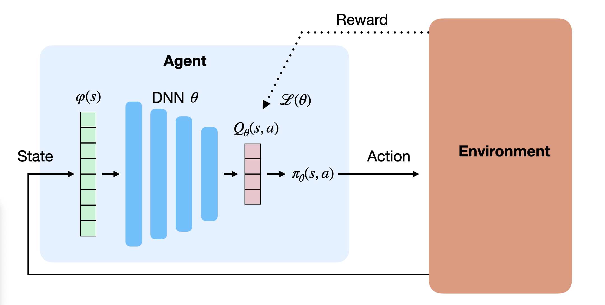

The goal of this educational book is to keep track of the state-of-the-art in deep reinforcement learning. It starts with basics in reinforcement learning and deep learning to introduce the notations. It then covers different classes of deep RL methods, value-based or policy-based, model-free or model-based, etc. Later sections focus on more advanced topics.

{width=70%}

This document is meant to stay *work in progress* forever, as new algorithms will be added as they are published. Feel free to comment, correct, suggest, pull request by writing to <julien.vitay@gmail.com>.

The book was used as the basis of the Deep RL course that I taught at the University of Chemnitz until 2025. You can find the slides there: <https://julien-vitay.net/course-deeprl/>.

Some figures are taken from the original publication ("Source:" in the caption). Their copyright stays to the respective authors, naturally. The rest is my own work and can be distributed, reproduced and modified under CC-BY-SA-NC 4.0.

:::{.callout-warning}
## AI disclaimer

Most of this book (everything up until model-based methods, included) has been written by hand by a human, old school. The "advanced topics" section has been generated in 2026 a posteriori by an AI agent based on the slides I produced for the course. I checked that it did not invent content. An agent also combed the human prose, fixed typos, and unified notations.
:::

:::{.callout-tip}
## License

Except where otherwise noted, this work is licensed under a [Creative Commons Attribution-Non Commercial-ShareAlike 4.0 International License](http://creativecommons.org/licenses/by-nc-sa/4.0).
:::
