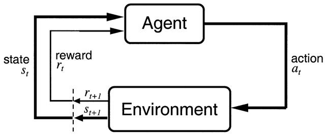

# Basics

Deep reinforcement learning (deep RL) is the integration of deep learning methods, classically used in supervised or unsupervised learning contexts, with reinforcement learning (RL), a well-studied adaptive control method used in problems with delayed and partial feedback [@Sutton1998]. This section starts with the basics of RL, mostly to set the notations, and provides a quick overview of deep neural networks.

## Reinforcement learning and Markov Decision Process

RL methods apply to problems where an agent interacts with an environment in discrete time steps (@fig:agentenv). At time $t$, the agent is in state $s_t$ and decides to perform an action $a_t$. At the next time step, it arrives in the state $s_{t+1}$ and obtains the reward $r_{t+1}$. The goal of the agent is to maximize the reward obtained on the long term. The textbook by @Sutton1998 (updated in @Sutton2017) defines the field extensively.

{#fig:agentenv width=50%}

Reinforcement learning problems are described as **Markov Decision Processes** (MDP) defined by five quantities:

* a state space $\mathcal{S}$ where each state $s$ respects the Markovian property. It can be finite or infinite.
* an action space $\mathcal{A}$ of actions $a$, which can be finite or infinite, discrete or continuous.
* an initial state distribution $p_0(s_0)$ (from which states is the agent likely to start).
* a transition dynamics model with density $p(s'|s, a)$, sometimes noted $\mathcal{P}_{ss'}^a$. It defines the probability of arriving in the state $s'$ at time $t+1$ when being in the state $s$ and performing the action $a$.
* a reward function $r(s, a, s') : \mathcal{S}\times\mathcal{A}\times\mathcal{S} \rightarrow \Re$ defining the (stochastic) reward obtained after performing $a$ in state $s$ and arriving in $s'$.

The behavior of the agent over time is a **trajectory** (also called episode, history or roll-out) $\tau = (s_0, a_0, s_1, a_, \ldots, s_T, a_T)$ defined by the dynamics of the MDP. Each transition occurs with a probability $p(s'|s, a)$ and provides a certain amount of reward defined by $r(s, a, s')$. In episodic tasks, the horizon $T$ is finite, while in continuing tasks $T$ is infinite.

Importantly, the **Markovian property** states that:

$$
    p(s_{t+1}|s_t, a_t) = p(s_{t+1}|s_t, a_t, s_{t-1}, a_{t-1}, \dots s_0, a_0)
$$

i.e. you do not need the full history of the agent to predict where it will arrive after an action. In simple problems, this is just a question of providing enough information to the description of a state: if a transition depends on what happened in the past, just put that information in the state description.

If the Markov property is not met, RL methods may not converge (or poorly). In many problems, one does not have access to the true states of the agent, but one can only indirectly observe them. For example, in a video game, the true state is defined by a couple of variables: coordinates $(x, y)$ of the two players, position of the ball, speed, etc. However, all you have access to are the raw pixels: sometimes the ball may be hidden behind a wall or a tree, but it still exists in the state space. Speed information is also not observable in a single frame.

In a **Partially Observable Markov Decision Process** (POMDP), observations $o_t$ come from a space $\mathcal{O}$ and are linked to underlying states using the density function $p(o_t| s_t)$. Observations are usually not Markovian, so the full history of observations $h_t = (o_0, a_0, \dots o_t, a_t)$ is needed to solve the problem.

### Policy and value functions

The policy defines the behavior of the agent: which action should be taken in each state. One distinguishes two kinds of policies:

* a stochastic policy $\pi : \mathcal{S} \rightarrow P(\mathcal{A})$ defines the probability distribution $P(\mathcal{A})$ of performing an action.
* a deterministic policy $\mu(s_t)$ is a discrete mapping of $\mathcal{S} \rightarrow \mathcal{A}$.

The policy can be used to explore the environment and generate trajectories of states, rewards and actions. The performance of a policy is determined by calculating the **expected discounted return**, i.e. the sum of all rewards received from time step $t$ onwards:

$$
    R_t = \sum_{k=0}^{T} \gamma^k \, r_{t+k+1}
$$

where $0 < \gamma \leq 1$ is the discount rate and $r_{t+1}$ represents the reward obtained during the transition from $s_t$ to $s_{t+1}$.

The **discount rate** $\gamma$ is a critical hyperparameter of RL: chosen too small, only immediate rewards will matter (i.e. participate to $R_t$) and the agent will be greedy. Chosen too close from 1, hypothetical rewards delivered in one year from now will count as much as slightly smaller rewards delivered for certain now.

If the task is episodic ($T$ is finite, the trajectories ends after a finite number of transitions), $\gamma$ can be set to 1, but if the task is continuing ($T=\infty$, trajectories have no end), $\gamma$ must be chosen smaller than 1.

The Q-value of a state-action pair $(s, a)$ is defined as the expected discounted reward received if the agent takes $a$ from a state $s$ and follows the policy distribution $\pi$ thereafter:

$$
    Q^{\pi}(s, a) = \mathbb{E}_{\pi}[R_t | s_t = s, a_t=a]
$$

More precisely, the Q-value of a state-action pair is the mathematical expectation of the expected return over all trajectories starting in $(s, a)$ defined by the policy $\pi$.

Similarly, the value of a state $s$ is the expected discounted reward received if the agent starts in $s$ and thereafter follows its policy $\pi$.

$$
    V^{\pi}(s) = \mathbb{E}_{\pi}[R_t | s_t = s]
$$

Obviously, these quantities depend on the states/actions themselves (some chessboard configurations are intrinsically better than others, i.e. you are more likely to win from that state), but also on the policy (if you can kill your opponent in one move - meaning you are in an intrinsically good state - but systematically take the wrong decision and lose, this is actually a bad state).

### Bellman equations

The V- and Q-values are obviously linked with each other. The value of state depend on the value of the actions possible in that state, modulated by the probability that an action will be taken (i.e. the policy):

$$
    V^{\pi}(s) = \sum_{a \in \mathcal{A}} \pi(s, a) \, Q^\pi(s,a)
$$ {#eq:v-value}

For a deterministic policy ($\pi(s, a) = 1$ if $a=a^*$ and $0$ otherwise), the value of a state is the same as the value of the action that will be systematically taken.

Noting that:

$$
    R_t = r_{t+1} + \gamma R_{t+1}
$$ {#eq:return}

i.e. that the expected return at time $t$ is the sum of the immediate reward received during the next transition $r_{t+1}$ and of the expected return at the next state ($R_{t+1}$, discounted by $\gamma$), we can also write:

$$
    Q^{\pi}(s, a) = \sum_{s' \in \mathcal{S}} p(s'|s, a) [r(s, a, s') + \gamma \, V^\pi(s')]
$$ {#eq:q-value}

The value of an action depends on which state you arrive in ($s'$), with which probability ($p(s'|s, a)$) this transition occurs, how much reward you receive immediately ($r(s, a, s')$) and how much you will receive later (summarized by $V^\pi(s')$).

Putting together @eq:v-value and @eq:q-value, we obtain the **Bellman equations**:

$$
    V^{\pi}(s) = \sum_{a \in \mathcal{A}} \pi(s, a) \, \sum_{s' \in \mathcal{S}} p(s'|s, a) [r(s, a, s') + \gamma \, V^\pi(s')]
$$

$$
    Q^{\pi}(s, a) = \sum_{s' \in \mathcal{S}} p(s'|s, a) [r(s, a, s') + \gamma \, \sum_{a' \in \mathcal{A}} \pi(s', a') \, Q^\pi(s',a')]
$$

The Bellman equations mean that the value of a state (resp. state-action pair) depends on the value of all other states (resp. state-action pairs), the current policy $\pi$ and the dynamics of the MDP ($p(s'|s, a)$ and $r(s, a, s')$).

{#fig:backup width=50%}

### Dynamic programming

The interesting property of the Bellman equations is that, if the states have the Markovian property, they admit *one and only one* solution. This means that for a given policy, if the dynamics of the MDP are known, it is possible to compute the value of all states or state-action pairs by solving the Bellman equations for all states or state-action pairs (*policy evaluation*).

Once the values are known for a given policy, it is possible to improve the policy by selecting with the highest probability the action with the highest Q-value. For example, if the current policy chooses the action $a_1$ over $a_2$ in $s$ ($\pi(s, a_1) > \pi(s, a_2)$), but after evaluating the policy it turns out that $Q^\pi(s, a_2) > Q^\pi(s, a_1)$ (the expected return after $a_2$ is higher than after $a_1$), it makes more sense to preferentially select $a_2$, as there is more reward afterwards. We can then create a new policy $\pi'$ where $\pi'(s, a_2) > \pi'(s, a_1)$, which is is *better* policy than $\pi$ as more reward can be gathered after $s$.

{#fig:dynamicprogramming width=20%}

**Dynamic programming** (DP) alternates between policy evaluation and policy improvement. If the problem is Markovian, it can be shown that DP converges to the *optimal policy* $\pi^*$, i.e. the policy where the expected return is maximal in all states.

Note that by definition the optimal policy is *deterministic* and *greedy*: if there is an action with a maximal Q-value for the optimal policy, it should be systematically taken. For the optimal policy $\pi^*$, the Bellman equations become:

$$
    V^{*}(s) = \max_{a \in \mathcal{A}} \sum_{s \in \mathcal{S}} p(s' | s, a) \cdot [ r(s, a, s') + \gamma \cdot V^{*} (s') ]
$$

$$
    Q^{*}(s, a) = \sum_{s' \in \mathcal{S}} p(s' | s, a) \cdot [r(s, a, s') + \gamma \max_{a' \in \mathcal{A}} Q^* (s', a') ]
$$

Dynamic programming can only be used when:

* the dynamics of the MDP ($p(s'|s, a)$ and $r(s, a, s')$) are fully known.
* the number of states and state-action pairs is small (one Bellman equation per state or state/action to solve).

In practice, sample-based methods such as Monte-Carlo or temporal difference are used.

### Monte-Carlo sampling

{#fig:mc width=50%}

When the environment is *a priori* unknown, it has to be explored in order to build estimates of the V or Q value functions. The key idea of **Monte-Carlo** sampling (MC) is rather simple:

1. Start from a state $s_0$.
2. Perform an episode (sequence of state-action transitions) until a terminal state $s_T$ is reached using your current policy $\pi$.
3. Accumulate the rewards into the actual return for that episode $R_t^{(e)} = \sum_{k=0}^T r_{t+k+1}$ for each time step.
4. Repeat often enough so that the value of a state $s$ can be approximated by the average of many actual returns:

$$V^\pi(s) = \mathbb{E}_\pi[R_t | s_t = s] \approx \frac{1}{M} \sum_{e=1}^M R_t^{(e)}$$

Monte-carlo sampling is a classical method to estimate quantities defined by a mathematical expectation: the *true* value of $V^\pi(s)$ is defined over **all** trajectories starting in $s$, what is impossible to compute in most problems. In MC methods, the true value is approximated by the average of a sufficient number of sampled trajectories, the million dollar question being: what means *sufficient*?

In practice, the estimated values are updated using continuous updates:

$$
    V^\pi(s) \leftarrow V^\pi(s) + \alpha (R_t - V^\pi(s))
$$

Q-values can also be approximated using the same procedure:

$$
    Q^\pi(s, a) \leftarrow Q^\pi(s, a) + \alpha (R_t - Q^\pi(s, a))
$$

The two main drawbacks of MC methods are:

1. The task must be episodic, i.e. stop after a finite amount of transitions. Updates are only applied at the end of an episode.
2. A sufficient level of exploration has to be ensured to make sure the estimates converge to the optimal values.

The second issue is linked to the **exploration-exploitation** dilemma: the episode is generated using the current policy (or a policy derived from it, see later). If the policy always select the same actions from the beginning (exploitation), the agent will never discover better alternatives: the values will converge to a local minimum. If the policy always pick randomly actions (exploration), the policy which is evaluated is not the current policy $\pi$, but the random policy. A trade-off between the two therefore has to be maintained: usually a lot of exploration at the beginning of learning to accumulate knowledge about the environment, less towards the end to actually use the knowledge and perform optimally.

There are two types of methods trying to cope with exploration:

* **On-policy** methods generate the episodes using the learned policy $\pi$, but it has to be *$\epsilon$-soft*, i.e. stochastic: it has to let a probability of at least $\epsilon$ of selecting another action than the greedy action (the one with the highest estimated Q-value).
* **Off-policy** methods use a second policy called the *behavior policy* to generate the episodes, but learn a different policy for exploitation, which can even be deterministic.

$\epsilon$-soft policies are easy to create. The simplest one is the **$\epsilon$-greedy** action selection method, which assigns a probability $(1-\epsilon)$ of selecting the greedy action (the one with the highest Q-value), and a probability $\epsilon$ of selecting any of the other available actions:

$$
    a_t = \begin{cases} a_t^* \quad \text{with probability} \quad (1 - \epsilon) \\
                       \text{any other action with probability } \epsilon \end{cases}
$$

Another solution is the **Softmax** (or Gibbs distribution) action selection method, which assigns to each action a probability of being selected depending on their relative Q-values:

$$
    P(s, a) = \frac{\exp Q^\pi(s, a) / \tau}{ \sum_b \exp Q^\pi(s, b) / \tau}
$$

$\tau$ is a positive parameter called the temperature: high temperatures cause the actions to be nearly equiprobable, while low temperatures cause $\tau$ is a positive parameter called the temperature.

The advantage of off-policy methods is that domain knowledge can be used to restrict the search in the state-action space. For example, only moves actually played by chess experts in a given state will be actually explored, not random stupid moves. The obvious drawback being that if the optimal solution is not explored by the behavior policy, the agent has no way to discover it by itself.

### Temporal Difference

The main drawback of Monte-Carlo methods is that the task must be composed of finite episodes. Not only is it not always possible, but value updates have to wait for the end of the episode, what slows learning down. **Temporal difference** methods simply replace the actual return obtained after a state or an action, by an estimation composed of the reward immediately received plus the value of the next state or action, as in @eq:return:

$$
    R_t \approx r(s, a, s') + \gamma \, V^\pi(s') \approx r + \gamma \, Q^\pi(s', a')
$$

This gives us the following learning rules:

$$
    V^\pi(s) \leftarrow V^\pi(s) + \alpha (r(s, a, s') + \gamma \, V^\pi(s') - V^\pi(s))
$$

$$
    Q^\pi(s, a) \leftarrow Q^\pi(s, a) + \alpha (r(s, a, s') + \gamma \, Q^\pi(s', a') - Q^\pi(s, a))
$$

The quantity:

$$
 \delta = r(s, a, s') + \gamma \, V^\pi(s') - V^\pi(s)
$$

or:

$$
    \delta = r(s, a, s') + \gamma \, Q^\pi(s', a') - Q^\pi(s, a)
$$

is called the **reward-prediction error** (RPE) or **TD error**: it defines the surprise between the current reward prediction ($V^\pi(s)$ or $Q^\pi(s, a)$) and the sum of the immediate reward plus the reward prediction in the next state / after the next action.

* If $\delta > 0$, the transition was positively surprising: one obtains more reward or lands in a better state than expected. The initial state or action was actually underrated, so its estimated value must be increased.
* If $\delta < 0$, the transition was negatively surprising. The initial state or action was overrated, its value must be decreased.
* If $\delta = 0$, the transition was fully predicted: one obtains as much reward as expected, so the values should stay as they are.

The main advantage of this learning method is that the update of the V- or Q-value can be applied immediately after a transition: no need to wait until the end of an episode, or even to have episodes at all: this is called **online learning** and allows very fast learning from single transitions. The main drawback is that the updates depend on other estimates, which are initially wrong: it will take a while before all estimates are correct.

{#fig:td width=3%}

When learning Q-values directly, the question is which next action $a'$ should be used in the update rule: the action that will actually be taken for the next transition (defined by $\pi(s', a')$), or the greedy action ($a^* = \text{argmax}_a Q^\pi(s', a)$). This relates to the *on-policy / off-policy* distinction already seen for MC methods:

* **On-policy** TD learning is called **SARSA** (state-action-reward-state-action). It uses the next action sampled from the policy $\pi(s', a')$ to update the current transition. This selected action could be noted $\pi(s')$ for simplicity. It is required that this next action will actually be performed for the next transition. The policy must be $\epsilon$-soft, for example $\epsilon$-greedy or softmax:

$$
    \delta = r(s, a, s') + \gamma \, Q^\pi(s', \pi(s')) - Q^\pi(s, a)
$$

* **Off-policy** TD learning is called **Q-learning** [@Watkins1989]. The greedy action in the next state (the one with the highest Q-value) is used to update the current transition. It does not mean that the greedy action will actually have to be selected for the next transition. The learned policy can therefore also be deterministic:

$$
    \delta = r(s, a, s') + \gamma \, \max_{a'} Q^\pi(s', a') - Q^\pi(s, a)
$$

In Q-learning, the behavior policy has to ensure exploration, while this is achieved implicitly by the learned policy in SARSA, as it must be $\epsilon$-soft. An easy way of building a behavior policy based on a deterministic learned policy is $\epsilon$-greedy: the deterministic action $\mu(s_t)$ is chosen with probability 1 - $\epsilon$, the other actions with probability $\epsilon$. In continuous action spaces, additive noise (e.g. Ohrstein-Uhlenbeck, see @sec:deep-deterministic-policy-gradient-ddpg) can be added to the action.

Alternatively, domain knowledge can be used to create the behavior policy and restrict the search to meaningful actions: compilation of expert moves in games, approximate solutions, etc. Again, the risk is that the behavior policy never explores the actually optimal actions. See @sec:off-policy-actor-critic for more details on the difference between on-policy and off-policy methods.

### Eligibility traces

The main drawback of TD learning is that learning can be slow and necessitate many transitions to converge (sample complexity). This is particularly true when the problem provides **sparse rewards** (as opposed to dense rewards). For example in a game like chess, a reward is given only at the end of a game (+1 for winning, -1 for losing). All other actions receive a reward of 0, although they are as important as the last one in order to win.

Imagine you initialize all Q-values to 0 and apply Q-learning. During the first episode, all actions but the last one will receive a reward $r(s, a, s')$ of 0 and arrive in a state where the greedy action has a value $Q^\pi(s', a')$ of 0, so the TD error $\delta$ is 0 and their Q-value will not change. Only the very last action will receive a non-zero reward and update its value slightly (because of the learning rate $\alpha$). When this episode is performed again, the last action will again be updated, but also the one just before: $Q^\pi(s', a')$ is now different from 0 for this action, so the TD error is now different from 0. It is straightforward to see that if the episode has a length of 100 moves, the agent will need at least 100 episodes to "backpropagate" the final sparse reward to the first action of the episode. In practice, this is even worse: the learning rate $\alpha$ and the discount rate $\gamma$ will slow learning down even more. MC methods suffer less from this problem, as the first action of the episode would be updated using the actual return, which contains the final reward (although it is discounted by $\gamma$).

**Eligibility traces** can be seen a trick to mix the advantages of MC (faster updates) with the ones of TD (online learning, smaller variance). The idea is that the TD error at time $t$ ($\delta_t$) will be used not only to update the action taken at time $t$ ($\Delta Q(s_t, a_t) = \alpha \, \delta_t$), but also all the preceding actions, which are also responsible for the success or failure of the action taken at time $t$. A parameter $\lambda$ between 0 and 1 (decaying factor) controls how far back in time a single TD error influences past actions. This is important when the policy is mostly exploratory: initial actions may be mostly random and finally find the the reward by chance. They should learn less from the reward than the last one, otherwise they would be systematically reproduced. @fig:eligibilitytraces shows the principle of eligibility traces in a simple Gridworld environment.

{#fig:eligibilitytraces width=80%}

There are many possible implementations of eligibility traces (Watkin's, Peng, Tree Backup, etc. See the Chapter 12 of @Sutton2017). Generally, one distinguished a forward and a backward view of eligibility traces.

* The *forward view* considers that one transition $(s_t, a_t)$ gathers the TD errors made at future time steps $t'$ and discounts them with the parameter $\lambda$:

$$
    Q^\pi(s_t, a_t) \leftarrow  Q^\pi(s_t, a_t) + \alpha \, \sum_{t'=t}^T (\gamma \lambda)^{t'-t} \delta_{t'}
$$

From this equation, $\gamma$ and $\lambda$ seem to play a relatively similar role, but remember that $\gamma$ is also used in the TD error, so they control different aspects of learning. The drawback of this approach is that the future transitions at $t'>t$ and their respective TD errors must be known when updating the transition, so this prevents online learning (the episode must be terminated to apply the updates).

* The *backward view* considers that the TD error made at time $t$ is sent backwards in time to all transitions previously executed. The easiest way to implement this is to update an eligibility trace $e(s,a)$ for each possible transition, which is incremented every time a transition is visited and otherwise decays exponentially with a speed controlled by $\lambda$:

$$
    e(s, a) = \begin{cases} e(s, a) + 1 \quad \text{if} \quad s=s_t \quad \text{and} \quad a=a_t \\
                            \lambda \, e(s, a) \quad \text{otherwise.}
              \end{cases}
$$

The Q-value of **all** transitions $(s, a)$ (not only the one just executed) is then updated proportionally to the corresponding trace and the current TD error:

$$
    Q^\pi(s, a) \leftarrow  Q^\pi(s, a) + \alpha \, e(s, a) \, \delta_{t} \quad \forall s, a
$$

The forward and backward implementations are equivalent: the first requires to know the future, the second requires to update many transitions at each time step. The best solution will depend on the complexity of the problem.

TD learning, SARSA and Q-learning can all be efficiently extended using eligibility traces. This gives the algorithms TD($\lambda$), SARSA($\lambda$) and Q($\lambda$), which can learn much faster than their 1-step equivalent, at the cost of more computations.

### Actor-critic architectures

Let's consider the TD error based on state values:

$$
 \delta = r(s, a, s') + \gamma \, V^\pi(s') - V^\pi(s)
$$

As noted in the previous sections, the TD error represents how surprisingly good (or bad) a transition between two states has been (ergo the corresponding action). It can be used to update the value of the state $s_t$:

$$
    V^\pi(s) \leftarrow V^\pi(s) + \alpha \, \delta
$$

This allows to estimate the values of all states for the current policy. However, this does not help to 1) directy select the best action or 2) improve the policy. When only the V-values are given, one can only want to reach the next state $V^\pi(s')$ with the highest value: one needs to know which action leads to this better state, i.e. have a model of the environment. Actually, one selects the action with the highest Q-value:

$$
    Q^{\pi}(s, a) = \sum_{s' \in \mathcal{S}} p(s'|s, a) [r(s, a, s') + \gamma \, V^\pi(s')]
$$

An action may lead to a high-valued state, but with such a small probability that it is actually not worth it. $p(s'|s, a)$ and $r(s, a, s')$ therefore have to be known (or at least approximated), what defeats the purpose of sample-based methods.

![Actor-critic architecture [@Sutton1998].](img/actorcritic.png){#fig:actorcritic width=30%}

**Actor-critic** architectures have been proposed to solve this problem:

1. The **critic** learns to estimate the value of a state $V^\pi(s)$ and compute the RPE $\delta = r(s, a, s') + \gamma \, V^\pi(s') - V^\pi(s)$.
2. The **actor** uses the RPE to update a *preference* for the executed action: action with positive RPEs (positively surprising) should be reinforced (i.e. taken again in the future), while actions with negative RPEs should be avoided in the future.

The main interest of this architecture is that the actor can take any form (neural network, decision tree), as long as it able to use the RPE for learning. The simplest actor would be a softmax action selection mechanism, which maintains a *preference* $p(s, a)$ for each action and updates it using the TD error:

$$
    p(s, a) \leftarrow p(s, a) + \alpha \, \delta_t
$$

The policy uses the softmax rule on these preferences:

$$
    \pi(s, a) = \frac{p(s, a)}{\sum_a p(s, a)}
$$

Actor-critic algorithms learn at the same time two aspects of the problem:

* A value function (e.g. $V^\pi(s)$) to compute the TD error in the critic,
* A policy $\pi$ in the actor.

Classical TD learning only learn a value function ($V^\pi(s)$ or $Q^\pi(s, a)$): these methods are called **value-based** methods. Actor-critic architectures are particularly important in **policy search** methods (see @sec:policy-gradient-methods).

### Function approximation

All the methods presented before are *tabular methods*, as one needs to store one value per state-action pair: either the Q-value of the action or a preference for that action. In most useful applications, the number of values to store would quickly become prohibitive: when working on raw images, the number of possible states alone is untractable. Moreover, these algorithms require that each state-action pair is visited a sufficient number of times to converge towards the optimal policy: if a single state-action pair is never visited, there is no guarantee that the optimal policy will be found. The problem becomes even more obvious when considering *continuous* state or action spaces.

However, in a lot of applications, the optimal action to perform in two very close states is likely to be the same: changing one pixel in a video game does not change which action should be applied. It would therefore be very useful to be able to *interpolate* Q-values between different states: only a subset of all state-action pairs has to explored; the others will be "guessed" depending on the proximity between the states and/or the actions. The problem is now **generalization**, i.e. transferring acquired knowledge to unseen but similar situations.

This is where **function approximation** becomes useful: the Q-values or the policy are not stored in a table, but rather learned by a function approximator. The type of function approximator does not really matter here: in deep RL we are of course interested in deep neural networks (@sec:deep-learning), but any kind of regressor theoretically works (linear algorithms, radial-basis function network, SVR...).

#### Value-based function approximation {-}

In **value-based** methods, we want to approximate the Q-values $Q^\pi(s,a)$ of all possible state-action pairs for a given policy. The function approximator depends on a set of parameters $\theta$. $\theta$ can for example represent all the weights and biases of a neural network. The approximated Q-value can now be noted $Q(s, a ;\theta)$ or $Q_\theta(s, a)$. As the parameters will change over time during learning, we can omit the time $t$ from the notation. Similarly, action selection is usually $\epsilon$-greedy or softmax, so the policy $\pi$ depends directly on the estimated Q-values and can therefore on the parameters: it is noted $\pi_\theta$.

{#fig:functionapprox width=50%}

There are basically two options regarding the structure of the function approximator (@fig:functionapprox):

1. The approximator takes a state-action pair $(s, a)$ as input and returns a single Q-value $Q(s, a)$.
2. It takes a state $s$ as input and returns the Q-value of all possible actions in that state.

The second option is of course only possible when the action space is discrete, but has the advantage to generalize better over similar states.

The goal of a function approximator is to minimize a *loss function* (or cost function) $\mathcal{L}(\theta)$, so that the estimated Q-values converge for all state-pairs towards their target value, depending on the chosen algorithm:

* Monte-Carlo methods: the Q-value of each $(s, a)$ pair should converge towards the mean expected return (in expectation):

$$
    \mathcal{L}(\theta) = \mathbb{E}_\pi[(R_t - Q_\theta(s, a))^2]
$$

If we learn over $N$ episodes of length $T$, the loss function can be approximated as:

$$
    \mathcal{L}(\theta) \approx \frac{1}{N} \sum_{e=1}^N \sum_{t = 1}^T [R^e_t - Q_\theta(s_t, a_t)]^2
$$

* Temporal difference methods: the Q-values should converge towards an estimation of the mean expected return.

    * For SARSA:

    $$
    \mathcal{L}(\theta) = \mathbb{E}_\pi[(r(s, a, s') + \gamma \, Q_\theta(s', \pi(s')) - Q_\theta(s, a))^2]
    $$

    * For Q-learning:

    $$
    \mathcal{L}(\theta) = \mathbb{E}_\pi[(r(s, a, s') + \gamma \, \max_{a'} Q_\theta(s', a') - Q_\theta(s, a))^2]
    $$

Any function approximator able to minimize these loss functions can be used.

#### Policy-based function approximation {-}

In policy-based function approximation, we want to directly learn a policy $\pi_\theta(s, a)$ that maximizes the expected return of each possible transition, i.e. the ones which are selected by the policy. The **objective function** to be maximized is defined over all trajectories $\tau = (s_0, a_0, s_1, a_1, \ldots, s_T, a_T)$ conditioned by the policy:

$$
    J(\theta) = \mathbb{E}_{\tau \sim \rho_\theta} [R_t]
$$

In short, the learned policy $\pi_\theta$ should only produce trajectories $\tau$ where each state is associated to a high expected return $R_t$ and avoid trajectories with low expected returns. Although this objective function leads to the desired behavior, it is not computationally tractable as we would need to integrate over all possible trajectories. The methods presented in @sec:policy-gradient-methods will provide estimates of the gradient of this objective function.
