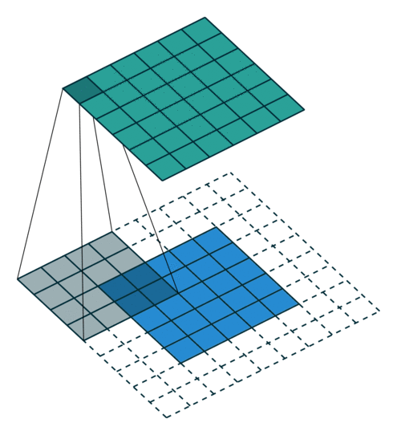
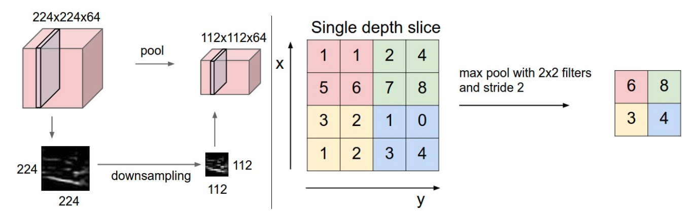

## Deep learning

Deep RL uses deep neural networks as function approximators, allowing complex representations of the value of state-action pairs to be learned. This section provides a very quick overview of deep learning. For additional details, refer to the excellent book of @Goodfellow2016.

### Deep neural networks

A deep neural network (DNN) consists of one input layer $\mathbf{x}$, one or several hidden layers $\mathbf{h_1}, \mathbf{h_2}, \ldots, \mathbf{h_n}$ and one output layer $\mathbf{y}$ (@fig:dnn).

{#fig:dnn width=60%}

Each layer $k$ (called *fully-connected*) transforms the activity of the previous layer (the vector $\mathbf{h_{k-1}}$) into another vector $\mathbf{h_{k}}$ by multiplying it with a **weight matrix** $W_k$, adding a **bias** vector $\mathbf{b_k}$ and applying a non-linear **activation function** $f$.

$$
    \mathbf{h_{k}} = f(W_k \times \mathbf{h_{k-1}} + \mathbf{b_k})
$${#eq:fullyconnected}

The activation function can theoretically be of any type as long as it is non-linear (sigmoid, tanh...), but modern neural networks use preferentially the **Rectified Linear Unit** (ReLU) function $f(x) = \max(0, x)$ or its parameterized variants.

The goal of learning is to find the weights and biases $\theta$ minimizing a given **loss function** on a training set $\mathcal{D}$.

* In *regression* problems, the **mean square error** (mse) is minimized:

$$
    \mathcal{L}(\theta) = \mathbb{E}_{\mathbf{x}, \mathbf{t} \in \mathcal{D}} [||\mathbf{t} - \mathbf{y}||^2]
$$

where $\mathbf{x}$ is the input, $\mathbf{t}$ the true output (defined in the training set) and $\mathbf{y}$ the prediction of the NN for the input $\mathbf{x}$. The closer the prediction from the true value, the smaller the mse.

* In *classification* problems, the **cross entropy** (or negative log-likelihood) is minimized:

$$
    \mathcal{L}(\theta) = - \mathbb{E}_{\mathbf{x}, \mathbf{t} \in \mathcal{D}} [\sum_i t_i \log y_i]
$$

where the log-likelihood of the prediction $\mathbf{y}$ to match the data $\mathbf{t}$ is maximized over the training set. The mse could be used for classification problems too, but the output layer usually has a softmax activation function for classification problems, which works nicely with the cross entropy loss function. See <https://rdipietro.github.io/friendly-intro-to-cross-entropy-loss> for the link between cross entropy and log-likelihood and <https://deepnotes.io/softmax-crossentropy> for the interplay between softmax and cross entropy.

Once the loss function is defined, it has to be minimized by searching optimal values for the free parameters $\theta$. This optimization procedure is based on **gradient descent**, which is an iterative procedure modifying estimates of the free parameters in the opposite direction of the gradient of the loss function:

$$
\Delta \theta = -\eta \, \nabla_\theta \mathcal{L}(\theta) = -\eta \, \frac{\partial \mathcal{L}(\theta)}{\partial \theta}
$$

The learning rate $\eta$ is chosen very small to ensure a smooth convergence. Intuitively, the gradient (or partial derivative) represents how the loss function changes when each parameter is slightly increased. If the gradient w.r.t a single parameter (e.g. a weight $w$) is positive, increasing the weight increases the loss function (i.e. the error), so the weight should be slightly decreased instead. If the gradient is negative, one should increase the weight.

The question is now to compute the gradient of the loss function w.r.t all the parameters of the DNN, i.e. each single weight and bias. The solution is given by the **backpropagation** algorithm, which is simply an application of the **chain rule** to feedforward neural networks:

$$
    \frac{\partial \mathcal{L}(\theta)}{\partial W_k} = \frac{\partial \mathcal{L}(\theta)}{\partial \mathbf{y}} \times \frac{\partial \mathbf{y}}{\partial \mathbf{h_n}} \times \frac{\partial \mathbf{h_n}}{\partial \mathbf{h_{n-1}}} \times \ldots \times \frac{\partial \mathbf{h_k}}{\partial W_k}
$$

Each layer of the network adds a contribution to the gradient when going **backwards** from the loss function to the parameters. Importantly, all functions used in a NN are differentiable, i.e. those partial derivatives exist (and are easy to compute). For the fully connected layer represented by @eq:fullyconnected, the partial derivative is given by:

$$
    \frac{\partial \mathbf{h_{k}}}{\partial \mathbf{h_{k-1}}} = f'(W_k \times \mathbf{h_{k-1}} + \mathbf{b_k}) \, W_k
$$

and its dependency on the parameters is:

$$
    \frac{\partial \mathbf{h_{k}}}{\partial W_k} = f'(W_k \times \mathbf{h_{k-1}} + \mathbf{b_k}) \, \mathbf{h_{k-1}}
$$
$$
    \frac{\partial \mathbf{h_{k}}}{\partial \mathbf{b_k}} = f'(W_k \times \mathbf{h_{k-1}} + \mathbf{b_k})
$$

Activation functions are chosen to have an easy-to-compute derivative, such as the ReLU function:

$$
    f'(x) = \begin{cases} 1 \quad \text{if} \quad x > 0 \\ 0 \quad \text{otherwise.} \end{cases}
$$

Partial derivatives are automatically computed by the underlying libraries, such as tensorflow, theano, pytorch, etc. The next step is choose an **optimizer**, i.e. a gradient-based optimization method allow to modify the free parameters using the gradients. Optimizers do not work on the whole training set, but use **minibatches** (a random sample of training examples: their number is called the *batch size*) to compute iteratively the loss function. The most popular optimizers are:

* SGD (stochastic gradient descent): vanilla gradient descent on random minibatches.
* SGD with momentum (Nesterov or not): additional momentum to avoid local minima of the loss function.
* Adagrad
* Adadelta
* RMSprop
* Adam
* Many others. Check the doc of keras to see what is available: <https://keras.io/optimizers>

See this useful post for a comparison of the different optimizers: <http://ruder.io/optimizing-gradient-descent> [@Ruder2016]. The common wisdom is that SGD with Nesterov momentum works best (i.e. it finds a better minimum) but its meta-parameters (learning rate, momentum) are hard to find, while Adam works out-of-the-box, at the cost of a slightly worse minimum. For deep RL, Adam is usually preferred, as the goal is to quickly find a working solution, not to optimize it to the last decimal.

<!-- {#fig:optimizers width=50%} -->

Additional regularization mechanisms are now typically part of DNNs in order to avoid overfitting (learning by heart the training set but failing to generalize): L1/L2 regularization, dropout, batch normalization, etc. Refer to @Goodfellow2016 for further details.

### Convolutional networks

Convolutional Neural Networks (CNN) are an adaptation of DNNs to deal with highly dimensional input spaces such as images. The idea is that neurons in the hidden layer reuse ("share") weights over the input image, as the features learned by early layers are probably local in visual classification tasks: in computer vision, an edge can be detected by the same filter all over the input image.

A **convolutional layer** learns to extract a given number of features (typically 16, 32, 64, etc) represented by 3x3 or 5x5 matrices. These matrices are then convoluted over the whole input image (or the previous convolutional layer) to produce **feature maps**. If the input image has a size NxMx1 (grayscale) or NxMx3 (colored), the convolutional layer will be a tensor of size NxMxF, where F is the number of extracted features. Padding issues may reduce marginally the spatial dimensions. One important aspect is that the convolutional layer is fully differentiable, so backpropagation and the usual optimizers can be used to learn the filters.

{#fig:convlayer width=50%}

After a convolutional layer, the spatial dimensions are preserved. In classification tasks, it does not matter where the object is in the image, the only thing that matters is what it is: classification requires **spatial invariance** in the learned representations. The **max-pooling layer** was introduced to downsample each feature map individually and increase their spatial invariance. Each feature map is divided into 2x2 blocks (generally): only the maximal feature activation in that block is preserved in the max-pooling layer. This reduces the spatial dimensions by a factor two in each direction, but keeps the number of features equal.

{#fig:maxpooling}

A convolutional neural network is simply a sequence of convolutional layers and max-pooling layers (sometime two convolutional layers are applied in a row before max-pooling, as in VGG [@Simonyan2015]), followed by a couple of fully-connected layers and a softmax output layer. @fig:alexnet shows the architecture of AlexNet, the winning architecture of the ImageNet challenge in 2012 [@Krizhevsky2012].

{#fig:alexnet}

Many improvements have been proposed since 2012 (e.g. ResNets [@He2015]) but the idea stays similar. Generally, convolutional and max-pooling layers are alternated until the spatial dimensions are so reduced (around 10x10) that they can be put into a single vector and fed into a fully-connected layer. This is **NOT** the case in deep RL! Contrary to object classification, spatial information is crucial in deep RL: position of the ball, position of the body, etc. It matters whether the ball is to the right or to the left of your paddle when you decide how to move it. Max-pooling layers are therefore omitted and the CNNs only consist of convolutional and fully-connected layers. This greatly increases the number of weights in the networks, hence the number of training examples needed to train the network. This is still the main limitation of using CNNs in deep RL.

### Recurrent neural networks

Feedforward neural networks learn to efficiently map static inputs $\mathbf{x}$ to outputs $\mathbf{y}$ but have no memory or context: the output at time $t$ does not depend on the inputs at time $t-1$ or $t-2$, only the one at time $t$. This is problematic when dealing with video sequences for example: if the task is to classify videos into happy/sad, a frame by frame analysis is going to be inefficient (most frames a neutral). Concatenating all frames in a giant input vector would increase dramatically the complexity of the classifier and no generalization can be expected.

Recurrent Neural Networks (RNN) are designed to deal with time-varying inputs, where the relevant information to take a decision at time $t$ may have happened at different times in the past. The general structure of a RNN is depicted on @fig:rnn:

{#fig:rnn width=90%}

The output $\mathbf{h}_t$ of the RNN at time $t$ depends on its current input $\mathbf{x}_t$, but also on its previous output $\mathbf{h}_{t-1}$, which, by recursion, depends on the whole history of inputs $(x_0, x_1, \ldots, x_t)$.

$$
    \mathbf{h}_t = f(W_x \, \mathbf{x}_{t} + W_h \, \mathbf{h}_{t-1} + \mathbf{b})
$$

Once unrolled, a RNN is equivalent to a deep network, with $t$ layers of weights between the first input $\mathbf{x}_0$ and the current output $\mathbf{h}_t$. The only difference with a feedforward network is that weights are reused between two time steps / layers. **Backpropagation though time** (BPTT) can be used to propagate the gradient of the loss function backwards in time and learn the weights $W_x$ and $W_h$ using the usual optimizer (SGD, Adam...).

However, this kind of RNN can only learn short-term dependencies because of the **vanishing gradient problem** [@Hochreiter1991]. When the gradient of the loss function travels backwards from  $\mathbf{h}_t$ to $\mathbf{x}_0$, it will be multiplied $t$ times by the recurrent weights $W_h$. If $|W_h| > 1$, the gradient will explode with increasing $t$, while if $|W_h| < 1$, the gradient will vanish to 0.

The solution to this problem is provided by **long short-term memory networks** [LSTM;@Hochreiter1997]. LSTM layers maintain additionally a state $\mathbf{C}_t$ (also called context or memory) which is manipulated by three learnable gates (input, forget and output gates). As in regular RNNs, a *candidate state* $\tilde{\mathbf{C}_t}$ is computed based on the current input and the previous output:

$$
    \tilde{\mathbf{C}_t} = f(W_x \, \mathbf{x}_{t} + W_h \, \mathbf{h}_{t-1} + \mathbf{b})
$$

{#fig:lstm width=40%}

The activation function $f$ is usually a tanh function. The input and forget learn to decide how the candidate state should be used to update the current state:

* The input gate decides which part of the candidate state $\tilde{\mathbf{C}_t}$ will be used to update the current state $\mathbf{C}_t$:

$$
    \mathbf{i}_t = \sigma(W^i_x \, \mathbf{x}_{t} + W^i_h \, \mathbf{h}_{t-1} + \mathbf{b}^i)
$$

The sigmoid activation function $\sigma$ is used to output a number between 0 and 1 for each neuron: 0 means the candidate state will not be used at all, 1 means completely.

* The forget gate decides which part of the current state should be kept or forgotten:

$$
    \mathbf{f}_t = \sigma(W^f_x \, \mathbf{x}_{t} + W^f_h \, \mathbf{h}_{t-1} + \mathbf{b}^f)
$$

Similarly, 0 means that the corresponding element of the current state will be erased, 1 that it will be kept.

Once the input and forget gates are computed, the current state can be updated based on its previous value and the candidate state:

$$
   \mathbf{C}_t =  \mathbf{i}_t \odot \tilde{\mathbf{C}_t} + \mathbf{f}_t \odot \mathbf{C}_{t-1}
$$

where $\odot$ is the element-wise multiplication.

* The output gate finally learns to select which part of the current state $\mathbf{C}_t$ should be used to produce the current output $\mathbf{h}_t$:

$$
    \mathbf{o}_t = \sigma(W^o_x \, \mathbf{x}_{t} + W^o_h \, \mathbf{h}_{t-1} + \mathbf{b}^o)
$$

$$
    \mathbf{h}_t = \mathbf{o}_t \odot \tanh \mathbf{C}_t
$$

The architecture may seem complex, but everything is differentiable: backpropagation though time can be used to learn not only the input and recurrent weights for the candidate state, but also the weights and and biases of the gates. The main advantage of LSTMs is that they solve the vanishing gradient problem: if the input at time $t=0$ is important to produce a response at time $t$, the input gate will learn to put it into the memory and the forget gate will learn to maintain in the current state until it is not needed anymore. During this "working memory" phase, the gradient is multiplied by exactly one as nothing changes: the dependency can be learned with arbitrary time delays!

There are alternatives to the classical LSTM layer such as the gated recurrent unit [GRU; @Cho2014] or peephole connections [@Gers2001]. See <http://colah.github.io/posts/2015-08-Understanding-LSTMs>, <https://medium.com/mlreview/understanding-lstm-and-its-diagrams-37e2f46f1714> or <http://blog.echen.me/2017/05/30/exploring-lstms/> for more visual explanations of LSTMs and their variants.

RNNs are particularly useful for deep RL when considering POMDPs, i.e. partially observable problems. If an observation does not contain enough information about the underlying state (e.g. a single image does not contain speed information), LSTM can integrate these observations over time and learn to implicitly represent speed in its context vector, allowing efficient policies to be learned.
