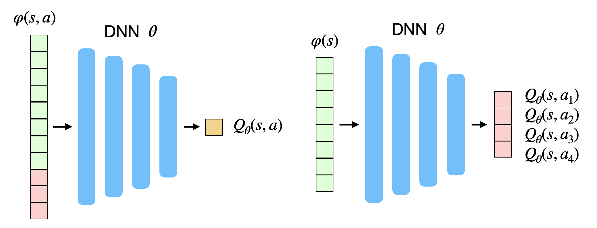

# Value-based methods

## Limitations of deep neural networks for function approximation

The goal of value-based deep RL is to approximate the Q-value of each possible state-action pair using a deep (convolutional) neural network. As shown on @fig:functionapprox2, the network can either take a state-action pair as input and return a single output value, or take only the state as input and return the Q-value of all possible actions (only possible if the action space is discrete), In both cases, the goal is to learn estimates $Q_\theta(s, a)$ with a NN with parameters $\theta$.

{#fig:functionapprox2 width=60%}

When using Q-learning, we have already seen in @sec:function-approximation that the problem is a regression problem, where the following mse loss function has to be minimized:

$$
    \mathcal{L}(\theta) = \mathbb{E}_\pi[(r_t + \gamma \, \max_{a'} Q_\theta(s', a') - Q_\theta(s, a))^2]
$$

In short, we want to reduce the prediction error, i.e. the mismatch between the estimate of the value of an action $Q_\theta(s, a)$ and the real expected return, here approximated with $r(s, a, s') + \gamma \, \text{max}_{a'} Q_\theta(s', a')$.

We can compute this loss by gathering enough samples $(s, a, r, s')$ (i.e. single transitions), concatenating them randomly in minibatches, and let the DNN learn to minimize the prediction error using backpropagation and SGD, indirectly improving the policy. The following pseudocode would describe the training procedure when gathering transitions **online**, i.e. when directly interacting with the environment:

---

* Initialize value network $Q_{\theta}$ with random weights.
* Initialize empty minibatch $\mathcal{D}$ of maximal size $n$.
* Observe the initial state $s_0$.
* for $t \in [0, T_\text{total}]$:
    * Select the action $a_t$ based on the behavior policy derived from $Q_\theta(s_t, a)$ (e.g. softmax).
    * Perform the action $a_t$ and observe the next state $s_{t+1}$ and the reward $r_{t+1}$.
    * Predict the Q-value of the greedy action in the next state $\max_{a'} Q_\theta(s_{t+1}, a')$
    * Store $(s_t, a_t, r_{t+1} + \gamma \, \max_{a'} Q_\theta(s_{t+1}, a'))$ in the minibatch.
    * If minibatch $\mathcal{D}$ is full:
        * Train the value network $Q_{\theta}$ on $\mathcal{D}$ to minimize $\mathcal{L}(\theta) = \mathbb{E}_\mathcal{D}[(r(s, a, s') + \gamma \, \text{max}_{a'} Q_\theta(s', a') - Q_\theta(s, a))^2]$
        * Empty the minibatch $\mathcal{D}$.

---

However, the definition of the loss function uses the mathematical expectation operator $E$ over all transitions, which can only be approximated by **randomly** sampling the distribution (the MDP). This implies that the samples concatenated in a minibatch should be independent from each other (i.i.d). When gathering transitions online, the samples are correlated: $(s_t, a_t, r_{t+1}, s_{t+1})$ will be followed by $(s_{t+1}, a_{t+1}, r_{t+2}, s_{t+2})$, etc. When playing video games, two successive frames will be very similar (a few pixels will change, or even none if the sampling rate is too high) and the optimal action will likely not change either (to catch the ball in pong, you will need to perform the same action - going left - many times in a row).

**Correlated inputs/outputs** are very bad for deep neural networks: the DNN will overfit and fall into a very bad local minimum. That is why stochastic gradient descent works so well: it randomly samples values from the training set to form minibatches and minimize the loss function on these uncorrelated samples (hopefully). If all samples of a minibatch were of the same class (e.g. zeros in MNIST), the network would converge poorly. This is the first problem preventing an easy use of deep neural networks as function approximators in RL.

The second major problem is the **non-stationarity** of the targets in the loss function. In classification or regression, the desired values $\mathbf{t}$ are fixed throughout learning: the class of an object does not change in the middle of the training phase.

$$
    \mathcal{L}(\theta) = - \mathbb{E}_{\mathbf{x}, \mathbf{t} \in \mathcal{D}}[ ||\mathbf{t} - \mathbf{y}||^2]
$$

In Q-learning, the target $r(s, a, s') + \gamma \, \max_{a'} Q_\theta(s', a')$ will change during learning, as $Q_\theta(s', a')$ depends on the weights $\theta$ and will hopefully increase as the performance improves. This is the second problem of deep RL: deep NN are particularly bad on non-stationary problems, especially feedforward networks. They iteratively converge towards the desired value, but have troubles when the target also moves (like a dog chasing its tail).

## Deep Q-Network (DQN)

@Mnih2015 (originally arXived in @Mnih2013) proposed an elegant solution to the problems of correlated inputs/outputs and non-stationarity inherent to RL. This article is a milestone of deep RL and it is fair to say that it started or at least strongly renewed the interest for deep RL.

The first idea proposed by @Mnih2015 solves the problem of correlated input/outputs and is actually quite simple: instead of feeding successive transitions into a minibatch and immediately training the NN on it, transitions are stored in a huge buffer called **experience replay memory** (ERM) or **replay buffer** able to store 100000 transitions. When the buffer is full, new transitions replace the old ones. SGD can now randomly sample the ERM to form minibatches and train the NN.

{#fig:erm width=40%}

The second idea solves the non-stationarity of the targets $r(s, a, s') + \gamma \, \max_{a'} Q_\theta(s', a')$. Instead of computing it with the current parameters $\theta$ of the NN, they are computed with an old version of the NN called the **target network** with parameters $\theta'$. The target network is updated only infrequently (every thousands of iterations or so) with the learned weights $\theta$. As this target network does not change very often, the targets stay constant for a long period of time, and the problem becomes more stationary.

The resulting algorithm is called **Deep Q-Network (DQN)**. It is summarized by the following pseudocode:

---

* Initialize value network $Q_{\theta}$ with random weights.
* Copy $Q_{\theta}$ to create the target network $Q_{\theta'}$.
* Initialize experience replay memory $\mathcal{D}$ of maximal size $N$.
* Observe the initial state $s_0$.
* for $t \in [0, T_\text{total}]$:
    * Select the action $a_t$ based on the behavior policy derived from $Q_\theta(s_t, a)$ (e.g. softmax).
    * Perform the action $a_t$ and observe the next state $s_{t+1}$ and the reward $r_{t+1}$.
    * Store $(s_t, a_t, r_{t+1}, s_{t+1})$ in the experience replay memory.
    * Every $T_\text{train}$ steps:
        * Sample a minibatch $\mathcal{D}_s$ randomly from $\mathcal{D}$.
        * For each transition $(s, a, r, s')$ in the minibatch:
            * Predict the Q-value of the greedy action in the next state $\max_{a'} Q_{\theta'}(s', a')$ using the target network.
            * Compute the target value $y = r + \gamma \, \max_{a'} Q_{\theta'}(s', a')$.
        * Train the value network $Q_{\theta}$ on $\mathcal{D}_s$ to minimize $\mathcal{L}(\theta) = \mathbb{E}_{\mathcal{D}_s}[(y - Q_\theta(s, a))^2]$
    * Every $T_\text{target}$ steps:
        * Update the target network with the trained value network:  $\theta' \leftarrow \theta$

---

In this document, pseudocode will omit many details to simplify the explanations (for example here, the case where a state is terminal - the game ends - and the next state has to be chosen from the distribution of possible starting states). Refer to the original publication for more exact algorithms.

The first thing to notice is that experienced transitions are not immediately used for learning, but simply stored in the ERM to be sampled later. Due to the huge size of the ERM, it is even likely that the recently experienced transition will only be used for learning hundreds or thousands of steps later. Meanwhile, very old transitions, generated using an initially bad policy, can be used to train the network for a very long time.

The second thing is that the target network is not updated very often ($T_\text{target}=10000$), so the target values are going to be wrong a long time. More recent algorithms such as DDPG (@sec:deep-deterministic-policy-gradient-ddpg) use a a smoothed version of the current weights, as proposed in @Lillicrap2015:

$$
    \theta' = \tau \, \theta + (1-\tau) \, \theta'
$$

If this rule is applied after each step with a very small rate $\tau$, the target network will slowly track the learned network, but never be the same.

These two facts make DQN extremely slow to learn: millions of transitions are needed to obtain a satisfying policy. This is called the **sample complexity**, i.e. the number of transitions needed to obtain a satisfying performance. DQN finds very good policies, but at the cost of a very long training time.

DQN was initially applied to solve various Atari 2600 games. Video frames were used as observations and the set of possible discrete actions was limited (left/right/up/down, shoot, etc). The CNN used is depicted on @fig:dqn. It has two convolutional layers, no max-pooling, 2 fully-connected layer and one output layer representing the Q-value of all possible actions in the games.

{#fig:dqn}

The problem of partial observability is solved by concatenating the four last video frames into a single tensor used as input to the CNN. The convolutional layers become able through learning to extract the speed information from it. Some of the Atari games (Pinball, Breakout) were solved with a performance well above human level, especially when they are mostly reactive. Games necessitating more long-term planning (Montezuma' Revenge) were still poorly learned, though.

Beside being able to learn using delayed and sparse rewards in highly dimensional input spaces, the true *tour de force* of DQN is that it was able to learn the 49 Atari games in a row, using the same architecture and hyperparameters, and without resetting the weights between two games: knowledge acquired in one game could be reused for the next game. This created great excitement, as the ability to reuse knowledge over different tasks is a fundamental property of true intelligence.

## Double DQN

In DQN, the experience replay memory and the target network were decisive in allowing the CNN to learn the tasks through RL. Their drawback is that they drastically slow down learning and increase the sample complexity. Additionally, DQN has stability issues: the same network may not converge the same way in different runs. One first improvement on DQN was proposed by @vanHasselt2015 and called **double DQN**.

The idea is that the target value $y = r(s, a, s') + \gamma \, \max_{a'} Q_{\theta'}(s', a')$ is frequently over-estimating the true expected return because of the max operator. Especially at the beginning of learning when Q-values are far from being correct, if an action is over-estimated ($Q_{\theta'}(s', a)$ is higher that its true value) and selected by the target network as the next greedy action, the learned Q-value $Q_{\theta}(s, a)$ will also become over-estimated, what will propagate to all previous actions on the long-term. @vanHasselt2010 showed that this over-estimation is inevitable in regular Q-learning and proposed **double learning**.

The idea is to train independently two value networks: one will be used to find the greedy action (the action with the maximal Q-value), the other to estimate the Q-value itself. Even if the first network choose an over-estimated action as the greedy action, the other might provide a less over-estimated value for it, solving the problem.

Applying double learning to DQN is particularly straightforward: there are already two value networks, the trained network and the target network. Instead of using the target network to both select the greedy action in the next state and estimate its Q-value, here the trained network $\theta$ is used to select the greedy action $a^* = \text{argmax}_{a'} Q_\theta (s', a')$ while the target network only estimates its Q-value. The target value becomes:

$$
    y = r(s, a, s') + \gamma \, Q_{\theta'}(s', \text{argmax}_{a'} Q_\theta (s', a'))
$$

This induces only a small modification of the DQN algorithm and significantly improves its performance and stability:

---

* Every $T_\text{train}$ steps:
    * Sample a minibatch $\mathcal{D}_s$ randomly from $\mathcal{D}$.
    * For each transition $(s, a, r, s')$ in the minibatch:
        * Select the greedy action in the next state $a^* = \text{argmax}_{a'} Q_\theta (s', a')$ using the trained network.
        * Predict its Q-value $Q_{\theta'}(s', a^*)$ using the target network.
        * Compute the target value $y = r + \gamma \, Q_{\theta'}(s', a*)$.

---

## Prioritized experience replay

Another drawback of the original DQN is that the experience replay memory is sampled uniformly. Novel and interesting transitions are selected with the same probability as old well-predicted transitions, what slows down learning. The main idea of **prioritized experience replay** [@Schaul2015] is to order the transitions in the experience replay memory in decreasing order of their TD error:

$$
    \delta = r(s, a, s') + \gamma \, Q_{\theta'}(s', \text{argmax}_{a'} Q_\theta (s', a')) - Q_\theta(s, a)
$$

and sample with a higher probability those surprising transitions to form a minibatch. However, non-surprising transitions might become relevant again after enough training, as the $Q_\theta(s, a)$ change, so prioritized replay has a softmax function over the TD error to ensure "exploration" of memorized transitions. This data structure has of course a non-negligible computational cost, but accelerates learning so much that it is worth it. See <https://jaromiru.com/2016/11/07/lets-make-a-dqn-double-learning-and-prioritized-experience-replay/> for a presentation of double DQN with prioritized replay.

## Duelling network

The classical DQN architecture uses a single NN to predict directly the value of all possible actions $Q_\theta(s, a)$. The value of an action depends on two factors:

* the value of the underlying state $s$: in some states, all actions are bad, you lose whatever you do.
* the interest of that action: some actions are better than others for a given state.

This leads to the definition of the **advantage** $A^\pi(s,a)$ of an action:

$$
    A^\pi(s, a) = Q^\pi(s, a) - V^\pi(s)
$${#eq:advantagefunction}

The advantage of the optimal action in $s$ is equal to zero: the expected return in $s$ is the same as the expected return when being in $s$ and taking $a$, as the optimal policy will choose $a$ in $s$ anyway. The advantage of all other actions is negative: they bring less reward than the optimal action (by definition), so they are less advantageous. Note that this is only true if your estimate of $V^\pi(s)$ is correct.

@Baird1993 has shown that it is advantageous to decompose the Q-value of an action into the value of the state and the advantage of the action (*advantage updating*):

$$
    Q^\pi(s, a) = V^\pi(s) + A^\pi(s, a)
$$

If you already know that the value of a state is very low, you do not need to bother exploring and learning the value of all actions in that state, they will not bring much. Moreover, the advantage function has **less variance** than the Q-values, which is a very good property when using neural networks for function approximation. The variance of the Q-values comes from the fact that they are estimated based on other estimates, which themselves evolve during learning (non-stationarity of the targets) and can drastically change during exploration (stochastic policies). The advantages only track the *relative* change of the value of an action compared to its state, what is going to be much more stable over time.

The range of values taken by the advantages is also much smaller than the Q-values. Let's suppose we have two states with values -10 and 10, and two actions with advantages 0 and -1 (it does not matter which one). The Q-values will vary between -11 (the worst action in the worst state) and 10 (the best action in the best state), while the advantage only varies between -1 and 0. It is therefore going to be much easier for a neural network to learn the advantages than the Q-values, as they are theoretically not bounded.

{#fig:duelling width=60%}

@Wang2016 incorporated the idea of *advantage updating* in a double DQN architecture with prioritized replay (@fig:duelling). As in DQN, the last layer represents the Q-values of the possible actions and has to minimize the mse loss:

$$
    \mathcal{L}(\theta) = \mathbb{E}_\pi([r(s, a, s') + \gamma \, Q_{\theta', \alpha', \beta'}(s', \text{argmax}_{a'} Q_{\theta, \alpha, \beta} (s', a')) - Q_{\theta, \alpha, \beta}(s, a)]^2)
$$

The difference is that the previous fully-connected layer is forced to represent the value of the input state $V_{\theta, \beta}(s)$ and the advantage of each action $A_{\theta, \alpha}(s, a)$ separately. There are two separate sets of weights in the network, $\alpha$ and $\beta$, to predict these two values, sharing  representations from the early convolutional layers through weights $\theta$. The output layer performs simply a parameter-less summation of both sub-networks:

$$
    Q_{\theta, \alpha, \beta}(s, a) = V_{\theta, \beta}(s) + A_{\theta, \alpha}(s, a)
$$

The issue with this formulation is that one could add a constant to $V_{\theta, \beta}(s)$ and substract it from $A_{\theta, \alpha}(s, a)$ while obtaining the same result. An easy way to constrain the summation is to normalize the advantages, so that the greedy action has an advantage of zero as expected:

$$
    Q_{\theta, \alpha, \beta}(s, a) = V_{\theta, \beta}(s) + (A_{\theta, \alpha}(s, a) - \max_a A_{\theta, \alpha}(s, a))
$$

By doing this, the advantages are still free, but the state value will have to take the correct value. @Wang2016 found that it is actually better to replace the $\max$ operator by the mean of the advantages. In this case, the advantages only need to change as fast as their mean, instead of having to compensate quickly for any change in the greedy action as the policy improves:

$$
    Q_{\theta, \alpha, \beta}(s, a) = V_{\theta, \beta}(s) + (A_{\theta, \alpha}(s, a) - \frac{1}{|\mathcal{A}|} \sum_a A_{\theta, \alpha}(s, a))
$$

Apart from this specific output layer, everything works as usual, especially the gradient of the mse loss function can travel backwards using backpropagation to update the weights $\theta$, $\alpha$ and $\beta$. The resulting architecture outperforms double DQN with prioritized replay on most Atari games, particularly games with repetitive actions.

## Distributed DQN (GORILA)

The main limitation of deep RL is the slowness of learning, which is mainly influenced by two factors:

* the *sample complexity*, i.e. the number of transitions needed to learn a satisfying policy.
* the online interaction with the environment.

The second factor is particularly critical in real-world applications like robotics: physical robots evolve in real time, so the acquisition speed of transitions will be limited. Even in simulation (video games, robot emulators), the simulator might turn out to be much slower than training the underlying neural network. Google Deepmind proposed the GORILA (General Reinforcement Learning Architecture) framework to speed up the training of DQN networks using distributed actors and learners [@Nair2015]. The framework is quite general and the distribution granularity can change depending on the task.

{#fig:gorila width=90%}

In GORILA, multiple actors interact with the environment to gather transitions. Each actor has an independent copy of the environment, so they can gather $N$ times more samples per second if there are $N$ actors. This is possible in simulation (starting $N$ instances of the same game in parallel) but much more complicated for real-world systems (but see @Gu2017 for an example where multiple identical robots are used to gather experiences in parallel).

The experienced transitions are sent as in DQN to an experience replay memory, which may be distributed or centralized. Multiple DQN learners will then sample a minibatch from the ERM and compute the DQN loss on this minibatch (also using a target network). All learners start with the same parameters $\theta$ and simply compute the gradient of the loss function $\frac{\partial \mathcal{L}(\theta)}{\partial \theta}$ on the minibatch. The gradients are sent to a parameter server (a master network) which uses the gradients to apply the optimizer (e.g. SGD) and find new values for the parameters $\theta$. Weight updates can also be applied in a distributed manner. This distributed method to train a network using multiple learners is now quite standard in deep learning: on multiple GPU systems, each GPU has a copy of the network and computes gradients on a different minibatch, while a master network integrates these gradients and updates the slaves.

The parameter server regularly updates the actors (to gather samples with the new policy) and the learners (to compute gradients w.r.t the new parameter values). Such a distributed system can greatly accelerate learning, but it can be quite tricky to find the optimum number of actors and learners (too many learners might degrade the stability) or their update rate (if the learners are not updated frequently enough, the gradients might not be correct). A similar idea is at the core of the A3C algorithm (@sec:asynchronous-advantage-actor-critic-a3c).

## Deep Recurrent Q-learning (DRQN)

The Atari games used as a benchmark for value-based methods are **partially observable MDPs** (POMDP), i.e. a single frame does not contain enough information to predict what is going to happen next (e.g. the speed and direction of the ball on the screen is not known). In DQN, partial observability is solved by stacking four consecutive frames and using the resulting tensor as an input to the CNN. if this approach worked well for most Atari games, it has several limitations (as explained in <https://medium.com/emergent-future/simple-reinforcement-learning-with-tensorflow-part-6-partial-observability-and-deep-recurrent-q-68463e9aeefc>):

1. It increases the size of the experience replay memory, as four video frames have to be stored for each transition.
2. It solves only short-term dependencies (instantaneous speeds). If the partial observability has long-term dependencies (an object has been hidden a long time ago but now becomes useful), the input to the neural network will not have that information. This is the main explanation why the original DQN performed so poorly on games necessitating long-term planning like Montezuma's revenge.

Building on previous ideas from the Schmidhuber's group [@Bakker2001;@Wierstra2007], @Hausknecht2015 replaced one of the fully-connected layers of the DQN network by a LSTM layer (see @sec:recurrent-neural-networks) while using single frames as inputs. The resulting **deep recurrent q-learning** (DRQN) network became able to solve POMDPs thanks to the astonishing learning abilities of LSTMs: the LSTM layer learn to remember which part of the sensory information will be useful to take decisions later.

However, LSTMs are not a magical solution either. They are trained using *truncated BPTT*, i.e. on a limited history of states. Long-term dependencies exceeding the truncation horizon cannot be learned. Additionally, all states in that horizon (i.e. all frames) have to be stored in the ERM to train the network, increasing drastically its size. Despite these limitations, DRQN is a much more elegant solution to the partial observability problem, letting the network decide which horizon it needs to solve long-term dependencies.

## Other variants of DQN

Double duelling DQN with prioritized replay is currently the state-of-the-art method for value-based deep RL (see @Hessel2017 for an experimental study of the contribution of each mechanism and the corresponding **Rainbow** DQN network). Several improvements have been proposed since the corresponding milestone papers. This section provides some short explanations and links to the original papers (to be organized and extended).

**Average-DQN** proposes to increase the stability and performance of DQN by replacing the single target network (a copy of the trained network) by an average of the last parameter values, in other words an average of many past target networks [@Anschel2016].

@He2016 proposed **fast reward propagation** through optimality tightening to speedup learning: when rewards are sparse, they require a lot of episodes to propagate these rare rewards to all actions leading to it. Their method combines immediate rewards (single steps) with actual returns (as in Monte-Carlo) via a constrained optimization approach.
