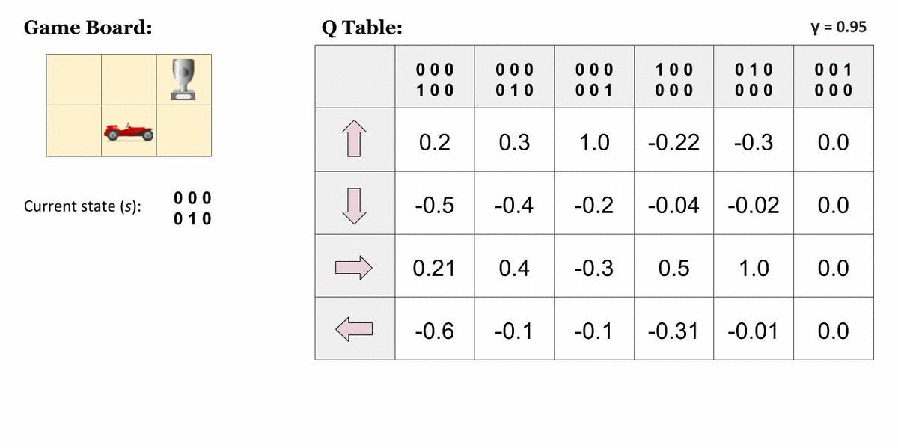
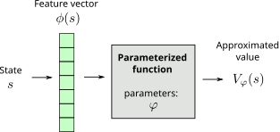
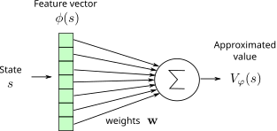
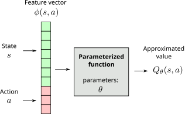
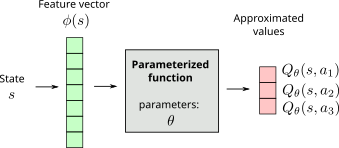
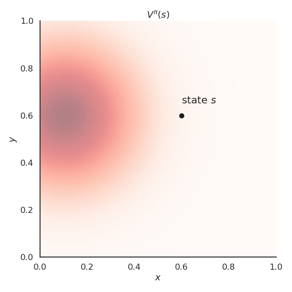
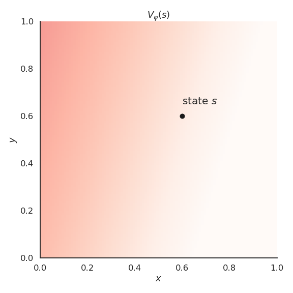

#  Function approximation {#sec-fa}

All the methods presented before are *tabular methods*, as one needs to store one value per state-action pair: either the Q-value of the action or a preference for that action. 

{#fig-qtable}

In most useful applications, the number of values to store would quickly become prohibitive: when working on raw images, the number of possible states alone is untractable. Moreover, these algorithms require that each state-action pair is visited a sufficient number of times to converge towards the optimal policy: if a single state-action pair is never visited, there is no guarantee that the optimal policy will be found. The problem becomes even more obvious when considering *continuous* state or action spaces.

However, in a lot of applications, the optimal action to perform in two very close states is likely to be the same: changing one pixel in a video game does not change which action should be applied. It would therefore be very useful to be able to **interpolate** Q-values between different states: only a subset of all state-action pairs has to explored; the others will be "guessed" depending on the proximity between the states and/or the actions. The problem is now **generalization**, i.e. transferring acquired knowledge to unseen but similar situations.

{#fig-generalization width=80%}

This is where **function approximation** (FA) becomes useful: the V/Q-values or the policy are not stored in a table, but rather learned by a function approximator. The type of function approximator does not really matter here: in deep RL we are of course interested in deep neural networks, but any kind of regressor theoretically works (linear algorithms, radial-basis function network, SVR...).

## Value-based function approximation

### State value approximators

Let's represent a state $s$ by a vector of $d$ **features** $\phi(s) = [\phi_1(s), \phi_2(s), \ldots, \phi_d(s)]^T$.
For the cartpole, the feature vector would be:

$$ \phi(s) = \begin{bmatrix}x \\ \dot{x} \\ \theta \\ \dot{\theta} \end{bmatrix}$$

$x$ is the position, $\theta$ the angle, $\dot{x}$ and $\dot{\theta}$ their derivatives. We are able to represent **any state** $s$ of the Cartpole using these four variables. If the state can be represented by an image, we only need to put its pixels into a single vector. For more complex problems, the feature vector should include all the necessary information (Markov property).

In **state value approximation**, we want to approximate the state value function $V^\pi(s)$ with a **parameterized function** $V_\varphi(s)$:

$$V_\varphi(s) \approx V^\pi(s)$$

{#fig-FA-V width=80%}

The parameterized function can have any form. It has a set of parameters $\varphi$ used to transform the feature vector $\phi(s)$ into an approximated value $V_\varphi(s)$.

The simplest function approximator (FA) is the **linear approximator**.

{#fig-FA-Vlinear width=80%}

The approximated value is a linear combination of the features:

$$V_\varphi(s) = \sum_{i=1}^d w_i \, \phi_i(s) = \mathbf{w}^T \times \phi(s)$$

The **weight vector** $\mathbf{w} = [w_1, w_2, \ldots, w_d]^T$is the set of parameters $\varphi$ of the function. 

Regardless the form of the function approximator, we want to find the parameters $\varphi$ making the approximated values $V_\varphi(s)$ as close as possible from the true values $V^\pi(s)$ for all states $s$. This is a **regression** problem.
We want to minimize the **mean square error** between the two quantities:

$$ \min_\varphi \mathcal{L}(\varphi) = \mathbb{E}_{s \in \mathcal{S}} [ (V^\pi(s) - V_\varphi(s))^2]$$

The **loss function** $\mathcal{L}(\varphi)$ is minimal when the predicted values are close to the true ones on average for all states.
Let's suppose that we know the true state values $V^\pi(s)$ for all states and that the parameterized function is **differentiable**.
We can find the minimum of the loss function by applying **gradient descent** (GD) iteratively:

$$
    \Delta \varphi = - \eta \, \nabla_\varphi \mathcal{L}(\varphi)
$$

$\nabla_\varphi \mathcal{L}(\varphi)$ is the gradient of the loss function w.r.t to the parameters $\varphi$:

$$
    \nabla_\varphi \mathcal{L}(\varphi) = \begin{bmatrix}
        \dfrac{\partial \mathcal{L}(\varphi)}{\partial \varphi_1} \\
        \dfrac{\partial \mathcal{L}(\varphi)}{\partial \varphi_2} \\
        \ldots \\
        \dfrac{\partial \mathcal{L}(\varphi)}{\partial \varphi_K} \\
    \end{bmatrix}
$$

When applied repeatedly, GD converges to a local minimum of the loss function. To minimize the mean square error, we just need to compute its gradient with respect to the parameters $\varphi$:

$$
\begin{aligned}
    \nabla_\varphi \mathcal{L}(\varphi) &= \nabla_\varphi \mathbb{E}_{s \in \mathcal{S}} [ (V^\pi(s) - V_\varphi(s))^2] \\
    &\\
    & = \mathbb{E}_{s \in \mathcal{S}} [\nabla_\varphi  (V^\pi(s) - V_\varphi(s))^2] \\
    &\\
    & = - 2 \, \mathbb{E}_{s \in \mathcal{S}} [ (V^\pi(s) - V_\varphi(s)) \, \nabla_\varphi V_\varphi(s)] \\
\end{aligned}
$$

Dropping the constant factor 2 into the learning rate, gradient descent $\Delta \varphi = - \eta \, \nabla_\varphi \mathcal{L}(\varphi)$ gives:

$$
    \Delta \varphi = \eta \, \mathbb{E}_{s \in \mathcal{S}} [ (V^\pi(s) - V_\varphi(s)) \, \nabla_\varphi V_\varphi(s)]
$$

As it would be too slow to compute the expectation on the whole state space (**batch algorithm**), we will update the parameters with **stochastic gradient descent** (SGD):

$$
    \Delta \varphi = \eta \,  \frac{1}{K} \sum_{k=1}^K (V^\pi(s_k) - V_\varphi(s_k)) \, \nabla_\varphi V_\varphi(s_k)
$$

where $K$ is the batch size. We can also sample a single state $s$ (online algorithm):

$$
    \Delta \varphi = \eta \, (V^\pi(s) - V_\varphi(s)) \, \nabla_\varphi V_\varphi(s)
$$

Unless stated otherwise, we will sample single states in this section, but the parameter updates will be noisy (high variance).

The obtained rule is the **delta learning rule** of linear regression and classification, with $\phi(s)$ being the input vector and $V^\pi(s) - V_\varphi(s)$ the prediction error.
The rule can be used with any function approximator, we only need to be able to differentiate it to get $\nabla_\varphi V_\varphi(s)$. The problem is that we do not know $V^\pi(s)$, as it is what we are trying to estimate.
We can replace $V^\pi(s)$ by a sampled estimate using Monte Carlo or TD:

* **Monte Carlo** function approximation:

$$
    \Delta \varphi = \eta \, (R_t - V_\varphi(s)) \, \nabla_\varphi V_\varphi(s)
$$

* **Temporal Difference** function approximation:

$$
    \Delta \varphi = \eta \, (r_{t+1} + \gamma \, V_\varphi(s') - V_\varphi(s)) \, \nabla_\varphi V_\varphi(s)
$$

Note that for Temporal Difference, we actually want to minimize the TD reward-prediction error for all states, i.e. the surprise:

$$\mathcal{L}(\varphi) = \mathbb{E}_{s \in \mathcal{S}} [ (r_{t+1} + \gamma \, V_\varphi(s') - V_\varphi(s))^2]= \mathbb{E}_{s \in \mathcal{S}} [ \delta_t^2]$$

:::{.callout-note icon="false"}
## Gradient Monte Carlo Algorithm for value estimation

* Algorithm:

    * Initialize the parameter $\varphi$ to 0 or randomly.

    * **while** not converged:

        1. Generate an episode according to the current policy $\pi$ until a terminal state $s_T$ is reached.

        $$
            \tau = (s_o, a_o, r_ 1, s_1, a_1, \ldots, s_T)
        $$

        2. For all encountered states $s_0, s_1, \ldots, s_{T-1}$:

            1. Compute the return $R_t = \sum_k \gamma^k r_{t+k+1}$ .

            2. Update the parameters using function approximation:

            $$
                \Delta \varphi = \eta \, (R_t - V_\varphi(s_t)) \, \nabla_\varphi V_\varphi(s_t)
            $$
:::

Gradient Monte Carlo has no bias (real returns) but a high variance.

:::{.callout-note icon="false"}
## Semi-gradient Temporal Difference Algorithm for value estimation

* Algorithm:

    * Initialize the parameter $\varphi$ to 0 or randomly.

    * **while** not converged:

        * Start from an initial state $s_0$.

        * **foreach** step $t$ of the episode:

            * Select $a_t$ using the current policy $\pi$ in state $s_t$.

            * Observe $r_{t+1}$ and $s_{t+1}$.

            * Update the parameters using function approximation:

            $$
                \Delta \varphi = \eta \, (r_{t+1} + \gamma \, V_\varphi(s_{t+1}) - V_\varphi(s_t)) \, \nabla_\varphi V_\varphi(s_t)
            $$

            * **if** $s_{t+1}$ is terminal: **break**
:::

Semi-gradient TD has less variance, but a significant bias as $V_\varphi(s_{t+1})$ is initially wrong. You can never trust these estimates completely.

### Action value approximators

Q-values can be approximated by a parameterized function $Q_\theta(s, a)$ in the same manner. There are basically two options for the structure of the function approximator:

1. The FA takes a feature vector for both the state $s$ and the action $a$ (which can be continuous) as inputs, and outputs a single Q-value $Q_\theta(s ,a)$. 

{#fig-qapprox1 width=80%}

2. The FA takes a feature vector for the state $s$ as input, and outputs one Q-value $Q_\theta(s ,a)$ per possible action (the action space must be discrete).

{#fig-qapprox2 width=80%}

In both cases, we minimize the mse between the true value $Q^\pi(s, a)$ and the approximated value $Q_\theta(s, a)$. The target can be approximated with SARSA or Q-learning:

:::{.callout-note icon="false"}
## Q-learning with function approximation

* Initialize the parameters $\theta$. 

* **while** True:

    * Start from an initial state $s_0$.

    * **foreach** step $t$ of the episode:

        * Select $a_{t}$ using the behavior policy $b$ (e.g. derived from $\pi$).

        * Take $a_t$, observe $r_{t+1}$ and $s_{t+1}$.

        * Update the parameters $\theta$:

        $$\Delta \theta = \eta \, (r_{t+1} + \gamma \, \max_a Q_\theta(s_{t+1}, a) - Q_\theta(s_t, a_t)) \, \nabla_\theta Q_\theta(s_t, a_t)$$

        * Improve greedily the learned policy:
        
        $$\pi(s_t, a) = \text{Greedy}(Q_\theta(s_t, a))$$

        * **if** $s_{t+1}$ is terminal: **break**

:::

## Feature construction {#sec-features}

All the algorithms above learn the weights $\varphi$ of a linear approximator, but they say nothing about where the features $\phi(s)$ come from. This matters much more than it seems, as a linear approximator can only represent what its features allow.

Take the cartpole again, with the four variables $\phi(s) = [x, \dot{x}, \theta, \dot{\theta}]^T$. Can the value of a state be a linear function of them? No. A high angular velocity $\dot{\theta}$ is a **good** thing when the pole is nearly horizontal, as it means the pole is coming back up, but a **bad** thing when the pole is vertical, as it means the pole will not stop there. Whether $\dot{\theta}$ contributes positively or negatively to the value depends on $\theta$: the value depends on something like $\dot{\theta} \, \sin \theta$, which is a **non-linear combination** of two features. No choice of weights $\varphi$ can produce it, because a linear approximator can only add up the features, never multiply them.

The consequence is visible on any non-linear value function: applied directly to the raw variables, linear approximation catches the general tendency but makes systematic errors, i.e. it **underfits** (high bias).

::: {layout-ncol=2}
{#fig-featurecoding-data}

{#fig-featurecoding-linear}
:::

The classical answer is to keep the approximator linear, but to feed it a richer feature vector, obtained by passing the raw variables through a set of fixed non-linear functions. Several such **bases** are used in practice:

* **Polynomial features**: all products of the variables up to a given order, e.g. $[1, x, y, x \, y, x^2, y^2, \ldots]$. Simple, but their number explodes with the dimension of the state space.
* **Fourier basis**: cosines of increasing frequency, which are good at representing smooth periodic value functions.
* **Discrete, coarse and tile coding**: the state space is covered by (possibly overlapping) regions, and the feature vector says in which regions the state falls. Coarse and tile coding use overlapping regions, so that neighboring states share features and generalize to each other.
* **Radial-basis functions** (RBF): each feature is a Gaussian centered on a prototypical state, so a feature is active only for states close to its center.

The interest of these methods is that the approximator stays linear in $\varphi$, so learning is fast and its convergence is **guaranteed**, which is not the case with non-linear approximators. Their limit is that somebody has to choose the basis, and that the number of features needed grows very quickly with the dimensionality of the state space: for a state that is an image, no such basis is realistic.

This is exactly what deep neural networks solve. Instead of designing the features by hand and learning only the last linear layer, a deep network **learns the features too** (@sec-deeplearning). The price is a loss of the convergence guarantees and a much higher sample complexity, which is the fundamental trade-off of deep RL.

## Policy-based function approximation

In policy-based function approximation, we want to directly learn a policy $\pi_\theta(s, a)$ that maximizes the expected return of each possible transition, i.e. the ones which are selected by the policy. The **objective function** to be maximized is defined over all trajectories $\tau = (s_0, a_0, s_1, a_1, \ldots, s_T, a_T)$ conditioned by the policy:

$$
    \mathcal{J}(\theta) = \mathbb{E}_{\tau \sim \rho_\theta} [R (\tau)]
$$

In short, the learned policy $\pi_\theta$ should only produce trajectories $\tau$ where each state is associated to a high return $R(\tau)$ and avoid trajectories with low returns. Although this objective function leads to the desired behavior, it is not computationally tractable as we would need to integrate over all possible trajectories. The methods presented in Section @sec-policygradient will provide estimates of the gradient of this objective function.
