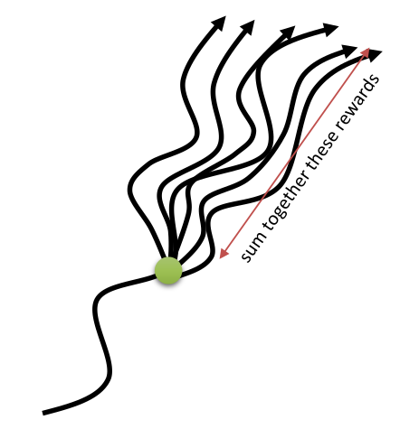

# Policy Gradient methods

**Policy search** methods directly learn to estimate the policy $\pi_\theta$ with a parameterized function estimator. The goal of the neural network is to maximize an objective function representing the *return* (sum of rewards, noted $R(\tau)$ for simplicity) of the trajectories $\tau = (s_0, a_0, s_1, a_1, \ldots, s_T, a_T)$ selected by the policy $\pi_\theta$:

$$
    J(\theta) = \mathbb{E}_{\tau \sim \rho_\theta}[R(\tau)] = \mathbb{E}_{\tau \sim \rho_\theta}[\sum_{t=0}^T \gamma^t \, r(s_t, a_t, s_{t+1}) ]
$$

To maximize this objective function, the policy $\pi_\theta$ should only generate trajectories $\tau$ associated with high expected returns $R(\tau)$ and avoid those with low expected return, which is exactly what we want.

The objective function uses the mathematical expectation of the expected return over all possible trajectories. The likelihood that a trajectory is generated by the policy $\pi_\theta$ is noted $\rho_\theta(\tau)$ and given by:

$$
    \rho_\theta(\tau) = p_\theta(s_0, a_0, \ldots, s_T, a_T) = p_0 (s_0) \, \prod_{t=0}^T \pi_\theta(s_t, a_t) p(s_{t+1} | s_t, a_t)
$${#eq:likelihood_trajectory}

$p_0 (s_0)$ is the initial probability of starting in $s_0$ (independent from the policy) and $p(s_{t+1} | s_t, a_t)$ is the transition probability defining the MDP. Having the probability distribution of the trajectories, we can expand the mathematical expectation in the objective function:

$$
    J(\theta) = \int_\tau \rho_\theta (\tau) \, R(\tau) \, d\tau
$$

Monte-Carlo sampling could be used to estimate the objective function. One basically would have to sample multiple trajectories $\{\tau_i\}$ and average the obtained returns:

$$
    J(\theta) \approx \frac{1}{N} \, \sum_i \rho_\theta(\tau_i) \, R(\tau_i)
$$

However, this approach would suffer from several problems:

1. The trajectory space is extremely huge, so one would need a lot of sampled trajectories to have a correct estimate of the objective function (**high variance**).
2. For stability reasons, only small changes can be made to the policy at each iteration, so it would necessitate a lot of episodes (**sample complexity**).
3. The probability of a trajectory is difficult to estimate: the initial probability distribution $p_0$ has to be known, as well as the dynamics of the MDP ($p(s_{t+1} | s_t, a_t)$). Those could be approximated or learned (*model-based RL*), but it would limit the applicability of the method and approximation errors would accumulate quickly over a trajectory.
4. For continuing tasks ($T = \infty$), the return can not be estimated.

The policy search methods presented in this section are called **policy gradient methods**. As we are going to apply gradient ascent on the weights $\theta$ in order to maximize $J(\theta)$, all we actually need is the gradient $\nabla_\theta J(\theta)$ of the objective function w.r.t the weights:

$$
    \nabla_\theta J(\theta) = \frac{\partial J(\theta)}{\partial \theta}
$$

Once a suitable estimation of this **policy gradient** is obtained, gradient ascent is straightforward:

$$
    \theta \leftarrow \theta + \eta \, \nabla_\theta J(\theta)
$$

The rest of this section basically presents methods allowing to estimate the policy gradient (REINFORCE, DPG) and to improve the sample complexity. See
<http://www.scholarpedia.org/article/Policy_gradient_methods> for an more detailed overview of policy gradient methods, <https://lilianweng.github.io/lil-log/2018/04/08/policy-gradient-algorithms.html> and <http://karpathy.github.io/2016/05/31/rl/> for excellent tutorials from Lilian Weng and Andrej Karpathy. The article by @Peters2008 is also a good overview of policy gradient methods.

## REINFORCE

### Estimating the policy gradient

@Williams1992 proposed a useful estimate of the policy gradient. Considering that the expected return $R(\tau)$ of a trajectory does not depend on the parameters $\theta$, one can simplify the policy gradient in the following way:

$$
    \nabla_\theta J(\theta) = \nabla_\theta \int_\tau \rho_\theta (\tau) \, R(\tau) \, d\tau =  \int_\tau (\nabla_\theta \rho_\theta (\tau)) \, R(\tau) \, d\tau
$$

We now use the **log-trick**, a simple identity based on the fact that:

$$
    \frac{d \log f(x)}{dx} = \frac{f'(x)}{f(x)}
$$

to rewrite the policy gradient of a single trajectory:

$$
    \nabla_\theta \rho_\theta (\tau) = \rho_\theta (\tau) \, \nabla_\theta \log \rho_\theta (\tau)
$$

The policy gradient becomes:

$$
    \nabla_\theta J(\theta) =  \int_\tau \rho_\theta (\tau) \, \nabla_\theta \log \rho_\theta (\tau) \, R(\tau) \, d\tau
$$

which now has the form of a mathematical expectation:

$$
    \nabla_\theta J(\theta) =  \mathbb{E}_{\tau \sim \rho_\theta}[ \nabla_\theta \log \rho_\theta (\tau) \, R(\tau) ]
$$

This means that we can obtain an estimate of the policy gradient by simply sampling different trajectories $\{\tau_i\}$ and averaging $\nabla_\theta \log \rho_\theta (\tau_i) \, R(\tau_i)$ (Monte-Carlo sampling).

Let's now look further at how the gradient of the log-likelihood of a trajectory $\log \pi_\theta (\tau)$ look like. Through its definition (@eq:likelihood_trajectory), the log-likelihood of a trajectory is:

$$
    \log \rho_\theta(\tau) = \log p_0 (s_0) + \sum_{t=0}^T \log \pi_\theta(s_t, a_t) + \sum_{t=0}^T \log p(s_{t+1} | s_t, a_t)
$${#eq:loglikelihood_trajectory}

$\log p_0 (s_0)$ and $\log p(s_{t+1} | s_t, a_t)$ do not depend on the parameters $\theta$ (they are defined by the MDP), so the gradient of the log-likelihood is simply:

$$
    \nabla_\theta \log \rho_\theta(\tau) = \sum_{t=0}^T \nabla_\theta \log \pi_\theta(s_t, a_t)
$${#eq:gradloglikelihood_trajectory}

$\nabla_\theta \log \pi_\theta(s_t, a_t)$ is called the **score function**.

This is the main reason why policy gradient algorithms are used: the gradient is independent from the MDP dynamics, allowing **model-free** learning. The policy gradient is then given by:

$$
    \nabla_\theta J(\theta) =  \mathbb{E}_{\tau \sim \rho_\theta}[\sum_{t=0}^T \nabla_\theta \log \pi_\theta(s_t, a_t) \, R(\tau) ] =  \mathbb{E}_{\tau \sim \rho_\theta}[ \sum_{t=0}^T \nabla_\theta \log \pi_\theta(s_t, a_t) \, (\sum_{t=0}^T \gamma^t r_{t+1})]
$$

Estimating the policy gradient now becomes straightforward using Monte-Carlo sampling. The resulting algorithm is called the **REINFORCE** algorithm [@Williams1992]:

---

* while not converged:

    * Sample $N$ trajectories $\{\tau_i\}$ using the current policy $\pi_\theta$ and observe the returns $\{R(\tau_i)\}$.

    * Estimate the policy gradient as an average over the trajectories:

    $$
       \nabla_\theta J(\theta) \approx \frac{1}{N} \sum_{i=1}^N \sum_{t=0}^T \nabla_\theta \log \pi_\theta(s_t, a_t) \, R(\tau_i)
    $$

    * Update the policy using gradient ascent:

    $$
        \theta \leftarrow \theta + \eta \, \nabla_\theta J(\theta)
    $$

---

While very simple, the REINFORCE algorithm does not work very well in practice:

1. The returns $\{R(\tau_i)\}$ have a very high variance (as the Q-values in value-based methods), which is problematic for NNs (see @sec:reducing-the-variance).
2. It requires a lot of episodes to converge (sample inefficient).
3. It only works with **online** learning: trajectories must be frequently sampled and immediately used to update the policy.
4. The problem must be episodic ($T$ finite).

However, it has two main advantages:

1. It is a **model-free** method, i.e. one does not need to know anything about the MDP.
2. It also works on **partially observable** problems (POMDP): as the return is computed over complete trajectories, it does not matter if the states are not Markovian.

The methods presented in this section basically try to solve the limitations of REINFORCE (high variance, sample efficiency, online learning) to produce efficient policy gradient algorithms.

### Reducing the variance

The main problem with the REINFORCE algorithm is the **high variance** of the policy gradient. This variance comes from the fact that we learn stochastic policies (it is often unlikely to generate twice the exact same trajectory) in stochastic environments (rewards are stochastic, the same action in the same state may receive). Two trajectories which are identical at the beginning will be associated with different returns depending on the stochasticity of the policy, the transition probabilities and the probabilistic rewards.

Consider playing a game like chess with always the same opening, and then following a random policy. You may end up winning ($R=1$) or losing ($R=-1$) with some probability. The initial actions of the opening will receive a policy gradient which is sometimes positive, sometimes negative: were these actions good or bad? Should they be reinforced? In supervised learning, this would mean that the same image of a cat will be randomly associated to the labels "cat" or "dog" during training: the NN will not like it.

In supervised learning, there is no problem of variance in the outputs, as training sets are fixed. This is in contrary very hard to ensure in deep RL and constitutes one of its main limitations. The only direct solution is to sample enough trajectories and hope that the average will be able to smooth the variance. The problem is even worse in the following conditions:

* High-dimensional action spaces: it becomes difficult to sample the environment densely enough if many actions are possible.
* Long horizons: the longer the trajectory, the more likely it will be unique.
* Finite samples: if we cannot sample enough trajectories, the high variance can introduce a bias in the gradient, leading to poor convergence.

See <https://medium.com/mlreview/making-sense-of-the-bias-variance-trade-off-in-deep-reinforcement-learning-79cf1e83d565> for a nice explanation of the bias/variance trade-off in deep RL.

Another related problem is that the REINFORCE gradient is sensitive to **reward scaling**. Let's consider a simple MDP where only two trajectories $\tau_1$ and $\tau_2$ are possible. Depending on the choice of the reward function, the returns may be different:

1. $R(\tau_1) = 1$ and $R(\tau_2) = -1$
2. $R(\tau_1) = 3$ and $R(\tau_2) = 1$

In both cases, the policy should select the trajectory $\tau_1$. However, the policy gradient for $\tau_2$ will change its sign between the two cases, although the problem is the same! What we want to do is to maximize the returns, regardless the absolute value of the rewards, but the returns are unbounded. Because of the non-stationarity of the problem (the agent becomes better with training, so the returns of the sampled trajectories will increase), the policy gradients will increase over time, what is linked to the variance problem. Value-based methods addressed this problem by using **target networks**, but it is not a perfect solution (the gradients become biased).

A first simple but effective idea to solve both problems would be to substract the mean of the sampled returns from the returns:

---

* while not converged:

    * Sample $N$ trajectories $\{\tau_i\}$ using the current policy $\pi_\theta$ and observe the returns $\{R(\tau_i)\}$.
    * Compute the mean return:
    $$
        \hat{R} = \frac{1}{N} \sum_{i=1}^N R(\tau_i)
    $$
    * Estimate the policy gradient as an average over the trajectories:
    $$
       \nabla_\theta J(\theta) \approx \frac{1}{N} \sum_{i=1}^N \sum_{t=0}^T \nabla_\theta \log \pi_\theta(s_t, a_t) \, ( R(\tau_i) - \hat{R})
    $$
    * Update the policy using gradient ascent:
    $$
        \theta \leftarrow \theta + \eta \, \nabla_\theta J(\theta)
    $$

---

This obviously solves the reward scaling problem, and reduces the variance of the gradients. But are we allowed to do this (i.e. does it introduce a bias to the gradient)? @Williams1992 showed that substracting a constant $b$ from the returns still leads to an unbiased estimate of the gradient:

$$
    \nabla_\theta J(\theta) =  \mathbb{E}_{\tau \sim \rho_\theta}[\nabla_\theta \log \rho_\theta (\tau) \, (R(\tau) -b) ]
$$

The proof is actually quite simple:

$$
    \mathbb{E}_{\tau \sim \rho_\theta}[\nabla_\theta \log \rho_\theta (\tau) \, b ] = \int_\tau \rho_\theta (\tau) \nabla_\theta \log \rho_\theta (\tau) \, b \, d\tau = \int_\tau \nabla_\theta  \rho_\theta (\tau) \, b \, d\tau = b \, \nabla_\theta \int_\tau \rho_\theta (\tau) \, d\tau =  b \, \nabla_\theta 1 = 0
$$

As long as the constant $b$ does not depend on $\theta$, the estimator is unbiased. The resulting algorithm is called **REINFORCE with baseline**. @Williams1992 has actually showed that the best baseline (the one which also reduces the variance) is the mean return weighted by the square of the gradient of the log-likelihood:

$$
    b = \frac{\mathbb{E}_{\tau \sim \rho_\theta}[(\nabla_\theta \log \rho_\theta (\tau))^2 \, R(\tau)]}{\mathbb{E}_{\tau \sim \rho_\theta}[(\nabla_\theta \log \rho_\theta (\tau))^2]}
$$

but the mean reward actually work quite well. Advantage actor-critic methods (@sec:advantage-actor-critic-methods) replace the constant $b$ with an estimate of the value of each state $\hat{V}(s_t)$.

### Policy Gradient theorem

Let's have another look at the REINFORCE estimate of the policy gradient after sampling:

$$
   \nabla_\theta J(\theta) \approx \frac{1}{N} \sum_{i=1}^N \sum_{t=0}^T \nabla_\theta \log \pi_\theta(s_t, a_t) \, R(\tau_i) = \frac{1}{N} \sum_{i=1}^N (\sum_{t=0}^T \nabla_\theta \log \pi_\theta(s_t, a_t) ) \, (\sum_{t'=0}^T \gamma^{t'} \, r(s_{t'}, a_{t'}, s_{t'+1}) )
$$

For each transition $(s_t, a_t)$, the  gradient of its log-likelihood (*score function*) $\nabla_\theta \log \pi_\theta(s_t, a_t) )$ is multiplied by the return of the whole episode $R(\tau) = \sum_{t'=0}^T \gamma^{t'} \, r(s_{t'}, a_{t'}, s_{t'+1})$. However, the **causality principle** dictates that the reward received at $t=0$ does not depend on actions taken in the future, so we can simplify the return for each transition:

$$
 \nabla_\theta J(\theta) \approx \frac{1}{N} \sum_{i=1}^N (\sum_{t=0}^T \nabla_\theta \log \pi_\theta(s_t, a_t)  \, \sum_{t'=t}^T \gamma^{t'-t} \, r(s_{t'}, a_{t'}, s_{t'+1}) )
$$

The quantity $\hat{Q}(s_t, a_t) = \sum_{t'=t}^T \gamma^{t'-t} \, r(s_{t'}, a_{t'}, s_{t'+1})$ is called the **reward to-go** from the transition $(s_t, a_t)$, i.e. the discounted sum of future rewards after that transition. Quite obviously, the Q-value of that action is the mathematical expectation of this reward to-go.

{#fig:rewardtogo width=30%}

$$
 \nabla_\theta J(\theta) \approx \frac{1}{N} \sum_{i=1}^N \sum_{t=0}^T \nabla_\theta \log \pi_\theta(s_t, a_t) \, \hat{Q}(s_t, a_t)
$$

@Sutton1999 showed that the policy gradient can be estimated by replacing the return of the sampled trajectory with the Q-value of each action, what leads to the **policy gradient theorem** (@eq:policygradienttheorem):

$$
    \nabla_\theta J(\theta) =  \mathbb{E}_{s \sim \rho_\theta, a \sim \pi_\theta}[\nabla_\theta \log \pi_\theta(s, a) \, Q^{\pi_\theta}(s, a)]
$${#eq:policygradienttheorem}

where $\rho_\theta$ is the distribution of states reachable under the policy $\pi_\theta$. Because the actual return $R(\tau)$ is replaced by its expectation $Q^{\pi_\theta}(s, a)$, the policy gradient is now a mathematical expectation over **single transitions** instead of complete trajectories, allowing **bootstrapping** as in temporal difference methods (@sec:temporal-difference).

One clearly sees that REINFORCE is actually a special case of the policy gradient theorem, where the Q-value of an action replaces the return obtained during the corresponding trajectory.

The problem is of course that the true Q-value of the actions is as unknown as the policy. However, @Sutton1999 showed that it is possible to estimate the Q-values with a function approximator $Q_\varphi(s, a)$ with parameters $\varphi$ and obtain an unbiased estimation:

$$
    \nabla_\theta J(\theta) =  \mathbb{E}_{s \sim \rho_\theta, a \sim \pi_\theta}[\nabla_\theta \log \pi_\theta(s, a) \, Q_\varphi(s, a))]
$${#eq:policygradienttheoremapprox}

Formally, the Q-value approximator must respect the Compatible Function Approximation Theorem, which states that the value approximator must be compatible with the policy ($\nabla_\varphi Q_\varphi(s, a) = \nabla_\theta \log \pi_\theta(s, a)$) and minimize the mean-square error with the true Q-values $\mathbb{E}_{s \sim \rho^\pi, a \sim \pi_\theta} [(Q^{\pi_\theta}(s, a) - Q_\varphi(s, a))^2]$. In the algorithms presented in this section, these conditions are either met or neglected.

The resulting algorithm belongs to the **actor-critic** class, in the sense that:

* The **actor** $\pi_\theta(s, a)$ learns to approximate the policy by maximizing @eq:policygradienttheoremapprox.
* The **critic** $Q_\varphi(s, a)$ learns to estimate the policy by minimizing the mse with the true Q-values.

@fig:actorcriticpolicy shows the architecture of the algorithm. The only problem left is to provide the critic with the true Q-values.

{#fig:actorcriticpolicy width=80%}

Most policy-gradient algorithms (A3C, DPPG, TRPO) are actor-critic architectures. Some remarks already:

* Trajectories now appear only implicitely in the policy gradient, one can even sample single transitions. It should therefore be possible (with modifications) to do **off-policy learning**, for example with using importance sampling (@sec:importance-sampling) or a replay buffer of stored transitions as in DQN (see ACER @sec:actor-critic-with-experience-replay-acer). REINFORCE works strictly on-policy.
* The policy gradient theorem suffers from the same **high variance** problem as REINFORCE. The different algorithms presented later are principally attempts to solve this problem and reduce the sample complexity: advantages, deterministic policies, natural gradients...
* The actor and the critic can be completely separated, or share some parameters.
