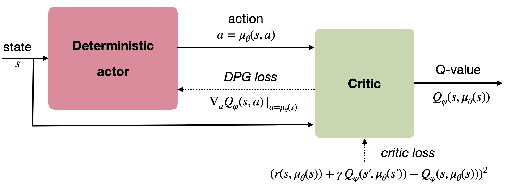
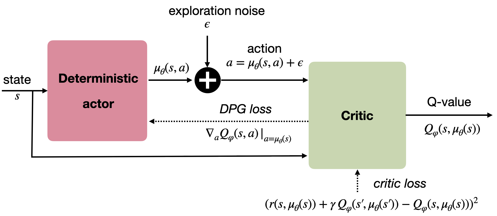

## Deterministic Policy Gradient (DPG)

So far, the actor produces a stochastic policy $\pi_\theta(s)$ assigning probabilities to each discrete action or necessitating sampling in some distribution for continuous actions (see @sec:stochastic-actor-critic-for-continuous-action-spaces). The main advantage is that stochastic policies ensure **exploration** of the state-action space: as most actions have a non-zero probability of being selected, we should not miss any important reward which should be ignored if the greedy action is always selected (exploration/exploitation dilemma).

There are however two drawbacks:

1. The policy gradient theorem only works **on-policy**: the value of an action estimated by the critic must have been produced recently by the actor, otherwise the bias would increase dramatically (but see importance sampling, @sec:off-policy-actor-critic). This prevents the use of an experience replay memory as in DQN to stabilize learning. Importance sampling can help, but is unstable for long trajectories.
2. Because of the stochasticity of the policy, the returns may vary considerably between two episodes generated by the same optimal policy. This induces a lot of **variance** in the policy gradient, which explains why policy gradient methods have a worse **sample complexity** than value-based methods: they need more samples to get rid of this variance.

Successful value-based methods such as DQN produce a **deterministic policy**, where the action to be executed after learning is simply the greedy action $a^*_t = \text{argmax}_a Q_\theta(s_t, a)$. Exploration is enforced by forcing the behavior policy (the one used to generate the sample) to be stochastic ($\epsilon$-greedy), but the learned policy is itself deterministic. This is **off-policy** learning, allowing to use a different policy than the learned one to explore. When using an experience replay memory, the behavior policy is simply an older version of the learning policy (as samples stored in the ERM were generated by an older version of the actor).

In this section, we will see the now state-of-the-art method DDPG (Deep Deterministic Policy Gradient), which tries to combine the advantages of policy gradient methods (actor-critic, continous or highly dimensional outputs, stability) with those of value-based methods (sample efficiency, off-policy).

### Deterministic policy gradient theorem

We now assume that we want to learn a parameterized **deterministic policy** $\mu_\theta(s)$. As for the stochastic policy gradient theorem, the goal is to maximize the expectation over all states reachable by the policy of the reward to-go (return) after each action:

$$
    J(\theta) =  \mathbb{E}_{s \sim \rho_\mu}[R(s, \mu_\theta(s))]
$$

As in the stochastic case, the distribution of states reachable by the policy $\rho_\mu$ is impossible to estimate, so we will have to perform approximations. Building on @Hafner2011, @Silver2014 showed how to obtain a usable gradient for the objective function when the policy is deterministic.

Considering that the Q-value of an action is the expectation of the reward to-go after that action $Q^\pi(s, a) = \mathbb{E}_\pi[R(s, a)]$, maximizing the returns or maximizing the true Q-value of all actions leads to the same optimal policy. This is the basic idea behind dynamic programming (see @sec:dynamic-programming). where *policy evaluation* first finds the true Q-value of all state-action pairs and *policy improvement* changes the policy by selecting the action with the maximal Q-value $a^*_t = \text{argmax}_a Q_\theta(s_t, a)$.

In the continuous case, we will simply state that the gradient of the objective function is the same as the gradient of the Q-value. Supposing we have an unbiased estimate $Q^\mu(s, a)$ of the value of any action in $s$, changing the policy $\mu_\theta(s)$ in the direction of $\nabla_\theta Q^\mu(s, a)$ leads to an action with a higher Q-value, therefore with a higher associated return:

$$
    \nabla_\theta J(\theta) = \mathbb{E}_{s \sim \rho_\mu}[\nabla_\theta Q^\mu(s, a) |_{a = \mu_\theta(s)}]
$$

This notation means that the gradient w.r.t $a$ of the Q-value is taken at $a = \mu_\theta(s)$. We now use the chain rule to expand the gradient of the Q-value:

$$
    \nabla_\theta J(\theta) = \mathbb{E}_{s \sim \rho_\mu}[\nabla_\theta \mu_\theta(s) \times \nabla_a Q^\mu(s, a) |_{a = \mu_\theta(s)}]
$$

It is perhaps clearer using partial derivatives and simplifying the notations:

$$
    \frac{\partial Q(s,a)}{\partial \theta} = \frac{\partial Q(s,a)}{\partial a} \times \frac{\partial a}{\partial \theta}
$$

The first term defines of the Q-value of an action changes when one varies slightly the action (if I move my joint a bit more to the right, do I get a higher Q-value, hence more reward?), the second term defines how the action changes when the parameters $\theta$ of the actor change (which weights should be changed in order to produce that action with a slightly higher Q-value?).

We already see an **actor-critic** architecture emerging from this equation: $\nabla_\theta \mu_\theta(s)$ only depends on the parameterized actor, while $\nabla_a Q^\mu(s, a)$ is a sort of critic, telling the actor in which direction to change its policy: towards actions associated with more reward.

As in the stochastic policy gradient theorem, the question is now how to obtain an unbiased estimate of the Q-value of any action and compute its gradient. @Silver2014 showed that it is possible to use a function approximator $Q_\varphi(s, a)$ as long as it is compatible and minimize the quadratic error with the true Q-values:

$$
    \nabla_\theta J(\theta) = \mathbb{E}_{s \sim \rho_\mu}[\nabla_\theta \mu_\theta(s) \times \nabla_a Q_\varphi(s, a) |_{a = \mu_\theta(s)}]
$$
$$
    J(\varphi) = \mathbb{E}_{s \sim \rho_\mu}[(Q^\mu(s, \mu_\theta(s)) - Q_\varphi(s, \mu_\theta(s)))^2]
$$

@fig:dpg outlines the actor-critic architecture of the DPG (deterministic policy gradient) method, to compare with the actor-critic architecture of the stochastic policy gradient (@fig:actorcriticpolicy).

{#fig:dpg width=65%}

@Silver2014 investigated the performance of DPG using linear function approximators and showed that it compared positively to stochastic algorithms in high-dimensional or continuous action spaces. However, non-linear function approximators such as deep NN would not work yet.

### Deep Deterministic Policy Gradient (DDPG)

@Lillicrap2015 extended the DPG approach to work with non-linear function approximators. In fact, they combined ideas from DQN and DPG to create a very successful algorithm able to solve continuous problems off-policy, the **deep deterministic policy gradient** (DDPG) algorithm..

The key ideas borrowed from DQN are:

* Using an **experience replay memory** to store past transitions and learn off-policy.
* Using **target networks** to stabilize learning.

They modified the update frequency of the target networks originally used in DQN. In DQN, the target networks are updated with the parameters of the trained networks every couple of thousands of steps. The target networks therefore change a lot between two updates, but not very often. @Lillicrap2015 found that it is actually better to make the target networks slowly track the trained networks, by updating their parameters after each update of the trained network using a sliding average for both the actor and the critic:

$$
    \theta' = \tau \, \theta + (1-\tau) \, \theta'
$$

with $\tau <<1$. Using this update rule, the target networks are always "late" with respect to the trained networks, providing more stability to the learning of Q-values.

The key idea borrowed from DPG is the policy gradient for the actor. The critic is learned using regular Q-learning and target networks:

$$
    J(\varphi) = \mathbb{E}_{s \sim \rho_\mu}[(r(s, a, s') + \gamma \, Q_{\varphi'}(s', \mu_{\theta'}(s')) - Q_\varphi(s, a))^2]
$$

One remaining issue is **exploration**: as the policy is deterministic, it can very quickly produce always the same actions, missing perhaps more rewarding options. Some environments are naturally noisy, enforcing exploration by itself, but this cannot be assumed in the general case. The solution retained in DDPG is an **additive noise** added to the deterministic action to explore the environment:

$$
    a_t = \mu_\theta(s_t) + \xi
$$

This additive noise could be anything, but the most practical choise is to use an **Ornstein-Uhlenbeck** process [@Uhlenbeck1930] to generate temporally correlated noise with zero mean. Ornstein-Uhlenbeck processes are used in physics to model the velocity of Brownian particles with friction. It updates a variable $x_t$ using a stochastic differential equation (SDE):

$$ dx_t = \theta (\mu - x_t) dt + \sigma dW_t \qquad \text{with} \qquad dW_t = \mathcal{N}(0, dt)$$

$\mu$ is the mean of the process (usually 0), $\theta$ is the friction (how fast it varies with noise) and $\sigma$ controls the amount of noise. @fig:OU shows three independent runs of a Ornstein-Uhlenbeck process: successive values of the variable $x_t$ vary randomly but coherently over time.

{#fig:OU width=80%}

The architecture of the DDPG algorithm is depicted on @fig:ddpg.

{#fig:ddpg width=70%}

The pseudo-algorithm is as follows:

---

* Initialize actor network $\mu_{\theta}$ and critic $Q_\varphi$ with random weights.
* Create the target networks $\mu_{\theta'}$ and $Q_{\varphi'}$.
* Initialize experience replay memory $\mathcal{D}$ of maximal size $N$.

* for episode $\in [1, M]$:
    * Initialize random process $\xi$.
    * Observe the initial state $s_0$.
    * for $t \in [0, T_\text{max}]$:
        * Select the action $a_t = \mu_\theta(s_t) + \xi$ according to the current policy and the noise.
        * Perform the action $a_t$ and observe the next state $s_{t+1}$ and the reward $r_{t+1}$.
        * Store $(s_t, a_t, r_{t+1}, s_{t+1})$ in the experience replay memory.

        * Sample a minibatch of $N$ transitions randomly from $\mathcal{D}$.
        * For each transition $(s_k, a_k, r_k, s'_k)$ in the minibatch:
            * Compute the target value using target networks $y_k = r_k + \gamma \, Q_{\varphi'}(s'_k, \mu_{\theta'}(s'_k))$.
        * Update the critic by minimizing:
        $$
            \mathcal{L}(\varphi) = \frac{1}{N} \sum_k (y_k - Q_\varphi(s_k, a_k))^2
        $$
        * Update the actor using the sampled policy gradient:
        $$
            \nabla_\theta J(\theta) = \frac{1}{N} \sum_k \nabla_\theta \mu_\theta(s_k) \times \nabla_a Q_\varphi(s_k, a) |_{a = \mu_\theta(s_k)}
        $$
        * Update the target networks:
        $$\theta' \leftarrow \tau \theta + (1-\tau) \, \theta'$$
        $$\varphi' \leftarrow \tau \varphi + (1-\tau) \, \varphi'$$

---

The question that arises is how to obtain the gradient of the Q-value w.r.t the action $\nabla_a Q_\varphi(s, a)$, when the critic only outputs the Q-value $Q_\varphi(s, a)$. Fortunately, deep neural networks are simulated using automatic differentiation libraries such as tensorflow, theano, pytorch and co, which can automatically output this gradient. If not available, one could simply use the finite difference method (Euler) to approximate this gradient. One has to evaluate the Q-value in $a +da$, where $da$ is a very small change of the executed action, and estimate the gradient using:

$$
    \nabla_a Q_\varphi(s, a) \approx \frac{Q_\varphi(s, a + da) - Q_\varphi(s, a)}{da}
$$

Note that the DDPG algorithm is **off-policy**: the samples used to train the actor come from the replay buffer, i.e. were generated by an older version of the target policy. DDPG does not rely on importance sampling: as the policy is deterministic (we maximize $\mathbb{E}_{s}[Q(s, \mu_\theta(s))]$), there is no need to balance the probabilities of the behavior and target policies (with stochastic policies, one should maximize $\mathbb{E}_{s}[\sum_{a\in\mathcal{A}} \pi(s, a) Q(s, a)]$). In other words, the importance sampling weight can safely be set to 1 for deterministic policies.

DDPG has rapidly become the state-of-the-art model-free method for continuous action spaces (although now PPO is preferred). It is able to learn efficent policies on most contiuous problems, either pixel-based or using individual state variables. In the original DDPG paper, they showed that *batch normalization* [@Ioffe2015] is crucial in stabilizing the training of deep networks on such problems. Its main limitation is its high sample complexity. Distributed versions of DDPG have been proposed to speed up learning, similarly to the parallel actor learners of A3C [@Lotzsch2017;@Popov2017;@Barth-Maron2018].

**Additional references:** see <http://pemami4911.github.io/blog/2016/08/21/ddpg-rl.html> for additional explanations and step-by-step tensorflow code and <https://lilianweng.github.io/lil-log/2018/04/08/policy-gradient-algorithms.html> for contextual explanations.

### Distributed Distributional DDPG (D4PG)

Distributed Distributional DDPG [D4PG,@Barth-Maron2018] proposed recently several improvements on DDPG to make it more efficient:

1. The critic is trained using **distributional learning** [@Bellemare2017] instead of classical Q-learning to improve the stability of learning in the actor (less variance). See @sec:distributional-learning for more explanations.

2. The critic uses **n-step** returns instead of simple one-step TD returns as in A3C (@sec:advantage-actor-critic-methods, @Mnih2016).

3. **Multiple Distributed Parallel Actors** gather $(s, a, r, s')$ transitions in parallel and write them to the same replay buffer.

4. The replay buffer uses **Prioritized Experience Replay** [@Schaul2015] to sample transitions based the information gain.
