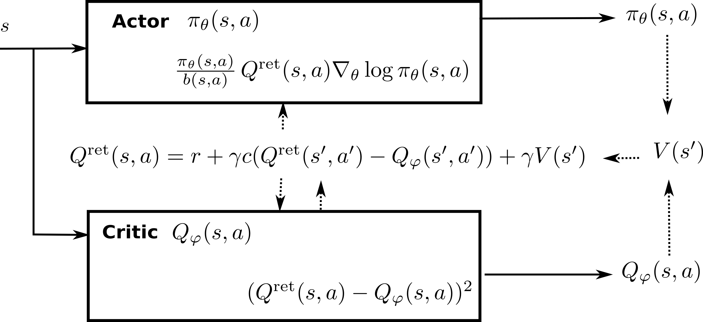

## Natural Gradients

The deep networks used as function approximators in the methods presented until now were all optimized (trained) using **stochastic gradient descent** (SGD) or any of its variants (RMSProp, Adam, etc). The basic idea is to change the parameters $\theta$ in the opposite direction of the gradient of the loss function (or the same direction as the policy gradient, in which case it is called gradient ascent), proportionally to a small learning rate $\eta$:

$$
    \Delta \theta = - \eta \, \nabla_\theta \mathcal{L}(\theta)
$$

SGD is also called a **steepest descent method**: one searches for the smallest parameter change $\Delta \theta$ inducing the biggest negative change of the loss function. In classical supervised learning, this is what we want: we want to minimize the loss function as fast as possible, while keeping weight changes as small as possible, otherwise learning might become unstable (weight changes computed for a single minibatch might erase the changes made on previous minibatches). The main difficulty of supervised learning is to choose the right value for the learning rate: too high and learning is unstable; too low and learning takes forever.

In deep RL, we have an additional problem: the problem is not stationary (see @sec:limitations-of-deep-neural-networks-for-function-approximation). In Q-learning, the target $r(s, a, s') + \gamma \, \max_{a'} Q_\theta(S', a')$ is changing with $\theta$. If the Q-values change a lot between two minibatches, the network will not get any stable target signal to learn from, and the policy will end up suboptimal. The trick is to use **target networks** to compute the target, which can be either an old copy of the current network (vanilla DQN), or a smoothed version of it (DDPG). Obviously, this introduces a bias (the targets are always wrong during training), but this bias converges to zero (after sufficient training, the targets will be almost correct), at the cost of a huge sample complexity.

Target networks cannot be used in **on-policy** methods, especially actor-critic architectures. As seen in @sec:off-policy-actor-critic, the critic must learn from transitions recently generated by the actor (although importance sampling and the Retrace algorithm might help). The problem with on-policy methods is that they waste a lot of data: they always need fresh samples to learn from and never reuse past experiences. The policy gradient theorem shows why:

$$
    \nabla_\theta J(\theta) =  \mathbb{E}_{s \sim \rho_\theta, a \sim \pi_\theta}[\nabla_\theta \log \pi_\theta(s, a) \, Q^{\pi_\theta}(s, a))] \approx  \mathbb{E}_{s \sim \rho_\theta, a \sim \pi_\theta}[\nabla_\theta \log \pi_\theta(s, a) \, Q_\varphi(s, a))]
$$

If the policy $\pi_\theta$ changes a lot between two updates, the estimated Q-value $Q_\varphi(s, a)$ will represent the value of the action for a totally different policy, not the true Q-value $Q^{\pi_\theta}(s, a)$. The estimated policy gradient will then be strongly biased and learning will be suboptimal. In other words, the actor should not change much faster than the critic, and vice versa. A naive solution would be to use a very small learning rate for the actor, but this just slows down learning (adding to the sample complexity) without solving the problem.

To solve the problem, we should actually do the opposite of the steepest descent: *search for the biggest parameter change $\Delta \theta$ inducing the smallest change in the policy, but in the right direction*. If the parameter change is high, the actor will learn a lot internally from each experience. But if the policy change is small between two updates (although the parameters have changed a lot), we might be able to reuse past experiences, as the targets will not be that wrong.

This is where **natural gradients** come into play, which are originally a statistical method to optimize over spaces of probability distributions, for example for variational inference. The idea to use natural gradients to train neural networks comes from @Amari1998. @Kakade2001 applied natural gradients to policy gradient methods, while @Peters2008 proposed a natural actor-critic algorithm for linear function approximators. The idea was adapted to deep RL by Schulman and colleagues, with Trust Region Policy Optimization [TRPO,@Schulman2015] and Proximal Policy Optimization [PPO,@Schulman2017], the latter gaining momentum over DDPG as the go-to method for continuous RL problems, particularly because of its smaller sample complexity and its robustness to hyperparameters.

### Principle of natural gradients

![Euclidian distances in the parameter space do not represent well the statistical distance between probability distributions. The two Gaussians on the left ($\mathcal{N}(0, 0.2)$ and $\mathcal{N}(1, 0.2)$) have the same Euclidian distance in the parameter space ($d = \sqrt{(\mu_0 - \mu_1)^2+(\sigma_0 - \sigma_1)^2}$) than the two Gaussians on the right ($\mathcal{N}(0, 10)$ and $\mathcal{N}(1, 10)$). However, the Gaussians on the right are much more similar than the two on the left: if you have a single sample, you could not say from which distribution it comes for the Gaussians on the right, while it is obvious for the Gaussians on the left.](img/naturalgradient.png){#fig:naturalgradient width=80%}

Consider the two Gaussian distributions in the left part of @fig:naturalgradient ($\mathcal{N}(0, 0.2)$ and $\mathcal{N}(1, 0.2)$) and the two on the right ($\mathcal{N}(0, 10)$ and $\mathcal{N}(1, 10)$). In both cases, the distance in the Euclidian space of parameters $d = \sqrt{(\mu_0 - \mu_1)^2+(\sigma_0 - \sigma_1)^2}$ is the same between the two Gaussians. Obviously, the two distributions on the left are however further away from each other than the two on the the right. This indicates that the Euclidian distance in the parameter space (which is what *regular* gradients act on) is not a correct measurement of the statistical distance between two distributions (which what we want to minimize between two iterations of PG).

In statistics, a common measurement of the statistical distance between two distributions $p$ and $q$ is the **Kullback-Leibler (KL) divergence** $D_{KL}(p||q)$, also called relative entropy or information gain. It is defined as:

$$
    D_{KL}(p || q) = \mathbb{E}_{x \sim p} [\log \frac{p(x)}{q(x)}]  = \int p(x) \, \log \frac{p(x)}{q(x)} \, dx
$$

Its minimum is 0 when $p=q$ (as $\log \frac{p(x)}{q(x)}$ is then 0) and is positive otherwise. Minimizing the KL divergence is equivalent to "matching" two distributions. Note that supervised methods in machine learning can all be interpreted as a minimization of the KL divergence: if $p(x)$ represents the distribution of the data (the label of a sample $x$) and $q(x)$ the one of the model (the prediction of a neural network for the same sample $x$), supervised methods want the output distribution of the model to match the distribution of the data, i.e. make predictions that are the same as the labels. For generative models, this is for example at the core of *generative adversarial networks* [@Goodfellow2014;@Arjovsky2017] or *variational autoencoders* [@Kingma2013].

The KL divergence is however not symmetrical ($D_{KL}(p || q) \neq D_{KL}(q || p)$), so a more useful divergence is the symmetric KL divergence, also known as Jensen-Shannon (JS) divergence:

$$
    D_{JS}(p || q) = \frac{D_{KL}(p || q) + D_{KL}(q || p)}{2}
$$

Other forms of divergence measurements exist, such as the Wasserstein distance which improves generative adversarial networks [@Arjovsky2017], but they are not relevant here. See <https://www.alexirpan.com/2017/02/22/wasserstein-gan.html> for more explanations.

We now have a global measurement of the similarity between two distributions on the whole input space, but which is hard to compute. How can we use it anyway in our optimization problem? As mentioned above, we search for the biggest parameter change $\Delta \theta$ inducing the smallest change in the policy. We need a metric linking changes in the parameters of the distribution (the weights of the network) to changes in the distribution itself. In other terms, we will apply gradient descent on the statistical manifold defined by the parameters rather than on the parameters themselves.

{#fig:riemannian width=50%}

Let's consider a parameterized distribution $p(x; \theta)$ and its new value $p(x; \theta + \Delta \theta)$ after applying a small parameter change $\Delta \theta$.
As depicted on @fig:riemannian, the Euclidian metric in the parameter space ($||\theta + \Delta \theta - \theta||^2$) does not take the structure of the statistical manifold into account. We need to define a **Riemannian metric** which accounts locally for the curvature of the manifold between $\theta$ and $\theta + \Delta \theta$. The Riemannian distance is defined by the dot product:

$$
    ||\Delta \theta||^2 = < \Delta \theta , F(\theta) \, \Delta \theta >
$$

where $F(\theta)$ is called the Riemannian metric tensor and is an inner product on the tangent space of the manifold at the point $\theta$.

When using the symmetric KL divergence to measure the distance between two distributions, the corresponding Riemannian metric is the **Fisher Information Matrix** (FIM), defined as the Hessian matrix of the KL divergence around $\theta$, i.e. the matrix of second order derivatives w.r.t the elements of $\theta$. See <https://stats.stackexchange.com/questions/51185/connection-between-fisher-metric-and-the-relative-entropy> and <https://wiseodd.github.io/techblog/2018/03/14/natural-gradient/> for an explanation of the link between the Fisher matrix and KL divergence.

The Fisher information matrix is defined as the Hessian of the KL divergence around $\theta$, i.e. how the manifold locally changes around $\theta$:

$$
    F(\theta) = \nabla^2 D_{JS}(p(x; \theta) || p(x; \theta + \Delta \theta))|_{\Delta \theta = 0}
$$

which necessitates to compute second order derivatives which are very complex and slow to obtain, especially when there are many parameters $\theta$ (the weights of the NN). Fortunately, it also has a simpler form which only depends on the outer product between the gradients of the log-likelihoods:

$$
    F(\theta) = \mathbb{E}_{x \sim p(x, \theta)}[ \nabla \log p(x; \theta)  (\nabla \log p(x; \theta))^T]
$$

which is something we can easily sample and compute.

Why is it useful? The Fisher Information matrix allows to **locally** approximate (for small $\Delta \theta$) the KL divergence between the two close distributions (using a second-order Taylor series expansion):

$$
    D_{JS}(p(x; \theta) || p(x; \theta + \Delta \theta)) \approx \Delta \theta^T \, F(\theta) \, \Delta \theta
$$

The KL divergence is then locally quadratic, which means that the update rules obtained when minimizing the KL divergence with gradient descent will be linear. Suppose we want to minimize a loss function $L$ parameterized by $\theta$ and depending on the distribution $p$. **Natural gradient descent** [@Amari1998] attempts to move along the statistical manifold defined by $p$ by correcting the gradient of $L(\theta)$ using the local curvature of the KL-divergence surface, i.e. moving some given distance in the direction $\tilde{\nabla_\theta} L(\theta)$:

$$
    \tilde{\nabla_\theta} L(\theta) = F(\theta)^{-1} \, \nabla_\theta L(\theta)
$$

$\tilde{\nabla_\theta} L(\theta)$ is the **natural gradient** of $L(\theta)$. Natural gradient descent simply takes steps in this direction:

$$
    \Delta \theta = - \eta \, \tilde{\nabla_\theta} L(\theta)
$$

When the manifold is not curved ($F(\theta)$ is the identity matrix), natural gradient descent is the regular gradient descent.

But what is the advantage of natural gradients? The problem with regular gradient descent is that it relies on a fixed learning rate. In regions where the loss function is flat (a plateau), the gradient will be almost zero, leading to very slow improvements. Because the natural gradient depends on the inverse of the curvature (Fisher), the magnitude of the gradient will be higher in flat regions, leading to bigger steps, and smaller in very steep regions (around minima). Natural GD therefore converges faster and better than regular GD.

Natural gradient descent is a generic optimization method, it can for example be used to train more efficiently deep networks in supervised learning [@Pascanu2013]. Its main drawback is the necessity to inverse the Fisher information matrix, whose size depends on the number of free parameters (if you have N weights in the NN, you need to inverse a NxN matrix). Several approximations allows to remediate to this problem, for example Conjugate Gradients or Kronecker-Factored Approximate Curvature (K-FAC).

**Additional resources** to understand natural gradients:

* <http://andymiller.github.io/2016/10/02/natural_gradient_bbvi.html>
* <https://hips.seas.harvard.edu/blog/2013/01/25/the-natural-gradient/>
* <http://kvfrans.com/what-is-the-natural-gradient-and-where-does-it-appear-in-trust-region-policy-optimization>
* <https://wiseodd.github.io/techblog/2018/03/14/natural-gradient/>
* A tutorial by John Schulman (OpenAI) <https://www.youtube.com/watch?v=xvRrgxcpaHY>
* A blog post on the related Hessian-free optimization and conjuguate gradients <http://andrew.gibiansky.com/blog/machine-learning/hessian-free-optimization/>
* K-FAC: <https://syncedreview.com/2017/03/25/optimizing-neural-networks-using-structured-probabilistic-models/>
* Conjugate gradients: <https://www.cs.cmu.edu/~quake-papers/painless-conjugate-gradient.pdf>

**Note:** Natural gradients can also be used to train DQN architectures, resulting in more efficient and stable learning behaviors [@Knight2018].

### Natural policy gradient and Natural Actor Critic (NAC)

@Kakade2001 applied the principle of natural gradients proposed by @Amari1998 to the policy gradient theorem:

$$
    \nabla_\theta J(\theta) =  \mathbb{E}_{s \sim \rho_\theta, a \sim \pi_\theta}[\nabla_\theta \log \pi_\theta(s, a) \, Q^{\pi_\theta}(s, a)]
$$

This *regular* gradient does not take into account the underlying structure of the policy distribution $\pi(s, a)$. The Fisher information matrix for the policy is defined by:

$$
    F(\theta) = \mathbb{E}_{s \sim \rho_\theta, a \sim \pi_\theta}[ \nabla \log \pi_\theta(s, a)  (\nabla \log \pi_\theta(s, a))^T]
$$

The natural policy gradient is simply:

$$
    \tilde{\nabla}_\theta J(\theta) = F(\theta)^{-1} \, \nabla_\theta J(\theta)  = \mathbb{E}_{s \sim \rho_\theta, a \sim \pi_\theta}[ F(\theta)^{-1} \,  \nabla_\theta \log \pi_\theta(s, a) \, Q^{\pi_\theta}(s, a)]
$$

@Kakade2001 also shows that you can replace the true Q-value $Q^{\pi_\theta}(s, a)$ with a compatible approximation $Q_\varphi(s, a)$ (as long as it minimizes the quadratic error) and still obtained an unbiased natural gradient. An important theoretical result is that policy improvement is guaranteed with natural gradients: the new policy after an update is always better (more expected returns) than before. He experimented this new rule on various simple MDPs and observed drastic improvements over vanilla PG.

@Peters2008 extended on the work of @Kakade2001 to propose the natural actor-critic (NAC). The exact derivations would be too complex to summarize here, but the article is an interesting read. He particularly reviews the progress at that time on policy gradient for its use in robotics. He showed that the $F(\theta)$) is a true Fisher information matrix even when using sampled episodes, and derived a baseline $b$ to reduce the variance of the natural policy gradient. He demonstrated the power of this algorithm by letting a robot learning motor primitives for baseball.

### Trust Region Policy Optimization (TRPO)

#### Principle {-}

@Schulman2015 extended the idea of natural gradients to allow their use for non-linear function approximators (e.g. deep networks), as the previous algorithms only worked efficiently for linear approximators. The proposed algorithm, Trust Region Policy Optimization (TRPO), has now been replaced in practice by Proximal Policy Optimization (PPO, see next section) but its novel ideas are important to understand already.

Let's note the expected return of a policy $\pi$ as:

$$
    \eta(\pi) = \mathbb{E}_{s \sim \rho_\pi, a \sim \pi}[\sum_{t=0}^\infty \gamma^t \, r(s_t, a_t, s_{t+1})]
$$

where $\rho_\pi$ is the discounted visitation frequency distribution (the probability that a state $s$ will be visited at some point in time by the policy $\pi$):

$$
    \rho_\pi(s) = P(s_0=s) + \gamma \, P(s_1=s) + \gamma^2 \, P(s_2=s) + \ldots
$$

@Kakade2002 had shown that it is possible to relate the expected return of two policies $\pi_\theta$ and $\pi_{\theta_\text{old}}$ using advantages (omitting $\pi$ in the notations):

$$
    \eta(\theta) = \eta(\theta_\text{old}) + \mathbb{E}_{s \sim \rho_{\pi_\theta}, a \sim \pi_\theta} [A_{\pi_{\theta_\text{old}}}(s, a)]
$$

The advantage $A_{\pi_{\theta_\text{old}}}(s, a)$ denotes the change in the expected return obtained after $(s, a)$ when using the new policy $\pi_\theta$, in comparison to the one obtained with the old policy $\pi_{\theta_\text{old}}$. While this formula seems interesting (it measures how good the new policy is with regard to the average performance of the old policy, so we could optimize directly), it is difficult to estimate as the mathematical expectation depends on state-action pairs generated by the new policy : $s \sim \rho_{\pi_\theta}, a \sim \pi_\theta$.

@Schulman2015 propose an approximation to this formula, by considering that if the two policies $\pi_\theta$ and $\pi_{\theta_\text{old}}$ are not very different from another, one can sample the states from the old distribution:

$$
    \eta(\theta) \approx \eta(\theta_\text{old}) + \mathbb{E}_{s \sim \rho_{\pi_{\theta_\text{old}}}, a \sim \pi_\theta} [A_{\pi_{\theta_\text{old}}}(s, a)]
$$

One can already recognize the main motivation behind natural gradients: finding a weight update that moves the policy in the right direction (getting more rewards) while keeping the change in the policy distribution as small as possible (to keep the assumption correct).

Let's now define the following objective function:

$$
    J_{\theta_\text{old}}(\theta) = \eta(\theta_\text{old}) + \mathbb{E}_{s \sim \rho_{\pi_{\theta_\text{old}}}, a \sim \pi_\theta} [A_{\pi_{\theta_\text{old}}}(s, a)]
$$

It is easy to see that $J_{\theta_\text{old}}(\theta_\text{old}) = \eta(\theta_\text{old})$ by definition of the advantage, and that its gradient w.r.t to $\theta$ taken in $\theta_\text{old}$ is the same as the one of $\eta(\theta_\text{old})$:

$$
    \nabla_\theta J_{\theta_\text{old}}(\theta)|_{\theta = \theta_\text{old}} = \nabla_\theta \eta(\theta)|_{\theta = \theta_\text{old}}
$$

This means that, at least locally, one maximization step of $J_{\theta_\text{old}}(\theta)$ goes in the same direction as maximizing $\eta(\theta)$ if we do not go too far. $J$ is called a **surrogate objective function**: it is not what we want to optimize, but it leads to the same result. TRPO belongs to the class of **minorization-majorization** algorithms (MM, we first find a local lower bound and then maximize it, iteratively).

Let's now suppose that we can find its maximum, i.e. a policy $\pi'$ that maximizes the advantage of each state-action pair over $\pi_{\theta_\text{old}}$. There would be no guarantee that $\pi'$ and $\pi_{\theta_\text{old}}$ are close enough so that the assumption stands. We could therefore make only a small step in its direction and hope for the best:

$$
    \pi_\theta(s, a) = (1-\alpha) \, \pi_{\theta_\text{old}}(s, a) + \alpha \, \pi'(s,a)
$${#eq:linesearch}

This is the conservative policy iteration method of @Kakade2002, where a bound on the difference between $\eta(\pi_{\theta_\text{old}})$ and $J_{\theta_\text{old}}(\theta)$ can be derived.

@Schulman2015 propose to penalize instead the objective function by the KL divergence between the new and old policies. There are basically two ways to penalize an optimization problem:

1. Adding a hard constraint on the KL divergence, leading to a constrained optimization problem (where Lagrange methods can be applied):

$$
    \text{maximize}_\theta \qquad J_{\theta_\text{old}}(\theta) \\
    \qquad \text{subject to} \qquad D_{KL}(\pi_{\theta_\text{old}} || \pi_\theta) \leq \delta
$$

2. Regularizing the objective function with the KL divergence:

$$
    \text{maximize}_\theta \qquad L(\theta) = J_{\theta_\text{old}}(\pi_\theta) - C \,  D_{KL}(\pi_{\theta_\text{old}} || \pi_\theta)
$$

In the first case, we force the KL divergence to stay below a certain threshold. In the second case, we penalize solutions that would maximize $J_{\theta_\text{old}}(\theta)$ but would be too different from the previous policy.
In both cases, we want to find a policy $\pi_\theta$ maximizing the expected return (the objective), but which is still close (in terms of KL divergence) from the current one. Both methods are however sensible to the choice of the parameters $\delta$ and $C$.

Formally, the KL divergence $D_{KL}(\pi_{\theta_\text{old}} || \pi_\theta)$ should be the maximum KL divergence over the state space:

$$
    D^\text{max}_{KL}(\pi_{\theta_\text{old}} || \pi_\theta) = \max_s D_{KL}(\pi_{\theta_\text{old}}(s, .) || \pi_\theta(s, .))
$$

This maximum KL divergence over the state space would be very hard to compute. Empirical evaluations showed however that it is safe to use the mean KL divergence, or even to sample it:

$$
    \bar{D}_{KL}(\pi_{\theta_\text{old}} || \pi_\theta) = \mathbb{E}_s [D_{KL}(\pi_{\theta_\text{old}}(s, .) || \pi_\theta(s, .))] \approx \frac{1}{N} \sum_{i=1}^N D_{KL}(\pi_{\theta_\text{old}}(s_i, .) || \pi_\theta(s_i, .))
$$

#### Trust regions {-}

![Graphical illustration of trust regions. From the current parameters $\theta_\text{old}$, we search for the maximum $\theta^*$ of the real objective $\eta(\theta)$. The unconstrained objective $J_{\theta_\text{old}}(\theta)$ is locally similar to $\eta(\theta)$ but quickly diverge as $\pi_\theta$ and $\pi_{\theta_\text{old}}$ become very different. The surrogate objective $L(\theta) = J_{\theta_\text{old}} (\theta) - C \,  D_{KL}(\pi_{\theta_\text{old}} || \pi_\theta)$ is always smaller than $\eta(\theta)$ and has a maximum close to $\theta^*$ which keeps $\pi_\theta$ and $\pi_{\theta_\text{old}}$ close from each other in terms of KL divergence. The region around $\theta_\text{old}$ where big optimization steps can be taken without changing the policy too much is called the trust region.](img/trustregion.png){#fig:trustregion width=70%}

Before diving further into how these optimization problems can be solved, let's wonder why the algorithm is called **trust region policy optimization** using the regularized objective. @fig:trustregion illustrates the idea. The "real" objective function $\eta(\theta)$ should be maximized (with gradient descent or similar) starting from the parameters $\theta_\text{old}$. We cannot estimate the objective function directly, so we build a surrogate objective function $L(\theta) = J_{\theta_\text{old}} (\theta) - C \,  D_{KL}(\pi_{\theta_\text{old}} || \pi_\theta)$. We know that:

1. The two objectives have the same value in $\theta_\text{old}$:
$$L(\theta_\text{old}) = J_{\theta_\text{old}}(\theta_\text{old}) - C \,  D_{KL}(\pi_{\theta_\text{old}} || \pi_{\theta_\text{old}}) = \eta(\theta_\text{old})$$
2. Their gradient w.r.t $\theta$ are the same in $\theta_\text{old}$:
$$\nabla_\theta L(\theta)|_{\theta = \theta_\text{old}} = \nabla_\theta \eta(\theta)|_{\theta = \theta_\text{old}}$$
3. The surrogate objective is always smaller than the real objective, as the KL divergence is positive:
$$\eta(\theta) \geq J_{\theta_\text{old}}(\theta) - C \,  D_{KL}(\pi_{\theta_\text{old}} || \pi_\theta)$$.

Under these conditions, the surrogate objective is also called a **lower bound** of the primary objective. The interesting fact is that the value of $\theta$ that maximizes $L(\theta)$ is at the same time:

* A big step in the parameter space towards the maximum of $\eta(\theta)$, as $\theta$ and $\theta_\text{old}$ can be very different.
* A small step in the policy distribution space, as the KL divergence between the previous and the new policies is kept small.

Exactly what we needed! The parameter region around $\theta_\text{old}$ where the KL divergence s kept small is called the **trust region**. This means that we can safely take big optimization steps (e.g. with a high learning rate or even analytically) without risking to violate the initial assumptions.

#### Sample-based formulation {-}

Although the theoretical proofs in @Schulman2015 used the regularized optimization method, the practical implementation uses the constrained optimization problem:

$$
    \text{maximize}_\theta \qquad J_{\theta_\text{old}}(\theta) = \eta(\theta_\text{old}) + \mathbb{E}_{s \sim \rho_{\pi_{\theta_\text{old}}}, a \sim \pi_\theta} [A_{\pi_{\theta_\text{old}}}(s, a)] \\
    \qquad \text{subject to} \qquad D_{KL}(\pi_{\theta_\text{old}} || \pi_\theta) \leq \delta
$$

The first thing to notice is that $\eta(\theta_\text{old})$ does not depend on $\theta$, so it is constant in the optimization problem. We only need to maximize the advantage of the actions taken by $\pi_\theta$ in each state visited by $\pi_{\theta_\text{old}}$. The problem is that $\pi_\theta$ is what we search, so we can not sample actions from it. The solution is to use **importance sampling** (see @sec:importance-sampling) to allow sampling actions from $\pi_{\theta_\text{old}}$. This is possible as long as we correct the objective with the importance sampling weight:

$$
    \text{maximize}_\theta \qquad \mathbb{E}_{s \sim \rho_{\pi_{\theta_\text{old}}}, a \sim \pi_{\theta_\text{old}}} [\frac{\pi_\theta(s, a)}{\pi_{\theta_\text{old}}(s, a)} \, A_{\pi_{\theta_\text{old}}}(s, a)] \\
    \qquad \text{subject to} \qquad D_{KL}(\pi_{\theta_\text{old}} || \pi_\theta) \leq \delta
$$

Now that states and actions are generated by the old policy, we can safely sample many trajectories using $\pi_{\theta_\text{old}}$ (@Schulman2015 proposes two methods called single path and Vine, but we ignore it here), compute the advantages of all state-action pairs (using real rewards along the trajectories), form the surrogate objective function and optimize it using second-order optimization methods.

One last thing to notice is that the advantages $A_{\pi_{\theta_\text{old}}}(s, a) = Q_{\pi_{\theta_\text{old}}}(s, a) - V_{\pi_{\theta_\text{old}}}(s)$ depend on the value of the states encountered by $\pi_{\theta_\text{old}}$. The state values do not depend on the policies, they are constant for each optimization step, so they can also be safely removed:

$$
    \text{maximize}_\theta \qquad \mathbb{E}_{s \sim \rho_{\pi_{\theta_\text{old}}}, a \sim \pi_{\theta_\text{old}}} [\frac{\pi_\theta(s, a)}{\pi_{\theta_\text{old}}(s, a)} \, Q_{\pi_{\theta_\text{old}}}(s, a)] \\
    \qquad \text{subject to} \qquad D_{KL}(\pi_{\theta_\text{old}} || \pi_\theta) \leq \delta
$$

Here we go, that's TRPO. It could seem a bit disappointing to come up with such a simple formulation (find a policy which maximizes the Q-value of sampled actions while being not too different from the previous one) after so many mathematical steps, but that is also the beauty of it: not only it works, but it is guaranteed to work. With TRPO, each optimization step brings the policy closer from an optimum, what is called **monotonic improvement**.

#### Practical implementation {-}

Now, how do we solve the constrained optimization problem? And what is the link with natural gradients?

To solve constrained optimization problems, we can form a Lagrange function with an additional parameter $\lambda$ and search for its maximum:

$$
    \mathcal{L}(\theta, \lambda) = J_{\theta_\text{old}}(\theta)  - \lambda \, (D_{KL}(\pi_{\theta_\text{old}} || \pi_\theta) - \delta)
$$

Notice how close the Lagrange function is from the regularized problem used in the theory. We can form a first-order approximation of $J_{\theta_\text{old}}(\theta)$:

$$
    J_{\theta_\text{old}}(\theta) = \nabla_\theta J_{\theta_\text{old}}(\theta) \, (\theta- \theta_\text{old})
$$

as $J_{\theta_\text{old}}(\theta_\text{old}) = 0$. $g = \nabla_\theta J_{\theta_\text{old}}(\theta)$ is the now familiar **policy gradient** with importance sampling. Higher-order terms do not matter, as they are going to be dominated by the KL divergence term.

As in @sec:principle-of-natural-gradients, we will use a second-order approximation of the KL divergence term using the Fisher Information Matrix:

$$
    D_{KL}(\pi_{\theta_\text{old}} || \pi_\theta) = (\theta- \theta_\text{old})^T \, F(\theta_\text{old}) \,  (\theta- \theta_\text{old})
$$

We get the following Lagrangian function:

$$
    \mathcal{L}(\theta, \lambda) = \nabla_\theta J_{\theta_\text{old}}(\theta) \, (\theta- \theta_\text{old})  - \lambda \, (\theta- \theta_\text{old})^T \, F(\theta_\text{old}) \,  (\theta- \theta_\text{old})
$$

which is quadratic in $\Delta \theta = \theta- \theta_\text{old}$. It has therefore a unique maximum, characterized by a first-order derivative equal to 0:

$$
    \nabla_\theta J_{\theta_\text{old}}(\theta) = \lambda \, F(\theta_\text{old}) \,  \Delta \theta
$$

or:

$$
    \Delta \theta  = \frac{1}{\lambda} \, F(\theta_\text{old})^{-1} \,  \nabla_\theta J_{\theta_\text{old}}(\theta)
$$

which is the **natural gradient descent**! The size of the step $\frac{1}{\lambda}$ still has to be determined, but it can also be replaced by a fixed hyperparameter.

The main problem is now to compute and inverse the Fisher information matrix, which is quadratic with the number of parameters $\theta$, i.e. with the number of weights in the NN. @Schulman2015 proposes to used **conjugate gradients** to iteratively approximate the Fisher, a second-order method which will not be presented here (see <https://www.cs.cmu.edu/~quake-papers/painless-conjugate-gradient.pdf> for a detailed introduction). After the conjugate gradient optimization step, the constraint $D_{KL}(\pi_{\theta_\text{old}} || \pi_\theta) \leq \delta$ is however not ensured anymore, so a line search is made as in @eq:linesearch until that criteria is met.

#### Summary {-}

TRPO is a policy gradient method using natural gradients to monotonically improve the expected return associated to the policy. As a minorization-maximization (MM) method, it uses a surrogate objective function (a lower bound on the expected return) to iteratively change the parameters of the policy using large steps, but without changing the policy too much (as measured by the KL divergence). Its main advantage over DDPG is that it is much less sensible to the choice of the learning rate.

However, it has several limitations:

* It is hard to use with neural networks having multiple outputs (e.g. the policy and the value function, as in actor-critic methods) as natural gradients are dependent on the policy distribution and its relationship with the parameters.
* It works well when the NN has only fully-connected layers, but empirically performs poorly on tasks requiring convolutional layers or recurrent layers.
* The use of conjugate gradients makes the implementation much more complicated and less flexible than regular SGD.

**Additional resources**

* <http://178.79.149.207/posts/trpo.html>
* <https://towardsdatascience.com/introduction-to-various-reinforcement-learning-algorithms-part-ii-trpo-ppo-87f2c5919bb9>
* <https://medium.com/@sanketgujar95/trust-region-policy-optimization-trpo-and-proximal-policy-optimization-ppo-e6e7075f39ed>
* <https://www.depthfirstlearning.com/2018/TRPO>
* <http://rll.berkeley.edu/deeprlcoursesp17/docs/lec5.pdf>

### Proximal Policy Optimization (PPO)

Proximal Policy Optimization (PPO) was proposed by @Schulman2017 to overcome the problems of TRPO (complexity, unability to share parameters or to use complex NN architectures) while increasing the range of tasks learnable by the system (compared to DQN) and improving the sample complexity (compared to online PG methods, which perform only one update per step).

For that, they investigated various surrogate objectives (lower bounds) that could be solved using first-order optimization techniques (gradient descent).  Let's rewrite the surrogate loss of TRPO in the following manner:

$$
    L^\text{CPI}(\theta) = \mathbb{E}_{t} [\frac{\pi_\theta(s_t, a_t)}{\pi_{\theta_\text{old}}(s_t, a_t)} \, A_{\pi_{\theta_\text{old}}}(s_t, a_t)] = \mathbb{E}_{t} [\rho_t(\theta) \, A_{\pi_{\theta_\text{old}}}(s_t, a_t)]
$$

by making the dependency over time explicit and noting the importance sampling weight $\rho_t(\theta)$. The superscript CPI refers to conservative policy iteration [@Kakade2002]. Without a constraint, the maximization of $L^\text{CPI}$ would lead to an excessively large policy updates. The authors searched how to modify the objective, in order to penalize changes to the policy that make $\rho_t(\theta)$ very different from 1, i.e. where the KL divergence between the new and old policies would become high. They ended up with the following surrogate loss:

$$
    L^\text{CLIP}(\theta) = \mathbb{E}_{t} [ \min (\rho_t(\theta) \, A_{\pi_{\theta_\text{old}}}(s_t, a_t), \text{clip}(\rho_t(\theta) , 1- \epsilon, 1+\epsilon) \,  A_{\pi_{\theta_\text{old}}}(s_t, a_t)]
$$

The left part of the min operator is the surrogate objective of TRPO $L^\text{CPI}(\theta)$. The right part restricts the importance sampling weight between $1-\epsilon$ and $1 +\epsilon$.  Let's consider two cases (depicted on @fig:ppo):

{#fig:ppo width=80%}

1. the transition $s_t, a_t$ has a positive advantage, i.e. it is a better action than expected. The probability of selecting that action again should be increased, i.e. $\pi_\theta(s_t, a_t) > \pi_{\theta_\text{old}}(s_t, a_t)$. However, the importance sampling weight could become very high (a change from 0.01 to 0.05 is a ration of $\rho_t(\theta) = 5$). In that case, $\rho_t(\theta)$ will be clipped to $1+\epsilon$, for example 1.2. As a consequence, the parameters $\theta$ will move in the right direction, but the distance between the new and the old policies will stay small.

2. the transition $s_t, a_t$ has a negative advantage, i.e. it is a worse action than expected. Its probability will be decreased and the importance sampling weight might become much smaller than 1. Clipping it to $1-\epsilon$ avoids drastic changes to the policy, while still going in the right direction.

Finally, they take the minimum of the clipped and unclipped objective, so that the final objective is a lower bound of the unclipped objective.
In the original paper, they use **generalized advantage estimation** (GAE, @sec:generalized-advantage-estimation-gae) to estimate $A_{\pi_{\theta_\text{old}}}(s_t, a_t)$, but anything could be used (n-steps, etc). Transitions are sampled by multiple actors in parallel, as in A2C (@sec:advantage-actor-critic-a2c).

The pseudo-algorithm of PPO is as follows:

---

* Initialize an actor $\pi_\theta$ and a critic $V_\varphi$ with random weights.

* while not converged :

    * for $N$ actors in parallel:

        * Collect $T$ transitions using $\pi_\text{old}$.

        * Compute the generalized advantage of each transition using the critic.

    * for $K$ epochs:

        * Sample $M$ transitions from the ones previously collected.

        * Train the actor to maximize the clipped surrogate objective.

        * Train the critic to minimize the mse using TD learning.

    * $\theta_\text{old} \leftarrow \theta$

---

The main advantage of PPO with respect to TRPO is its simplicity: the clipped objective can be directly maximized using first-order methods like stochastic gradient descent or Adam. It does not depend on assumptions about the parameter space: CNNs and RNNs can be used for the policy. It is sample-efficient, as several epochs of parameter updates are performed between two transition samplings: the policy network therefore needs less fresh samples that strictly on-policy algorithms to converge.

The only drawbacks of PPO is that there no convergence guarantee (although in practice it converges more often than other state-of-the-art methods) and that the right value for $\epsilon$ has to be determined. PPO has improved the state-of-the-art on Atori games and Mujoco robotic tasks. It has become the go-to method for continuous control problems.

**Additional resources**

* More explanations and demos from OpenAI: <https://blog.openai.com/openai-baselines-ppo>

### Actor-Critic with Experience Replay (ACER)

The natural gradient methods presented above are stochastic actor-critic methods, therefore strictly on-policy. Off-policy methods such as DQN or DDPG allow to reuse past transitions through the usage of an **experience replay memory**, potentially reducing the sample complexity at the cost of a higher variance and worse stability (@sec:off-policy-actor-critic). @Wang2017 proposed an off-policy actor-critic architecture using variance reduction techniques, the off-policy Retrace algorithm [@Munos2016, @sec:retrace], parallel training of multiple actor-learners [@Mnih2016, @sec:asynchronous-advantage-actor-critic-a3c], truncated importance sampling with bias correction (@sec:importance-sampling), stochastic duelling network architectures [@Wang2016, @sec:duelling-network], and efficient trust region policy optimization. It can be seen as the off-policy counterpart to A3C.

The first aspect of ACER is that it interleaves on-policy learning with off-policy: the agent samples a trajectory $\tau$, learns from it on-policy, stores it in the replay buffer, samples $n$ trajectories from the replay buffer and learns off-policy from each of them:

---

* Sample a trajectory $\tau$ using the current policy.

* Apply ACER on-policy on $\tau$.

* Store $\tau$ in the replay buffer.

* Sample $n$ trajectories from the replay buffer.

* for each sampled trajectory $\tau_k$:

    * Apply ACER off-policy on $\tau_k$.

---

Mixing on-policy learning with off-policy is quite similar to the Self-Imitation Learning approach of [@Oh2018, @sec:self-imitation-learning-sil].

#### Retrace evaluation {-}

ACER comes in two flavours: one for discrete action spaces, one for continuous spaces. The discrete version is simpler, so let's focus on this one. As any policy-gradient method, ACER tries to estimate the policy gradient for each transition of a trajectory, but using importance sampling [@Degris2012, @sec:linear-off-policy-actor-critic-off-pac]:

$$
    \nabla_\theta J(\theta)  = \mathbb{E}_{s_t, a_t \sim \rho_b} [\frac{\pi_\theta(s_t, a_t)}{b(s_t, a_t)} \, Q_\varphi(s_t, a_t) \, \nabla_\theta \log \pi_\theta(s_t, a_t)]
$$

The problem is now to train the critic $Q_\varphi(s_t, a_t)$ by computing the correct target. ACER learning builds on the Retrace algorithm [@Munos2016, @sec:retrace]:

$$
    \Delta Q_\varphi(s_t, a_t) = \alpha \, \sum_{t'=t}^T (\gamma)^{t'-t} \left(\prod_{s=t+1}^{t'} c_s \right) \, \delta_{t'}
$$

with $c_s = \lambda \min (1, \frac{\pi_\theta(s_s, a_s)}{b(s_s, a_s)})$ being the clipped importance sampling weight and $\delta_{t'}$ is the TD error at time $t'>t$:

$$
    \delta_{t'} = r_{t'+1} + \gamma \, V(s_{t'+1}) - V(s_{t'})
$$

By noting $Q^\text{ret}$ the target value for the update of the critic (neglecting the learning rate $\alpha$):

$$
    Q^\text{ret}(s_t, a_t) = Q_\varphi(s_t, a_t) +  \sum_{t'=t}^T (\gamma)^{t'-t} \left(\prod_{s=t+1}^{t'} c_s \right) \, \delta_{t'}
$$

we can transform the Retrace formula into a recurrent one:

$$
\begin{aligned}
    Q^\text{ret}(s_t, a_t) & = Q_\varphi(s_t, a_t) + \delta_t + \sum_{t'=t+1}^T (\gamma)^{t'-t} \left(\prod_{s=t+1}^{t'} c_s \right) \, \delta_{t'} \\
    & = Q_\varphi(s_t, a_t) + \delta_t + \gamma \, c_{t+1} \, (Q^\text{ret}(s_{t+1}, a_{t+1}) - Q_\varphi(s_{t+1}, a_{t+1})) \\
\end{aligned}
$$

$Q_\varphi(s_t, a_t) + \delta_t = Q_\varphi(s_t, a_t) + r_{t+1} + \gamma \, V(s_{t+1}) - V(s_t)$ can furthermore be reduced to $r_{t+1} + \gamma \, V(s_{t+1})$ by considering that $Q_\varphi(s_t, a_t) \approx V(s_t)$ (the paper does not justify this assumption, but it should be true in expectation).

This gives us the following target value for the Q-values:

$$
    Q^\text{ret}(s_t, a_t) = r_{t+1} + \gamma \, c_{t+1} \, (Q^\text{ret}(s_{t+1}, a_{t+1}) - Q_\varphi(s_{t+1}, a_{t+1})) + \gamma \, V(s_{t+1})
$$

One remaining issue is that the critic would also need to output the value of each state $V(s_{t+1})$, in addition to the Q-values $Q_\varphi(s_t, a_t)$. In the discrete case, this is not necessary, as the value of a state is the expectation of the value of the available actions under the current policy:

$$
    V(s_{t+1}) = \mathbb{E}_{a_{t+1} \sim \pi_\theta} [Q_\varphi(s_{t+1}, a_{t+1})] = \sum_a \pi_\theta(s_{t+1}, a) \, Q_\varphi(s_{t+1}, a))
$$

The value of the next state can be easily computed when we have the policy $\pi_\theta(s, a)$ (actor) and the Q-value $Q_\varphi(s, a)$ (critic) of each action $a$ in a state $s$.

The actor-critic architecture needed for ACER is therefore the following:

* The **actor** $\pi_\theta$ takes a state $s$ as input and outputs a vector of probabilities $\pi_\theta$ for each available action.

* The **critic** $Q_\varphi$ takes a state $s$ as input and outputs a vector of Q-values.

This is different from the architecture of A3C, where the critic "only" had to output the value of a state $V_\varphi(s)$: it is now a vector of Q-values. Note that the actor and the critic can share most of their parameters: the network only needs to output two different vectors $\pi_\theta(s)$ and $Q_\varphi(s)$ for each input state $s$ (@fig:acer). This makes a "two heads" NN, similar to the **duelling architecture** of [@Wang2016, @sec:duelling-network].

{#fig:acer width=90%}

The target Q-value $Q^\text{ret}(s, a)$ can be found recursively by iterating backwards over the episode:

---

* Initialize $Q^\text{ret}(s_T, a_T)$, $Q_\varphi(s_T, a_T)$ and $V(s_T)$ to 0, as the terminal state has no value.

* for $t \in [T-1, \ldots, 0]$:

    * Update the target Q-value using the received reward, the critic and the previous target value:

    $$
        Q^\text{ret}(s_t, a_t) = r_{t+1} + \gamma \, c_{t+1} \, (Q^\text{ret}(s_{t+1}, a_{t+1}) - Q_\varphi(s_{t+1}, a_{t+1})) + \gamma \, V(s_{t+1})
    $$

    * Apply the critic on the current action:

    $$
        Q_\varphi(s_t, a_t)
    $$

    * Estimate the value of the state using the critic:

    $$
        V(s_t) = \sum_a \pi_\theta(s_t) \, Q_\varphi(s_t, a)
    $$

---

As the target value $Q^\text{ret}(s, a)$ use multiple "real" rewards $r_{t+1}$, it is actually less biased than the critic $Q_\varphi(s, a)$. It is then better to use it to update the actor:

$$
    \nabla_\theta J(\theta)  = \mathbb{E}_{s_t, a_t \sim \rho_b} [\frac{\pi_\theta(s_t, a_t)}{b(s_t, a_t)} \, Q^\text{ret}(s_t, a_t) \, \nabla_\theta \log \pi_\theta(s_t, a_t)]
$$

The critic just has to minimize the mse with the target value:

$$
    \mathcal{L}(\varphi) = \mathbb{E}_{s_t, a_t \sim \rho_b} [(Q^\text{ret}(s, a) - Q_\varphi(s, a))^2]
$$

#### Importance weight truncation with bias correction {-}

When updating the actor, we rely on the importance sampling weight $\rho_t = \frac{\pi_\theta(s_t, a_t)}{b(s_t, a_t)}$ which can vary a lot and destabilize learning.

$$
    \nabla_\theta J(\theta)  = \mathbb{E}_{s_t, a_t \sim \rho_b} [\rho_t \, Q^\text{ret}(s_t, a_t) \, \nabla_\theta \log \pi_\theta(s_t, a_t)]
$$

PPO (@sec:proximal-policy-optimization-ppo) solved this problem by clipping the importance sampling weight between $1- \epsilon$ and $1+\epsilon$. ACER uses a similar strategy, but only using an upper bound $c = 10$ on the weight:

$$
    \bar{\rho}_t = \min(c, \rho_t)
$$

Using $\bar{\rho}_t$ in the policy gradient directly would introduce a bias: actions whose importance sampling weight $\rho_t$ is higher than $c$ would contribute to the policy gradient with a smaller value than they should, introducing a bias.

The solution in ACER is to add a **bias correcting term**, that corrects the policy gradient when an action has a weight higher than $c$:

$$
\begin{aligned}
    \nabla_\theta J(\theta)  = & \mathbb{E}_{s_t \sim \rho_b} [\mathbb{E}_{a_t \sim b} [\bar{\rho}_t \, Q^\text{ret}(s_t, a_t) \, \nabla_\theta \log \pi_\theta(s_t, a_t)] \\
    & + \mathbb{E}_{a \sim \pi_\theta}[(\frac{\rho_t(a) - c}{\rho_t(a)})^+ \, Q_\varphi(s_t, a) \, \nabla_\theta \log \pi_\theta(s_t, a)]] \\
\end{aligned}
$$

The left part of that equation is the same policy gradient as before, but using a clipped importance sampling weight.

The right part requires to integrate over all possible actions in the state $s_t$ according to the learned policy $\pi_\theta$, although only the action $a_t$ was selected by the behavior policy $b$. The term $(\frac{\rho_t(a) - c}{\rho_t(a)})^+$ is zero for all actions having an importance sampling weight smaller than c, and has a maximum of 1. In practice, this correction term can be computed using the vectors $\pi_\theta(s, a)$ and $Q_\varphi(s, a)$, which are the outputs of the actor and the critic, respectively.

Finally, the Q-values $Q^\text{ret}(s_t, a_t)$ and $Q_\varphi(s_t, a)$ are transformed into advantages $Q^\text{ret}(s_t, a_t)  - V_\varphi(s_t)$ and $Q_\varphi(s_t, a) - V_\varphi(s_t)$ by substracting the value of the state in order to reduce the variance of the policy gradient.

In short, we now have an estimator of the policy gradient which is **unbiased** and of smaller variance.

#### Efficient trust region policy optimization {-}

However, the variance is still too high. The last important step of ACER is an efficient TRPO update for the parameters of the actor.

A first component of their TRPO update is they use a **target actor network** $\theta'$ (called averaged policy network in the paper) slowly tracking the actor $\theta$ after each update:

$$
    \theta' \leftarrow \alpha \, \theta' + (1 - \alpha) \, \theta
$$

A second component is that the actor is decomposed into two components:

1. a distribution $f$.
2. the statistics $\Phi_\theta(x)$ of this distribution.

This is what you do when you apply the softmax action selection on Q-values: the distribution is the Gibbs (or Boltzmann) distribution and the Q-values are its statistics. In the discrete case, they take a categorical (or multinouilli) distribution: $\Phi_\theta(s)$ is the probability for each action to be taken and the distribution selects one of them. Think of a dice with one side per action and probabilities governed by the policy. In the continuous case, it could be anything, for example a normal distribution.

Let's rewrite the policy gradient with that formulation (we omit here the bias correction, but ACER uses it), but only w.r.t the output of the actor $\Phi_\theta(s_t)$ for a state $s_t$:

$$
    \hat{g_t}^\text{ACER} = \nabla_{\Phi_\theta(s_t)} J(\theta)  = \bar{\rho}_t \, (Q^\text{ret}(s_t, a_t) - V_\phi(s_t) ) \, \nabla_{\Phi_\theta(s_t)} \log f(a_t | \Phi_\theta(s_t))
$$

To compute the policy gradient, we would only need to apply the chain rule:

$$
    \nabla_\theta J(\theta) = \mathbb{E}_{s_t, a_t \sim \rho_b} [ \hat{g_t}^\text{ACER} \, \nabla_\theta \Phi_\theta(s_t) ]
$$

The variance of $\hat{g_t}^\text{ACER}$ is too high. ACER defines the following TRPO problem: we search for a gradient $z$ solution of:

$$
    \min_z ||\hat{g_t}^\text{ACER} - z ||^2 \\
    \text{s.t.} \quad \nabla_{\Phi_\theta(s_t)} D_{KL}( f(\cdot | \Phi_{\theta'}(s_t) ) || f(\cdot | \Phi_{\theta'}(s_t)) )^T \times z < \delta
$$

The exact meaning of the constraint is hard to grasp, but here some intuition: the change of policy $z$ (remember that $\hat{g_t}^\text{ACER}$ is defined w.r.t the output of the actor) should be as orthogonal as possible (within a margin $\delta$) to the change of the **Kullback-Leibler** divergence between the policy defined by the actor ($\theta$) and the one defined by the **target actor** ($\theta'$). In other words, we want to update the actor, but without making the new policy too different from its past values (the target actor).

The advantage of this formulation is that the objective function is quadratic in $z$ and the constraint is linear. We can therefore very easily find its solution using KKT optimization:

$$
    z^* = \hat{g_t}^\text{ACER} - \max(0, \frac{k^T \, \hat{g_t}^\text{ACER} - \delta}{||k||^2}) \, k
$$

where $k = \nabla_{\Phi_\theta(s_t)} D_{KL}( f(\cdot | \Phi_{\theta'}(s_t) ) || f(\cdot | \Phi_{\theta'}(s_t)) )$.

Having obtained $z^*$, we can safely update the parameters of the actor in the direction of:

$$
    \nabla_\theta J(\theta) = \mathbb{E}_{s_t, a_t \sim \rho_b} [ z^* \, \nabla_\theta \Phi_\theta(s_t) ]
$$

As noted in the paper: *"The trust region step is carried out in the space of the statistics of the distribution $f$ , and not in the space of the policy parameters. This is done deliberately so as to avoid an additional back-propagation step through the policy network"*. We indeed need only one network update per transition. If the KL divergence was computed with respect to $\pi_\theta$ directly, one would need to apply backpropagation on the target network too.

The target network $\theta'$ is furthermore used as the behavior policy $b(s, a)$. here is also a **target critic network** $\varphi'$, which is primarily used to compute the value of the states $V_{\varphi'}(s)$ for variance reduction.

For a complete description of the algorithm, refer to the paper... To summarize, ACER is an actor-critic architecture using Retrace estimated values, importance weight truncation with bias correction and efficient TRPO. Its variant for continuous action spaces furthermore uses a **Stochastic Dueling Network** (SDN) in order estimate both $Q_\varphi(s, a)$ and $V_\varphi(s)$. It is straightforward in the discrete case (multiply the policy with the Q-values and take the average) but hard in the continuous case.

ACER improved the performance and/or the sample efficiency of the state-of-the-art (A3C, DDPG, etc) on a variety of tasks (Atari, Mujoco). Apart from truncation with bias correction, all aspects of the algorithm are essential to obtain this improvement, as shown by ablation studies.
