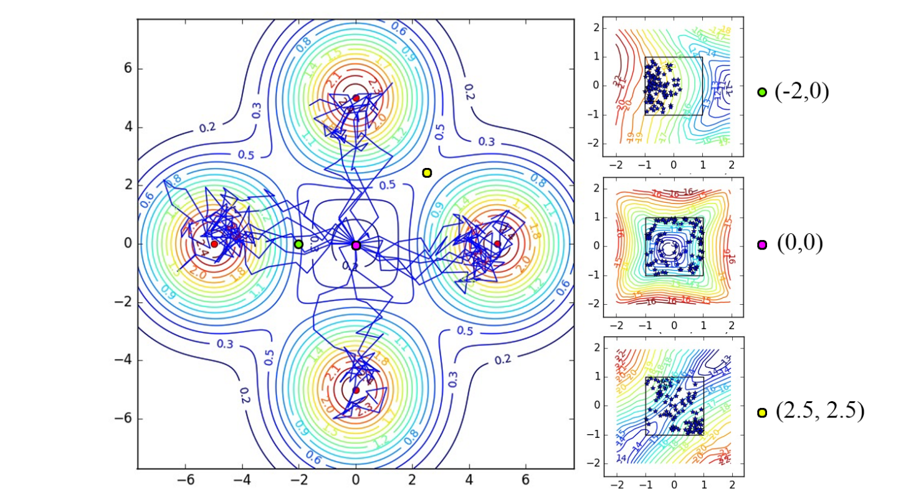

## Maximum Entropy RL

All the methods seen sofar focus on finding a policy (or value functions) that maximizes the obtained return. This corresponds to the **exploitation** part of RL: we care only about the optimal policy. The **exploration** is ensured by external mechanisms, such as $\epsilon$-greedy or softmax policies in value based methods, or adding exploratory noise to the actions as in DDPG. Exploration mechanisms typically add yet another free parameter ($\epsilon$, softmax temperature, etc) that additionally need to be scheduled (more exploration at the beginning of learning than at the end).

The idea behind **maximum entropy RL** is to let the algorithm learn by itself how much exploration it needs to learn appropriately. There are several approaches to this problem (see for example [@Machado2018] for an approach using successor representations), we focus first on methods using **entropy regularization**, a concept already seen briefly in A3C (@sec:asynchronous-advantage-actor-critic-a3c), before looking at soft methods such as Soft Q-learning and SAC.

### Entropy regularization

**Entropy regularization** [@Williams1991] adds a regularization term to the objective function:

$$
    J(\theta) =  \mathbb{E}_{s_t \sim \rho^\pi, a_t \sim \pi_\theta}[ R(s_t, a_t) + \beta \,  H(\pi_\theta(s_t))]
$${#eq:entropy_reg}

We will neglect here how the objective function is sampled (policy gradient, etc.) and focus on the second part.

The entropy of a discrete policy $\pi_\theta$ in a state $s_t$ is given by:

$$
    H(\pi_\theta(s_t)) = - \sum_a \pi_\theta(s_t, a) \, \log \pi_\theta(s_t, a)
$$

For continuous actions, one can replace the sum with an integral. The entropy of the policy measures its "randomness":

* if the policy is fully deterministic (the same action is systematically selected), the entropy is zero as it carries no information.
* if the policy is completely random (all actions are equally surprising), the entropy is maximal.

By adding the entropy as a regularization term directly to the objective function, we force the policy to be as non-deterministic as possible, i.e. to explore as much as possible, while still getting as many rewards as possible. The parameter $\beta$ controls the level of regularization: we do not want the entropy to dominate either, as a purely random policy does not bring much reward. If $\beta$ is chosen too low, the entropy won't play a significant role in the optimization and we may obtain a suboptimal deterministic policy early during training as there was not enough exploration. If $\beta$ is too high, the policy will be random and suboptimal.

Besides exploration, why would we want to learn a stochastic policy, while the solution to the Bellman equations is deterministic by definition? A first answer is that we rarely have a MDP: most interesting problems are POMDP, where the states are indirectly inferred through observations, which can be probabilistic. @Todorov2008 showed that a stochastic policy emerges as the optimal answer when we consider the connection between optimal control and probabilistic inference [see also @Toussaint2009].

Consider a two-opponents game like chess: if you have a deterministic policy, you will always play the same moves in the same configuration. In particular, you will always play the same opening moves. Your game strategy becomes predictable for your opponent, who can adapt accordingly. Having a variety of opening moves (as long as they are not too stupid) is obviously a better strategy on the long term. This is due to the fact that chess is actually a POMDP: the opponent's strategy and beliefs are not accessible.

Another way to view the interest of entropy regularization is to realize that learning a deterministic policy only leads to a single optimal solution to the problem. Learning a stochastic policy forces the agent to learn **many** optimal solutions to the same problem: the agent is somehow forced to learn as much information as possible for the experienced transitions, potentially reducing the sample complexity.

Entropy regularization is nowadays used very commonly used in deep RL networks [e.g. @ODonoghue2016], as it is "only" an additional term to set in the objective function passed to the NN, adding a single hyperparameter $\beta$.

### Soft Q-learning

Entropy regularization greedily maximizes the entropy of the policy in each state (the objective is the return plus the entropy in the current state). Building on the maximum entropy RL framework [@Ziebart2008;@Schulman2017a;@Nachum2017], @Haarnoja2017 proposed a version of **soft-Q-learning** by extending the definition of the objective:

$$
    J(\theta) =  \sum_t \mathbb{E}_{s_t \sim \rho^\pi, a_t \sim \pi_\theta}[ r(s_t, a_t) + \beta \,  H(\pi_\theta(s_t))]
$${#eq:softQ}

In this formulation based on trajectories, the agent seeks a policy that maximizes the entropy of the complete trajectories rather than the entropy of the policy in each state. This is a very important distinction: the agent does not only search a policy with a high entropy, but a policy that brings into states with a high entropy, i.e. where the agent is the most uncertain. This allows for very efficient exploration strategies, where the agent will try to reduce its uncertainty about the world and gather a lot more information than when simply searching for a good policy.

Note that it is always possible to fall back to classical Q-learning by setting $\beta=0$ and that it is possible to omit this hyperparameter by scaling the rewards with $\frac{1}{\beta}$. The discount rate $\gamma$ is omitted here for simplicity, but it should be added back when the task has an infinite horizon.

In soft Q-learning, the policy can be defined by a softmax over the soft Q-values $Q_\text{soft}(s, a)$, where $\beta$ plays the role of the temperature parameter:

$$
    \pi(s, a) \propto \exp(Q_\text{soft}(s_t, a_t) / \beta)
$$

Note that $-Q_\text{soft}(s_t, a_t) / \beta$ plays the role of the energy of the policy (as in Boltzmann machines), hence the name of the paper (*Reinforcement Learning with Deep Energy-Based Policies*). We will ignore this analogy here. The normalization term of the softmax (the log-partition function in energy-based models) is also omitted as it later disappears from the equations anyway.

The soft Q-values are defined by the following Bellman equation:

$$
    Q_\text{soft}(s_t, a_t) = r(s_t, a_t) + \gamma \, \mathbb{E}_{s_{t+1} \in \rho} [V_\text{soft}(s_{t+1})]
$${#eq:softQ_update}

This is the regular Bellman equation that can be turned into an update rule for the soft Q-values (minimizing the mse between the l.h.s and the r.h.s). The soft value of a state is given by:

$$
    V_\text{soft}(s_t) = \mathbb{E}_{a_{t} \in \pi} [Q_\text{soft}(s_{t}, a_{t}) - \log \, \pi(s_t, a_t)]
$${#eq:softV_update}

The notation in @Haarnoja2017 is much more complex than that (the paper includes the theoretical proofs), but it boils down to this in @Haarnoja2018a. When @eq:softQ_update is applied repeatedly with the definition of @eq:softV_update, it converges to the optimal solution of @eq:softQ, at least in the tabular case.

The soft V-value of a state is the expectation of the Q-values in that state (as in regular RL) minus the log probability of each action. This last term measures the entropy of the policy in each state (when expanding the expectation over the policy, we obtain $- \pi \log \pi$, which is the entropy).

In a nutshell, the soft Q-learning algorithm is:

* Sample transitions $(s, a, r, s')$ and store them in a replay memory.
* For each transition $(s, a, r, s')$ in a minibatch of the replay memory:
    * Estimate $V_\text{soft}(s')$ with @eq:softV_update by sampling several actions.
    * Update the soft Q-value of $(s,a)$ with @eq:softQ_update.
    * Update the policy (if not using the softmax over soft Q-values directly).

The main drawback of this approach is that several actions have to be sampled in the next state in order to estimate its current soft V-value, what makes it hard to implement in practice. The policy also has to be sampled from the Q-values, what is not practical for continuous action spaces.

But the real interesting thing is the policies that are learned in multi-goal settings, as in @fig:softql. The agent starts in the middle of the environment and can obtain one of the four rewards (north, south, west, east). A regular RL agent would very quickly select only one of the rewards and stick to it. With soft Q-learning, the policy stays stochastic and the four rewards can be obtained even after convergence. This indicates that the soft agent has learned much more about its environment than its hard equivalent, thanks to its maximum entropy formulation.

{#fig:softql}

### Soft Actor-Critic (SAC)

@Haarnoja2018a proposed the **Soft Actor-Critic** (SAC), an off-policy actor-critic which allows to have a stochastic actor (contrary to DDPG) while being more optimal and sample efficient than on-policy methods such as A3C or PPO. It is also less sensible to hyperparameters than all these methods.

SAC builds on soft Q-learning to achieve these improvements. It relies on three different function approximators:

* a soft state value function $V_\varphi(s)$.
* a soft Q-value function $Q_\psi(s,a)$.
* a stochastic policy $\pi_\theta(s, a)$.

The paper uses a different notation for the parameters $\theta, \varphi, \psi$, but I choose to be consistent with the rest of this document.

The soft state-value function $V_\varphi(s)$ is learned using @eq:softV_update which is turned into a loss function:

$$
    \mathcal{L}(\varphi) = \mathbb{E}_{s_t \in \mathcal{D}} [\mathbb{E}_{a_{t} \in \pi} [(Q_\psi(s_{t}, a_{t}) - \log \, \pi_\theta(s_t, a_t)] - V_\varphi(s_t) )^2]
$$

In practice, we only need the gradient of this loss function to train the corresponding neural network. The expectation over the policy inside the loss function can be replaced by a single sample action $a$ using the current policy $\pi_\theta$ (but not $a_{t+1}$ in the replay memory $\mathcal{D}$, which is only used for the states $s_t$).

$$
    \nabla_\varphi \mathcal{L}(\varphi) = \nabla_\varphi V_\varphi(s_t) \, (V_\varphi(s_t) - Q_\psi(s_{t}, a) + \log \, \pi_\theta(s_t, a) )
$$

The soft Q-values $Q_\psi(s_{t}, a_{t})$ can be trained from the replay memory $\mathcal{D}$ on $(s_t, a_t, r_{t+1} , s_{t+1})$ transitions by minimizing the mse:

$$
    \mathcal{L}(\psi) = \mathbb{E}_{s_t, a_t \in \mathcal{D}} [(r_{t+1} + \gamma \, V_\varphi(s_{t+1}) - Q_\psi(s_t, a_t))^2]
$$

Finally, the policy $\pi_\theta$ can be trained to maximize the obtained returns. There are many ways to do that, but @Haarnoja2018a proposes to minimize the Kullback-Leibler (KL) divergence (see @sec:principle-of-natural-gradients) between the current policy $\pi_\theta$ and a softmax function over the soft Q-values:

$$
    \mathcal{L}(\theta) = \mathbb{E}_{s_t \in \mathcal{D}} [D_\text{KL}(\pi_\theta(s, \cdot) | \frac{\exp Q_\psi(s_t, \cdot)}{Z(s_t)})]
$$

where $Z$ is the partition function to normalize the softmax. Fortunately, it disappears when using the reparameterization trick and taking the gradient of this loss (see the paper for details).

There are additional tricks to make it more efficient and robust, such as target networks or the use of two independent function approximators for the soft Q-values in order to reduce the bias, but the gist of the algorithm is the following:

---

* Sample a transition $(s_t, a_t, r_{t+1}, a_{t+1})$ using the current policy $\pi_\theta$ and store it in the replay memory $\mathcal{D}$.
* For each transition $(s_t, a_t, r_{t+1}, a_{t+1})$ of a minibatch of $\mathcal{D}$:
    * Sample an action $a \in \pi_\theta(s_t, \cdot)$ from the current policy.
    * Update the soft state-value function $V_\varphi(s_t)$:
    $$
        \nabla_\varphi \mathcal{L}(\varphi) = \nabla_\varphi V_\varphi(s_t) \, (V_\varphi(s_t) - Q_\psi(s_{t}, a) + \log \, \pi_\theta(s_t, a) )
    $$
    * Update the soft Q-value function $Q_\psi(s_t, a_t)$:
    $$
        \nabla_\psi \mathcal{L}(\psi) = - \nabla_\psi Q_\psi(s_t, a_t) \, (r_{t+1} + \gamma \, V_\varphi(s_{t+1}) - Q_\psi(s_t, a_t))
    $$
    * Update the policy $\pi_\theta(s_t, \cdot)$:
    $$
        \nabla_\theta \mathcal{L}(\theta) = \nabla_\theta D_\text{KL}(\pi_\theta(s, \cdot) | \frac{\exp Q_\psi(s_t, \cdot)}{Z(s_t)})
    $$

---

SAC was compared to DDPG, PPO, soft Q-learning and others on a set of gym and humanoid robotics tasks (with 21 joints!). It outperforms all these methods in both the final performance and the sample complexity, the difference being even more obvious for the complex tasks. The exploration bonus given by the maximum entropy allows the agent to discover better policies than its counterparts. SAC is an actor-critic architecture (the critic computing both V and Q) working off-policy (using an experience replay memory, so re-using past experiences) allowing to learn stochastic policies, even in high dimensional spaces.
