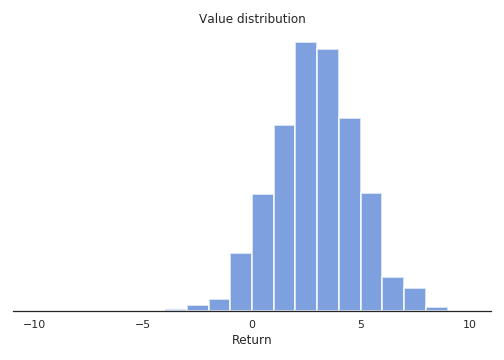
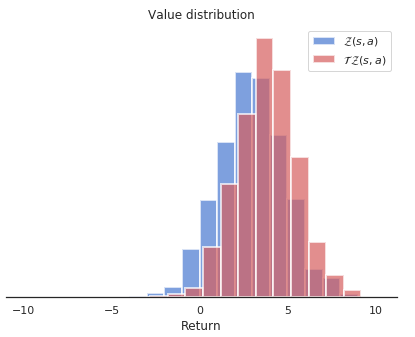
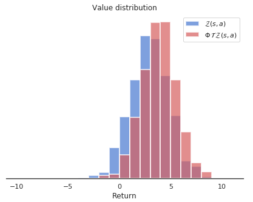

## Distributional learning

All RL methods based on the Bellman equations use the expectation operator to average returns and compute the values of states and actions:

$$
    Q^\pi(s, a) = \mathbb{E}_{s, a \in \pi}[R(s, a)]
$$

The variance of the returns is not considered in the action selection scheme, and most methods actually try to reduce this variance as it impairs the convergence of neural networks. Decision theory states that only the mean should matter on the long-term, but one can imagine tasks where the variance is an important factor for the decision. Imagine you are in a game where you have two actions available: the first one brings returns of 10 and 20, with a probability of 0.5 each (to simplify), while the second one brings returns of -10 and +40 with probability 0.5 too. Both actions have the same Q-value of 15 (a return which is actually never experienced), so one can theoretically pick whatever action, both are optimal in the Bellman's sense. However, this is only true when playing **long enough**. If, after learning, one is only allowed one try on that game, it is obviously safer (but less fun) to choose the first action, as one wins at worse 10, while it is -10 with the second action. Knowing the distribution of the returns can allow to distinguish risky choices from safe ones more easily and adapt the behavior. Another advantage would be that by learning the distribution of the returns instead of just their mean, one actually gathers more information about the environment dynamics: it can only help the convergence of the algorithm towards the optimal policy.

### Categorical DQN

@Bellemare2017 proposed to learn the **value distribution** (the probability distribution of the returns) through a modification of the Bellman equation. They show that learning the complete distribution of rewards instead of their mean leads to performance improvements on Atari games over modern variants of DQN.

Their proposed **categorical DQN** (also called C51) has an architecture based on DQN, but where the output layer predicts the distribution of the returns for each action $a$ in state $s$, instead of its mean $Q^\pi(s, a)$. In practice, each action $a$ is represented by $N$ output neurons, who encode the support of the distribution of returns. If the returns take values between $V_\text{min}$ and $V_\text{max}$, one can represent their distribution $\mathcal{Z}$ by taking $N$ discrete "bins" (called *atoms* in the paper) in that range. @fig:distributionallearning shows how the distribution of returns between -10 and 10 can be represented using 21 atoms.

{#fig:distributionallearning width=80%}

Of course, the main problem is to know in advance the range of returns $[V_\text{min}, V_\text{max}]$ (it depends largely on the choice of the discount rate $\gamma$), but you can infer it from training another algorithm such as DQN beforehand. @Dabney2017 got rid of this problem with quantile regression. In the paper, the authors found out experimentally that 51 is the most efficient number of atoms (hence the name C51).

Let's note $z_i$ these atoms with $1 \leq i < N$. The atom probability that the return associated to a state-action pair $(s, a)$ lies within the bin associated to the atom $z_i$ is noted $p_i(s, a)$. These probabilities can be predicted by a neural network, typically by using a softmax function over outputs $f_i(s, a; \theta)$:

$$
    p_i(s, a; \theta) = \frac{\exp f_i(s, a; \theta)}{\sum_{j=1}^{N} \exp f_j(s, a; \theta)}
$$

The distribution of the returns $\mathcal{Z}$ is simply a sum over the atoms (represented by the Dirac distribution $\delta_{z_i}$):

$$
    \mathcal{Z}_\theta(s, a) = \sum_{i=1}^{N} p_i(s, a; \theta) \, \delta_{z_i}
$$

If these probabilities are correctly estimated, the Q-value is easy to compute as the mean of the distribution:

$$
    Q_\theta(s, a) = \mathbb{E} \mathcal{Z}_\theta(s, a) = \sum_{i=1}^{N} p_i(s, a; \theta) \, z_i
$$

These Q-values can then be used for action selection as in the regular DQN. The problem is now to learn the value distribution $\mathcal{Z}_\theta$, i.e. to find a learning rule / loss function for the $p_i(s, a; \theta)$. Let's consider a single transition $(s, a, r, s')$ and select the greedy action $a'$ in $s'$ using the current policy $\pi_\theta$. The value distribution $\mathcal{Z}_\theta$ can be evaluated by applying recursively the Bellman operator $\mathcal{T}$:

$$
    \mathcal{T} \, \mathcal{Z}_\theta(s, a) = \mathcal{R}(s, a) + \gamma \, \mathcal{Z}_\theta(s', a')
$$

where $\mathcal{R}(s, a)$ is the distribution of immediate rewards after $(s, a)$. This use of the Bellman operator is the same as in Q-learning:

$$
    \mathcal{T} \, \mathcal{Q}_\theta(s, a) = \mathbb{E}[r(s, a)] + \gamma \, \mathcal{Q}_\theta(s', a')
$$

In Q-learning, one minimizes the difference (mse) between $\mathcal{T} \, \mathcal{Q}_\theta(s, a)$ and $\mathcal{Q}_\theta(s, a)$, which are expectations (so we only manipulate scalars). Here, we will minimize the statistical distance between the distributions $\mathcal{T} \, \mathcal{Z}_\theta(s, a)$ and $\mathcal{Z}_\theta(s, a)$ themselves, using for example the KL divergence, Wasserstein metric, total variation or whatnot.

The problem is mostly that the distributions $\mathcal{T} \, \mathcal{Z}_\theta(s, a)$ and $\mathcal{Z}_\theta(s, a)$ do not have the same support: for a particular atom $z_i$, $\mathcal{T} \, \mathcal{Z}_\theta(s, a)$ can have a non-zero probability $p_i(s, a)$, while $\mathcal{Z}_\theta(s, a)$ has a zero probability. Besides, the probabilities must sum to 1, so one cannot update the $z_i$ independently from one another.

The proposed method consists of three steps:

1. Computation of the Bellman update $\mathcal{T} \, \mathcal{Z}_\theta(s, a)$. They simply compute translated values for each $z_i$ according to:

$$
    \mathcal{T} \, z_i = r + \gamma \, z_i
$$

and clip the obtained value to $[V_\text{min}, V_\text{max}]$. The reward $r$ translates the distribution of atoms, while the discount rate $\gamma$ scales it. @fig:distributionallearning2 shows the distribution of $\mathcal{T} \, \mathcal{Z}_\theta(s, a)$ compared to $\mathcal{Z}_\theta(s, a)$. Note that the atoms of the two distributions are not aligned.

{#fig:distributionallearning2 width=80%}

2. Distribution of the probabilities of $\mathcal{T} \, \mathcal{Z}_\theta(s, a)$ on the support of $\mathcal{Z}_\theta(s, a)$. The projected atom $\mathcal{T} \, z_i$ lie between two "real" atoms $z_l$ and $z_u$, with a non-integer index $b$ (for example $b = 3.4$, $l = 3$ and $u=4$). The corresponding probability $p_{b}(s', a'; \theta)$ of the next greedy action $(s', a')$ is "spread" to its neighbors through a local interpolation depending on the distances between $b$, $l$ and $u$:

$$
    \Delta p_{l}(s', a'; \theta) = p_{b}(s', a'; \theta) \, (b - u)
$$
$$
    \Delta p_{u}(s', a'; \theta) = p_{b}(s', a'; \theta) \, (l - b)
$$

@fig:distributionallearning3 shows how the projected update distribution $\Phi \, \mathcal{T} \, \mathcal{Z}_\theta(s, a)$ now matches the support of $\mathcal{Z}_\theta(s, a)$

{#fig:distributionallearning3 width=80%}

The projection of the Bellman update onto an atom $z_i$ can be summarized by the following equation:

$$
    (\Phi \, \mathcal{T} \, \mathcal{Z}_\theta(s, a))_i = \sum_{j=1}^N \big [1 - \frac{| [\mathcal{T}\, z_j]_{V_\text{min}}^{V_\text{max}} - z_i|}{\Delta z} \big ]_0^1 \, p_j (s', a'; \theta)
$$

where $[\cdot]_a^b$ bounds its argument in $[a, b]$ and $\Delta z$ is the step size between two atoms.

3. Minimizing the statistical distance between $\Phi \, \mathcal{T} \, \mathcal{Z}_\theta(s, a)$ and $\mathcal{Z}_\theta(s, a)$. Now that the Bellman update has the same support as the value distribution, we can minimize the KL divergence between the two for a single transition:

$$
    \mathcal{L}(\theta) = D_\text{KL} (\Phi \, \mathcal{T} \, \mathcal{Z}_{\theta'}(s, a) | \mathcal{Z}_\theta(s, a))
$$

using a target network $\theta'$ for the target. It is to be noted that minimizing the KL divergence is the same as minimizing the cross-entropy between the two, as in classification tasks:

$$
    \mathcal{L}(\theta) =  - \sum_i (\Phi \, \mathcal{T} \, \mathcal{Z}_{\theta'}(s, a))_i \log p_i (s, a; \theta)
$$

The projected Bellman update plays the role of the one-hot encoded target vector in classification (except that it is not one-hot encoded). DQN performs a regression on the Q-values (mse loss), while categorical DQN performs a classification (cross-entropy loss). Apart from the way the target is computed, categorical DQN is very similar to DQN: architecture, experience replay memory, target networks, etc.

@fig:categoricaldqn illustrates how the predicted value distribution changes when playing Space invaders, also have a look at the Youtube video. C51 outperforms DQN on most Atari games, both in terms of the achieved performance and the sample complexity.

{#fig:categoricaldqn width=100%}

<iframe width="989" height="371" src="https://www.youtube.com/embed/yFBwyPuO2Vg" frameborder="0" allow="accelerometer; autoplay; encrypted-media; gyroscope; picture-in-picture" allowfullscreen></iframe>

**Additional resources:**

* <https://deepmind.com/blog/going-beyond-average-reinforcement-learning>
* <https://physai.sciencesconf.org/data/pages/distributional_RL_Remi_Munos.pdf>
* <https://flyyufelix.github.io/2017/10/24/distributional-bellman.html>, with keras code for C51.

### The Reactor

The **Reactor** (Retrace Actor) of @Gruslys2017 combines many architectural and algorithmic contributions seen until now in order to provide an algorithm that is both sample efficient and with a good run-time performance. A3C has for example a better run-time performance (smaller wall-clock time for the training) than DQN or categorical DQN thanks to the use of multiple actor-learners in parallel, but its sample complexity is actually higher (as it is on-policy).

The Reactor combines and improves on:

* An actor-critic architecture using policy gradient with importance sampling (@sec:importance-sampling),
* Off-policy corrected returns computed by the Retrace algorithm (@sec:retrace),
* Distributional learning of the Q-values in the critic (@sec:categorical-dqn),
* Prioritized experience replay for sequences (@sec:prioritized-experience-replay).

One could consider REACTOR as the distributional version of ACER (@sec:actor-critic-with-experience-replay-acer, @Wang2017). We will not go into all the details here, but simply outline the main novelties.

The Reactor is composed of an actor $\pi_\theta(s, a)$ and a critic $Q_\varphi(s, a)$. The actor is trained using policy gradient with importance sampling, as in Off-PAC (@sec:linear-off-policy-actor-critic-off-pac). For a single state $s$ and an action $\hat{a}$ sampled by the behavior policy $b$, the gradient of the objective is defined as:

$$
\begin{aligned}
    \nabla_\theta J(\theta) = \frac{\pi_\theta(s, \hat{a})}{b(s, \hat{a})} & \, (R(s, \hat{a}) - Q_\varphi(s, \hat{a})) \, \nabla_\theta \log \pi_\theta(s, \hat{a}) \\
    & + \sum_a Q_\varphi(s, a) \, \nabla_\theta \pi_\theta(s, a) \\
\end{aligned}
$$

The first term comes from Off-PAC and only concerns the chosen action $\hat{a}$ from the behavior policy. The actual return $R(s, a)$ is compared to its estimate $Q_\varphi(s, \hat{a})$ in order to reduce its variance. The second term $\sum_a Q_\varphi(s, a) \, \nabla_\theta \pi_\theta(s, a)$ depends on all available actions in $s$. Its role is to reduce the bias of the first term, without adding any variance as it is only based on estimates. As the value of the state is defined by $V^\pi(s) = \sum_a \pi(s, a) \, Q^\pi(s, a)$, maximizing this term maximizes the value of the state, i.e. the associated returns. This rule is called **leave-one-out** (LOO), as one action is left out from the sum and estimated from actual returns instead of other estimates.

For a better control on the variance, the behavior probability $b(s, a)$ is replaced by a parameter $\beta$:

$$
    \nabla_\theta J(\theta) = \beta \, (R(s, \hat{a}) - Q_\varphi(s, \hat{a})) \, \nabla_\theta \pi_\theta(s, \hat{a}) + \sum_a Q_\varphi(s, a) \, \nabla_\theta \pi_\theta(s, a)
$$

$\beta$ is defined as $\min (c, \frac{1}{b(s, \hat{a})})$, where $c>1$ is a constant. This truncated term is similar to what was used in ACER. The rule is now called **$\beta$-LOO** and is a novel proposition of the Reactor.

The second importance contribution of the Reactor is how to combine the Retrace algorithm (@sec:retrace, @Munos2016) for estimating the return $R(s, \hat{a})$ on multiple steps, with the distributional learning method of Categorical DQN. As Retrace uses n-steps returns iteratively, the n-step distributional Bellman target can updated using the $n$ future rewards:

$$
    z_i^n = \mathcal{T}^n \, z_i = \sum_{k=t}^{t+n} \gamma^{k-t} r_k + \gamma^n \, z_i
$$

We leave out the details on how Retrace is combined with these distributional Bellman updates: the notation is complicated but the idea is simple. The last importance contribution of the paper is the use of **prioritized sequence replay**. Prioritized experience replay allows to select in priority transitions from the replay buffer which are the most surprising, i.e. where the TD error is the highest. These transitions are the ones carrying the most information. A similar principle can be applied to sequences of transitions, which are needed by the n-step updates. They devised a specific sampling algorithm in order to achieve this and reduce the variance of the samples.

The last particularities of the Reactor is that it uses a LSTM layer to make the problem Markovian (instead of stacking four frames as in DQN) and train multiple actor-learners as in A3C. The algorithm is trained on CPU, with 10 or 20 actor-learners. The Reactor outperforms DQN and its variants, A3C and ACER on Atari games. Importantly, Reactor only needs one day of training on CPU, compared to the 8 days of GPU training needed by DQN.  
