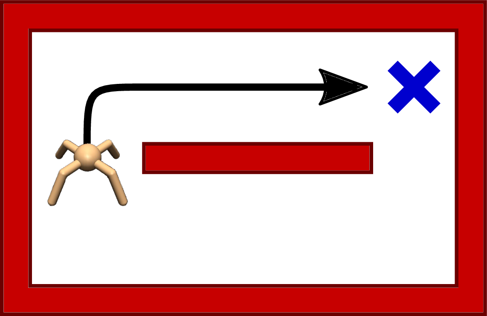
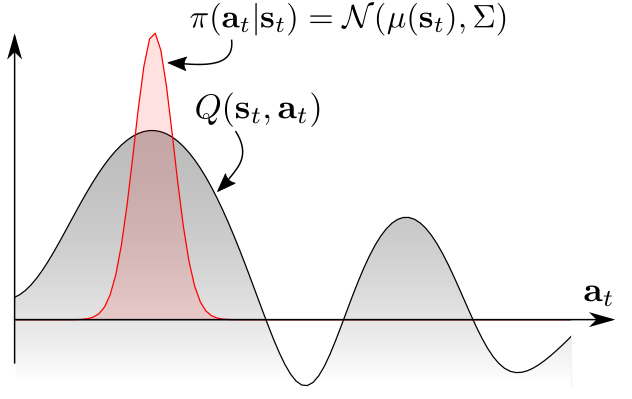
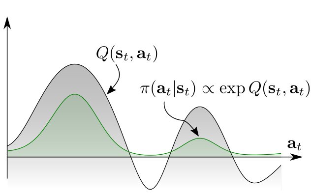
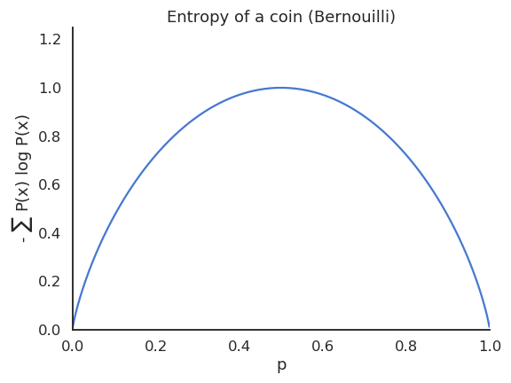
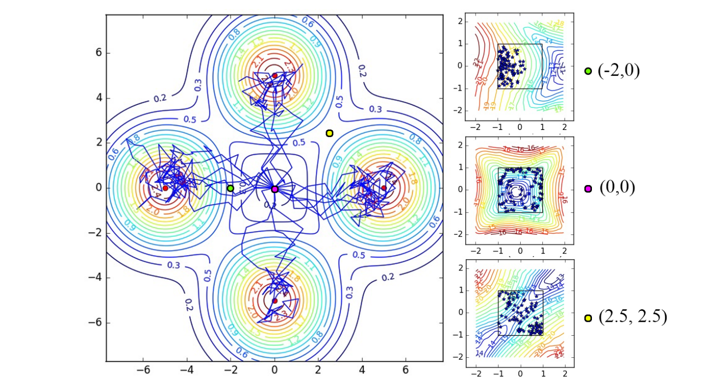
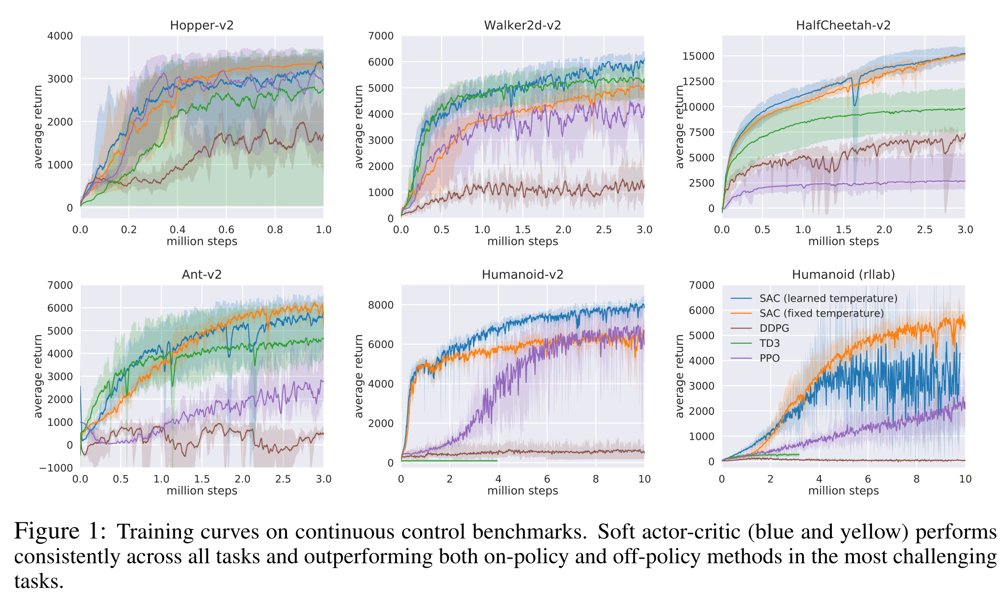
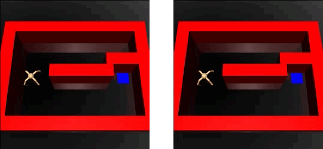
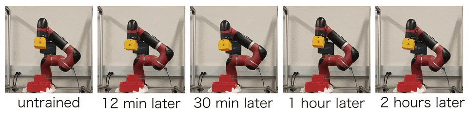
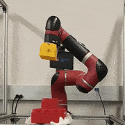

# Maximum Entropy RL (SAC) {#sec-maxentrl}

All the methods seen so far focus on finding a policy (or value functions) that maximizes the obtained return. This corresponds to the **exploitation** part of RL: we care only about the optimal policy, which is deterministic and greedy by definition:

$$\pi^*(s) = \text{argmax}_a \, Q^*(s, a)$$

**Exploration** is ensured by external mechanisms: $\epsilon$-greedy or softmax policies over the Q-values in value-based methods, additive exploratory noise in DDPG, or stochastic policies that progressively become deterministic in A3C and PPO. Each of these mechanisms adds yet another free parameter ($\epsilon$, the softmax temperature, the noise variance) which additionally needs to be scheduled: more exploration at the beginning of learning than at the end.

The idea behind **maximum entropy RL** is to let the algorithm learn by itself how much exploration it needs, by making exploration part of the objective function instead of an external add-on. There are several approaches to this problem (see for example @Machado2018 for an approach using successor representations); we focus first on **entropy regularization**, a concept already seen briefly in A3C, before looking at soft methods such as soft Q-learning and SAC.

## Why learn a stochastic policy?

The solution to the Bellman equations is deterministic by definition, so why would we want to learn a stochastic policy in the first place?

A first answer is that we rarely have a MDP: most interesting problems are POMDPs, where the states are indirectly inferred through observations. @Todorov2008 showed that a stochastic policy emerges as the optimal answer when one considers the connection between optimal control and probabilistic inference [see also @Toussaint2009].

Consider a two-opponents game like chess: if you have a deterministic policy, you will always play the same moves in the same configuration. In particular, you will always play the same opening moves. Your strategy becomes predictable for your opponent, who can adapt accordingly. Having a variety of opening moves (as long as they are not too stupid) is obviously a better strategy on the long term. This is due to the fact that chess is actually a POMDP: the opponent's strategy and beliefs are not accessible.

A second answer is that there is often **more than one way** to collect rewards, especially when they are sparse. If exploration decreases too soon, the agent will "overfit" one of the paths leading to the reward. If that path is suddenly blocked, the agent has to re-learn its policy from scratch. It would be much more efficient if the agent had learned *all* the possible paths, even if some of them are slightly less optimal.

{#fig-softpaths width=50%}

In other words, learning a deterministic policy only provides a single solution to the problem, while learning a stochastic policy forces the agent to learn **many** optimal solutions to the same problem. The agent is somehow forced to extract as much information as possible from the experienced transitions, potentially reducing the sample complexity.

This requires however a policy that is **multimodal**, i.e. that can assign a high probability to several distinct regions of the action space. Softmax policies over discrete actions can do that:

$$
    \pi(s, a) = \frac{\exp Q(s, a) / \tau}{ \sum_b \exp Q(s, b) / \tau}
$$

but the continuous Gaussian policies of @sec-continuousspaces cannot: they sample actions around the single mean $\mu_\theta(s)$, and the variance $\sigma_\theta(s)$ decreases towards 0 during learning. A Gaussian policy is **unimodal** by construction, so it has to commit to one of the two paths above.

::: {.columns}
::: {.column width=50%}
{#fig-unimodal}
:::
::: {.column width=50%}
{#fig-multimodal}
:::
:::

What we would need is a softmax (Gibbs / Boltzmann) distribution over the **continuous** action space, but its normalization term would require integrating over the whole action space: intractable. Maximum entropy RL provides a way around this.

## Entropy regularization

**Entropy regularization** [@Williams1991] adds a regularization term to the objective function:

$$
    \mathcal{J}(\theta) =  \mathbb{E}_{s_t \sim \rho_\theta, a_t \sim \pi_\theta}[ R(s_t, a_t) + \alpha \,  H(\pi_\theta(s_t))]
$$

We will neglect here how the objective function is sampled (policy gradient, etc.) and focus on the second part. The parameter $\alpha$ is called the **temperature** of the regularization; it is the same mechanism as the $\beta$ parameter used for the entropy bonus of A3C, but $\alpha$ is the notation used in the maximum entropy RL literature and we stick to it in this section.

The entropy of a discrete policy $\pi_\theta$ in a state $s_t$ is defined by the expected value of the **self-information** of each action:

$$
    H(\pi_\theta(s_t)) = \mathbb{E}_{a \sim \pi_\theta(s_t, a)} [- \log \pi_\theta(s_t, a)] = - \sum_a \pi_\theta(s_t, a) \, \log \pi_\theta(s_t, a)
$$

and by the corresponding integral for a continuous action space:

$$
    H(\pi_\theta(s_t)) = - \int_a \pi_\theta(s_t, a) \, \log \pi_\theta(s_t, a) \, da
$$

{#fig-selfinformation}

The entropy of the policy measures its "randomness":

* if the policy is fully deterministic (the same action is systematically selected), the entropy is zero as it carries no information: pure **exploitation**.
* if the policy is completely random (all actions are equally surprising), the entropy is maximal: pure **exploration**.

{#fig-entropybinomial width=50%}

:::{.callout-note icon="false"}

Computing the entropy of a continuous policy distribution is complex in the general case, but using a Gaussian policy (see @sec-continuousspaces) allows to compute it easily. If the policy is a normal distribution $\pi_\theta(s, a) = \mathcal{N}(\mu_\theta(s), \sigma^2_\theta(s))$ parameterized by the mean vector $\mu_\theta(s)$ and the variance vector $\sigma_\theta(s)$ of size $n$, the pdf is given by:

$$
    \pi_\theta(s, a) = \frac{1}{\sqrt{2\pi\sigma^2_\theta(s)}} \, \exp -\frac{(a - \mu_\theta(s))^2}{2\sigma_\theta(s)^2}
$$

The **differential entropy** of the Gaussian policy only depends on the variance of the distribution:

$$
    H(\pi_\theta(s_t)) = \mathbb{E}_{a \sim \pi_\theta(s_t, a)} [- \log \pi_\theta(s_t, a)] = \dfrac{n}{2} \, (1 + \ln 2\pi) + \dfrac{1}{2} \ln |\sigma_\theta(s)|
$$

:::

By adding the entropy as a regularization term directly to the objective function, we force the policy to be as non-deterministic as possible, i.e. to explore as much as possible, while still getting as many rewards as possible. The temperature $\alpha$ controls the level of regularization: we do not want the entropy to dominate either, as a purely random policy does not bring much reward. If $\alpha$ is chosen too low, the entropy will not play a significant role in the optimization and we may obtain a suboptimal deterministic policy early during training, as there was not enough exploration. If $\alpha$ is too high, the policy will be random and suboptimal. Note that it is always possible to fall back to "hard" RL by setting $\alpha = 0$.

Entropy regularization is nowadays used very commonly in deep RL networks [e.g. @ODonoghue2016], as it is "only" an additional term in the objective function passed to the NN, adding a single hyperparameter $\alpha$.

## Soft Q-learning

Entropy regularization greedily maximizes the entropy of the policy in each state: the objective is the return plus the entropy in the *current* state. Building on the maximum entropy RL framework [@Ziebart2008;@Schulman2017a;@Nachum2017], @Haarnoja2017 proposed a version of **soft Q-learning** by extending the definition of the objective over complete trajectories:

$$
    \mathcal{J}(\theta) =  \sum_t \gamma^t \, \mathbb{E}_{s_t \sim \rho_\theta, a_t \sim \pi_\theta}[ r(s_t, a_t, s_{t+1}) + \alpha \,  H(\pi_\theta(s_t))]
$$

In this formulation, the agent seeks a policy that maximizes the entropy of the complete trajectories rather than the entropy of the policy in each state. This is a very important distinction: the agent does not only search for a policy with a high entropy, but for a policy that **brings it into states with a high entropy**, i.e. where the agent is the most uncertain. This allows for very efficient exploration strategies, where the agent tries to reduce its uncertainty about the world and gathers a lot more information than when simply searching for a good policy.

The agent can then decide by itself how the exploration-exploitation trade-off is solved in each state: if a single action leads to high rewards, the policy may become deterministic there; if several actions lead to equivalent rewards, the policy stays stochastic.

In soft Q-learning, the policy is defined by a softmax over the **soft Q-values** $Q^\text{soft}_\theta(s, a)$, where $\alpha$ plays the role of the temperature parameter:

$$
    \pi_\theta(s, a) = \dfrac{\exp  \dfrac{Q^\text{soft}_\theta (s, a)}{\alpha}}{\sum_b \exp \dfrac{Q^\text{soft}_\theta (s, b)}{\alpha}} \propto \exp \dfrac{Q^\text{soft}_\theta (s, a)}{\alpha}
$$

Note that $-Q^\text{soft}_\theta(s, a) / \alpha$ plays the role of the energy of the policy (as in Boltzmann machines), hence the name of the paper (*Reinforcement Learning with Deep Energy-Based Policies*). We will ignore this analogy here. The normalization term of the softmax (the log-partition function in energy-based models) is intractable for continuous action spaces, as one would need to integrate over the whole action space, but it will disappear from the equations anyway.

**Soft values** are the equivalent of the "hard" value functions for this new objective. The soft value of an action depends on the immediate reward and the soft value of the next state, giving a soft Bellman equation:

$$
    Q^\text{soft}_\theta(s_t, a_t) = \mathbb{E}_{s_{t+1} \sim \rho_\theta} [r(s_t, a_t, s_{t+1}) + \gamma \, V^\text{soft}_\theta(s_{t+1})]
$$

while the soft value of a state is the expected soft Q-value over the available actions, **plus the entropy of the policy** in that state:

$$
    V^\text{soft}_\theta(s_t) = \mathbb{E}_{a_{t} \sim \pi_\theta} [Q^\text{soft}_\theta(s_{t}, a_{t})] + H(\pi_\theta(s_t)) = \mathbb{E}_{a_{t} \sim \pi_\theta} [Q^\text{soft}_\theta(s_{t}, a_{t}) -  \alpha \, \log \, \pi_\theta(s_t, a_t)]
$$

The second form comes from expanding the expectation over the policy: $- \pi \log \pi$ *is* the entropy. @Haarnoja2017 showed that these soft value functions are the solution of the entropy-regularized objective, and that applying the soft Bellman equation repeatedly converges to the optimal solution, at least in the tabular case.

In a nutshell, the soft Q-learning algorithm is:

:::{.callout-note icon="false"}
## Soft Q-learning
* Sample transitions $(s, a, r, s')$ and store them in a replay memory.

* For each transition $(s, a, r, s')$ in a minibatch of the replay memory:

    * Estimate $V^\text{soft}_\theta(s')$ by sampling several actions:
    $$
        V^\text{soft}_\theta(s_t) = \mathbb{E}_{a_{t} \sim \pi_\theta} [Q^\text{soft}_\theta(s_{t}, a_{t}) -  \alpha \, \log \, \pi_\theta(s_t, a_t)]
    $$

    * Update the soft Q-value of $(s,a)$:
    $$
        Q^\text{soft}_\theta(s_t, a_t) = \mathbb{E}_{s_{t+1} \sim \rho_\theta} [r(s_t, a_t, s_{t+1}) + \gamma \, V^\text{soft}_\theta(s_{t+1})]
    $$

    * Update the policy (if not using the softmax over soft Q-values directly).
:::

The main drawback of this approach is that several actions have to be sampled in the next state in order to estimate its soft V-value, which makes it hard to implement in practice (@Haarnoja2017 uses variational inference to do it). Sampling the policy from the Q-values is also impractical for continuous action spaces.

But the really interesting thing is the policies that are learned in multi-goal settings, as in @fig-softql. The agent starts in the middle of the environment and can obtain one of the four rewards (north, south, west, east). A regular RL agent would very quickly select only one of the rewards and stick to it. With soft Q-learning, the policy stays stochastic and the four rewards can be obtained even after convergence. This indicates that the soft agent has learned much more about its environment than its hard equivalent, thanks to its maximum entropy formulation.

{#fig-softql}

## Soft Actor-Critic (SAC)

**Soft Actor-Critic** [SAC, @Haarnoja2018b;@Haarnoja2018a] makes the maximum entropy framework practical. It is an **off-policy actor-critic** architecture which, contrary to DDPG and TD3, learns a **stochastic** policy, while being more sample efficient than on-policy methods such as A3C or PPO and much less sensitive to hyperparameters than all of them.

### The critic

The trick is to avoid estimating the soft V-values by sampling, by injecting the definition of $V^\text{soft}_\theta$ into the soft Bellman equation:

$$
    Q^\text{soft}_\theta(s_t, a_t) = \mathbb{E}_{s_{t+1} \sim \rho_\theta} [r(s_t, a_t, s_{t+1}) + \gamma \, \mathbb{E}_{a_{t+1} \sim \pi_\theta} [Q^\text{soft}_\theta(s_{t+1}, a_{t+1}) -  \alpha \, \log \, \pi_\theta(s_{t+1}, a_{t+1})]]
$$

This now only depends on soft Q-values. If we want to train a **critic** $Q_\varphi(s, a)$ to estimate the true soft Q-value $Q^\text{soft}_\theta(s, a)$, we just need to sample $(s_t, a_t, r_{t+1}, s_{t+1})$ transitions and minimize:

$$
    \mathcal{L}(\varphi) = \mathbb{E}_{s_t, a_t, s_{t+1} \sim \mathcal{D}} [(r_{t+1} + \gamma \, (Q_\varphi(s_{t+1}, a_{t+1}) - \alpha \, \log \pi_\theta(s_{t+1}, a_{t+1})) - Q_\varphi(s_{t}, a_{t}) )^2]
$$

The only difference with a SARSA critic is that the negative log-likelihood of the next action is added to the target. Crucially, $s_t$, $a_t$ and $r_{t+1}$ can come from a replay buffer $\mathcal{D}$, while $a_{t+1}$ only has to be **sampled** from the current policy $\pi_\theta$ — it does not have to be taken. This is what makes SAC an **off-policy** algorithm with a **stochastic** policy, a combination that neither A3C/PPO (on-policy, stochastic) nor DDPG/TD3 (off-policy, deterministic) achieve.

### The actor

But how do we train the actor? The optimal policy is a softmax over the soft Q-values, but its log-partition function $Z(s)$ is intractable for continuous action spaces:

$$
    \pi_\theta(s, a) = \dfrac{\exp  \dfrac{Q_\varphi (s, a)}{\alpha}}{\sum_b \exp \dfrac{Q_\varphi (s, b)}{\alpha}} = \dfrac{1}{Z(s)} \, \exp \dfrac{Q_\varphi (s, a)}{\alpha}
$$

The trick is to make a **parameterized actor** $\pi_\theta$ (a Gaussian policy, using the reparameterization trick of @sec-continuousspaces) learn to be as close as possible to this softmax, by minimizing the Kullback-Leibler divergence between the two:

$$
    \mathcal{L}(\theta) = \mathbb{E}_{s \sim \mathcal{D}} [D_\text{KL} (\pi_\theta(s, \cdot) \, || \, \dfrac{1}{Z(s)} \, \exp \dfrac{Q_\varphi (s, \cdot)}{\alpha})]
$$

As $Z(s)$ does not depend on $\theta$, it disappears when taking the gradient, leaving a remarkably simple update:

$$
   \nabla_\theta \, \mathcal{L}(\theta) = \mathbb{E}_{s \sim \mathcal{D}, a \sim \pi_\theta} [\alpha \, \nabla_\theta \log \pi_\theta(s, a) - \nabla_\theta Q_\varphi (s, a)]
$$

The actor therefore only has to implement a Gaussian policy, and we can train it using the soft Q-values of the critic.

### Practical improvements

Two additional mechanisms, introduced in @Haarnoja2018a, make SAC robust in practice:

* **Clipped double learning.** As in TD3 (@sec-doubleqlearning), SAC uses two critics $Q_{\varphi_1}$ and $Q_{\varphi_2}$ trained on the same target, and takes the *lesser of two evils* (the minimum) when computing the target, in order to reduce the overestimation of Q-values:

$$
    y = r_{t+1} + \gamma \, (\min_{i=1,2} Q_{\varphi'_i}(s_{t+1}, a_{t+1}) - \alpha \, \log \pi_\theta(s_{t+1}, a_{t+1}))
$$

* **Automatic temperature tuning.** The temperature $\alpha$ is the main remaining hyperparameter, and the right value depends on the task, on the reward scale, and even on the stage of training. Instead of fixing it, SAC solves a constrained problem where the expected entropy of the policy must stay above a target value $\bar{H}$ (typically $-\dim(\mathcal{A})$). The corresponding Lagrange multiplier is $\alpha$ itself, and it can be learned by gradient descent on:

$$
    \mathcal{L}(\alpha) = \mathbb{E}_{s \sim \mathcal{D}, a \sim \pi_\theta} [- \alpha \, (\log \pi_\theta(s, a) + \bar{H})]
$$

so the exploration level becomes fully automatic: $\alpha$ increases when the policy becomes too deterministic and decreases when it is too random.

:::{.callout-note icon="false"}
## SAC algorithm

* Initialize the actor $\pi_\theta$, the critics $Q_{\varphi_1}, Q_{\varphi_2}$ and their target networks $Q_{\varphi'_1}, Q_{\varphi'_2}$, the temperature $\alpha$ and the replay buffer $\mathcal{D}$.

* for $t \in [0, T_\text{max}]$:

    * Select an action $a_t \sim \pi_\theta(s_t, \cdot)$, observe $r_{t+1}$ and $s_{t+1}$, and store $(s_t, a_t, r_{t+1}, s_{t+1})$ in $\mathcal{D}$.

    * For each transition $(s_k, a_k, r_k, s'_k)$ of a minibatch sampled from $\mathcal{D}$:

        * Sample the next action from the **current** policy: $a'_k \sim \pi_\theta(s'_k, \cdot)$.

        * Compute the target using the target critics:

        $$
            y_k = r_k + \gamma \, (\min_{i=1,2} Q_{\varphi'_i}(s'_k, a'_k) - \alpha \, \log \pi_\theta(s'_k, a'_k))
        $$

    * Update both critics by minimizing:

    $$
        \mathcal{L}(\varphi_i) = \frac{1}{K} \sum_k (y_k - Q_{\varphi_i}(s_k, a_k))^2 \qquad i = 1, 2
    $$

    * Sample $a_k \sim \pi_\theta(s_k, \cdot)$ and update the actor:

    $$
        \nabla_\theta \mathcal{L}(\theta) = \frac{1}{K} \sum_k (\alpha \, \nabla_\theta \log \pi_\theta(s_k, a_k) - \nabla_\theta \min_{i=1,2} Q_{\varphi_i} (s_k, a_k))
    $$

    * Update the temperature:

    $$
        \nabla_\alpha \mathcal{L}(\alpha) = - \frac{1}{K} \sum_k (\log \pi_\theta(s_k, a_k) + \bar{H})
    $$

    * Update the target critics:

    $$
        \varphi'_i \leftarrow \tau \, \varphi_i + (1-\tau) \, \varphi'_i \qquad i = 1, 2
    $$
:::

:::{.callout-tip icon="false" title="A note on the original formulation"}
The first version of SAC [@Haarnoja2018b] additionally learned a separate soft state-value function $V_\psi(s)$, giving three function approximators (a policy, a soft Q-value and a soft V-value), and used a fixed temperature. The follow-up paper [@Haarnoja2018a] showed that the V-critic is not needed — it can be recovered from the Q-critic and the policy, as done above — and added clipped double learning and the automatic temperature tuning. Modern implementations all follow the second formulation, which is the one presented here. You will still find the three-network version in many tutorials.
:::

### SAC vs. TD3

SAC and TD3 (@sec-ddpg) were published around the same time and share several mechanisms, but differ in important ways:

* Both use **clipped double learning** to fight the overestimation of Q-values.
* TD3 learns a **deterministic** policy and needs additive exploratory noise, as well as noisy Bellman targets to avoid overfitting particular actions. SAC learns a **stochastic** policy, so the targets are already stochastic: no target noise is needed.
* In SAC the next action $a_{t+1}$ comes from the current policy, so there is no need for a target actor network (only target critics).
* TD3 delays the actor updates to let the critics catch up; SAC does not need to.

See <https://spinningup.openai.com/en/latest/algorithms/sac.html> for a detailed comparison.

### Results

SAC was compared to DDPG, PPO, TD3, soft Q-learning and others on a set of gym and humanoid robotics tasks (with 21 joints!). It outperforms these methods in both the final performance and the sample complexity, the difference being even more obvious for the complex tasks. The exploration bonus given by the maximum entropy allows the agent to discover better policies than its counterparts.

{#fig-sacresults}

The enhanced exploration strategy does not only improve the returns: it produces robust and varied strategies that can cope with changes in the environment. Although trained on a flat surface, the learned stochastic policies generalize to complex terrains.

{#fig-sacant width=60%}

Its low sample complexity makes SAC usable to train a real-world robot in less than two hours:



When trained to stack Lego bricks, the robotic arm explores the whole state-action space instead of committing to a single trajectory, which makes it much more robust to external perturbations after training:

::: {.columns}
::: {.column width=50%}
{#fig-saclego1}
:::
::: {.column width=50%}
{#fig-saclego2}
:::
:::

In summary, SAC is an actor-critic architecture working **off-policy** (using an experience replay memory, so re-using past experiences) while learning **stochastic** policies, even in high-dimensional continuous action spaces. Together with TD3, it is nowadays the go-to method for continuous control: TD3 is less computationally expensive, SAC is more sample efficient and less brittle.

:::{.callout-tip icon="false" title="Additional resources"}
* <https://spinningup.openai.com/en/latest/algorithms/sac.html>
* <https://bair.berkeley.edu/blog/2017/10/06/soft-q-learning>
* <https://ai.googleblog.com/2019/01/soft-actor-critic-deep-reinforcement.html>
* @Levine2018 provides the general connection between RL and probabilistic inference: <https://arxiv.org/abs/1805.00909>
:::
