# World models, Dreamer {#sec-worldmodels}

## World models

The core idea of **world models** [@Ha2018] is to explicitly separate the **world model** (what will happen next) from the **controller** (how to act).
The neural networks used in deep RL are usually small, as rewards do not contain enough information to train huge networks. However, unsupervised data (without any label nor reward) is plenty and could be leveraged to learn useful representations.
A huge **world model** can be efficiently trained by self-supervised / unsupervised methods, while a small **controller** should not need too many trials if its input representations are good.

@Ha2018 used the Vizdoom Take Cover environment (<http://vizdoom.cs.put.edu.pl/>) to demonstrate the power of world models, as well as a car racing environment.

:::{.callout-tip icon="false"}
For a detailed explanation of world models, refer to:

<https://worldmodels.github.io/>

The videos embedded here come from this page.
:::

### Architecture

The architecture of World Models is composed of three modules trained in succession:

1. The Vision module $V$,
2. The Memory module $M$,
3. The Controller module $C$.

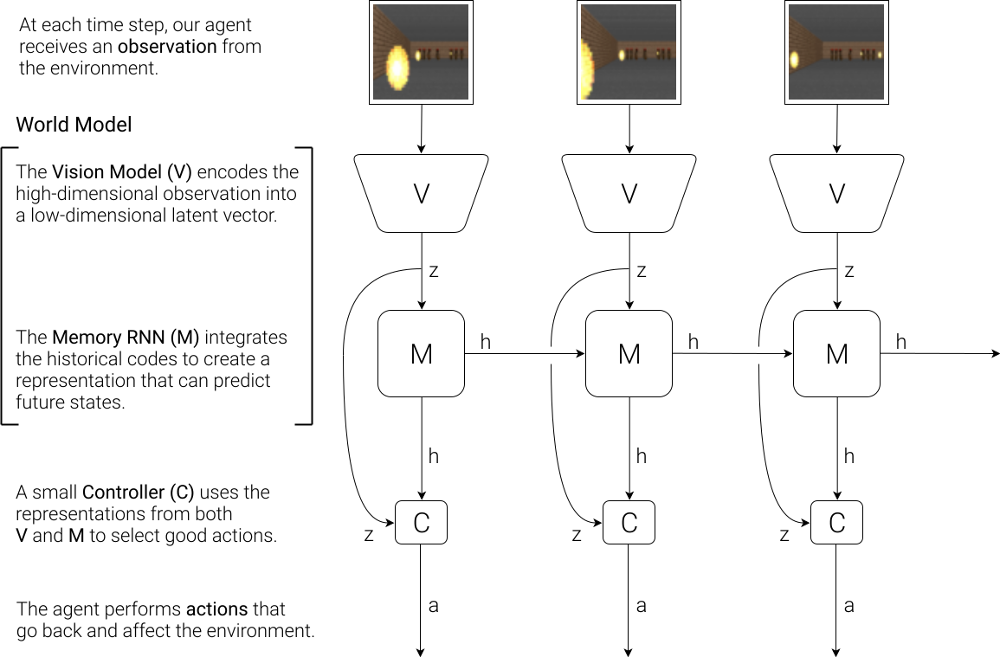{#fig-wmarchitecture}

**Vision module**

The vision module $V$ is the encoder of a **variational autoencoder** (VAE), trained on single frames of the game (obtained using a random policy).
The resulting latent vector $\mathbf{z}_t$ contains a compressed representation of the frame $\mathbf{o}_t$.

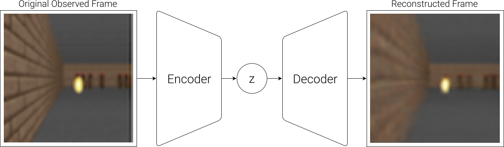{#fig-wmvision}

**Memory module**

The sequence of latent representations $\mathbf{z}_0, \ldots \mathbf{z}_t$ in a game is fed to a LSTM layer (RNN) together with the actions $a_t$ to compress what happens over time.

A **Mixture Density Network** (MDN, @Bishop1994) is used to predict the **distribution** of the next latent representations $P(\mathbf{z}_{t+1} | a_t, \mathbf{h}_t, \ldots \mathbf{z}_t)$. In short, MDN allows to perform probabilistic regression, but predicting both the mean and the variance of the data, instead of just its mean as in vanilla least squares regression. Most MDN methods use a mixture of Gaussian distributions to model the target distribution. 

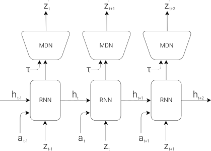{#fig-wmmemory}

:::{.callout-tip icon="false"}
## RNN-MDN

The RNN-MDN architecture has been used successfully in the past for sequence generation problems such as generating handwriting and sketches (Sketch-RNN, @Ha2017).

Check a demo here: <https://magenta.tensorflow.org/sketch-rnn-demo>


:::

**Controller module**

The last step is the **controller**. It takes a latent representation $\mathbf{z}_t$ and the current hidden state of the LSTM $\mathbf{h}_t$ as inputs and selects an action **linearly**:

$$a_t = \text{tanh}(W \, [\mathbf{z}_t, \mathbf{h}_t ] + b)$$

A RL actor cannot get simpler as that...

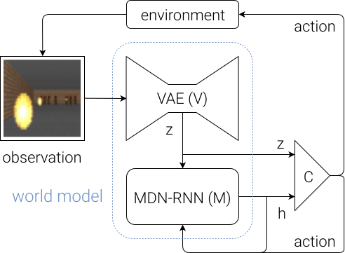{#fig-wmcontroller}

The controller is not even trained with RL: it uses a genetic algorithm, the Covariance-Matrix Adaptation Evolution Strategy (CMA-ES, @Hansen2001), to find the output weights that maximize the returns.
The world model is trained by classical self-supervised learning using a random agent before learning, while the controller is simply evolved using a black-box optimizer. 

::: {.callout-note icon="false"}
## World models

**Algorithm:**

1. Collect 10,000 rollouts from a random policy.

2. Train VAE (V) to encode each frame into a latent vector $\mathbf{z} \in \mathcal{R}^{32}$.

3. Train MDN-RNN (M) to model $P(\mathbf{z}_{t+1} | a_t, \mathbf{h}_t, \ldots \mathbf{z}_t)$.

4. Evolve Controller (C) to maximize the expected cumulative reward of a rollout.
:::

For the car racing environment, the repartition of the number of weights clearly shows that the complexity of the model lies in the world model, not the controller:

**Parameters for car racing:**

Model       Parameter Count
------      ------------------
VAE         4,348,547
MDN-RNN     422,368
Controller  867

### Results

Performance in car racing:



Below is the input of the VAE and the reconstruction.
The reconstruction does not have to be perfect as long as the latent space is informative.



Having access to a full rollout of the future leads to more stable driving:

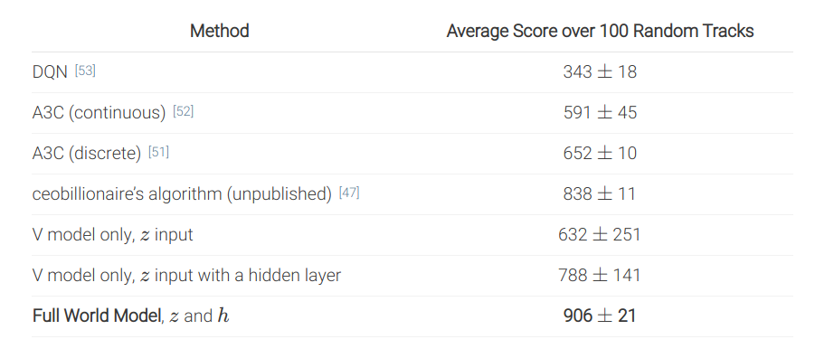{#fig-wmresults}

In summary, the **world model** V+M is learned **offline** with a random agent, using self-supervised learning, while the **controller** C has few weights (1000) and can be trained by evolutionary algorithms, not even RL.
The network can even learn by playing entirely in its **own imagination**, as the world model can be applied on itself and predict all future frames. It just needs to additionally predict the reward. After that, the learned policy can be transferred to the real environment. 

## Deep Planning Network - PlaNet

PlaNet [@Hafner2019] extends the idea of World models by learning the model together with the policy (**end-to-end**).
It learns a **latent dynamics model** that takes the past observations $o_t$ into account (needed for POMDPs):

$$s_{t}, r_{t+1}, \hat{o}_t = f(o_t, a_t, s_{t-1})$$

and plans in the latent space using multiple rollouts:

$$a_t = \text{arg}\max_a \mathbb{E}[R(s_t, a, s_{t+1}, \ldots)]$$

**Training**

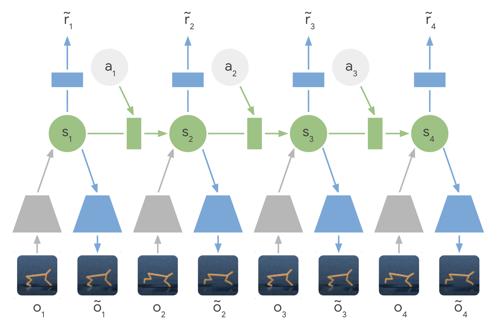{#fig-planet}

The latent dynamics model is a sequential variational autoencoder learning concurrently:

1. An **encoder** from the observation $o_t$ to the latent space $s_t$.

$$q(s_t | o_t)$$

2. A **decoder** from the latent space to the reconstructed observation $\hat{o}_t$.

$$p(\hat{o}_t | s_t)$$

3. A **transition model** to predict the next latent representation given an action.

$$p(s_{t+1} | s_t, a_t)$$

4. A **reward model** predicting the immediate reward.

$$p(r_t | s_t)$$

Training sequences $(o_1, a_1, o_2, \ldots, o_T)$ can be generated **off-policy** (e.g. from demonstrations) or on-policy. 
The loss function to train this **recurrent state-space model** (RSSM), which has a stochastic component in the encoder (VAE), and has to compensate for latent overshooting (i.e. to enforce consistency between one-step and multi-step predictions in the latent space), is slightly complicated and is not explained here. 

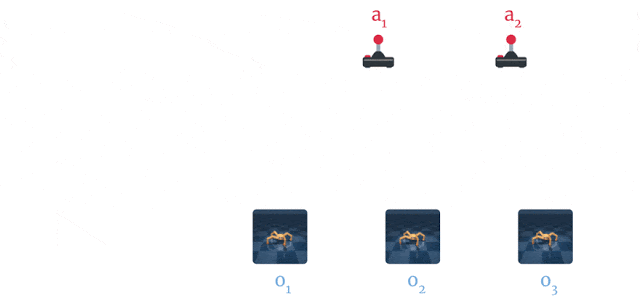{#fig-planet-training}

**Inference**

From a single observation $o_t$ encoded into $s_t$, we can generate 10000 rollouts using **random sampling**. In these rollouts, the action sequences are varied randomly, generating as many random sequences as needed. The return of each rollout can be estimated using the reward model.
A belief over the action sequences is updated using the **cross-entropy method** (CEM, @Szita2006) in order to restrict the search.

After the 10000 rollouts are executed (in imagination), the sequence with the highest return is selected and its first action is executed. 
At the next time step, planning starts from scratch: this is the key idea of Model Predictive Control.
There is no actor in PlaNet, only a transition model used for planning. The reason PlaNet works is that planning is done in the latent space, which has a much lower dimensionality than the observations (e.g. images). 

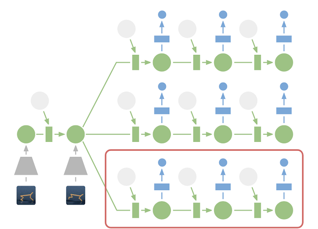

**Results**

Planet learns continuous Mujoco image-based control problems in 2000 episodes, where D4PG needs 50 times more.



The latent dynamics model can learn 6 control tasks **at the same time**.
As there is no actor, but only a planner, the same network can control all agents!

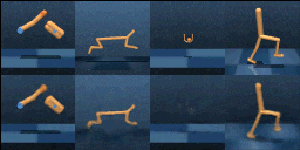{#fig-planetresults}

## Dreamer

Dreamer [@Hafner2020] extends the idea of PlaNet by additionally **training an actor** instead of using a MPC planner.
The latent dynamics model is the same RSSM architecture.
Training a "model-free" actor on imaginary rollouts instead of MPC planning should reduce the computational cost at inference time.

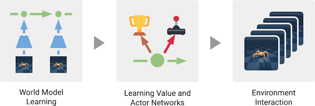{#fig-dreamer-principle}

The latent dynamics model is the same as in PlaNet, learning from past experiences. 

{#fig-dreamer-rssm}

The behavior module learns to predict the value of a state $V_\varphi(s)$ and the policy $\pi_\theta(s)$ (actor-critic).
It is trained **in imagination** in the latent space using the reward model for the immediate rewards (to compute returns) and the transition model for the next states.

{#fig-dreamer-mf}

The current observation $o_t$ is encoded into a state $s_t$, the actor selects an action $a_t$, the transition model predicts $s_{t+1}$, the reward model predicts $r_{t+1}$, the critic predicts $V_\varphi(s_t)$.
At the end of the sequence, we apply **backpropagation-through-time** to train the actor and the critic.

The **critic** $V_\varphi(s_t)$ is trained on the imaginary sequence $(s_t, a_t, r_{t+1}, s_{t+1}, \ldots, s_T)$ to minimize the prediction error with the $\lambda$-return:

$$R^\lambda_t = (1  - \lambda) \, \sum_{n=1}^{T-t-1} \lambda^{n-1} \, R^n_t + \lambda^{T-t-1} \, R_t$$

The **actor** $\pi_\theta(s_t, a_t)$ is trained on the sequence to maximize the sum of the value of the future states:

$$\mathcal{J}(\theta) = \mathbb{E}_{s_t, a_t \sim \pi_\theta} [\sum_{t'=t}^T V_\varphi(s_{t'})]$$

The main advantage of training an actor is that we need only one rollout when training it: backpropagation maximizes the expected returns.
When acting, we just need to encode the history of the episode in the latent space, and the actor becomes model-free!

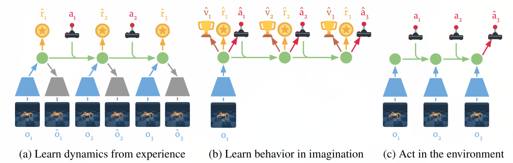{#fig-dreamer-arch}

Dreamer beats model-free and model-based methods on 20 continuous control tasks.

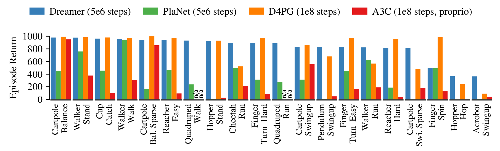{#fig-dreamer-results}

It also learns Atari and Deepmind lab video games, sometimes on par with Rainbow or IMPALA!

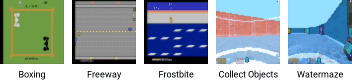

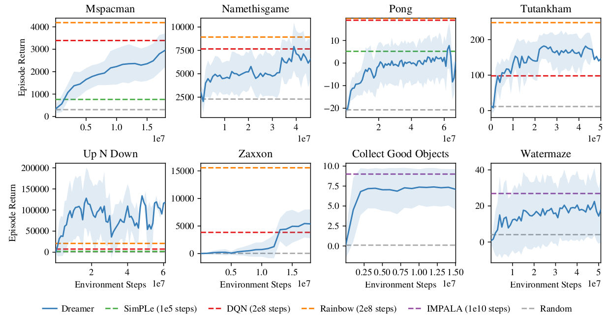{#fig-dreamer-atari}

### DreamerV2

The main change introduced by DreamerV2 [@Hafner2022] is in the representation used by the RSSM. In PlaNet and Dreamer, the stochastic part of the latent state is a Gaussian distribution, as in a regular VAE. DreamerV2 replaces it by a set of **categorical** variables (32 variables with 32 classes each), sampled with straight-through gradients so that backpropagation still works through the sampling operation.

Categorical latents turn out to be much better suited to video games than Gaussians: the future of a game is often genuinely multi-modal (an enemy appears or it does not), and a categorical distribution can represent that, while a unimodal Gaussian has to average over the alternatives and produce blurry predictions. Note the parallel with the argument for stochastic policies in @sec-maxentrl: whenever the quantity to be modeled is multi-modal, a Gaussian is the wrong tool.

With this single change, DreamerV2 became the first agent to reach human-level performance on the Atari benchmark of 55 tasks by learning behaviors **purely inside a world model**, surpassing the final performance of the top single-GPU agents IQN and Rainbow at the same computational budget and wall-clock time. This mattered beyond the score itself: until then, model-based methods were considered competitive only on continuous control tasks with simple dynamics, not on pixel-based games.

### DayDreamer

An extension of Dreamer, DayDreamer [@Wu2022], allows **physical** robots to learn complex tasks in a few hours, without a simulator. The sample efficiency of learning in imagination is what makes this possible: the expensive resource is real-world interaction, and the world model turns a small number of real transitions into a large number of imagined ones.

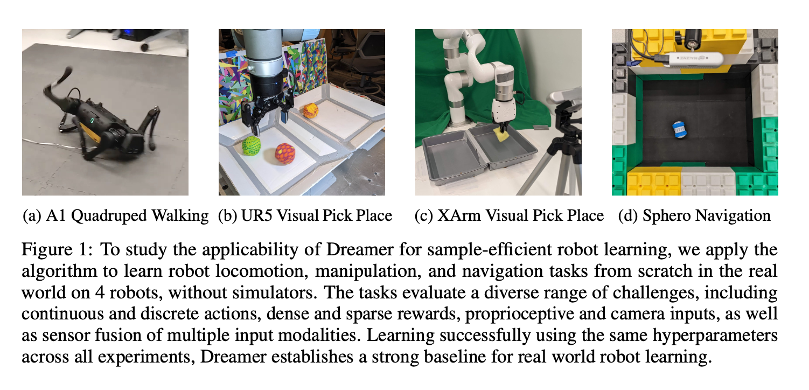



### DreamerV3

DreamerV3 [@Hafner2024] is not primarily a new architecture: the RSSM world model and the actor-critic trained in imagination are those of DreamerV2. What it addresses is a different and rather uncomfortable problem, which applies to every algorithm presented in this book:

> deep RL algorithms work, but only after someone has spent a lot of time tuning them for the task at hand.

Reward scales differ by orders of magnitude between domains, rewards can be dense or extremely sparse, observations can be images or proprioceptive vectors, episodes can last a hundred or a million steps. Each of these usually requires its own reward clipping, its own normalization, its own learning rates. This tuning cost is invisible in published benchmark curves but is what actually prevents RL from being applied to new problems.

DreamerV3 fixes a **single configuration of hyperparameters** and makes the algorithm robust enough to work with it everywhere, using three families of techniques: transformations, balancing and normalization.

**Symlog transformations**

The magnitudes of rewards, values and observations vary enormously across domains. Instead of normalizing them per domain, DreamerV3 squashes them through the **symlog** function, a symmetric logarithm which compresses large magnitudes while staying linear around zero:

$$
    \text{symlog}(x) = \text{sign}(x) \, \ln(|x| + 1) \qquad \qquad \text{symexp}(x) = \text{sign}(x) \, (\exp(|x|) - 1)
$$

symexp is its inverse, used to decode predictions back into the original scale. Inputs are fed to the networks as $\text{symlog}(x)$, and the reward and value predictors are trained to predict $\text{symlog}$ of their targets. A reward of 1 and a reward of 1000 then produce gradients of comparable magnitude, so the same learning rate works for both.

**Two-hot discrete regression**

Predicting rewards and values by regression (mse) is fragile when the targets are sparse or span several orders of magnitude: a handful of very large returns dominate the loss. DreamerV3 instead turns the regression into a **classification** problem. The output layer is a softmax over a fixed set of exponentially spaced bins, and the target is a **two-hot** vector: all the probability mass is put on the two bins surrounding the true value, split between them in proportion to the distance.

This should look familiar: it is the same device as the categorical output of C51 (@sec-distributionalrl). The motivation differs, though — C51 predicts a distribution because the *distribution itself* is of interest, while DreamerV3 uses it because classification losses are far better behaved than mse when the scale of the target is unknown in advance.

**Balancing the world model loss**

The world model is trained with a reconstruction term and a KL term between the representations inferred from observations and those predicted by the dynamics. Two adjustments keep this balanced across domains:

* **Free bits**: the KL term is clipped below a small threshold (one nat), so that once the dynamics are predicted well enough the optimizer stops pushing on the KL and concentrates on reconstruction. Without it, on domains with easily predictable dynamics, the KL collapses and the latent state stops carrying information.
* **KL balancing**: the representation and dynamics sides of the KL are scaled by different coefficients, so that the dynamics model is encouraged to move towards the representations more than the reverse.

The actor's returns are additionally normalized by a running estimate of the range between low and high percentiles of recent returns, which keeps the entropy regularizer in a sensible ratio to the returns whether rewards are dense or very sparse.

**Results**

With this single configuration, DreamerV3 outperforms specialized methods across more than 150 tasks drawn from very different domains: continuous control from states and from pixels, Atari, ProcGen, DMLab, BSuite, and Minecraft.

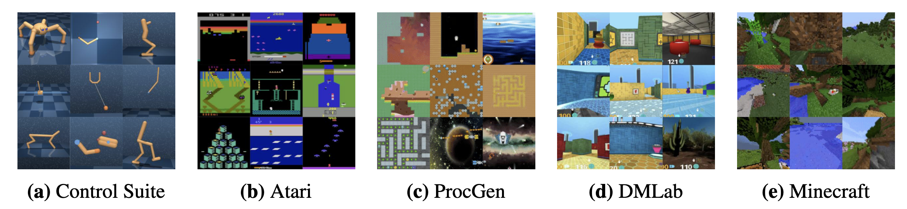{#fig-dreamerv3-tasks}

@fig-dreamerv3-results compares DreamerV3 against the best specialized agent on each benchmark. The grey bars are **tuned experts** (each tuned for its own domain), the colored ones use a **unified configuration**. Dreamer matches or beats the tuned experts nearly everywhere, and on DMLab it does so while using ten times less data than R2D2+ and IMPALA.

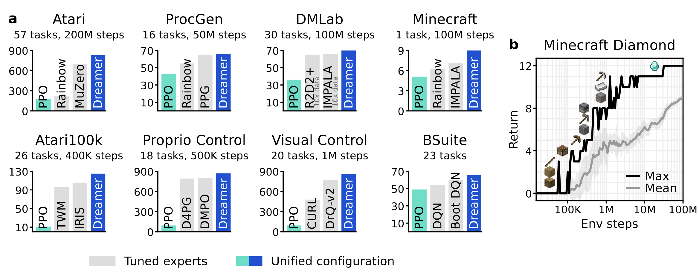{#fig-dreamerv3-results}

Another useful property is that DreamerV3 **scales monotonically**: increasing the size of the model improves not only the final performance but also the data efficiency. This is not generally true of deep RL algorithms, where bigger networks often just become harder to train.

**Minecraft**

The headline result is that DreamerV3 is the first algorithm to **collect diamonds in Minecraft from scratch**, without human demonstrations and without a curriculum. This had been a standing challenge in the field, because it combines nearly everything that makes RL hard: an open world generated afresh for each episode (so the policy cannot memorize a map), pixel observations, and an extremely sparse reward at the end of a long chain of prerequisites — you need to collect wood, craft a table, craft a wooden pickaxe, mine stone, craft a stone pickaxe, mine iron, smelt it, craft an iron pickaxe, and only then can you mine a diamond.

The right panel of @fig-dreamerv3-results shows this progression: each step of the curve corresponds to the agent reliably obtaining one more item in the chain. Reaching the diamond requires the agent to pursue a strategy whose payoff is tens of thousands of steps away, which is exactly what planning in a learned world model is supposed to buy us.

:::{.callout-tip icon="false" title="Additional resources"}
* <https://danijar.com/project/dreamerv3/>
* <https://danijar.com/project/dreamerv2/>
* <https://danijar.com/daydreamer>
:::