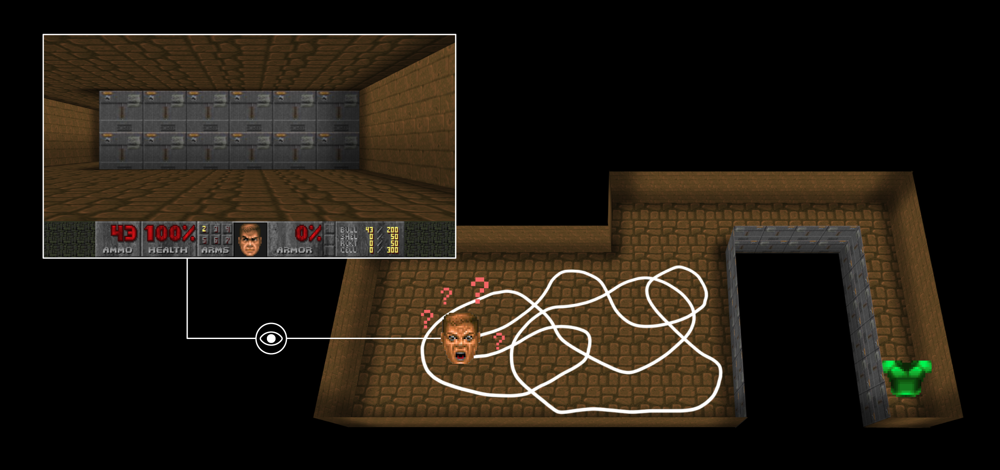
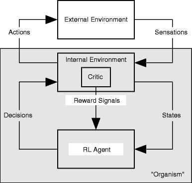
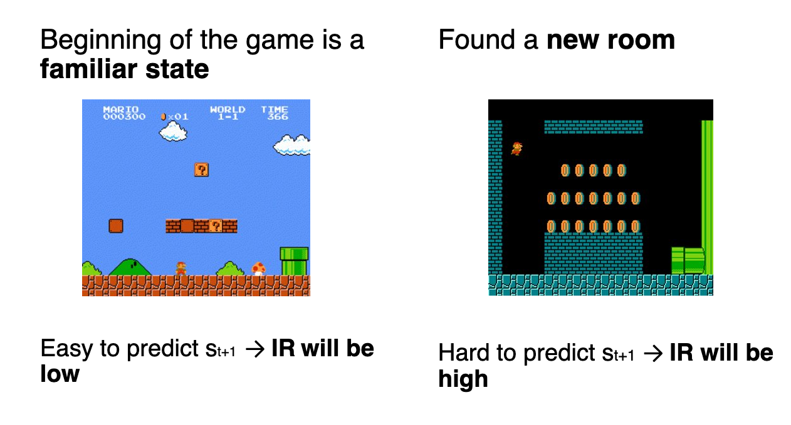
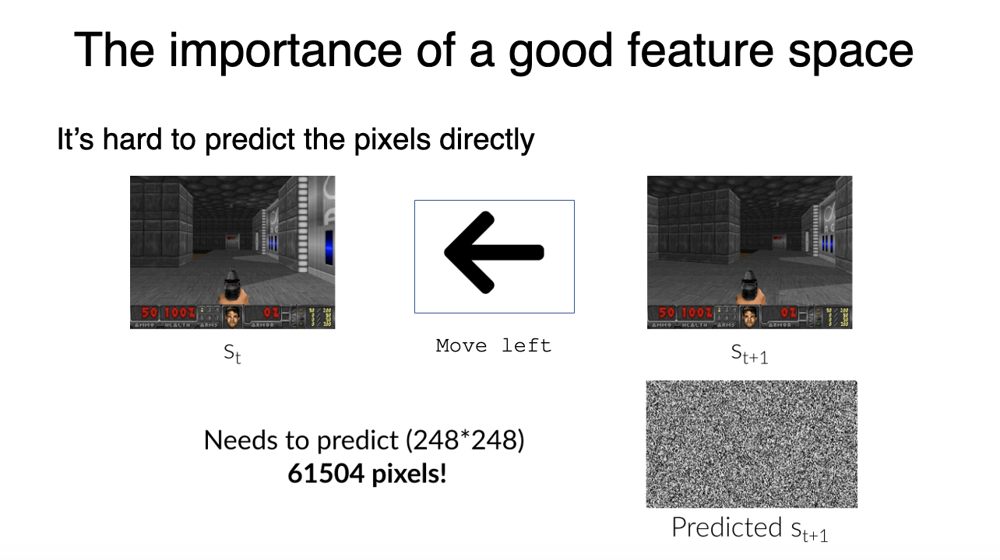
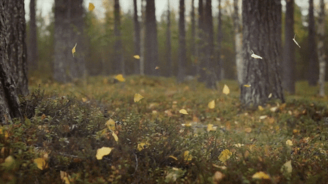
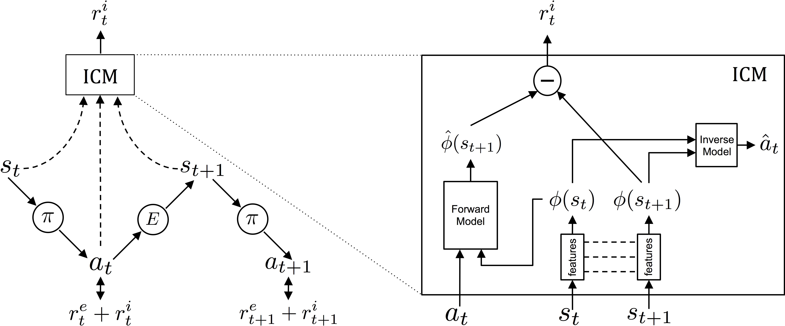

# Intrinsic motivation {#sec-intrinsic}

All the methods presented in this book depend entirely on the **reward function**. The agent maximizes the returns, so whatever we put in the reward function is what we get. This is fine as long as we are able to write down a reward function that describes what we want, and as long as the agent is able to collect some reward by exploring randomly at the beginning of learning. Both assumptions are problematic.

## The problem with sparse rewards

Let's start with the second assumption. With **sparse rewards** (@sec-mc), the agent only receives a non-zero reward in a few rare transitions: winning the game, reaching the goal, grasping the object. Everywhere else, the reward is 0.

{#fig-sparserewards width=60%}

Before the agent stumbles on a reward **by chance**, all the transitions it experiences have a reward of 0 and all its value estimates stay at 0, so the TD error is 0 and nothing is learned. The agent does not become "better at exploring" during that phase: it is a random agent, and it stays a random agent until the first reward arrives. If the reward is far away, the probability of reaching it by executing random actions decreases exponentially with the distance.

This is exactly what happened to DQN on **Montezuma's Revenge** (@sec-dqn). In this Atari game, the agent must climb down a ladder, jump over a skull, pick up a key, come back, and open a door. Only then does it receive a reward. A random agent essentially never completes that sequence, so DQN scored 0 on the game while reaching super-human performance on most of the others. Adding more layers or more training time does not help: the problem is not the capacity of the network, it is that the reward signal never arrives.

The first assumption is not much better. Writing the "right" reward function is an art, and a badly designed one leads to an agent that maximizes exactly what you asked for instead of what you wanted (we will come back to that in @sec-inverse). In many realistic problems, we may not even be able to say what the reward should be.

So the question of this chapter is:

> can the agent generate **its own** reward signal, in order to learn something useful even when the environment does not tell it anything?

## Intrinsic motivation

The inspiration comes again from animal behavior. Humans, and especially infants, do not spend their time maximizing external rewards. They **play**: they push objects off the table, they open and close doors, they babble. None of this brings any food or any grade. They do it because it is interesting.

Psychologists call this **intrinsic motivation**: a behavior done for its own sake, as opposed to **extrinsic motivation**, a behavior done to obtain an external reward [@Barto2013]. The useful thing about playing is that it builds a model of the world, which becomes extremely valuable later, when there finally is a goal to achieve.

The idea in RL is to give the agent an additional reward that it computes by itself, the **intrinsic reward** $r^i_t$, and to have it maximize the sum of both:

$$
    r_t = r^e_t + \beta \, r^i_t
$$

where $r^e_t$ is the usual **extrinsic reward** coming from the environment, and $\beta$ weights how curious the agent should be.

One may wonder whether this is not cheating. If the agent produces its own rewards, what prevents it from simply giving itself an infinite reward and stopping there? @Barto2013 proposes a useful way to think about it, depicted on @fig-barto. What we usually call the environment in the agent-environment interface is in fact the **external environment**. The reward signal is not produced by it, but by a **critic** which belongs to the **internal environment** of the organism. Both the critic and the RL agent are inside the organism, but the RL agent does not control the critic: from its point of view, the reward is still something that it receives, not something that it chooses.

{#fig-barto width=55%}

In this view, extrinsic and intrinsic rewards are not different in nature: they are both produced by the same internal critic. What differs is only what triggers them, an event in the external environment or an event inside the organism. Hunger, curiosity or boredom are as "real" as a reward given by a teacher.

Note that this changes nothing to the algorithms themselves: we can use DQN, A3C, PPO or SAC without any modification, we only modify the reward that we feed them. This is why intrinsic motivation is so widely used: it is a module that can be plugged on top of any RL algorithm.

The idea is not new: @Schmidhuber2010 had been formalizing it since 1990, under the names of curiosity, fun and creativity. His formulation is worth remembering, because it is subtly different from what most modern methods do: the intrinsic reward should not be the error of the agent's model, but the **improvement** of that model, i.e. the *learning progress*. Rewarding the error pushes the agent towards what it cannot predict; rewarding the progress pushes it towards what it is currently able to learn. We will see very soon why this distinction matters.

The whole difficulty is now to define $r^i_t$: what should be intrinsically rewarding?

## Curiosity as a prediction error

A reasonable answer is: what is **surprising**. If you can perfectly predict what is going to happen, the situation is boring and there is nothing to learn from it. If you cannot predict what happens, you have found a part of the world that your model does not cover yet, and it is worth exploring.

This can be measured directly. Let's learn a **forward model** $f$ that predicts the next state from the current state and action, exactly as in model-based RL (@sec-worldmodels):

$$
    \hat{s}_{t+1} = f(s_t, a_t)
$$

and define the intrinsic reward as the error made by this prediction:

$$
    r^i_t = || f(s_t, a_t) - s_{t+1} ||^2
$$

{#fig-intrinsicreward width=70%}

An agent maximizing this reward will systematically go towards the transitions that its model predicts badly, i.e. the parts of the environment it does not know yet. This is **exploration**, but a directed one: instead of taking random actions and hoping, the agent actively seeks novelty.

A very nice property of this scheme is that it is **self-limiting**. The forward model is trained on the transitions that the agent experiences, so the more often the agent visits a region, the better the model predicts it, and the smaller the intrinsic reward becomes. Curiosity therefore extinguishes itself in regions that have been understood, and the agent moves on. Compare this to $\epsilon$-greedy, where the exploration level is a hyperparameter that we have to schedule by hand and which is the same everywhere in the state space.

## The noisy-TV problem

Unfortunately, computing the prediction error directly on the states does not work well.

The first issue is technical: when the states are images, predicting the next frame means predicting tens of thousands of pixels. This is a hard problem in itself, and the prediction will never be perfect, so there will always be a residual error and therefore a residual intrinsic reward everywhere.

{#fig-intrinsicrewardhard width=55%}

The second issue is much more fundamental. Some things in the world are unpredictable **but not interesting**: leaves moving in the wind, noise on a screen, the result of a dice throw. The prediction error on those will stay high forever, because the randomness is irreducible: no amount of learning will let you predict which way a leaf moves next.

{#fig-leaves width=50%}

An agent maximizing the prediction error will happily park itself in front of such a source of noise and collect a large intrinsic reward forever, without learning anything and without exploring anything else. This failure mode is known as the **noisy-TV problem**: put a TV showing static in a maze, and your curious agent will stop exploring the maze and watch the TV.

Note that this is the exact opposite of what we wanted: we introduced curiosity to make exploration smarter, and we ended up with an agent that gets addicted to noise. This is also exactly the distinction made by @Schmidhuber2010: in front of the noisy TV, the prediction **error** stays maximal forever, but the learning **progress** is zero, as the model does not improve at all. An agent rewarded by its progress would lose interest immediately. Measuring progress is unfortunately much harder than measuring error, so most practical methods keep the error and try to fix the problem another way: by being more careful about **what** the agent tries to predict.

## Intrinsic Curiosity Module (ICM)

The **Intrinsic Curiosity Module** [ICM, @Pathak2017] solves both issues at once with a simple idea: do not predict the next state, predict a **learned representation** of the next state, and learn that representation so that it only contains what the agent can influence.

The ICM has three components:

1. A **feature encoder** $\phi$, which maps a state $s_t$ to a feature vector $\phi(s_t)$ of much smaller dimensionality.
2. A **forward model**, which predicts the features of the next state from the features of the current state and the action:
$$\hat{\phi}(s_{t+1}) = f(\phi(s_t), a_t)$$
3. An **inverse model**, which predicts which action was taken between two successive states:
$$\hat{a}_t = g(\phi(s_t), \phi(s_{t+1}))$$

{#fig-icm width=90%}

The intrinsic reward is now the prediction error of the forward model **in the feature space**:

$$
    r^i_t = || \hat{\phi}(s_{t+1}) - \phi(s_{t+1}) ||^2
$$

which is a much smaller and easier prediction problem than working on raw pixels.

But the real trick is the inverse model. The encoder $\phi$ is not trained to reconstruct the states (as an autoencoder would), it is trained so that the **inverse model** can recover the action. Think about what this implies:

* If some part of the observation is influenced by the agent's actions (the position of its own body, the objects it pushes), it is useful to predict the action, so $\phi$ keeps it.
* If some part of the observation is not influenced by the agent at all (the leaves in the wind, the TV static, the clouds in the background), it is useless to predict the action, so $\phi$ learns to **discard** it.

The feature space therefore only encodes the part of the environment that the agent can control or that affects it, and the noisy-TV disappears from the representation before the intrinsic reward is even computed. This is an elegant solution, and it is worth remembering as a general principle: when a quantity is hard to define directly, one can often define an auxiliary task whose solution forces the right quantity to emerge.

ICM allows agents to learn to play games such as VizDoom and Super Mario Bros with very sparse rewards, and even with **no extrinsic reward at all**.



@Burda2018 later performed a large-scale study of purely curiosity-driven learning, i.e. with the extrinsic reward completely removed ($r_t = r^i_t$), on 54 benchmark environments including the whole Atari suite. The results are surprising: on many games, an agent that has never seen a single point of game score still learns to play reasonably well. The explanation is that these games are designed by humans for humans, so the game score is usually well aligned with "making interesting things happen on the screen" — progressing in the level is exactly what a curious agent wants to do anyway.



## Counting states

Let's take a step back. All the methods above measure **surprise**: how badly does my model predict what is going to happen? But what we actually want for exploration is **novelty**: have I been here before? The two are related, as a state which has never been visited is usually predicted badly, but they are not the same thing, and the noisy TV is precisely a case where a state stays surprising forever while not being novel at all.

If novelty is what we want, why not measure it directly? In tabular RL, this is trivial: keep a counter $N(s)$ of the number of times each state has been visited, and give a bonus that decreases with it, for example:

$$
    r^i_t = \frac{1}{\sqrt{N(s_t)}}
$$

This is a very old idea, and in the tabular case it can even be proven to lead to near-optimal exploration. The problem is that it does not survive the passage to deep RL. When the states are images, no two frames are ever identical pixel by pixel, so every state is visited exactly once, all counts are 1, and the bonus is the same everywhere: useless. Counting requires the states to be discrete and to repeat, which is exactly the assumption that function approximation was introduced to get rid of (@sec-fa).

@Bellemare2016 found an elegant way around this, called **pseudo-counts**. The idea is to replace the counter by a **density model** $\rho(s)$, i.e. a model that estimates the probability of observing the state $s$, and which is trained on the states that the agent visits. Contrary to a counter, a density model **generalizes**: a state which resembles many already visited states receives a high probability, even if this exact state has never been seen.

The question is then how to get a count back out of a probability. Let's note $\rho(s)$ the probability that the model assigns to $s$, and $\rho'(s)$ the probability that it would assign to $s$ **after** being trained on $s$ one more time. If the density model behaved exactly like a counter having seen $n$ states in total, we would have:

$$
    \rho(s) = \frac{N(s)}{n} \qquad \qquad \rho'(s) = \frac{N(s) + 1}{n + 1}
$$

These are two equations with two unknowns ($N(s)$ and $n$), so we can solve them for $N(s)$ and obtain the **pseudo-count**:

$$
    \hat{N}(s) = \frac{\rho(s) \, (1 - \rho'(s))}{\rho'(s) - \rho(s)}
$$

which can now be computed for any density model and used in the exploration bonus in place of the true count. Said differently: *how much the model improves when forced to learn a state one more time* tells us how many times it has effectively already seen it. A state the model already knows well barely changes, so $\rho'(s) \approx \rho(s)$, the denominator is tiny and the pseudo-count is huge. A completely new state changes the model a lot, and the pseudo-count is small.

It is worth noticing that this is precisely @Schmidhuber2010's learning progress, measured on a density model instead of a forward model. Pseudo-counts are therefore immune to the noisy TV for the same reason: watching static does not improve the density model, so the pseudo-count stops growing and the bonus vanishes.

Applied to Atari with a simple pixel density model, pseudo-counts produced the first real progress on Montezuma's Revenge. @Ostrovski2017 then replaced the density model by PixelCNN, a much better neural density model for images, and improved the results further, confirming that the quality of the density model directly determines the quality of the exploration.

## Random Network Distillation (RND)

Pseudo-counts work, but they require training a density model over images, which is heavy and delicate: the whole scheme depends on the density model being well calibrated, and image density models are hard to get right.

**Random Network Distillation** [RND, @Burda2018b] obtains a very similar notion of novelty far more cheaply, with a trick that looks like a joke at first sight. Take two networks:

* A **target network** $\hat{f}$ with random weights, which is **fixed** and never trained.
* A **predictor network** $f_\psi$, which is trained to predict the output of the target network on the states that the agent visits, by minimizing:

$$
    \mathcal{L}(\psi) = || f_\psi(s_t) - \hat{f}(s_t) ||^2
$$

The intrinsic reward is simply this prediction error:

$$
    r^i_t = || f_\psi(s_t) - \hat{f}(s_t) ||^2
$$

Why does this work? The function to be predicted is now **deterministic by construction**: $\hat{f}$ is a fixed function of the state, it contains no noise whatsoever. There is therefore no irreducible error: on a state that has been visited often, the predictor can in principle become perfect and the intrinsic reward goes to 0. On a state that has never been visited, the predictor has no reason to be correct and the error is high.

The prediction error has stopped measuring "how unpredictable is the future" and now measures "**how novel is this state**", which is what we wanted in the first place. A stochastic TV does not fool RND: whatever the screen shows, $\hat{f}$ maps it to a fixed output, and once the predictor has seen enough screens it predicts them all.

RND is also trivial to implement (two small networks and one mse loss, no forward model, no inverse model, no density model) and adds almost no computation. Combined with PPO, it established the state of the art on **Montezuma's Revenge** and was the first method to exceed average human performance on it, five years after DQN had scored zero on the same game.

## Episodic curiosity

Pseudo-counts and RND both measure novelty with respect to **everything the agent has seen since the beginning of training**. @Savinov2019 propose a different and quite intuitive notion: novelty with respect to the **current episode**, measured in number of steps.

The agent maintains an **episodic memory** containing the observations encountered since the beginning of the episode. A network is trained to predict, for a pair of observations, whether one is **reachable** from the other within $k$ steps. The intrinsic reward of the current observation is then high if it is far, in number of steps, from everything already in memory, and low if it can be reached quickly from something already seen. At the end of the episode, the memory is emptied.

The interesting point is that this measure is about the **dynamics** of the environment, not about the appearance of the states. Turning on the spot produces a continuous stream of very different images, so any appearance-based novelty measure rewards it. But all these images are reachable from one another in one or two steps, so reachability-based curiosity does not reward it at all. The noisy TV is defeated once more, this time by asking a question about the structure of the environment rather than about the pixels.

## Planning to explore

All the methods above are **retrospective**: the agent computes the novelty of a state *after* having reached it. It discovers that a region was interesting only once it is already there, which is still a form of trial and error.

If we have a world model (@sec-worldmodels), we can do better and seek out novelty **before** experiencing it. This is the idea of Plan2Explore [@Sekar2020], which builds on Dreamer. Instead of a single forward model, it trains an **ensemble** of forward models in the latent space. On a part of the environment that has been seen often, all the models agree with each other. On a part that has not, they disagree, because each of them extrapolates differently.

The **disagreement** between the models (the variance of their predictions) is therefore a measure of novelty that can be computed **in imagination**, without acting. The agent can then plan a trajectory towards the states where the ensemble expects to disagree, i.e. actively navigate towards what it does not know yet.

The consequence is that the agent explores with **no task and no reward at all**, purely building a world model, and afterwards it can solve new tasks that were not known during exploration, sometimes in a zero-shot manner: once the world model is good, a new reward function is all that is needed to derive a new behavior by planning in imagination.

This closes a nice loop with @sec-worldmodels: a world model makes better exploration possible, and better exploration makes a better world model.

## Is novelty enough?

All the methods presented so far follow the same recipe: define a measure of novelty, turn it into a reward, and let a standard RL algorithm maximize it. @Ecoffet2021 argue that this recipe has a structural weakness, and that this weakness, rather than the quality of the novelty measure, is what really limits exploration. They identify two failure modes:

* **Detachment**: the agent discovers a promising area and starts exploring it, but its policy drifts elsewhere in the meantime. When it comes back, the states of that area are not novel anymore, so their intrinsic reward has already been consumed and there is nothing left to attract the agent. It has effectively **forgotten** that there was something to explore there.
* **Derailment**: even when the agent does know that a distant state is worth exploring from, it has to travel back to it using its own stochastic, exploratory policy. The longer the path, the more likely the exploratory noise makes it fail somewhere on the way. The very randomness that is needed to explore prevents the agent from reaching the place where it should explore.

Their algorithm, **Go-Explore**, gives up on the intrinsic reward entirely. It keeps instead an explicit **archive** of the interesting states that have been reached, together with a trajectory leading to each of them, and repeats the two steps which give the paper its title:

1. **First return**: select a promising state from the archive and go back to it **directly**, by replaying the stored trajectory (or, in the stochastic case, by training a policy to imitate it), rather than by exploring.
2. **Then explore**: from there, explore randomly, and add every newly discovered state to the archive.

Separating "coming back" from "exploring" removes both failure modes at once: nothing is forgotten, because the archive is explicit and permanent, and nothing is derailed, because returning does not rely on a noisy policy. Go-Explore solved Montezuma's Revenge outright, above the human world record, and scored above the state of the art on all the hard-exploration Atari games.

This is a useful result to keep in mind, because it says something slightly uncomfortable about the rest of this chapter. The hard part of exploration may not be **estimating** novelty, which is what ICM, pseudo-counts, RND and episodic curiosity all work on, but **exploiting** it reliably once it has been estimated. The two views are probably both partly right, and modern agents combine them: Never Give Up [@Badia2020a] mixes an episodic novelty measure with a life-long one based on RND, and Agent57 [@Badia2020] adds a meta-controller that learns how curious the agent should be at each moment, becoming the first agent to beat the human baseline on all 57 Atari games.

:::{.callout-tip icon="false" title="Additional resources"}

* @Aubret2019 is a survey of intrinsic motivation in RL.
* @Oudeyer2016 gives the psychological and developmental background.
* @Barto2013 discusses what intrinsic motivation means for a learning machine.
* @Schmidhuber2010 is the historical formal theory, covering twenty years of work on curiosity, fun and creativity.
* <https://pathak22.github.io/large-scale-curiosity/> for the large-scale study of @Burda2018.

:::
