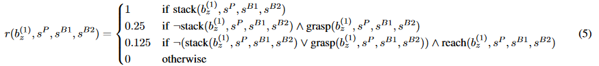

# Inverse Reinforcement Learning {#sec-inverse}

Reinforcement learning is an optimization method: it maximizes the reward function that you give it. Nothing more, nothing less. This sounds obvious, but it has a consequence that is easy to underestimate: if the reward function does not describe exactly what you want, the agent will not do what you want, and it will be **your** fault, not the algorithm's.

This chapter is about that problem and about one family of answers to it: instead of writing the reward function by hand, learn it from examples of the desired behavior.

## RL maximizes the reward function you give it

A classical illustration is the boat racing game *Coast Runners*, where an agent was trained to win a race. The natural reward signal is the score of the game, which increases when the boat passes through turbo blocks placed along the circuit. A human player collects them on the way while racing towards the finish line.

The trained agent discovered something better. Some turbos respawn quickly, so instead of finishing the race, the optimal behavior is to turn around in circles in a small lagoon and collect the same three turbos again and again. The agent obtains a much higher score than any human player, while never finishing a single race, repeatedly catching fire and driving in the wrong direction.



The agent is not broken: it found a very good solution to the problem we actually gave it, which was "maximize the score", not "win the race". This failure mode is called **reward hacking** (or reward gaming, or specification gaming), and it is extremely common as soon as the reward function is a proxy for the real objective.

## Reward functions need careful engineering

Designing a reward function that does what you want becomes an art. Two forces pull in opposite directions:

* RL algorithms work much better with **dense** rewards than with sparse ones (@sec-intrinsic), so it is tempting to add intermediary rewards to guide the agent.
* Every intermediary reward that you add is an opportunity for the agent to hack it, as it is by definition not the true objective.

You quickly end up covering so many special cases that the reward function becomes unusable: *go as fast as you can, but not in a curve, except if you are on a closed circuit, but not if it rains...* And each added term has to be weighted against the others, which introduces hyperparameters that have no obvious value.



@Popov2017 give a striking example of this. Their task is to stack one Lego brick on another with a robotic arm, which is conceptually simple, and they solve it with DDPG, which at this point of the book we know how to implement. The reward function they had to design in order to make it work is anything but simple: it is composed of several terms for approaching, grasping, lifting and aligning the brick, each one shaped and weighted by hand.

{#fig-legoreward width=90%}

It is fair to say that, in that paper, writing the reward function was harder than implementing DDPG. This is not an isolated case: in many applied projects, most of the engineering effort goes into the reward function rather than into the algorithm.

## Learning the reward function from demonstrations

If the reward function is the hard part, perhaps it should be learned rather than written. This is the goal of **inverse reinforcement learning** (IRL): given demonstrations of an expert behaving well, find the reward function that this expert seems to be maximizing.

{#fig-inverserl width=55%}

The name is well chosen: regular RL goes from a reward function to a policy, IRL goes from a policy (observed through its trajectories) back to a reward function. Once the reward function has been recovered, we can simply apply any of the algorithms of this book to obtain the optimal policy.

:::{.callout-tip icon="false" title="IRL is not imitation learning"}

It is important not to confuse the two, as they use the same data but do very different things with it.

**Imitation learning** (or behavioral cloning, see @sec-offlinerl) learns the policy directly: it treats the demonstrations as a supervised learning dataset of (state, action) pairs and trains a network to reproduce the expert's actions. It is simple and often works, but it only learns **what** the expert does, not **why**.

**Inverse RL** learns the reward function, i.e. the **intention** behind the behavior, and only then derives a policy from it.

The difference matters as soon as something changes. An imitation policy is tied to the states it has seen and to the body and the environment of the expert: put it in a slightly different situation and it has nothing to say. A reward function is a much more compact and much more **transferable** description of a task. "Reach the red cube without knocking over the blue one" stays valid if the robot has different arms, if the table is higher, or if the dynamics change; the sequence of joint angles that the expert used does not.

This is the central argument in favor of IRL: among all the ways of describing a task, the reward function is arguably the most succinct and the most robust.
:::

## The problem is ill-posed

Unfortunately, IRL is much harder than it looks. @Ng2000, who formalized the problem, immediately noted that it is **ill-posed**: many different reward functions explain the same observed behavior equally well.

The most obvious one is $r(s, a, s') = 0$ everywhere. If all rewards are zero, then all policies have a return of zero, so all policies are optimal, including the expert's. A degenerate solution, but a valid one: it perfectly "explains" the demonstrations.

Less trivially, multiplying a reward function by a positive constant does not change the optimal policy either. And there is a whole family of additive transformations that leave it unchanged, characterized by @Ng1999: for any function $\Phi(s)$ of the state, called a **potential**, the transformed reward

$$
    r'(s, a, s') = r(s, a, s') + \gamma \, \Phi(s') - \Phi(s)
$$

has exactly the same optimal policy as $r$. The intuition is that the added term telescopes along a trajectory: summing it over an episode leaves only the potentials of the first and last states, so it changes the return of every trajectory by the same amount and therefore changes no comparison between them.

:::{.callout-tip icon="false" title="Potential-based reward shaping"}
This result is worth remembering outside of IRL, because it is the principled answer to the reward engineering problem of the previous section. If your reward is too sparse and you want to add intermediary rewards to guide the agent, doing it with a potential $\Phi(s)$ guarantees that you are **not** changing the task: the agent cannot hack a potential-based bonus, because collecting it repeatedly requires coming back to a lower-potential state, which costs exactly what it gained.

The Coast Runners agent could loop over the turbos precisely because the bonus was not potential-based. Had the score been shaped as "progress along the circuit", i.e. as the difference of a potential, going backwards would have given a negative reward exactly cancelling the forward one.
:::

Even excluding all these cases, an infinity of reward functions remain compatible with a finite set of demonstrations, simply because the demonstrations only tell us about the states the expert actually visited.

Every IRL algorithm is therefore, at its core, a way of choosing **which** of the compatible reward functions to return. The different methods differ mostly by the criterion they use for that choice.

## Feature-based rewards

A first and very common restriction is to constrain the shape of the reward function. Instead of allowing an arbitrary value in each state, the reward is written as a **linear combination of features**:

$$
    \hat{r}(s) = \sum_{i=1}^K w_i \, \phi_i(s) = \mathbf{w}^T \, \phi(s)
$$

where $\phi(s)$ is a feature vector describing the state (@sec-fa) and $\mathbf{w}$ the weights to be learned. For an autonomous car, the features could be the distance to the center of the lane, the speed, the distance to the car in front, whether the blinker matches the direction taken, and so on. The IRL problem then reduces to finding the $K$ weights, which is a much smaller problem than finding one value per state, and which has the pleasant side effect of being interpretable: after learning, one can read the weights and see what the expert seems to care about.

A key quantity for these methods is the **expected feature count**, i.e. the discounted sum of the features encountered along a trajectory:

$$
    \mu(\pi) = \mathbb{E}_{\tau \sim \rho_\pi} [\sum_{t=0}^{T} \gamma^t \, \phi(s_t)]
$$

Because the reward is linear in the features, the expected return of a policy is simply $\mathbf{w}^T \, \mu(\pi)$. Two policies with the same expected feature counts therefore have the same return **for any** weight vector. This gives a concrete objective, proposed by @Abbeel2004 under the name **apprenticeship learning**: find a policy whose feature counts match those of the expert, measured on the demonstrations.

$$
    || \mu(\pi) - \mu(\pi_\text{expert}) || \leq \epsilon
$$

If the features are well chosen, matching them means solving the same task, and one does not even need to identify the "true" weights: any policy matching the feature counts is guaranteed to be at least as good as the expert under the unknown reward function. Note however that this only pushes the difficulty one step further, as we now have to choose the features $\phi(s)$ by hand, which is a bit like designing the reward function.

## Maximum entropy IRL

Feature matching still leaves a lot of ambiguity: many policies, and many weight vectors, produce the same feature counts. @Ziebart2008 resolve it with an argument that we have already met in @sec-maxentrl: among all the distributions over trajectories that match the observed feature counts, choose the one with the **maximum entropy**, i.e. the one that commits to nothing beyond what the data actually says.

This leads to modelling the expert as being only **approximately** optimal, with the probability of a trajectory increasing exponentially with its return:

$$
    \rho(\tau) \propto \exp \left( \sum_{t=0}^T \gamma^t \, \hat{r}(s_t) \right)
$$

The expert takes good trajectories with a high probability and bad ones with a low probability, but it is not assumed to be perfect. This is a far more realistic model of a human demonstrator, and it is also numerically much better behaved: the reward weights can now be found by maximizing the likelihood of the demonstrations under this distribution, which is a well-defined optimization problem instead of a search among infinitely many equally valid answers.

Maximum entropy IRL became the basis of most modern methods, and it is worth noticing how the same principle appears twice in this book for two different purposes: in @sec-maxentrl, maximizing entropy made the agent explore; here, it makes the explanation of someone else's behavior as non-committal as possible.

## Adversarial imitation learning

All the methods above share an expensive structure: they alternate between guessing a reward function and solving the corresponding RL problem to see whether the resulting policy resembles the expert. There are two nested loops, and the inner one is a complete RL training.

@Ho2016 observed that this detour can be avoided. They showed that maximum entropy IRL followed by RL is mathematically equivalent to matching the **occupancy measure** of the expert, i.e. the distribution of the $(s, a)$ pairs visited. If all we want is a policy, we do not need to pass through the reward function at all: we only need a way to make two distributions of state-action pairs similar.

This is exactly the problem that **generative adversarial networks** solve, and the resulting algorithm is called **Generative Adversarial Imitation Learning** (GAIL). It uses two networks:

* A **discriminator** $D_\omega(s, a)$, trained as a classifier to distinguish the $(s, a)$ pairs coming from the expert demonstrations from those generated by the agent.
* The **policy** $\pi_\theta$, trained by regular RL (TRPO in the original paper, PPO in most implementations) using the discriminator as its reward function:

$$
    r(s, a) = - \log (1 - D_\omega(s, a))
$$

The policy is therefore rewarded for producing transitions that the discriminator believes come from the expert. As the policy improves, the discriminator has to become sharper, which in turn provides a more demanding reward, and so on. At convergence, the discriminator can no longer tell the two apart, which means the occupancy measures match.

GAIL works remarkably well and scales to problems where classical IRL does not. But notice what we have given up: the reward function. The discriminator is *not* a usable reward function, because it is entangled with the dynamics of the environment in which the demonstrations were collected. Move the agent to an environment with different dynamics and the discriminator becomes meaningless, so we have lost precisely the transferability that motivated IRL in the first place.

**Adversarial Inverse Reinforcement Learning** [AIRL, @Fu2018] recovers it. It keeps the adversarial structure of GAIL, but constrains the shape of the discriminator so that the recovered reward is **disentangled** from the dynamics. The reward obtained can then be transferred to an environment where the dynamics have changed, and re-optimized there, which GAIL cannot do.

## Learning from preferences

There is one assumption that all the methods above make and that is easy to overlook: they require an expert **able to perform the task**. This is a strong requirement. A human can explain what a good backflip looks like, but very few can teleoperate a simulated robot into performing one. For many tasks, we can **judge** a behavior much more easily than we can **produce** it.

@Christiano2017 build on that observation. Instead of demonstrations, the human is shown two short video clips of the agent's behavior, one or two seconds each, and simply answers: which of the two is better? From these binary comparisons, a **reward model** $\hat{r}_\psi(s, a)$ is fitted, by assuming that the probability of preferring a segment grows with its predicted return:

$$
    P(\tau^1 \succ \tau^2) = \frac{\exp \sum_{t} \hat{r}_\psi(s^1_t, a^1_t)}{\exp \sum_{t} \hat{r}_\psi(s^1_t, a^1_t) + \exp \sum_{t} \hat{r}_\psi(s^2_t, a^2_t)}
$$

The reward model is trained to maximize the likelihood of the observed human choices, and the agent is trained by regular RL on the predicted reward. Both are learned at the same time: the agent explores, the human labels some of the resulting pairs, the reward model improves, the agent improves, and so on.

Two things make this practical. First, the human only has to compare, which is fast and requires no expertise. Second, the comparisons are only requested on a tiny fraction of the interactions, typically less than one percent, as the reward model generalizes to everything in between. With about an hour of a non-expert human's time, the agent learns behaviors that had never been specified by any reward function, including the famous backflip. @Ibarz2018 later combined preferences and demonstrations on Atari games, showing that the two sources of information are complementary.

### From games to language models

This is where the chapter meets something the reader has certainly used. The alignment of large language models such as ChatGPT, mentioned in the introduction of this book, is exactly the procedure above, applied to text:

1. A pretrained language model generates several answers to a prompt.
2. Human annotators **rank** these answers from best to worst.
3. A **reward model** is trained on these comparisons, exactly as above.
4. The language model is fine-tuned by RL, using PPO (@sec-PPO), to maximize the reward model while staying close to the pretrained model.

This is called **Reinforcement Learning from Human Feedback** (RLHF), and it is what turns a model that merely predicts plausible text into one that answers questions usefully and refuses harmful requests [@Ouyang2022]. It is worth emphasizing that the technique was not invented for language models: @Christiano2017 introduced it five years before ChatGPT, on Atari games and simulated robots, as an answer to the reward specification problem that opens this chapter. This is a good example of why it is worth understanding the classical RL literature: the ideas travel.

Step 4 is expensive: it requires a reward model, a value network and a full PPO training loop. @Rafailov2023 showed that the RLHF objective actually admits a closed-form solution, so that the optimal policy can be expressed directly in terms of the preference data. The resulting algorithm, **Direct Preference Optimization** (DPO), removes both the reward model and the RL loop, replacing them by a single supervised-style loss on pairs of preferred and rejected answers. It is far simpler and cheaper, which explains its wide adoption, although the question of whether it fully matches PPO-based RLHF in quality is at the time of writing still debated.

Let us finish with a word of caution that brings us back to the beginning of the chapter. The reward model is trained on a finite number of human comparisons, so it is only an **approximation** of what humans actually prefer. Optimizing it too hard therefore leads to exactly the phenomenon we started with: the agent finds behaviors that score very well under the reward model while being judged poorly by real humans. Learning the reward function does not make reward hacking disappear, it moves it one level up. This is why RLHF implementations always constrain the fine-tuned model to stay close to its starting point, usually through a KL penalty, which is one more instance of the trust region idea of @sec-PPO.

:::{.callout-tip icon="false" title="Additional resources"}

* @Arora2019 is a detailed survey of inverse RL: challenges, methods and progress.
* @Ng2000 is the founding paper, and is still very readable.

:::
