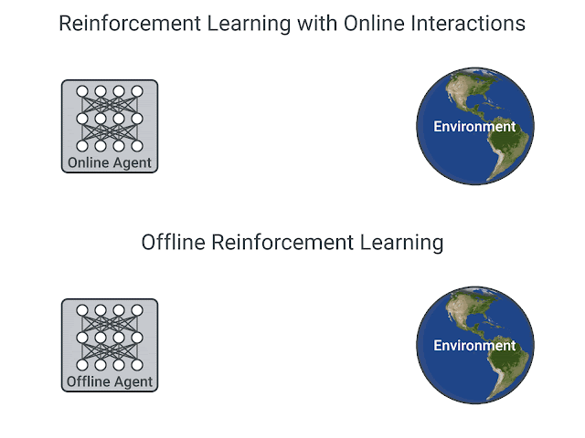
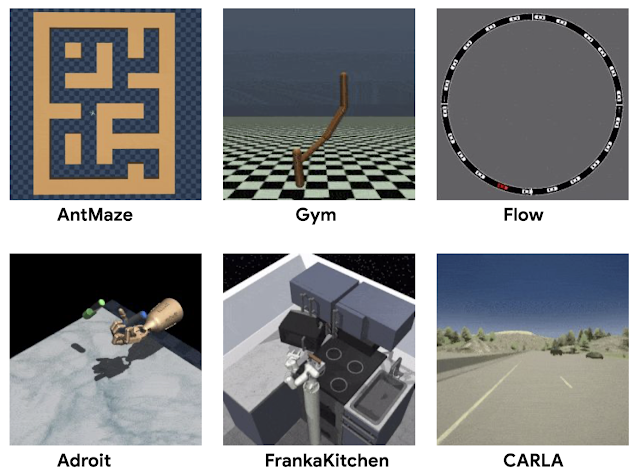
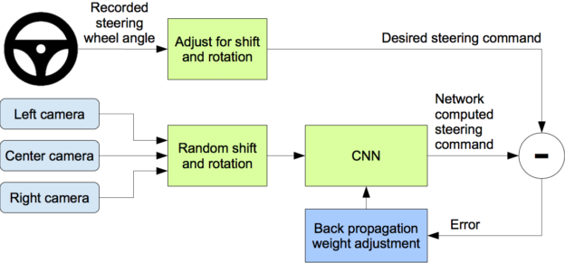
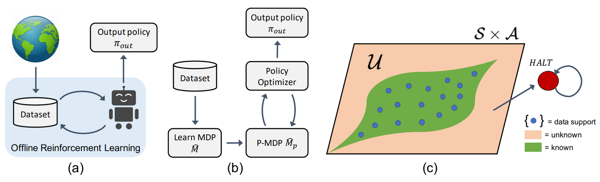
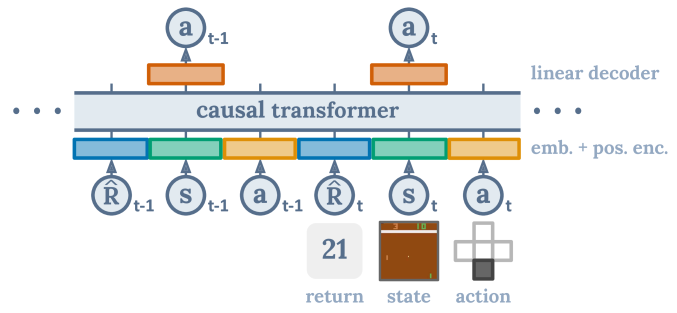
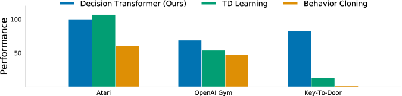
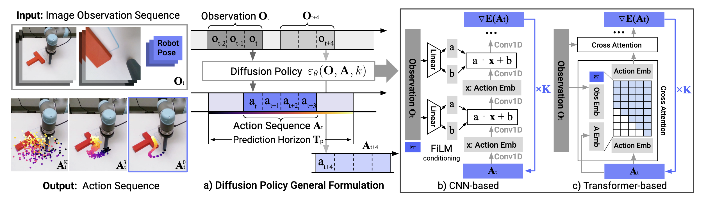

# Offline RL {#sec-offlinerl}

Every method presented so far, whether on-policy or off-policy, needs to **interact** with the environment while learning. This chapter asks what happens when it cannot, and what has to change.

## Learning from a fixed dataset

It is worth being precise about the difference between **off-policy** and **offline**, because the two are easily confused.

An off-policy algorithm such as DQN or SAC learns from transitions generated by a **behavior policy** $b$ different from the learned policy $\pi$ (@sec-mc). But in practice, $b$ is an $\epsilon$-soft version of $\pi$: the agent still acts in the environment, and as $\pi$ improves, the data that fills the experience replay memory improves with it. If the agent develops a wrong idea about an action, it will eventually try that action, see that it was a bad idea, and correct itself.

In **offline RL** (also called batch RL), this feedback loop is cut. We are given a fixed dataset of transitions

$$
    \mathcal{D} = \{(s_k, a_k, r_k, s'_k)\}_{k=1}^N
$$

collected by somebody else, and we must produce the best possible policy from it, without ever interacting with the environment during training. Whatever the agent believes about an action that is not in the dataset, it will never be contradicted.

{#fig-offlinerl width=75%}

Why would we want to work under such a constraint? Because in most real applications, it is not a constraint we choose, it is the situation we are in:

* **Safety.** Exploration means trying actions to see what happens. This is fine in a simulator, unacceptable for a treatment plan in a hospital, a controller in a chemical plant, or a car on a public road.
* **Cost.** Interaction may be extremely slow or expensive, while historical data already exists in large quantities: years of logs from an industrial process, millions of recorded human drives.
* **Reuse.** RL is notoriously sample-inefficient. Being able to reuse a dataset across many tasks and many algorithms, as computer vision does with ImageNet, would change the economics of the field completely.

This last point explains why standardized datasets appeared. **D4RL** (*Datasets for Deep Data-Driven RL*, <https://sites.google.com/view/d4rl/home>) provides offline datasets recorded on classical benchmarks with policies of varying quality, from random to expert, so that offline algorithms can be compared on the same data.

{#fig-d4rl width=80%}

## Behavioral cloning

The simplest thing one can do with a dataset of transitions is to ignore the rewards entirely and treat it as a supervised learning problem: learn a network that maps states to the actions taken in the data.

$$
    \mathcal{L}(\theta) = \mathbb{E}_{(s, a) \sim \mathcal{D}} [ - \log \pi_\theta(s, a) ]
$$

This is **behavioral cloning**, and when the dataset comes from a human it is also called **imitation learning** or learning from demonstrations. Note that this is the approach we contrasted with inverse RL in @sec-inverse: it copies *what* the expert does, without asking *why*.

The classical example is Dave2, NVIDIA's self-driving car [@Bojarski2016]. A camera and the steering angle of a human driver are recorded over many hours; a CNN is then trained to predict the steering angle from the image. No reward, no value function, no RL at all.

{#fig-dave2 width=80%}



Behavioral cloning is simple and works surprisingly often, but it has two structural limits. First, it can only be as good as the data: it reproduces the behavior policy, so it can never **outperform** the expert, and if the data comes from a mediocre policy the result is a mediocre policy. Second, it suffers from **compounding errors**: the network makes a small mistake, which brings the car slightly off the trajectories seen during training, where the network is less accurate, which produces a bigger mistake, and so on. Nothing in supervised learning teaches the policy how to *recover* from its own errors, since the expert never made them.

The promise of offline RL is to do better: by using the rewards, an RL algorithm should in principle be able to **stitch together** the good parts of several mediocre trajectories and produce a policy better than anything present in the dataset.

## The distribution shift problem

So why not simply run DQN or SAC on the fixed dataset, since they are off-policy anyway? This is the natural idea, and it fails, often catastrophically. Understanding why is the key to this whole chapter.

The problem comes from the maximum in the Bellman target:

$$
    y = r(s, a, s') + \gamma \, \max_{a'} Q_\theta(s', a')
$$

This target deliberately looks for the action with the **highest** estimated Q-value in the next state. But $Q_\theta$ is a neural network: for the state-action pairs present in the dataset, its predictions are constrained by the data, while for the pairs that are **not** in the dataset, its output is a pure extrapolation. And neural networks extrapolate badly and, as we have seen in @sec-doubleqlearning, they extrapolate **optimistically**: the maximum over many noisy estimates is biased upwards.

Online, this is not fatal. The overestimated action eventually gets selected, the agent tries it, obtains a disappointing reward, and the estimate is corrected. The max operator is self-correcting because the agent can check its own beliefs against reality.

Offline, that correction never happens. The action is not in the dataset, so it is never tried, so the overestimation is never contradicted. Worse, bootstrapping **propagates** it: the inflated value of $(s', a')$ becomes part of the target for $(s, a)$, which inflates its value, which contaminates its predecessors. The Q-values drift upwards, the policy becomes greedy towards actions that are attractive only because they were never observed, and the final policy can be far worse than plain behavioral cloning on the same data.

This is called **distribution shift**: the learned policy $\pi$ produces state-action pairs that are outside the distribution of the dataset $\mathcal{D}$, and everything the agent believes about those pairs is unverified. Note the irony: adding more data does not necessarily help, because the problem is not the amount of data but the fact that the policy asks questions the data cannot answer.

## Conservative methods

The general remedy follows directly from the diagnosis: force the agent to stay **close to the data**, so that it only relies on values it has some evidence for. This is why most offline RL algorithms are called **conservative** or **pessimistic**. They differ mostly in where the conservatism is applied.

* **Constrain the policy.** Batch-Constrained deep Q-learning [BCQ, @Fujimoto2019] restricts the maximum in the Bellman target to actions that are plausible under the dataset. A generative model is trained on the data to propose actions that the behavior policy could have taken, and the max is taken only over those. The agent can still choose among the actions it has evidence for, but cannot invent new ones.

* **Penalize the values.** Conservative Q-Learning [CQL, @Kumar2020] leaves the policy free but modifies the loss of the critic, adding a term that pushes **down** the Q-values of actions not present in the data while keeping those of the observed actions accurate. The learned Q-function becomes a lower bound of the true one, so the policy can only be pleasantly surprised, never disappointed.

* **Be pessimistic about the model.** MOReL [@Kidambi2021] takes the model-based route (@sec-worldmodels): a dynamics model is learned from the dataset, and the agent is trained inside it. The trick is to detect the regions where the model is unreliable, i.e. far from the data, and to make them strongly **penalized** in the learned MDP. The agent is then free to plan, but planning naturally avoids the parts of the state space where the model is guessing.

{#fig-morel width=75%}

All three share the same philosophy: the agent should be allowed to improve upon the data, but not to build its policy on values that the data cannot support.

## Sequence models

A rather different idea is to avoid the Bellman equation altogether. If the max operator is what causes the trouble, why keep it?

The **Decision Transformer** [@Chen2021] treats offline RL as a **sequence modelling** problem. A trajectory is written as a sequence alternating returns, states and actions:

$$
    \tau = (\hat{R}_0, s_0, a_0, \hat{R}_1, s_1, a_1, \ldots)
$$

where $\hat{R}_t$ is the **return-to-go**, i.e. the sum of the rewards obtained from $t$ until the end of the trajectory. A transformer is then trained, exactly as a language model, to predict the next action given everything before it. There is no value function, no bootstrapping, no maximum: only supervised learning on sequences.

{#fig-decisiontransformer width=85%}

The clever part is how the policy is used at test time. Since the model has learned the relation between the announced return and the actions that follow, we can simply **ask** for a high return: we feed the desired performance as the first token, and the model generates the actions that, in the training data, were associated with that level of performance. The policy is conditioned on the return instead of maximizing it.

{#fig-decisiontransformer-results width=85%}

Because there is no bootstrapping, there is no propagation of overestimated values, and the distribution shift problem largely disappears. The price is that the model can only recombine what it has seen, which makes it closer in spirit to a very sophisticated behavioral cloning than to dynamic programming. Transformers can also be used as world models for model-based RL [@Micheli2022], which brings us back to @sec-worldmodels.

## Diffusion policies

The last approach borrows from generative AI. **Diffusion models** learn to generate data by starting from pure noise and iteratively denoising it, and they are currently the most effective way of modelling complex distributions such as images.

They are a natural fit for offline RL, because the difficulty of cloning a behavior is precisely a problem of **distribution modelling**. Human demonstrations are strongly **multimodal**: faced with an obstacle, one demonstrator goes left, another goes right, and both are correct. A Gaussian policy trained on this data will average the two and drive straight into the obstacle, for exactly the reason discussed in @sec-maxentrl. A diffusion model has no such problem: it represents the two modes and samples one of them.

**Diffusion Policy** [@Chi2023] applies this idea to visuomotor control, generating not a single action but a short **sequence** of future actions, which makes the resulting behavior smoother and more consistent over time.

{#fig-diffusionpolicy width=85%}

Their main drawback is inference cost: generating an action requires several denoising steps, which is a problem for a robot that must act at high frequency. Recent work reduces this to a single step by **distillation** [@Wang2024], making the approach practical for real-time control.

:::{.callout-tip icon="false" title="Additional resources"}

Offline RL is a very active field and this chapter only sketches its main ideas. @Levine2020 is the reference tutorial and review: it covers the theory of distribution shift, the main algorithmic families, and the open problems, and it is the right place to continue.

:::
