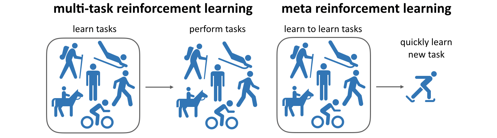
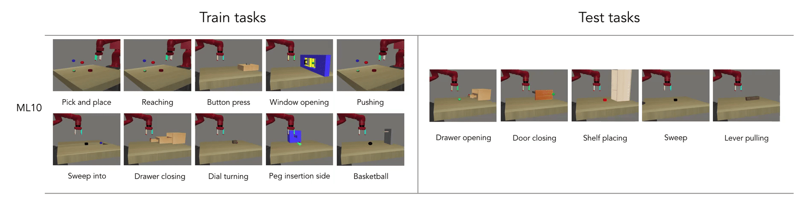
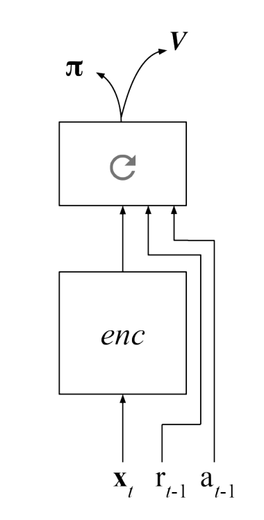
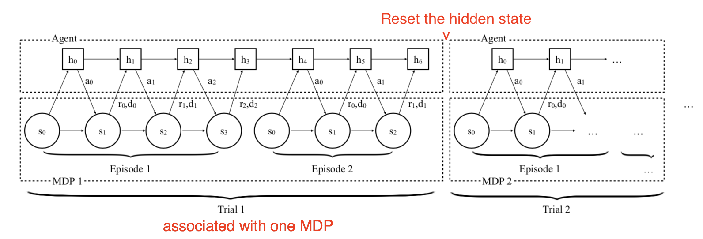
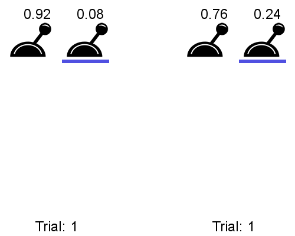

# Meta reinforcement learning {#sec-metarl}

A deep RL agent trained on Breakout plays Breakout. Retrain it on Pong and it will play Pong, but it will have forgotten Breakout, and it will have needed another 50 million frames to get there, although the two games have a lot in common: there is a ball, it bounces, you move a paddle, you should not let the ball pass. Every agent in this book is a **specialist**: it is trained from scratch on one MDP, and starts from zero every time.

Humans do not work like that. Somebody who has played a dozen Atari games needs a couple of minutes to become decent at the thirteenth one, not 50 million frames. Not because they are particularly good at that specific game, but because they have learned something about **how** Atari games work in general. **Meta reinforcement learning** tries to give that ability to an agent: the goal is not to learn a task, but to learn how to learn tasks.

## Learning to learn

The setup changes slightly. Instead of a single MDP, we are given a **distribution of tasks** $p(\mathcal{M})$: the same robot arm but a different object to manipulate, the same maze but a different position of the goal, the same bandit but different reward probabilities. The tasks share their state and action spaces, and usually most of their dynamics; what changes is the detail that makes each of them a different problem.

Training consists in sampling tasks from that distribution and learning on them. Testing consists in sampling **new** tasks from the same distribution, and what we measure is not only the final performance, but mostly **how fast** it is reached.

{#fig-metalearning width=90%}

@fig-metalearning makes the difference with **multi-task learning** explicit, as the two are easy to confuse. A multi-task agent is trained on $N$ tasks and is expected to solve those $N$ tasks, typically by conditioning its policy on a task identifier. A meta-RL agent is trained on $N$ tasks and is expected to solve the $N+1$-th one, which it has never seen. Multi-task learning asks for competence, meta learning asks for **generalization**.

Benchmarks had to be created for this, since the classical ones offer a single task. Meta-World [@Yu2019] provides a collection of robotic manipulation tasks (opening a drawer, pressing a button, hammering a nail) sharing the same simulated arm and the same action space, split between tasks used for training and tasks kept for testing.

{#fig-metaworld width=80%}

## Fast and slow learning

The central idea of meta RL is that learning happens at **two timescales** [@Botvinick2019]:

* **Slow learning** is the adaptation of the weights of the neural network by gradient descent. It is slow by construction: learning rates are small, and the gradient is averaged over the whole task distribution. This is where knowledge about the *family* of tasks accumulates.

* **Fast learning** is the adaptation to the task at hand. It has to happen within a handful of episodes, so it cannot be gradient descent on millions of weights.

Deep RL as seen so far only has the slow loop, which is exactly why it is so sample-inefficient. The question is where to put the fast one.

## RL$^2$: putting the learning algorithm inside the network

Two groups proposed the same answer at the same time [@Wang2017;@Duan2016a], and it is surprisingly simple: let the fast learning happen in the **activity** of a recurrent network rather than in its weights.

Take any model-free algorithm, for instance A3C (@sec-a3c), and give its network a LSTM layer (@sec-deeplearning). Instead of feeding the network only the current state $s_t$, feed it also the action $a_{t-1}$ it took at the previous step and the reward $r_t$ that this action produced:

$$
    \mathbf{h}_t = f(\mathbf{h}_{t-1}, s_t, a_{t-1}, r_t)
$$

{#fig-metarl-lstm width=25%}

This little change matters more than it looks. A regular policy $\pi_\theta(s, a)$ is a function of the current state only: two visits to the same state must produce the same distribution over actions, no matter what happened in between. Such a policy cannot represent "I already tried that door and it was locked". By feeding back the previous action and its outcome, the policy becomes **memory-guided**: what the agent does in a state depends on what it has already tried in this task and on how it went.

Training then follows this loop:

:::{.callout-note icon="false"}
## Meta RL training

* Repeat:

    1. Sample a MDP $\mathcal{M}$ from the task distribution $p(\mathcal{M})$.

    2. Reset the internal state $\mathbf{h}$ of the LSTM.

    3. Let the agent interact with $\mathcal{M}$ for **several episodes in a row**, without resetting $\mathbf{h}$ between them.

    4. Update the weights $\theta$ with A3C using all the collected transitions.

:::

Step 3 is the crucial one, and the usual source of confusion. At the end of an episode the **environment** is reset, but the **memory of the agent** is not. The agent therefore keeps across episodes everything it has found out about the current MDP. This whole sequence of episodes is called a **trial**, and it is the trial, not the episode, that the outer algorithm optimizes. The memory is only cleared in step 2, when the task changes and everything has to be discovered again.

{#fig-rl2 width=90%}

Since the return is accumulated over the whole trial, gradient descent has an incentive to make the first episodes **informative** rather than merely rewarding: losing some reward early in order to find out which task we are in pays off over the remaining episodes. The exploration/exploitation trade-off of @sec-bandits is not implemented by hand anymore, with an $\epsilon$ or an entropy bonus: it is **learned**, and it is adapted to the particular structure of the task distribution.

This is where the name RL$^2$ comes from. We train an agent using a reinforcement learning algorithm (A3C), and what ends up in the recurrent weights is a **second** reinforcement learning algorithm, one that the LSTM executes at run time with no weight change at all. The outer algorithm is chosen by us and is slow; the inner one is discovered by gradient descent and is fast.

## Learning how to solve bandits

The clearest demonstration of this uses the simplest possible tasks: two-armed bandits (@sec-bandits). A task is defined by a single number $p$: the first arm returns a reward of 1 with probability $p$, the second one with probability $1 - p$. Drawing $p$ randomly gives a whole distribution of bandit problems, on which the meta agent is trained.

{#fig-metabandit width=45%}

Confronted with a bandit it has never seen, the trained agent samples both arms a few times, and then sticks to the one that worked best. Nobody programmed that. There is no $\epsilon$ decreasing over time, no confidence interval as in UCB: the network simply applies the strategy that maximizes the return over that particular distribution of bandits, and this strategy happens to look very much like the algorithms we derived by hand in @sec-bandits.

The lesson is worth stating twice: the meta agent does not learn to solve each bandit, it learns **how** to solve bandits. Its weights after training do not contain the solution to any particular problem; they contain a procedure that finds the solution.

## Other approaches

RL$^2$ keeps the weights frozen at test time and puts everything in the memory. The other main family does the opposite: it allows a few gradient steps on the new task, but arranges in advance for these steps to be unusually effective.

**MAML** [*Model-Agnostic Meta-Learning*, @Finn2017] searches for an initialization $\theta$ of the weights such that, for any task sampled from the distribution, **one or a few** gradient steps on that task are enough to obtain a good policy. Instead of a set of weights that is good on average, which is what multi-task learning would give, one looks for a set of weights that is well **placed**: close to the optimum of every task, so that a short descent reaches any of them. Training requires differentiating through the gradient steps of the inner loop, which is expensive but works. As the name indicates, nothing in the method is specific to RL: the same idea applies to supervised learning.

**PEARL** [@Rakelly2019] sits in between. The agent infers from a few transitions a **context variable** $\mathbf{z}$, a compact description of "which task am I in", and conditions its policy on it: $\pi_\theta(s, a \, | \, \mathbf{z})$. Because the inference of $\mathbf{z}$ is separated from the policy, PEARL can be trained off-policy with a replay buffer, which makes it much more sample-efficient than RL$^2$ and MAML, which are both on-policy.

Meta RL is finally one of the few advanced topics that already work on real robots, precisely because fast adaptation is what a robot actually needs. @Belkhale2021 use a model-based meta learner on a quadcopter carrying payloads suspended by a cable: the mass and the length of the cable change the dynamics completely and are not known in advance, so the drone adapts its dynamics model online, within a couple of seconds of flight.



:::{.callout-tip icon="false" title="Additional resources"}

@Beck2023 is a complete survey of meta RL and of its numerous variants. @Botvinick2019 discusses the fast/slow distinction from the point of view of neuroscience and is a pleasant read. See also <https://lilianweng.github.io/lil-log/2019/06/23/meta-reinforcement-learning.html> for a well-illustrated introduction.

:::
