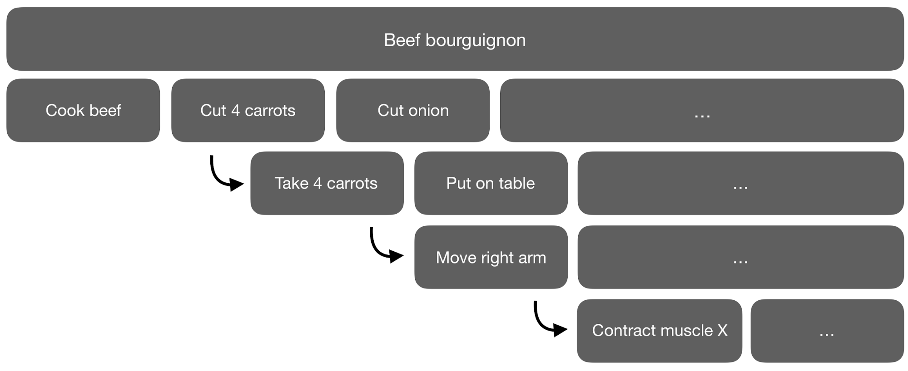
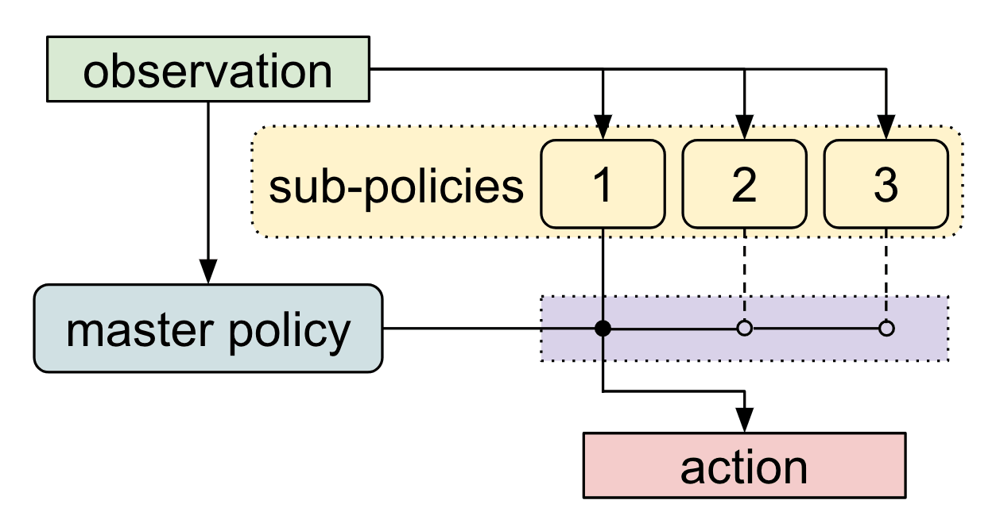

# Hierarchical Reinforcement Learning {#sec-hrl}

In every method seen so far, the action space is **fixed** and given in advance: 18 joystick directions in Atari, a torque per joint in MuJoCo. The agent takes one such action per step, and that is the only level at which it thinks.

Humans obviously do not work like that, and a recipe is a good way to see it.

## Acting at different levels

When you read the recipe of a beef bourguignon, the actions are "cut four carrots", "brown the meat", "add the wine". These are not actions in the sense of this book: they are **high-level actions**, and you have to figure out yourself how to perform them. "Cut four carrots" decomposes into "take four carrots", "put them on the table", and so on, until one reaches the level at which something really happens, i.e. muscle activations.

{#fig-hierarchicalrl width=90%}

The important remark is that nobody could learn to cook a beef bourguignon if muscle activations were the only available actions. There are two reasons for this, and both are problems we have met before:

* **Credit assignment.** A recipe takes hours, i.e. millions of muscle activations. When the dish is finally tasted, which of these millions of contractions deserves the credit? The discounted return of @sec-mc becomes useless over such horizons: with $\gamma = 0.99$, a reward obtained one million steps later is multiplied by $0.99^{1000000}$, which is zero for any practical purpose.

* **Exploration.** Random exploration in the space of muscle activations will produce random twitching, forever. The probability that a random sequence of a million actions happens to produce a beef bourguignon, and therefore a reward to learn from, is not small, it is zero. This is the sparse reward problem of @sec-intrinsic, in its most extreme form.

At the level of "cut carrots / brown meat / add wine", both problems disappear. The episode lasts twenty steps instead of a million, so credit assignment is easy, and random exploration over twenty high-level actions will occasionally produce something edible. **Hierarchical reinforcement learning** (HRL) is about building agents that work at several such levels at once.

## Options

The classical way to formalize this is the **option** framework [@Sutton1999a]. An option is a temporally extended action, a "mini-policy" that one can call and that runs for a while before giving back the control. It is defined by three things:

1. An **initiation set**: the states in which the option can be called (you can only cut carrots if you have carrots).
2. A **policy**: what to do at the low level while the option is running.
3. A **termination condition**: when the option considers itself finished (the carrots are cut), or gives up.

The agent is then organized in two levels. A **master policy**, also called manager or meta-policy, observes the state and selects an **option** instead of an action. The selected option takes over and generates primitive actions for as many steps as it needs. When it terminates, the control goes back to the master policy, which selects the next option.

Note what this does to the time scales: the master policy takes a decision only every $k$ steps, so it sees a much shorter problem. Since options have variable durations, the underlying process is not a MDP anymore but a **semi-MDP**, where the time elapsed between two decisions of the master is itself a random variable. This mostly means that the discount applied to the reward of an option must account for how long the option lasted.

The obvious question is where the options come from. Historically they were designed by hand, which works but only moves the problem: somebody still has to know that cutting carrots is a useful skill. Deep HRL tries to **learn** them.

## Meta-Learning Shared Hierarchies

MLSH [@Frans2017] proposes a simple and elegant answer, which is to learn the options on a **distribution of tasks**, exactly as in @sec-metarl.

The agent has a fixed number of **sub-policies** (the options) and one **master policy** which, every $k$ steps, decides which sub-policy is in charge. Both are trained, but not at the same rhythm:

* The **sub-policies are shared** across all tasks of the distribution. They are trained slowly, and end up representing skills that are useful in many tasks, typically primitives such as "walk left", "walk right", "jump".

* The **master policy is specific to each task** and is re-initialized whenever a new task is sampled. It must therefore be learned very quickly, from scratch, using only the existing sub-policies.

{#fig-mlsh width=70%}

The trick is that the master policy is deliberately handicapped: it is thrown away between tasks and given very little time to learn. The only way for the whole system to obtain a good reward on a new task is that the sub-policies are *already* good enough for a simple, quickly learned combination of them to solve it. Gradient descent on the sub-policies is thus pushed towards skills that are **reusable**, and not towards skills that solve one particular task.

This is the fast/slow decomposition of @sec-metarl in another disguise: the slow knowledge is in the sub-policies, the fast adaptation is in the master policy.



## Giving goals instead of calling options

A different idea is that the upper level, instead of picking from a list of options, tells the lower level **what to achieve**, and lets it figure out how. The lower level is then an ordinary RL agent, but with a reward that is produced internally by the level above. This is the same machinery as in @sec-intrinsic, except that the intrinsic reward rewards obedience rather than curiosity.

**FeUdal Networks** [FuN, @Vezhnevets2017] use a *manager* and a *worker*. The manager operates at a low temporal resolution and outputs a **direction** in a learned latent space, i.e. roughly "make the situation change this way". The worker acts at every step and receives an intrinsic reward proportional to how well the state actually moves in the direction asked. The manager is not allowed to give primitive actions, and the worker never sees the real reward. These two principles, called *information hiding* and *reward hiding*, come from the original feudal architecture [@Dayan1992]: a level is only told what it needs to know, and is only rewarded for obeying the level above, not for solving the task. This is what forces the levels to specialize instead of all doing the same thing.

**HIRO** [@Nachum2018] is more direct: the manager proposes a **goal state** $s_g$ every $k$ steps, and the worker is rewarded by its distance to that goal, $r_t = - ||s_t - s_g||$. Goals expressed as states are easy to interpret, and the approach connects naturally with the goal-conditioned policies of @sec-tdm. HIRO is also off-policy at both levels, which is what makes it data-efficient enough for real robots.

Being off-policy raises a problem specific to hierarchies, which is worth understanding because it is the main technical difficulty of the field. The manager's transitions stored in the replay buffer say "I asked for goal $s_g$ and the following 10 steps happened". But the worker keeps learning, so the same goal asked today would produce completely different steps: the manager is learning about a world whose dynamics change under its feet, since these dynamics *are* the worker. HIRO's answer is an **off-policy correction**: old transitions are relabeled with the goal that would have made the *current* worker produce the observed behavior.

**HAC** [*Hierarchical Actor-Critic*, @Levy2019] attacks the same problem with hindsight (@sec-tdm). Each level is trained as if the level below were already optimal, by pretending that the goal it had asked for was the state actually reached. This decouples the levels and allows three of them to be learned in parallel.

**Option-critic** [@Bacon2016] goes one step further and derives the policy gradient theorem (@sec-policygradient) for options, making it possible to learn the options, their policies **and** their termination conditions end-to-end, with no sub-goal and no intrinsic reward. It is the most principled formulation, but it is also where a typical failure mode of HRL is easiest to see: nothing in the objective says that options should last. Left alone, the learned options tend to terminate at almost every step, in which case the master policy chooses a new option every step and the whole hierarchy quietly degenerates into a flat policy. In practice, a cost is added to discourage switching.

A last family avoids the discrete list of options altogether and lets the upper level act in a **continuous latent space**. @Haarnoja2018 stack maximum-entropy policies (@sec-maxentrl) on top of each other, the latent variable of one layer becoming the action space of the layer above, so that the hierarchy is built by construction instead of being designed. SeCTAR [@Co-Reyes2018] learns instead a latent space of **trajectories** with an autoencoder (@sec-worldmodels): the upper level picks a point in that space, which describes a whole behavior over the next steps, and a decoder turns it into the corresponding sequence of actions. In both cases the upper level chooses among a continuum of skills rather than among three or four fixed ones.

:::{.callout-tip icon="false" title="Does it actually work?"}

HRL is one of the most intuitive ideas in RL and one of the least solved. The difficulties are of the kind described above: what counts as a good sub-goal, how to reward a level that does not see the real reward, how to learn an upper level whose environment keeps changing, and how to prevent the hierarchy from collapsing into a flat policy or into a single option that does everything.

Hand-designed hierarchies remain very effective in practice, e.g. in robotics where a low-level controller is usually given and only the high level is learned. Learning the whole hierarchy from scratch and beating a well-tuned flat algorithm is still difficult.

:::

:::{.callout-tip icon="false" title="Additional resources"}

@Pateria2021 is a comprehensive survey of hierarchical RL and of the many approaches that could not be mentioned here. <https://thegradient.pub/the-promise-of-hierarchical-reinforcement-learning/> is an excellent and very readable introduction to the motivation behind HRL.

:::
